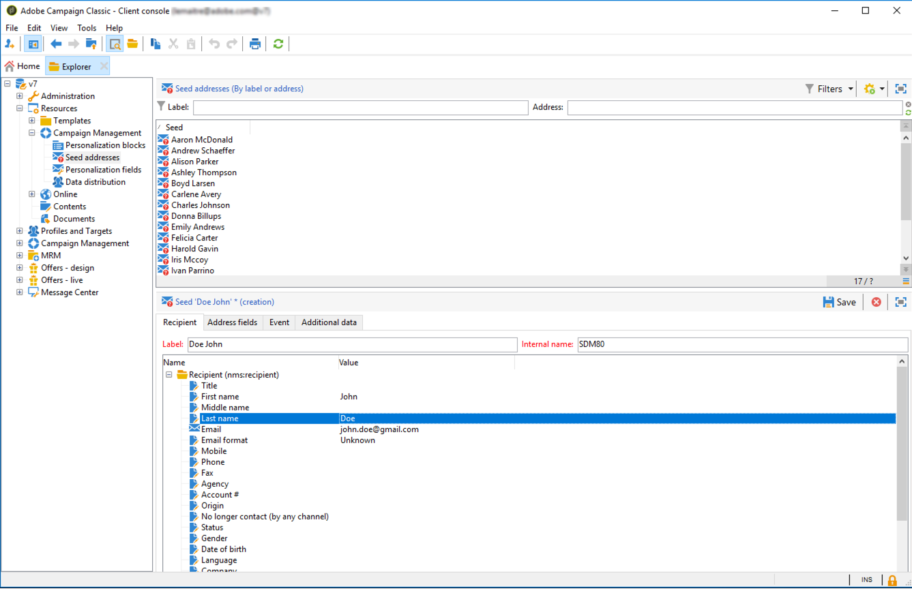

# 시드 주소 만들기{#creating-seed-addresses}

시드 주소는 표준 프로필 및 대상을 통해 관리되지 않고 Adobe Campaign 계층의 전용 노드에서 관리됩니다 **[!UICONTROL Resources > Campaign management > Seed addresses]**.

시드 주소를 구성하기 위해 하위 폴더를 만들 수 있습니다. 이렇게 하려면 노드를 마우스 오른쪽 단추로 클릭하고 **[!UICONTROL Seed addresses]** 선택합니다 **[!UICONTROL Create a new 'Seed addresses' folder]**. 하위 폴더의 이름을 지정한 다음 키를 눌러 유효성을 **[!UICONTROL Enter]** 확인합니다. 이제 시드 주소를 만들거나 이 하위 폴더에 복사할 수 있습니다. For more on this, refer to [Defining addresses](#defining-addresses).

또한, Adobe Campaign을 사용하면 배송 또는 캠페인으로 가져와서 관련 게재 및 캠페인의 특정 요구 사항을 기반으로 채택되는 시드 주소 템플릿을 만들 수도 있습니다. 시드 [주소 템플릿 만들기를 참조하십시오](#creating-seed-address-templates).

## 주소 정의 {#defining-addresses}

시드 주소를 만들려면 아래 단계를 수행하십시오.

1. 시드 주소 목록 위에 있는 **[!UICONTROL New]** 단추를 클릭합니다.
1. 탭의 일치 필드에 주소에 연결된 데이터를 **[!UICONTROL Recipient]** 입력합니다. 사용 가능한 필드는 배달 받는 사람의 프로필에 있는 표준 필드(nms:recipient table)에 해당합니다.이름, 이름, 이메일 등

   >[!NOTE]
   >
   >주소의 레이블은 사용자가 정의한 이름과 이름으로 자동으로 채워집니다.
   >
   >시드 주소를 만들 때 각 탭의 모든 필드를 입력할 필요는 없습니다. 누락된 개인화 요소는 제공 중에 임의로 입력됩니다.

   

1. 탭에서 **[!UICONTROL Seed fields]** 분석 단계(테이블에서) 동안 배달 로그에 삽입될 값을 **[!UICONTROL nms:broadLog]** 입력합니다.

1. 데이터 관리 워크플로우에서 생성된 게재에 사용되는 개인화 데이터와 특정 값을 할당할 개인화 데이터를 **[!UICONTROL Additional data]** 탭에서 입력합니다.

   >[!NOTE]
   >
   >활동에서 &#39;@&#39;로 시작하는 별칭으로 추가 대상 데이터가 정의되어 있는지 **[!UICONTROL Enrichment]** 확인하십시오. 그렇지 않으면 배달 활동의 시드 주소에서 이 주소를 제대로 사용할 수 없습니다.

## 시드 주소 템플릿 만들기 {#creating-seed-address-templates}

가져올 주소 템플릿을 만들고 각 전달에 대해 수정할 수 있는 주소 템플릿을 만들려면 새 시드 주소를 정의할 때와 동일한 프로세스를 사용합니다. 유일한 차이점은 시드 주소 템플릿 주소는 &#39;템플릿&#39; 유형 폴더에 저장해야 한다는 것입니다.

템플릿 폴더를 정의하려면 다음 프로세스를 적용합니다.

1. 새 **[!UICONTROL Seed addresses]** 유형 폴더를 만들고 폴더를 마우스 오른쪽 단추로 클릭한 다음 선택합니다 **[!UICONTROL Properties...]**.

   

1. 탭을 **[!UICONTROL Restriction]** 클릭하고 다음 필터링 조건을 추가합니다. **@isModel = true**.

   

   이제 이 폴더에 저장된 주소를 주소 템플릿으로 사용할 수 있습니다. 게재나 캠페인으로 가져와서 관련 게재와 캠페인의 특정 요구 사항에 따라 조정할 수 있습니다(시드 주소 [추가 참조](../../delivery/using/adding-seed-addresses.md)).
