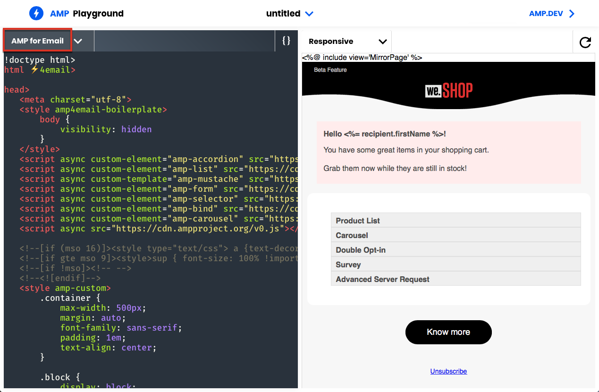

# 인터랙티브한 컨텐츠 정의{#defining-interactive-content}

Adobe Campaign을 사용하면 특정 조건에서 동적 이메일을 [보낼 수](https://amp.dev/about/email/) 있는 새로운 대화형 AMP 이메일 형식을 사용할 수 있습니다.

>[!CAUTION]
>
>* 이 기능은 Adobe Campaign의 베타 기능입니다.
>* AMP for Email은 개발자가 다이내믹하고 인터랙티브한 이메일을 만들 수 있는 새로운 오픈 소스 포맷입니다. 현재 두 개의 이메일 공급자가 지원합니다.Gmail 및 Outlook.
>
>
따라서 다음 작업만 수행할 수 있습니다.
>* AMP 이메일을 특정 Gmail 또는 Outlook 주소로 적절하게 구성된 것을 테스트합니다.
>* Google에 등록하고 Microsoft에 등록한 후 모든 Outlook 주소에 AMP 이메일을 전달할 수 있습니다.
>
>
AMP [이메일](#targeting-amp-email)타깃팅을 참조하십시오.

이 기능은 Adobe Campaign의 전용 패키지를 통해 사용할 수 있습니다. 이 패키지를 사용하려면 이 패키지를 설치해야 합니다. 완료되면 패키지를 고려하기 위해 서버를 다시 시작합니다.

하이브리드 아키텍처와 호스팅 아키텍처의 경우 [중간 소싱 서버](../../installation/using/mid-sourcing-server.md) 및 [실행 인스턴스를](../../message-center/using/creating-a-shared-connection.md#execution-instance)비롯한 모든 서버에 패키지를 설치해야 합니다. 계정 담당자에게 문의하십시오.

이 [비디오를](https://docs.adobe.com/content/help/en/campaign-learn/campaign-classic-tutorials/sending-messages/email-channel/defining-interactive-email-content-with-amp.html) 통해 Adobe Campaign에서 AMP를 활성화하는 방법을 살펴보고 사용 방법에 대해 알아보십시오.

## 이메일의 AMP 정보 {#about-amp-for-email}

AMP **for Email** 의 새로운 포맷을 사용하면 메시지 내에 AMP 구성 요소를 포함할 수 있으므로 풍부하고 실행 가능한 컨텐츠를 통해 이메일 경험을 향상시킬 수 있습니다. 이메일 내에서 바로 이용할 수 있는 최신 앱 기능을 통해 수신자는 메시지 자체의 컨텐츠와 동적으로 인터랙션할 수 있습니다.

예:
* AMP로 작성된 이메일에는 이미지 Carousel과 같은 대화형 요소가 포함될 수 있습니다.
* 컨텐츠가 메시지에 최신 상태로 유지됩니다.
* 수신자는 받은 편지함을 떠나지 않고도 양식에 응답하는 것과 같은 작업을 수행할 수 있습니다.

AMP for Email은 기존 이메일과 호환됩니다. AMP 버전의 메시지는 HTML 및/또는 일반 텍스트 외에 새로운 MIME 부분으로 이메일에 포함되어 모든 이메일 클라이언트에서 호환되도록 합니다.

이메일 포맷, 사양 및 요구 사항에 대한 AMP에 대한 자세한 내용은 AMP [개발자 설명서를](https://amp.dev/documentation/guides-and-tutorials/learn/email-spec/amp-email-format/?format=email)참조하십시오.

## Adobe Campaign을 사용하여 이메일에 AMP를 사용하는 주요 단계 {#key-steps-to-use-amp}

Adobe Campaign을 사용하여 AMP 이메일을 성공적으로 테스트 및 전송하려면 아래 단계를 따르십시오.
1. 패키지를 **[!UICONTROL AMP support (Beta)]** 설치합니다. Campaign [표준 패키지](../../installation/using/installing-campaign-standard-packages.md)설치를 참조하십시오.
1. Adobe Campaign에서 이메일을 만들고 AMP 컨텐츠를 작성합니다. Adobe [Campaign을 사용하여 AMP 이메일 컨텐츠 제작을 참조하십시오](#build-amp-email-content).
1. AMP 형식을 지원하는 이메일 제공업체의 모든 제공 요구 사항을 따라야 합니다.

   >[!NOTE]
   >
   >AMP for Email은 테스트 목적으로 베타 기능으로 사용할 수 있습니다. 현재 두 개의 이메일 제공업체만 이 형식(Gmail 및 Outlook)을 테스트합니다.

   이메일 [배달 요구 사항은](#amp-for-email-delivery-requirements)AMP를 참조하십시오.

1. 대상을 정의할 때 AMP 형식을 표시할 수 있는 수신자를 선택해야 합니다.

   >[!NOTE]
   >
   >현재 AMP 이메일 배달을 적절히 구성하거나 AMP 베타 프로그램에 참여하는 이메일 제공업체를 통해 등록한 후에만 테스트할 수 있습니다.

   AMP [이메일](#targeting-amp-email)타깃팅을 참조하십시오.

1. 평소대로 이메일을 보내십시오. AMP [이메일](#sending-amp-email)전송을 참조하십시오.

## Adobe Campaign에서 AMP 이메일 컨텐츠 제작 {#build-amp-email-content}

AMP 형식을 사용하여 이메일을 작성하려면 아래 단계를 따르십시오.

>[!CAUTION]
>
>AMP 개발자 설명서에 나와 있는 이메일 요구 사항 및 사양에 대한 AMP를 따라야 합니다. AMP에서 이메일 [모범 사례를](https://amp.dev/documentation/guides-and-tutorials/develop/amp_email_best_practices/?format=email)참조할 수도 있습니다.

1. 이메일 배달을 만들 때 템플릿을 선택합니다.

   >[!NOTE]
   >
   >특정 AMP 템플릿에는 사용할 수 있는 기본 용량 예제가 포함되어 있습니다.제품 목록, 회전판, 이중 옵트인, 설문 조사 및 고급 서버 요청

1. 탭을 **[!UICONTROL AMP content]** 클릭합니다.

   

1. 필요에 맞게 AMP 컨텐츠를 편집합니다.

   >[!NOTE]
   >
   >첫 번째 AMP 이메일 작성에 대한 자세한 내용은 AMP 개발자 [설명서를](https://amp.dev/documentation/guides-and-tutorials/start/create_email/?format=email)참조하십시오.

   예를 들어 AMP 템플릿의 제품 목록 구성 요소를 사용하고 타사 시스템 또는 Adobe Campaign 내에서 제품 목록을 유지 관리할 수 있습니다. 가격이나 다른 요소를 조정할 때마다 받는 사람이 편지함에서 이메일을 다시 열면 자동으로 반영됩니다.

1. 개인화 필드 및 개인화 블록으로 Adobe Campaign의 HTML 포맷과 같이 필요에 따라 AMP 컨텐츠를 개인화할 수 있습니다.

   

1. 편집을 완료한 후 전체 AMP 컨텐츠를 선택하고 AMP 웹 기반 유효성 검사기 [또는 유사한 웹 사이트에](https://validator.ampproject.org) 복사하여 붙여 넣습니다.

   >[!NOTE]
   >
   >화면 상단의 **드롭다운 목록에서 AMP4** EMAIL을 선택해야 합니다.

   

   모든 오류는 인라인으로 플래그가 지정됩니다.

   >[!NOTE]
   >
   >Adobe Campaign AMP 편집기는 컨텐츠 유효성 검사를 위해 디자인되지 않았습니다. AMP 웹 기반 유효성 검사기와 같은 외부 웹 [사이트를](https://validator.ampproject.org) 사용하여 콘텐츠가 올바른지 확인할 수 있습니다.

1. AMP 컨텐츠가 유효성 검사를 통과할 때까지 필요에 따라 수정합니다.

   

1. 검증된 컨텐츠를 AMP 놀이터나 유사한 [웹 사이트에](https://playground.amp.dev) 복사하여 붙여넣으면 컨텐츠를 미리 볼 수 있습니다.

   >[!NOTE]
   >
   >화면 상단의 **드롭다운** 목록에서 이메일용 AMP를 선택해야 합니다.

   

   >[!NOTE]
   >
   >Adobe Campaign에서 직접 AMP 컨텐츠를 미리 볼 수 없습니다. AMP 놀이터와 같은 외부 웹 사이트를 [사용하십시오](https://playground.amp.dev).

1. Adobe Campaign으로 돌아가서 확인된 컨텐츠를 **[!UICONTROL AMP content]** 탭에 복사하여 붙여 넣습니다.

1. 또는 **[!UICONTROL HTML content]** **[!UICONTROL Text content]** 탭으로 전환하고 이러한 두 형식 중 적어도 하나에 대한 내용을 정의합니다.

   >[!CAUTION]
   >
   >이메일에 AMP 컨텐츠 외에 HTML 또는 일반 텍스트 버전이 포함되어 있지 않으면 보낼 수 없습니다.

## 이메일 배달 요구 사항을 위한 AMP {#amp-for-email-delivery-requirements}

Adobe Campaign에서 AMP 컨텐츠를 작성할 때 수신자의 이메일 공급자에 따라 제공되는 동적 이메일의 조건을 준수해야 합니다.

현재 두 개의 이메일 공급자가 이 형식을 테스트하는 것을 지원합니다.Gmail 및 Outlook.

Gmail 계정에서 AMP 포맷으로 전달하는 것을 테스트하는 데 필요한 모든 단계 및 사양은 해당 Gmail 개발자 설명서 [및](https://developers.google.com/gmail/ampemail?) Outlook 개발자 문서에 [자세히 설명되어](https://docs.microsoft.com/en-gb/outlook/amphtml/)있습니다.

특히 다음 요구 사항을 충족해야 합니다.
* Gmail 및 Outlook에 대한 AMP 보안 요구 [사항을](https://developers.google.com/gmail/ampemail/security-requirements) [따르십시오](https://docs.microsoft.com/en-gb/outlook/amphtml/security-requirements).
* AMP MIME 부분에 [유효한 AMP 문서가](https://amp.dev/documentation/guides-and-tutorials/learn/validation-workflow/validate_emails/?format=email)있어야 합니다.
* AMP MIME 부분은 100KB 미만이어야 합니다.

Gmail에 대한 [팁과 알려진 제한 사항](https://developers.google.com/gmail/ampemail/tips) 및 Outlook에 [대한 AMP 우수 사례를 참조할 수도 있습니다](https://docs.microsoft.com/en-gb/outlook/amphtml/best-practices).

## AMP 이메일 타깃팅 {#targeting-amp-email}

AMP for Email을 베타 기능으로 사용할 수 있으므로, 현재 두 가지 단계를 통해 AMP 이메일 전송을 실험해 볼 수 있습니다.

1. Adobe Campaign을 사용하면 AMP 기반의 동적 이메일을 선택한 이메일 주소로 적절하게 구성된 이메일 주소로 전달하는 것을 테스트할 수 있습니다. 이러한 이메일의 내용과 동작을 확인할 수 있습니다. 선택한 [주소에](#testing-amp-delivery-for-selected-addresses)대한 AMP 이메일 배달 테스트를 참조하십시오.
1. 테스트를 거친 후에는 관련 이메일 공급자에 등록하여 보낸 사람 도메인을 허용 목록에 등록함으로써 이메일용 AMP 베타 프로그램의 일부로 게재 또는 캠페인을 보낼 수 있습니다. 이메일 [공급자에](#delivering-amp-emails-by-registering)등록하여 AMP 이메일 제공을 참조하십시오.

### 선택한 주소에 대한 AMP 이메일 배달 테스트 {#testing-amp-delivery-for-selected-addresses}

Adobe Campaign에서 선택한 이메일 주소로 동적 메시지 전송을 테스트할 수 있습니다.

>[!NOTE]
>
>현재 Gmail 및 Outlook만 AMP 형식 테스트를 지원합니다.

그러기 전에 Adobe Campaign에서 타깃팅하는 Gmail 및 Outlook 계정에 대해 전달하는 데 사용하는 보낸 사람 주소를 허용 목록에 포함해야 합니다.

이렇게 하려면:
1. 관련 이메일 공급자에 대해 동적 이메일 활성화 옵션이 선택되어 있는지 확인합니다.
1. 배달 필드에 표시된 보낸 사람 주소를 복사하여 이메일 공급자 계정 설정의 해당 섹션에 붙여 넣습니다 **[!UICONTROL From]** .

자세한 내용은 Gmail 개발자 [설명서](https://developers.google.com/gmail/ampemail/testing-dynamic-email) 및 [Outlook 개발자 설명서를](https://docs.microsoft.com/en-gb/outlook/amphtml/register-outlook#individual-mailbox-registration)참조하십시오.

### 이메일 공급자에 등록하여 AMP 이메일 전달 {#delivering-amp-emails-by-registering}

AMP 베타 프로그램에 참여하는 이메일 공급자에 등록하여 보낸 사람 도메인을 허용 목록에 등록함으로써 동적 이메일 제공을 실험해 볼 수 있습니다.

>[!NOTE]
>
>현재 Gmail 및 Outlook만 AMP 형식을 지원합니다.

몇 개의 주소로 테스트하고 나면 AMP 이메일을 Gmail 또는 Outlook 주소로 보낼 수 있습니다. 이를 위해서는 Google 또는 Microsoft에 정중하게 등록하고 답변을 기다리셔야 합니다.

Gmail 개발자 설명서 [및](https://developers.google.com/gmail/ampemail/register) Outlook 개발자 설명서에 [나와](https://docs.microsoft.com/en-gb/outlook/amphtml/register-outlook#global-registration)있는 단계를 따르십시오. 등록이 완료되면 공인 발송자가 됩니다.

## AMP 이메일 보내기 {#sending-amp-email}

AMP 컨텐츠와 폴백이 준비되고 호환 타겟을 정의한 후에는 평소대로 이메일을 보낼 수 있습니다.

현재 Gmail 및 Outlook만 특정 조건에서 AMP 형식을 지원합니다. 다른 이메일 공급자의 주소를 타게팅할 수 있지만 이 이메일 주소는 HTML 또는 일반 텍스트 버전을 받게 됩니다.

>[!NOTE]
>
>이메일에 AMP 컨텐츠 외에 HTML 또는 일반 텍스트 버전이 포함되어 있지 않으면 보낼 수 없습니다.

일치하는 받는 사람은 AMP 버전의 이메일이 사서함에 표시됩니다.

예를 들어, 이메일에 제품 목록을 포함시킨 경우 타사 시스템에서 가격을 편집할 때 받는 사람이 메일함으로 이메일을 다시 열 때마다 가격이 자동으로 조정됩니다.

>[!NOTE]
>
>특정 도메인이 AMP 이메일을 받지 못하도록 하는 메일 처리 규칙을 만들 수 있습니다. 이메일 [형식](../../installation/using/email-deliverability.md#managing-email-formats)관리를 참조하십시오.
>
>기본적으로 이 **[!UICONTROL AMP inclusion]** 옵션은 로 설정됩니다 **[!UICONTROL No]**.
