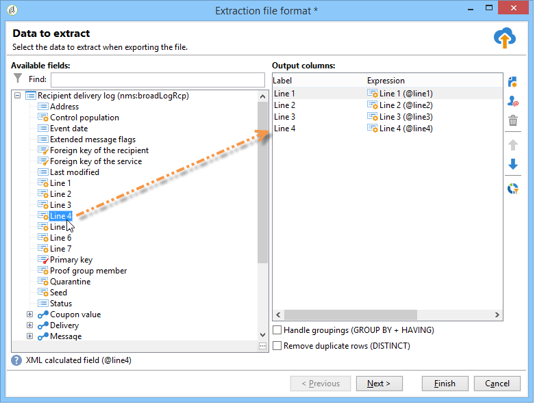

# DM 콘텐츠 정의{#defining-the-direct-mail-content}

## 추출 파일 {#extraction-file}

추출된 데이터가 포함된 파일 이름이 **[!UICONTROL File]** 필드에 정의되어 있습니다. 필드 오른쪽에 있는 버튼을 사용하면 개인화 필드를 사용하여 파일 이름을 만들 수 있습니다.

기본적으로 추출 파일이 생성되어 서버에 저장됩니다. 컴퓨터에 저장할 수 있습니다. 이렇게 하려면 **[!UICONTROL Download the generated file after the analysis of the delivery]**&#x200B;을(를) 확인하십시오. 이 경우 파일 이름과 로컬 저장소 디렉토리에 대한 액세스 경로를 표시해야 합니다.

DM 게재의 경우 **[!UICONTROL Edit the extraction file format...]** 링크에 추출 콘텐츠가 정의되어 있습니다.

이 링크를 사용하면 추출 도우미에 액세스하고 출력 파일로 내보낼 정보(열)를 정의할 수 있습니다.

추출 파일에 개인화된 URL을 삽입할 수 있습니다. 이 작업에 대한 자세한 정보는 [이 섹션](../../web/using/publishing-a-web-form.md)을 참조하십시오.

>[!NOTE]
>
>이 도우미에는 [시작](../../platform/using/executing-export-jobs.md) 섹션에 자세히 설명되어 있는 내보내기 도우미의 단계가 포함되어 있습니다.
