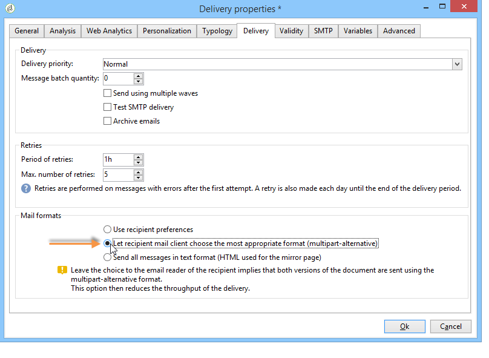
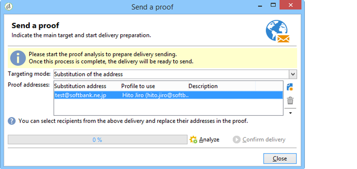

# 이메일 컨텐츠 정의{#defining-the-email-content}

## 보낸 사람 {#sender}

보낸 메시지 헤더에 표시될 발신자의 이름과 주소를 정의하려면 **[!UICONTROL From]** 링크를 클릭합니다.

이 창을 사용하면 이메일 메시지 헤더를 만드는 데 필요한 모든 정보를 입력할 수 있습니다. 이러한 정보는 개인화할 수 있습니다. 이렇게 하려면 입력 필드 오른쪽에 있는 단추를 사용하여 개인화 필드를 삽입합니다.

개인화 필드를 삽입하고 사용하는 방법에 대한 자세한 내용은 개인화 [섹션을 참조하십시오](../../delivery/using/about-personalization.md) .

>[!NOTE]
>
>* 발신자의 주소는 기본적으로 회신에 사용됩니다.
>* 헤더 매개 변수는 비워 둘 수 없습니다. 기본적으로 배포 마법사를 구성할 때 입력한 값이 포함되어 있습니다. 자세한 내용은 설치 [안내서를 참조하십시오](../../installation/using/deploying-an-instance.md).
>* 보낸 사람의 주소는 RFC 표준(Email to Send)을 허용해야 합니다.
>* Adobe Campaign은 입력한 이메일 주소 구문을 확인합니다.

>[!CAUTION]
>
>ISP(Internet Access Providers)가 요청하지 않은 이메일(스팸)과 싸우기 위해 구현한 확인 작업 중에, Adobe는 게재 및 답글에 대해 지정된 주소에 해당하는 이메일 계정을 만드는 것이 좋습니다. 메시징 시스템 관리자에게 문의하십시오.

## 메시지 제목 {#message-subject}

메시지의 제목은 해당 필드에 구성됩니다. 필드에 직접 입력하거나 링크를 클릭하여 스크립트를 입력할 수 있습니다. **[!UICONTROL Subject]** 개인화 링크를 사용하면 제목에 데이터베이스 필드를 삽입할 수 있습니다.

>[!CAUTION]
>
>메시지 제목은 필수입니다.

메시지가 전송되면 필드 컨텐츠가 수신자 프로필의 값으로 대체됩니다.

예를 들어 위의 메시지에서 메시지의 제목은 각 수신자에 대해 프로필의 데이터를 개인화합니다.

>[!NOTE]
>
>개인화 필드의 사용은 개인화 [정보에 나와](../../delivery/using/about-personalization.md)있습니다.

## 메시지 내용 {#message-content}

>[!CAUTION]
>
>개인 정보상의 이유로 모든 외부 리소스에 대해 HTTPS를 사용하는 것이 좋습니다.

메시지 컨텐츠는 배달 구성 창의 하단 섹션에 정의됩니다.

메시지는 수신자 기본 설정에 따라 기본적으로 HTML 또는 텍스트 형식으로 전송됩니다. 모든 메일 시스템에서 메시지가 올바르게 표시되도록 두 형식 모두에서 컨텐츠를 만드는 것이 좋습니다. 자세한 내용은 메시지 형식 [선택을 참조하십시오](#selecting-message-formats).

* HTML 컨텐츠를 가져오려면 **[!UICONTROL Open]** 단추를 사용합니다. 소스 코드를 **[!UICONTROL Source]** 하위 탭에 바로 붙여넣을 수도 있습니다.

   DCE(Digital Content [Editor](../../web/using/about-campaign-html-editor.md) )를 사용하는 경우 컨텐츠 [템플릿](../../web/using/use-case--creating-an-email-delivery.md#step-3---selecting-a-content)선택을 참조하십시오.

   >[!CAUTION]
   >
   >HTML 컨텐츠를 미리 만든 다음 Adobe Campaign으로 가져와야 합니다. HTML 편집기는 콘텐츠 제작을 위해 디자인되지 않았습니다.

   이 **[!UICONTROL Preview]** 하위 탭에서는 수신자의 각 컨텐츠 렌더링을 볼 수 있습니다. 개인화 필드 및 컨텐츠의 조건부 요소는 선택한 프로파일에 대한 해당 정보로 대체됩니다.

   도구 모음 단추를 사용하면 HTML 페이지의 표준 작업 및 서식 매개 변수에 액세스할 수 있습니다.

   

   로컬 파일 또는 Adobe Campaign의 이미지 라이브러리의 메시지에 이미지를 삽입할 수 있습니다. 이렇게 하려면 **[!UICONTROL Image]** 아이콘을 클릭하고 적절한 옵션을 선택합니다.

   

   라이브러리 이미지는 폴더 트리의 **[!UICONTROL Resources>Online>Public resources]** 폴더를 통해 액세스할 수 있습니다. 이미지 추가를 [참조하십시오](#adding-images).

   도구 모음의 마지막 단추를 사용하여 개인화 필드를 삽입할 수 있습니다.

   >[!NOTE]
   >
   >개인화 필드의 사용은 개인화 [정보에 나와](../../delivery/using/about-personalization.md)있습니다.

   페이지 하단의 탭을 사용하면 만들어지는 페이지의 HTML 코드를 표시할 수 있고 개인화를 통해 메시지의 렌더링을 볼 수 있습니다. 이 표시를 시작하려면 도구 모음의 단추를 사용하여 수신자를 **[!UICONTROL Preview]** 클릭하고 **[!UICONTROL Test personalization]** 선택합니다. 정의된 대상에서 수신자를 선택하거나 다른 수신자를 선택할 수 있습니다.

   

   HTML 메시지의 유효성을 확인할 수 있습니다. 이메일 헤더의 컨텐츠를 볼 수도 있습니다.

   

* 텍스트 컨텐츠를 가져오려면 **[!UICONTROL Open]** 단추나 **[!UICONTROL Text Content]** 탭을 사용하여 텍스트 형식으로 표시할 때 메시지 내용을 입력합니다. 도구 모음 단추를 사용하여 컨텐츠의 작업에 액세스합니다. 마지막 단추를 사용하여 개인화 필드를 삽입할 수 있습니다.

   

   HTML 형식의 경우 페이지 하단에 있는 **[!UICONTROL Preview]** 탭을 클릭하여 개인화로 메시지 렌더링을 확인합니다.

   

## 메시지 형식 선택 {#selecting-message-formats}

보낸 이메일 메시지의 형식을 변경할 수 있습니다. 이렇게 하려면 배달 속성을 편집하고 **[!UICONTROL Delivery]** 탭을 클릭합니다.

창의 아래 섹션에서 이메일 형식을 선택합니다.

* **[!UICONTROL Use recipient preferences]** (기본 모드)

   메시지 형식은 수신자 프로필에 저장된 데이터에 따라 정의되며 기본적으로 **[!UICONTROL email format]** 필드(@emailFormat)에 저장됩니다. 수신자가 특정 형식으로 메시지를 수신하려는 경우 이 형식이 전송됩니다. 필드가 채워지지 않으면 다중 부분 대체 메시지가 전송됩니다(아래 참조).

* **[!UICONTROL Let recipient mail client choose the most appropriate format]**

   메시지에는 다음 두 가지 형식이 포함되어 있습니다.텍스트 및 HTML을 참조하십시오. 수신에 표시되는 형식은 받는 사람의 메일 소프트웨어(다중 부분 대체)의 구성에 따라 달라집니다.

   >[!CAUTION]
   >
   >이 옵션에는 두 버전의 문서가 포함되어 있습니다. 따라서 메시지 크기가 커서 배달 비율에 영향을 줍니다.

* **[!UICONTROL Send all messages in text format]**

   메시지는 텍스트 형식으로 전송됩니다. HTML 형식은 전송되지 않지만 수신자가 메시지를 클릭하는 경우에만 미러 페이지에 사용됩니다.

## 인터랙티브한 컨텐츠 정의 {#amp-for-email-format}

Adobe Campaign을 사용하면 특정 조건에서 동적 이메일을 [보낼 수](https://amp.dev/about/email/) 있는 새로운 대화형 AMP 이메일 형식을 사용할 수 있습니다.

자세한 내용은 [이 섹션을](../../delivery/using/defining-interactive-content.md)참조하십시오.

## 컨텐츠 관리 사용 {#using-content-management}

전달 마법사에서 직접 컨텐츠 관리 양식을 사용하여 게재의 컨텐츠를 정의할 수 있습니다. 이렇게 하려면 전달 속성의 **[!UICONTROL Advanced]** 탭에서 사용할 컨텐츠 관리의 게시 템플릿을 참조해야 합니다.

추가 탭에서는 컨텐츠 관리 규칙에 따라 자동으로 통합되고 형식이 지정되는 컨텐츠를 입력할 수 있습니다.

>[!NOTE]
>
>Adobe Campaign의 콘텐츠 관리에 대한 자세한 내용은 [이 섹션을](../../delivery/using/about-content-management.md)참조하십시오.

## 이미지 추가 {#adding-images}

HTML 형식 이메일 배달에는 이미지가 포함될 수 있습니다. 배달 마법사에서 이미지가 포함된 HTML 페이지를 가져오거나 **[!UICONTROL Image]** 아이콘을 통해 HTML 편집기를 사용하여 직접 이미지를 삽입할 수 있습니다.

이미지는 다음과 같습니다.

* 로컬 이미지 또는 서버에서 호출된 이미지
* Adobe Campaign 공개 리소스 라이브러리에 저장된 이미지

   공개 리소스는 Adobe Campaign 계층의 **[!UICONTROL Resources > Online]** 노드를 통해 액세스할 수 있습니다. 라이브러리로 그룹화되고 이메일 메시지에 포함할 수 있지만 캠페인 또는 작업에 사용하거나 컨텐츠 관리에 사용할 수도 있습니다.

* Adobe Experience Cloud와 공유된 에셋. 이 [섹션을](../../integrations/using/sharing-assets-with-adobe-experience-cloud.md)참조하십시오.

>[!CAUTION]
>
>배달 마법사를 사용하여 이메일 메시지에 이미지를 포함하려면 공개 리소스 관리를 사용하도록 Adobe Campaign 인스턴스를 구성해야 합니다. 이 절차는 배포 마법사에서 수행할 수 있습니다. 구성에 대한 자세한 내용은 [이 섹션을](../../installation/using/deploying-an-instance.md) 참조하십시오.

전달 마법사를 사용하면 로컬 이미지 또는 라이브러리에 저장된 이미지를 메시지 내용에 추가할 수 있습니다. 이렇게 하려면 HTML 컨텐츠 도구 모음에서 **[!UICONTROL Image]** 단추를 클릭합니다.

받는 사람이 받는 메시지에 포함된 이미지를 볼 수 있도록 이러한 메시지를 외부에서 액세스할 수 있는 서버에서 사용할 수 있어야 합니다.

배달 마법사를 통해 이미지를 관리하려면 도구 모음에서 **[!UICONTROL Tracking & Images]** 아이콘을 클릭해야 합니다.

탭에서 **[!UICONTROL Upload images]** 선택합니다 **[!UICONTROL Images]** . 그런 다음 이메일 메시지에 이미지를 포함할지 여부를 선택할 수 있습니다.

* 전달 분석 단계를 기다리지 않고 수동으로 이미지를 업로드할 수 있습니다. 이렇게 하려면 **[!UICONTROL Upload images now]** 링크를 클릭합니다.
* 추적 서버에서 이미지에 액세스할 수 있는 다른 경로를 지정할 수 있습니다. 이렇게 하려면 **[!UICONTROL Image URL]** 필드에 입력합니다. 이 값은 설치 마법사의 매개 변수에 정의된 값을 무시합니다.

배달 마법사에서 포함된 이미지가 포함된 HTML 컨텐츠를 열면 전달 매개 변수에 따라 이미지를 즉시 업로드할 수 있는 메시지가 표시됩니다.

>[!CAUTION]
>
>수동으로 업로드하거나 메시지를 전송할 때 이미지 액세스 경로가 수정되었습니다.

**예:이미지가 포함된 메시지 보내기{#example--sending-a-message-with-images}**

다음은 4개의 이미지가 포함된 배달 예입니다.

이러한 이미지는 **[!UICONTROL Source]** 탭에서 확인할 수 있는 로컬 디렉토리 또는 웹 사이트에서 가져옵니다.

아이콘을 **[!UICONTROL Tracking & Images]** 클릭한 다음 **[!UICONTROL Images]** 탭을 클릭하여 메시지에서 이미지 감지를 시작합니다.

검색된 각 이미지에 대해 상태를 볼 수 있습니다.

* 이미지가 로컬에 저장되거나 다른 서버에 있는 경우, 이 서버가 외부(예: 인터넷 사이트)에서 보여도 이미지로 검색됩니다 **[!UICONTROL Not yet online]**.
* 이미지는 다른 배달을 만드는 동안 이전에 업로드된 **[!UICONTROL Already online]** 것처럼 감지됩니다.
* 배포 마법사에서 이미지 감지가 활성화되지 않은 URL을 정의할 수 있습니다.이러한 이미지를 업로드하면 **[!UICONTROL Skipped]**&#x200B;됩니다.

>[!NOTE]
>
>이미지는 액세스 경로가 아니라 컨텐츠로 식별됩니다. 즉, 이전에 다른 이름으로 업로드된 이미지 또는 다른 디렉토리에 업로드된 이미지가 **[!UICONTROL Already online]**&#x200B;로 검색됩니다.

분석 단계 동안 이미지는 미리 업로드해야 하는 로컬 이미지를 제외하고 외부로부터 액세스할 수 있도록 서버에 자동으로 업로드됩니다.

다른 Adobe Campaign 운영자가 볼 수 있도록 미리 작업하고 이미지를 업로드할 수 있습니다. 이 기능은 공동으로 작업하는 경우 유용합니다. 이렇게 하려면 을 클릭하여 **[!UICONTROL Upload the images straightaway...]** 이미지를 서버에 업로드합니다.

>[!NOTE]
>
>그러면 이메일에 있는 이미지의 URL과 특히 해당 이름이 수정됩니다.

이미지가 온라인 상태가 되면 메시지의 **[!UICONTROL Source]** 탭에서 해당 이름과 경로에 대한 변경 사항을 볼 수 있습니다.

선택하는 **[!UICONTROL Include the images in the email]**&#x200B;경우 해당 열에 포함할 이미지를 선택할 수 있습니다.

>[!NOTE]
>
>메시지에 로컬 이미지가 포함된 경우 메시지 소스 코드의 변경 사항을 확인해야 합니다.

## 이메일에 바코드 삽입{#inserting-a-barcode-in-an-email}

바코드 생성 모듈을 사용하면 2D 바코드를 비롯한 다양한 일반적인 표준을 준수하는 다양한 유형의 바코드를 만들 수 있습니다.

고객 기준을 사용하여 정의된 값을 사용하여 바코드를 비트맵으로 동적으로 생성할 수 있습니다. 개인화된 바코드는 이메일 캠페인에 포함될 수 있습니다. 수신자는 메시지를 인쇄하여 스캔(예: 체크 아웃할 때)을 위해 발행 회사에 표시할 수 있습니다.

바코드를 이메일에 삽입하려면 표시하려는 내용에 커서를 놓고 개인화 버튼을 클릭합니다. 을 **[!UICONTROL Include > Barcode...]**&#x200B;선택합니다.

그런 다음 필요에 맞게 다음 요소를 구성합니다.

1. 바코드 유형을 선택합니다.

   * 1D 형식의 경우 Adobe Campaign에서 다음 유형을 사용할 수 있습니다.Codeabar, Code 128, GS1-128(이전 EAN-128), UPC-A, UPC-E, ISBN, EAN-8, Code39, Interleave 2 of 5, POSTNET 및 Royal Mail(RM4SCC).

      1D 바코드의 예:

      

   * DataMatrix 및 PDF417 유형은 2D 포맷과 관련이 있습니다.

      2D 바코드의 예:

      

   * QR 코드를 삽입하려면 이 유형을 선택하고 적용할 오류 수정 비율을 입력합니다. 이 비율은 반복되는 정보의 양과 악화되는 허용치를 정의합니다.

      

      QR 코드의 예:

      

1. 이메일에 삽입할 바코드의 크기를 입력합니다.크기 조정을 구성하면 바코드의 크기를 x1에서 x10으로 늘리거나 줄일 수 있습니다.
1. 이 **[!UICONTROL Value]** 필드를 사용하면 바코드의 값을 정의할 수 있습니다. 값은 특별 오퍼와 일치할 수 있으며 기준의 기능이 될 수 있으며, 고객과 연결된 데이터베이스 필드의 값이 될 수 있습니다.

   이 예에서는 수신자의 계정 번호가 추가된 EAN-8 유형 바코드를 보여줍니다. 이 계정 번호를 추가하려면 필드 오른쪽에 있는 개인화 단추를 클릭하고 **[!UICONTROL Value]** 선택합니다 **[!UICONTROL Recipient > Account number]**.

   

1. 이 **[!UICONTROL Height]** 필드를 사용하면 바코드의 폭을 변경하지 않고 각 막대 사이의 공간을 변경하여 바코드의 높이를 구성할 수 있습니다.

   바코드 유형에 따라 진입 제어를 제한하지 않습니다. 바코드 값이 잘못되면 바코드가 **빨간색으로** 넘어가는 미리 보기 모드에서만 볼 수 있습니다.

   >[!NOTE]
   >
   >바코드에 할당된 값은 해당 유형에 따라 달라집니다. 예를 들어 EAN-8 유형은 정확히 8개의 숫자를 가집니다.
   >
   >필드 오른쪽의 개인화 단추를 사용하여 값 자체에 데이터를 추가할 수 **[!UICONTROL Value]** 있습니다. 이는 바코드 표준이 바코드를 수락하는 경우 바코드를 더욱 풍부하게 해줍니다.
   >
   >예를 들어 GS1-128 유형 바코드를 사용하는 경우 값 외에 수신자의 계정 번호를 입력하려면 개인화 단추를 클릭하고 **[!UICONTROL Recipient > Account number]**&#x200B;선택합니다. 선택한 수신자의 계정 번호를 올바르게 입력하면 바코드가 이를 고려합니다.

이러한 요소가 구성되면 이메일을 마무리하고 전송할 수 있습니다. 오류를 방지하려면 **[!UICONTROL Preview]** 탭을 클릭하여 배달을 수행하기 전에 항상 컨텐츠가 올바르게 표시되는지 확인하십시오.

>[!NOTE]
>
>바코드의 값이 올바르지 않으면 비트맵이 빨간색으로 표시됩니다.

## 일본 모바일에 이메일 보내기 {#sending-emails-on-japanese-mobiles}

### 일본어 모바일용 이메일 포맷 {#email-formats-for-japanese-mobiles}

Adobe Campaign은 모바일에서 이메일에 대한 세 가지 일본어 형식을 관리합니다.장식 **메일** (DoCoMo 휴대폰), **데코어 메일** ( **소프트뱅크 모바일) 및 데코레이션 메일** (KDDI AU 모바일). 이러한 포맷은 특정 코딩, 구조 및 크기 제한을 시행합니다. 이 [섹션의](#limitations-and-recommendations)제한 사항 및 권장 사항에 대해 자세히 알아보십시오.

받는 사람이 이러한 형식 중 하나로 메시지를 제대로 받으려면 다음 중 하나를 선택하거나 해당 **[!UICONTROL Deco-mail (DoCoMo)]****[!UICONTROL Decore Mail (Softbank)]** **[!UICONTROL Decoration Mail (KDDI AU)]** 프로필을 선택하는 것이 좋습니다.

그러나 **[!UICONTROL Email format]** 옵션을 **[!UICONTROL Unknown]**&#x200B;그대로 **[!UICONTROL HTML]** 두거나 **[!UICONTROL Text]**&#x200B;둘 경우 Adobe Campaign은 메시지가 올바로 표시되도록 사용할 일본어 형식을 자동으로 감지합니다(이메일을 보낼 때).

이 자동 감지 시스템은 **[!UICONTROL Management of Email Formats]** 메일 규칙 세트에 정의된 사전 정의된 도메인 목록을 기반으로 합니다. 이메일 형식 관리에 대한 자세한 내용은 [이 페이지를](../../installation/using/email-deliverability.md#managing-email-formats)참조하십시오.

### 제한 사항 및 권장 사항 {#limitations-and-recommendations}

일본 업체(Softbank, DoCoMo, KDDI AU)가 운영하는 모바일에서 읽을 이메일 전송에는 일정 수의 제한이 적용됩니다.

따라서 다음을 수행해야 합니다.

* JPEG 또는 GIF 형식의 이미지만 사용
* 10,000바이트 미만의 텍스트 및 HTML 섹션이 포함된 배달 만들기(KDDI AU 및 DoCoMo의 경우)
* 100KB 미만의 전체 크기(인코딩 전)의 이미지 사용
* 메시지당 20개 이상의 이미지 사용 안 함
* 축소된 크기 HTML 형식 사용(각 연산자에 대해 제한된 수의 태그 사용 가능)

>[!NOTE]
>
>메시지를 만들 때 각 연산자에 대한 제한 사항을 고려해야 합니다. 참조:
>
>* DoCoMo의 경우 [이 페이지를 참조하십시오](https://www.nttdocomo.co.jp/service/developer/make/content/deco_mail/index.html)
>* KDDI AU의 경우 [이 페이지를 참조하십시오.](https://www.au.com/ezfactory/tec/spec/decorations/template.html)
>* Softbank의 경우 [이 페이지를 참조하십시오.](https://www.support.softbankmobile.co.jp/partner/home_tech3/index.cfm)

### 이메일 컨텐츠 테스트 {#testing-the-email-content}

#### 메시지 미리 보기 {#previewing-the-message}

Adobe Campaign을 사용하면 메시지 형식이 일본어 모바일로 전송되도록 채택되었는지 확인할 수 있습니다.

컨텐츠를 정의하고 이메일 제목을 입력했으면 메시지가 작성되었을 때 표시 및 서식을 확인할 수 있습니다.

컨텐츠 편집 창의 **[!UICONTROL Preview]** 탭에서 을 클릭하면 다음 작업을 수행할 수 **[!UICONTROL More... > Deco-mail diagnostic]** 있습니다.

* HTML 컨텐츠 태그가 일본어 형식 제한에 부합하는지 확인
* 메시지의 이미지 수가 형식(20개 이미지)으로 지정한 제한을 초과하지 않는지 확인합니다.
* 총 메시지 크기 확인(100kB 미만)

   

#### 유형 규칙 실행 {#running-typology-rule}

미리 보기 진단 외에 증명 전송 또는 배달 시 두 번째 검사가 수행됩니다.분석 중에 **[!UICONTROL Deco-mail check]**&#x200B;특정 유형 규칙이 시작됩니다.

>[!CAUTION]
>
>이 유형 규칙은 받는 사람 중 적어도 하나가 **[!UICONTROL Deco-mail (DoCoMo)]**&#x200B;또는 **[!UICONTROL Decore Mail (Softbank)]** **[!UICONTROL Decoration Mail (KDDI AU)]** 형식으로 이메일을 수신하도록 구성된 경우에만 실행됩니다.

이 유형 규칙을 사용하면 특히 이메일의 전체 크기, HTML 및 텍스트 섹션의 크기, 메시지의 이미지 수 및 HTML 컨텐츠의 태그와 관련하여, 일본 연산자가 정의한 [형식 제약 조건을](#limitations-and-recommendations) 전달해야 합니다.

#### 교정본 보내기 {#sending-proofs}

교정본을 보내 배달을 테스트할 수 있습니다. 증명을 보낼 때 대체 주소를 사용하는 경우 사용된 프로필의 이메일 형식에 해당하는 주소를 입력하십시오.

예를 들어 이 프로필에 대한 이메일 형식이 미리 정의된 경우 프로필 주소를 test@softbank.ne.jp로 바꿀 수 **[!UICONTROL Decore Mail (Softbank)]**&#x200B;있습니다.

### 메시지 보내기 {#sending-messages}

Campaign을 사용하여 일본어 이메일 포맷을 수신자에게 이메일을 보내려면 다음 두 가지 옵션을 사용할 수 있습니다.

* 두 가지 배달 만들기:1은 일본어 수신자 및 다른 수신자의 경우 - [이 섹션을](#designing-a-specific-delivery-for-japanese-formats)참조하십시오.
* 단일 제공을 만들면 Adobe Campaign에서 사용할 형식을 자동으로 검색합니다. [이 섹션을](#designing-a-delivery-for-all-formats)참조하십시오.

#### 일본어 포맷에 대한 특정 전달 디자인 {#designing-a-specific-delivery-for-japanese-formats}

다음 두 가지 배달을 포함하는 워크플로우를 만들 수 있습니다.표준 이메일 형식을 사용하는 수신자를 위해 일본어 모바일에서 읽을 수 있는 메시지

이렇게 하려면 워크플로우의 **[!UICONTROL Split]** 활동을 사용하고 일본어 이메일 형식(장식 메일, 데코레이션 메일 및 데코어 메일)을 필터링 조건으로 정의합니다.

#### 모든 포맷에 전달 디자인 {#designing-a-delivery-for-all-formats}

Adobe Campaign이 도메인( **[!UICONTROL Unknown]**&#x200B;또는 으로 정의된 이메일 형식이 있는 프로필)에 따라 형식을 동적으로 관리하는 **[!UICONTROL HTML]** **[!UICONTROL Text]** 경우 모든 받는 사람에게 동일한 배달을 보낼 수 있습니다.

표준 수신자의 경우와 마찬가지로, 일본어 모바일 사용자의 경우 메시지 연락처가 올바르게 표시됩니다.

>[!CAUTION]
>
>각 일본어 이메일 형식(장식 이메일, 데코레이션 메일 및 데코어 메일)과 관련된 특수 기능을 고려해야 합니다. For more information on limitations, refer to [this section](#limitations-and-recommendations).
