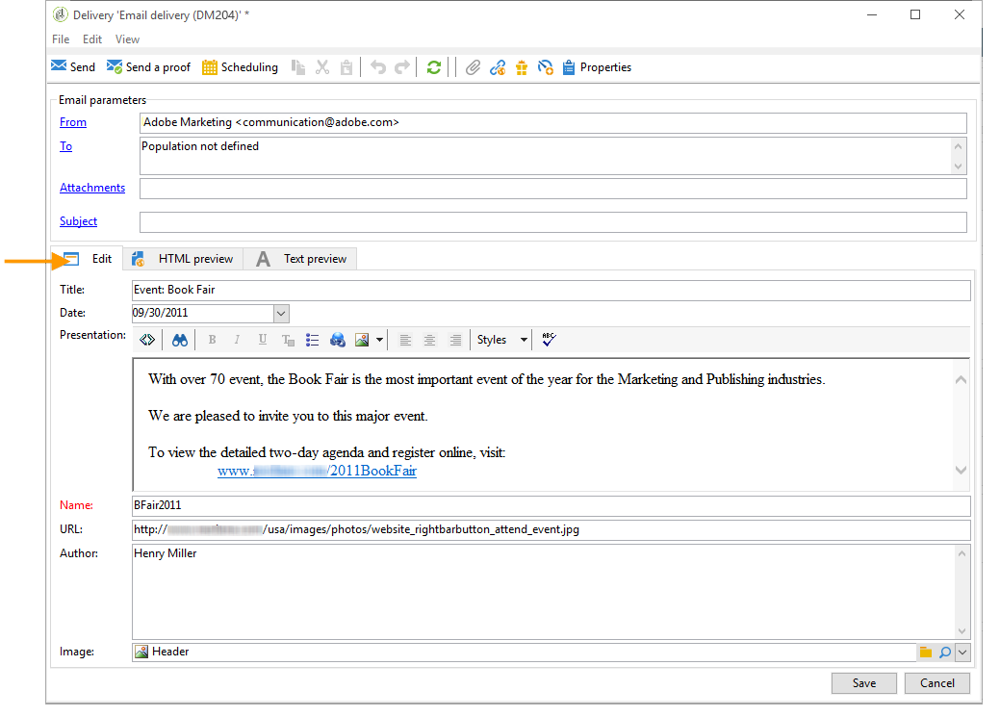
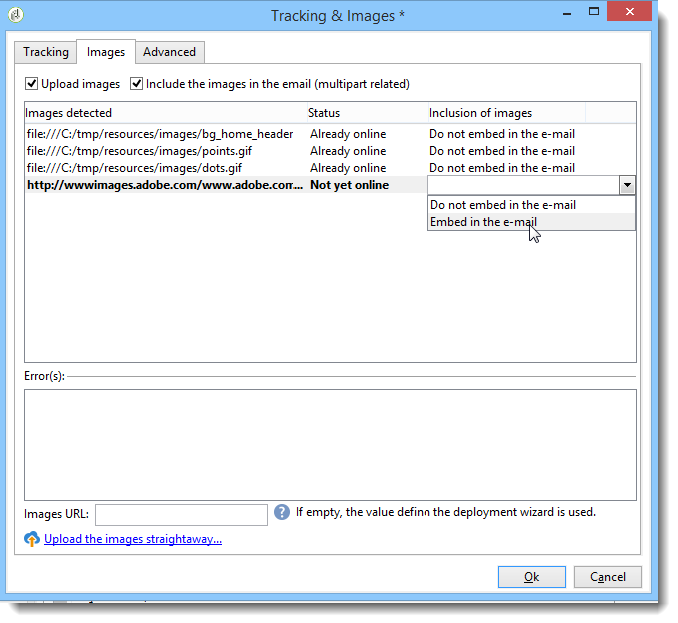

# 전자 메일 콘텐츠 정의 {#defining-the-email-content}

## 보낸 사람 {#sender}

보낸 메시지 헤더에 표시될 보낸 사람의 이름과 주소를 정의하려면 **[!UICONTROL From]** 링크를 클릭합니다.

이 창에서 이메일 메시지 헤더를 만드는 데 필요한 모든 정보를 입력할 수 있습니다. 이러한 정보는 개인화할 수 있습니다. 이렇게 하려면 입력 필드 오른쪽에 있는 단추를 사용하여 개인화 필드를 삽입합니다.

개인화 필드를 삽입하고 사용하는 방법을 알아보려면 [개인화 정보](../../delivery/using/about-personalization.md) 섹션을 참조하십시오.

>[!NOTE]
>
>* 발신자의 주소는 기본적으로 회신에 사용됩니다.
>* 헤더 매개 변수는 비워 둘 수 없습니다. 기본적으로 배포 마법사를 구성할 때 값 입력이 포함됩니다. 자세한 내용은 [설치 안내서](../../installation/using/deploying-an-instance.md)를 참조하십시오.
>* 보낸 사람의 주소는 이메일 전송(RFC 표준)을 허용하려면 필수입니다.
>* Adobe Campaign은 입력한 이메일 주소 구문을 확인합니다.

>[!IMPORTANT]
>
>ISP(Internet Access Providers)가 원하지 않는 이메일(스팸)과 싸우기 위해 구현한 검사 컨텍스트에서는 메시지 및 회신에 대해 지정된 주소에 해당하는 이메일 계정을 만드는 것이 좋습니다. 메시징 시스템 관리자에게 문의하십시오.

## 메시지 제목 {#message-subject}

메시지 제목은 해당 필드에 구성됩니다. 필드에 직접 입력하거나 **[!UICONTROL Subject]** 링크를 클릭하여 스크립트를 입력할 수 있습니다. 개인화 링크를 사용하면 제목에 데이터베이스 필드를 삽입할 수 있습니다.

>[!IMPORTANT]
>
>메시지 제목은 필수입니다.

메시지가 전송되면 필드 컨텐츠가 수신자 프로필의 값으로 바뀝니다.

예를 들어, 위의 메시지에서 메시지 제목은 각 수신자에 대해 프로필의 데이터를 개인화합니다.

>[!NOTE]
>
>개인화 필드의 사용은 [개인화 정보](../../delivery/using/about-personalization.md)에 있습니다.

**[!UICONTROL Insert emoticon]** 팝업 창에서 제목 줄에 이모티콘을 삽입할 수도 있습니다.

## 메시지 내용 {#message-content}

>[!IMPORTANT]
>
>개인 정보상의 이유로 모든 외부 리소스에 대해 HTTPS를 사용하는 것이 좋습니다.

메시지 내용은 배달 구성 창의 아래쪽 섹션에 정의됩니다.

받는 사람 환경 설정에 따라 기본적으로 HTML 또는 텍스트 형식으로 메시지가 전송됩니다. 모든 메일 시스템에서 메시지가 올바르게 표시되도록 하려면 두 가지 형식의 컨텐츠를 만드는 것이 좋습니다. 자세한 내용은 [메시지 형식 선택](#selecting-message-formats)을 참조하십시오.

* HTML 콘텐츠를 가져오려면 **[!UICONTROL Open]** 단추를 사용합니다. 소스 코드를 **[!UICONTROL Source]** 하위 탭에 직접 붙여넣을 수도 있습니다.

   [디지털 콘텐츠 편집기](../../web/using/about-campaign-html-editor.md)(DCE)를 사용하는 경우 [콘텐츠 템플릿 선택](../../web/using/use-case--creating-an-email-delivery.md#step-3---selecting-a-content)을 참조하십시오.

   >[!IMPORTANT]
   >
   >HTML 컨텐츠를 미리 만든 다음 Adobe Campaign으로 가져와야 합니다. HTML 편집기는 콘텐츠 제작을 위해 디자인되지 않았습니다.

   **[!UICONTROL Preview]** 하위 탭에서는 수신자의 각 컨텐츠 렌더링을 볼 수 있습니다. 개인화 필드 및 컨텐츠 조건부 요소는 선택한 프로파일에 대한 해당 정보로 대체됩니다.

   도구 모음 단추를 사용하면 HTML 페이지의 표준 작업 및 서식 매개 변수에 액세스할 수 있습니다.

   

   로컬 파일 또는 Adobe Campaign의 이미지 라이브러리의 메시지에 이미지를 삽입할 수 있습니다. 이렇게 하려면 **[!UICONTROL Image]** 아이콘을 클릭하고 적절한 옵션을 선택합니다.

   

   라이브러리 이미지는 폴더 트리의 **[!UICONTROL Resources>Online>Public resources]** 폴더를 통해 액세스할 수 있습니다. 또한 [이미지 추가](#adding-images)를 참조하십시오.

   도구 모음의 마지막 단추를 사용하여 개인화 필드를 삽입할 수 있습니다.

   >[!NOTE]
   >
   >개인화 필드의 사용은 [개인화 정보](../../delivery/using/about-personalization.md)에 있습니다.

   페이지 하단의 탭을 사용하여 만들어지는 페이지의 HTML 코드를 표시하고 개인화를 통해 메시지 렌더링을 볼 수 있습니다. 이 디스플레이를 시작하려면 **[!UICONTROL Preview]**&#x200B;을 클릭하고 도구 모음에서 **[!UICONTROL Test personalization]** 단추를 사용하여 수신자를 선택합니다. 정의된 대상에서 수신자를 선택하거나 다른 수신자를 선택할 수 있습니다.

   

   HTML 메시지의 유효성을 확인할 수 있습니다. 이메일 헤더의 컨텐츠를 볼 수도 있습니다.

   

* 텍스트 내용을 가져오려면 텍스트 형식으로 표시될 때 **[!UICONTROL Open]** 단추 또는 **[!UICONTROL Text Content]** 탭을 사용하여 메시지 내용을 입력합니다. 도구 모음 단추를 사용하여 내용의 작업에 액세스합니다. 마지막 단추를 사용하여 개인화 필드를 삽입할 수 있습니다.

   

   HTML 형식의 경우 페이지 하단에 있는 **[!UICONTROL Preview]** 탭을 클릭하여 개인화된 메시지를 표시합니다.

   

<!--## Selecting message formats {#selecting-message-formats}

You can change the format of email messages sent. To do this, edit the delivery properties and click the **[!UICONTROL Delivery]** tab.

Select the format of the email in the lower section of the window:

* **[!UICONTROL Use recipient preferences]** (default mode)

  The message format is defined according to the data stored in the recipient profile and stored by default in the **[!UICONTROL email format]** field (@emailFormat). If a recipient wishes to receive messages in a certain format, this is the format sent. If the field is not filled in, a multipart-alternative message is sent (see below).

* **[!UICONTROL Let recipient mail client choose the most appropriate format]**

  The message contains both formats: text and HTML. The format displayed on reception depends on the configuration of the recipient's mail software (multipart-alternative).

  >[!IMPORTANT]
  >
  >This option includes both versions of the document. It therefore impacts the delivery rate, because the message size is greater.

* **[!UICONTROL Send all messages in text format]**

  The message is sent in text format. HTML format will not be sent, but used for the mirror page only when the recipient clicks on the message.-->

## 대화형 콘텐츠 정의 {#amp-for-email-format}

Adobe Campaign에서는 특정 조건에서 동적 이메일을 보낼 수 있는 새로운 대화형 [AMP for Email](https://amp.dev/about/email/) 형식을 사용할 수 있습니다.

자세한 내용은 [이 섹션](../../delivery/using/defining-interactive-content.md)을 참조하십시오.

## 콘텐츠 관리 사용 {#using-content-management}

전달 마법사에서 직접 컨텐츠 관리 양식을 사용하여 게재의 컨텐츠를 정의할 수 있습니다. 이렇게 하려면 전달 속성의 **[!UICONTROL Advanced]** 탭에서 사용할 콘텐츠 관리의 게시 템플릿을 참조해야 합니다.

추가 탭을 사용하면 컨텐츠 관리 규칙에 따라 자동으로 통합되고 서식이 지정되는 컨텐츠를 입력할 수 있습니다.

>[!NOTE]
>
>Adobe Campaign의 콘텐츠 관리에 대한 자세한 내용은 [이 섹션](../../delivery/using/about-content-management.md)을 참조하십시오.

## 이모티콘 삽입 {#inserting-emoticons}

이메일 컨텐츠에 이모티콘을 삽입할 수 있습니다.

1. **[!UICONTROL Insert emoticon]** 아이콘을 클릭합니다.
1. 팝업 창에서 이모티콘을 선택합니다.

   

1. 완료되면 **[!UICONTROL Close]** 단추를 클릭합니다.

이모티콘 목록을 사용자 정의하려면 이 [페이지](../../delivery/using/customizing-emoticon-list.md)를 참조하십시오.

## {#adding-images} 이미지 추가

HTML 형식 이메일 배달에는 이미지가 포함될 수 있습니다. 배달 마법사에서 이미지가 포함된 HTML 페이지를 가져오거나 **[!UICONTROL Image]** 아이콘을 통해 HTML 편집기를 사용하여 이미지를 직접 삽입할 수 있습니다.

이미지는 다음 작업을 수행할 수 있습니다.

* 로컬 이미지 또는 서버에서 호출된 이미지
* Adobe Campaign 공용 리소스 라이브러리에 저장된 이미지

   공개 리소스는 Adobe Campaign 계층 구조의 **[!UICONTROL Resources > Online]** 노드를 통해 액세스할 수 있습니다. 라이브러리로 그룹화되고 이메일 메시지에 포함할 수 있지만 캠페인, 작업 또는 컨텐츠 관리에 사용할 수도 있습니다.

* Adobe Experience Cloud과 공유된 에셋. [이 섹션](../../integrations/using/sharing-assets-with-adobe-experience-cloud.md)을 참조하십시오.

>[!IMPORTANT]
>
>배달 마법사를 사용하여 이메일 메시지에 이미지를 포함하려면 공개 리소스 관리를 사용하도록 Adobe Campaign 인스턴스를 구성해야 합니다. 이 절차는 배포 마법사에서 수행할 수 있습니다. 구성에 대한 자세한 내용은 [이 섹션](../../installation/using/deploying-an-instance.md)을 참조하십시오.

전달 마법사를 사용하면 로컬 이미지 또는 라이브러리에 저장된 이미지를 메시지 내용에 추가할 수 있습니다. 이렇게 하려면 HTML 컨텐츠 도구 모음에서 **[!UICONTROL Image]** 단추를 클릭합니다.

>[!IMPORTANT]
>
>받는 사람이 받는 메시지에 포함된 이미지를 볼 수 있도록 외부 서버에서 액세스할 수 있어야 합니다.

배달 마법사를 통해 이미지를 관리하려면:

1. 도구 모음에서 **[!UICONTROL Tracking & Images]** 아이콘을 클릭합니다.
   

1. **[!UICONTROL Images]** 탭에서 **[!UICONTROL Upload images]**&#x200B;을 선택합니다.
1. 그런 다음 이메일 메시지에 이미지를 포함할지 여부를 선택할 수 있습니다.
   

* 배달 분석 단계를 기다리지 않고 수동으로 이미지를 업로드할 수 있습니다. 이렇게 하려면 **[!UICONTROL Upload the images straightaway...]** 링크를 클릭합니다.
* 추적 서버의 이미지에 액세스할 다른 경로를 지정할 수 있습니다. 이렇게 하려면 **[!UICONTROL Images URL]** 필드에 입력합니다. 이 값은 설치 마법사의 매개 변수에 정의된 값을 무시합니다.

배달 마법사에서 포함된 이미지가 포함된 HTML 컨텐츠를 열 때 전달 매개 변수에 따라 이미지를 즉시 업로드할 수 있는 메시지가 표시됩니다.

>[!IMPORTANT]
>
>이미지 액세스 경로는 수동으로 업로드하거나 메시지를 보낼 때 수정됩니다.

### {#sending-a-message-with-images} 이미지가 포함된 메시지 보내기

>[!NOTE]
>
>성능 문제를 방지하려면, 개인화된 URL에서 [attachment](../../delivery/using/attaching-files.md)으로 즉시 다운로드한 이미지를 포함하는 경우 각 이미지 크기는 기본적으로 100,000바이트를 초과할 수 없습니다. 이 권장 임계값은 [Campaign Classic 옵션 목록](../../installation/using/configuring-campaign-options.md#delivery)에서 구성할 수 있습니다.

다음은 4개의 이미지가 포함된 배달의 샘플입니다.

이러한 이미지는 **[!UICONTROL Source]** 탭에서 확인할 수 있으므로 로컬 디렉토리 또는 웹 사이트에서 가져옵니다.

**[!UICONTROL Tracking & Images]** 아이콘을 클릭한 다음 **[!UICONTROL Images]** 탭을 클릭하여 메시지의 이미지 검색을 시작합니다.

검색된 각 이미지에 대해 상태를 볼 수 있습니다.

* 이미지가 로컬에 저장되어 있거나 다른 서버에 있는 경우, 이 서버가 외부(예: 인터넷 사이트)에서 볼 수 있어도 **[!UICONTROL Not yet online]**&#x200B;으로 검색됩니다.
* 이미지는 다른 배달을 만드는 동안 이전에 업로드된 경우 **[!UICONTROL Already online]**&#x200B;으로 검색됩니다.
* 배포 마법사에서 이미지 감지가 활성화되지 않은 URL을 정의할 수 있습니다.이러한 이미지를 업로드하는 것은 **[!UICONTROL Skipped]**&#x200B;입니다.

>[!NOTE]
>
>이미지는 액세스 경로가 아니라 컨텐츠로 식별됩니다. 즉, 이전에 다른 이름 또는 다른 디렉토리에 업로드된 이미지가 **[!UICONTROL Already online]**&#x200B;으로 검색됩니다.

분석 단계 동안 이미지는 미리 업로드해야 하는 로컬 이미지를 제외하고 외부로부터 액세스할 수 있도록 자동으로 서버에 업로드됩니다.

다른 Adobe Campaign 운영자가 볼 수 있도록 미리 작업하고 이미지를 업로드할 수 있습니다. 이 기능은 공동으로 작업할 때 유용합니다. 이렇게 하려면 **[!UICONTROL Upload the images straightaway...]**&#x200B;을 클릭하여 이미지를 서버에 업로드합니다.

>[!NOTE]
>
>이메일에 포함된 이미지의 URL 및 특히 해당 이름이 수정됩니다.

이미지가 온라인 상태가 되면 메시지의 **[!UICONTROL Source]** 탭에서 해당 이름과 경로에 대한 변경 사항을 볼 수 있습니다.

**[!UICONTROL Include the images in the email]**&#x200B;을 선택하면 해당 열에 포함할 이미지를 선택할 수 있습니다.

>[!NOTE]
>
>로컬 이미지가 메시지에 포함된 경우 메시지 소스 코드의 변경 사항을 확인해야 합니다.

## 이메일{#inserting-a-barcode-in-an-email}에 바코드 삽입

바코드 생성 모듈을 사용하면 2D 바코드를 비롯한 다양한 일반적인 표준을 준수하는 다양한 유형의 바코드를 만들 수 있습니다.

고객 기준을 사용하여 정의된 값을 사용하여 바코드를 비트맵으로 동적으로 생성할 수 있습니다. 이메일 캠페인에 개인화된 바코드를 포함할 수 있습니다. 수신자는 메시지를 인쇄하여 스캔할 수 있도록(예: 체크 아웃할 때) 발행업체에 표시할 수 있습니다.

바코드를 이메일에 삽입하려면 표시하려는 내용에 커서를 놓고 개인화 버튼을 클릭합니다. **[!UICONTROL Include > Barcode...]**&#x200B;을(를) 선택합니다.

그런 다음 필요에 맞게 다음 요소를 구성합니다.

1. 바코드 유형을 선택합니다.

   * 1D 형식의 경우 Adobe Campaign에서 다음 유형을 사용할 수 있습니다.Codabar, Code 128, GS1-128(이전 EAN-128), UPC-A, UPC-E, ISBN, EAN-8, Code39, Interleave 2/5, POSTNET 및 Royal Mail(RM4SCC).

      1D 바코드의 예:

      

   * DataMatrix 및 PDF417 유형은 2D 형식과 관련이 있습니다.

      2D 바코드의 예:

      

   * QR 코드를 삽입하려면 이 유형을 선택하고 적용할 오류 수정 비율을 입력합니다. 이 비율은 반복되는 정보의 양과 감소된 허용치를 정의합니다.

      

      QR 코드의 예:

      

1. 이메일에 삽입할 바코드의 크기를 입력합니다.비율을 구성하면 바코드 크기를 x1에서 x10으로 늘리거나 줄일 수 있습니다.
1. **[!UICONTROL Value]** 필드를 사용하여 바코드의 값을 정의할 수 있습니다. 값은 특수 오퍼와 일치할 수 있으며 기준의 기능일 수 있으며 고객과 연결된 데이터베이스 필드의 값이 될 수 있습니다.

   이 예는 수신자의 계정 번호를 추가한 EAN-8 형식의 바코드를 보여줍니다. 이 계정 번호를 추가하려면 **[!UICONTROL Value]** 필드 오른쪽에 있는 개인화 단추를 클릭하고 **[!UICONTROL Recipient > Account number]**&#x200B;을 선택합니다.

   

1. **[!UICONTROL Height]** 필드를 사용하면 각 막대 사이의 간격을 변경하여 바코드의 폭을 변경하지 않고 바코드의 높이를 구성할 수 있습니다.

   바코드 유형에 따라 입력 제어를 제한하는 것은 없습니다. 바코드 값이 잘못된 경우 바코드가 빨간색으로 교차되는 **미리 보기** 모드에서만 볼 수 있습니다.

   >[!NOTE]
   >
   >바코드에 할당된 값은 해당 유형에 따라 달라집니다. 예를 들어 EAN-8 유형은 정확히 8개의 숫자를 가집니다.
   >
   >**[!UICONTROL Value]** 필드 오른쪽에 있는 개인화 단추를 사용하면 값 자체에 데이터를 추가할 수 있습니다. 바코드 표준이 바코드를 허용하는 한 바코드가 더욱 풍부해집니다.
   >
   >예를 들어 GS1-128 유형 바코드를 사용하고 값 외에 수신자의 계정 번호를 입력하려면 개인화 단추를 클릭하고 **[!UICONTROL Recipient > Account number]**&#x200B;을 선택합니다. 선택한 받는 사람의 계정 번호를 올바르게 입력하면 바코드가 해당 번호를 고려합니다.

이러한 요소가 구성되면 이메일을 마무리하고 보낼 수 있습니다. 오류를 방지하려면 **[!UICONTROL Preview]** 탭을 클릭하여 배달을 수행하기 전에 항상 컨텐츠가 올바르게 표시되는지 확인하십시오.

>[!NOTE]
>
>바코드 값이 올바르지 않으면 비트맵이 빨간색으로 표시됩니다.

<!--## Sending emails on Japanese mobiles {#sending-emails-on-japanese-mobiles}

### Email formats for Japanese mobiles {#email-formats-for-japanese-mobiles}

Adobe Campaign manages three specific Japanese formats for email on mobiles: **Deco-mail** (DoCoMo mobiles), **Decore Mail** (Softbank mobiles) and **Decoration Mail** (KDDI AU mobiles). These formats impose particular coding, structure, and size constraints. Learn more about limitations and recommendations in [this section](#limitations-and-recommendations).

In order for the recipient to correctly receive messages in one of these formats, we recommend selecting **[!UICONTROL Deco-mail (DoCoMo)]**, **[!UICONTROL Decore Mail (Softbank)]** or **[!UICONTROL Decoration Mail (KDDI AU)]** in the corresponding profile:

However, if you leave the **[!UICONTROL Email format]** option as **[!UICONTROL Unknown]**, **[!UICONTROL HTML]** or **[!UICONTROL Text]**, Adobe Campaign will automatically detect (when sending the email) the Japanese format to use so that the message is correctly displayed.

This automatic detection system is based on the list of predefined domains defined in the **[!UICONTROL Management of Email Formats]** mail rule set. For more on managing email formats, refer to [this page](../../installation/using/email-deliverability.md#managing-email-formats).

### Limitations and recommendations {#limitations-and-recommendations}

A certain number of constraints apply for sending emails that will be read on a mobile operated by a Japanese provider (Softbank, DoCoMo, KDDI AU).

Therefore, you must:

* Only use images in JPEG or GIF format
* Create a delivery with text and HTML sections that are strictly lower than 10 000 bytes (for KDDI AU and DoCoMo)
* Use images with a total size (before encoding) that is lower than 100 KB
* Do not use more than 20 images per message
* Use a reduced size HTML format (a limited number of tags are available for each operator)

>[!NOTE]
>
>Limitations specific to each operator are to be taken into account when creating your message. Refer to:  
>
>* For DoCoMo, refer to [this page](https://www.nttdocomo.co.jp/service/developer/make/content/deco_mail/index.html)
>* For KDDI AU, refer to [this page](https://www.au.com/ezfactory/tec/spec/decorations/template.html)
>* For Softbank, refer to [this page](https://www.support.softbankmobile.co.jp/partner/home_tech3/index.cfm)

### Testing the email content {#testing-the-email-content}

#### Previewing the message {#previewing-the-message}

Adobe Campaign allows you to check that your message format is adapted to be sent to a Japanese mobile.

Once you have defined your content and entered the email subject, you can check the display and formatting when the message is created.

In the **[!UICONTROL Preview]** tab of the content editing window, clicking **[!UICONTROL More... > Deco-mail diagnostic]** allows you to:

* Check that the HTML content tags conform to the Japanese format restrictions
* Check that the number of images in the message does not exceed the limit imposed by the format (20 images)
* Check the total message size (less than 100kB)

  

#### Running typology rule {#running-typology-rule}

In addition to the previewing diagnosis, a second check is carried out when sending a proof or a delivery: a specific typology rule, **[!UICONTROL Deco-mail check]**, is started during the analysis.

>[!IMPORTANT]
>
>This typology rule is only executed if at least one of the recipients is configured to receive emails in **[!UICONTROL Deco-mail (DoCoMo)]**, **[!UICONTROL Decore Mail (Softbank)]** or **[!UICONTROL Decoration Mail (KDDI AU)]** format.

This typology rule allows you to make sure that the delivery respects the [format constraints](#limitations-and-recommendations) defined by the Japanese operators, particularly in relation to the total size of the email, the size of the HTML and text sections, the number of images in the messages, and the tags in the HTML content.

#### Sending proofs {#sending-proofs}

You can send proofs to test your delivery. When you send the proof, if you are using substitution addresses, please enter addresses that correspond to the email format of the profile used.

For example, you can replace a profile's address by test@softbank.ne.jp if the email format for this profile was defined beforehand on **[!UICONTROL Decore Mail (Softbank)]**.

### Sending messages {#sending-messages}

To send an email to recipients with Japanese email formats with Campaign, two options are possible:

* Create two deliveries: one only for Japanese recipients and another for other recipients - refer to [this section](#designing-a-specific-delivery-for-japanese-formats).
* Create a single delivery and Adobe Campaign will automatically detect the format to use - refer to [this section](#designing-a-delivery-for-all-formats).

#### Designing a specific delivery for Japanese formats {#designing-a-specific-delivery-for-japanese-formats}

You can create a workflow that contains two deliveries: one to be read on a Japanese mobile and another for recipients with a standard email format.

To do this, use the **[!UICONTROL Split]** activity in your workflow and define the Japanese email formats (Deco-mail, Decoration Mail and Decore Mail) as filtering conditions.

#### Designing a delivery for all formats {#designing-a-delivery-for-all-formats}

When Adobe Campaign dynamically manages the formats according to the domain (profiles with email formats defined as **[!UICONTROL Unknown]**, **[!UICONTROL HTML]** or **[!UICONTROL Text]** ), you can send the same delivery to all of your recipients.

The message contact will display correctly for the users on Japanese mobiles, just as for the standard recipients.

>[!IMPORTANT]
>
>Make sure to respect the special features associated with each Japanese email format (Deco-mail, Decoration Mail, and Decore Mail). For more information on limitations, refer to [this section](#limitations-and-recommendations).-->
