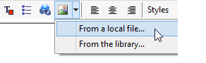

# 전자 메일 콘텐츠 정의 {#defining-the-email-content}

## 보낸 사람 {#sender}

보낸 메시지 헤더에 나타날 발신자의 이름과 주소를 정의하려면 **[!UICONTROL From]** 링크를 클릭합니다.

이 창에서는 전자 메일 메시지 헤더를 만드는 데 필요한 모든 정보를 입력할 수 있습니다. 이러한 정보는 개인화할 수 있습니다. 이렇게 하려면 입력 필드 오른쪽의 버튼을 사용하여 개인화 필드를 삽입합니다.

개인화 필드를 삽입하고 사용하는 방법을 알아보려면 [개인화 정보](about-personalization.md) 섹션을 참조하십시오.

>[!NOTE]
>
>* 발신자의 주소는 기본적으로 회신에 사용됩니다.
>* 헤더 매개 변수는 비워 둘 수 없습니다. 기본적으로 배포 마법사를 구성할 때 값 입력이 포함됩니다. 자세한 내용은 [설치 안내서](../../installation/using/deploying-an-instance.md)를 참조하십시오.
>* 전자 메일을 보낼 수 있도록 하려면 보낸 사람의 주소가 필수입니다(RFC 표준).
>* Adobe Campaign은 입력한 이메일 주소 구문을 확인합니다.

>[!IMPORTANT]
>
>ISP(인터넷 액세스 공급자)가 원치 않는 이메일(스팸)을 방지하기 위해 구현하는 확인 컨텍스트에서, Adobe은 게재 및 답글에 지정된 주소에 해당하는 이메일 계정을 만드는 것을 권장합니다. 메시징 시스템 관리자에게 문의하십시오.

## 메시지 제목 {#message-subject}

메시지의 제목은 해당 필드에 구성됩니다. 필드에 직접 입력하거나 **[!UICONTROL Subject]** 링크를 클릭하여 스크립트를 입력할 수 있습니다. 개인화 링크를 사용하면 제목에 데이터베이스 필드를 삽입할 수 있습니다.

>[!IMPORTANT]
>
>메시지 제목은 필수입니다.

메시지가 전송될 때 필드 콘텐츠가 수신자 프로필의 값으로 바뀝니다.

예를 들어 위의 메시지에서 메시지의 제목은 각 수신자에 대해 프로필의 데이터를 개인화합니다.

>[!NOTE]
>
>개인화 필드 사용은 [개인화 정보](about-personalization.md)에 나와 있습니다.

**[!UICONTROL Insert emoticon]** 팝업 창을 사용하여 제목 줄에 이모티콘을 삽입할 수도 있습니다.

## 메시지 콘텐츠 {#message-content}

>[!IMPORTANT]
>
>개인 정보용으로 모든 외부 리소스에 HTTPS를 사용하는 것이 좋습니다.

메시지 컨텐츠는 게재 구성 창의 하위 섹션에 정의됩니다.

메시지는 수신자 환경 설정에 따라 기본적으로 HTML 또는 텍스트 형식으로 전송됩니다. 모든 메일 시스템에서 메시지를 올바르게 표시할 수 있도록 두 형식 모두에서 컨텐츠를 만드는 것이 좋습니다. 자세한 내용은 [메시지 형식 선택](#selecting-message-formats)을 참조하십시오.

* HTML 콘텐츠를 가져오려면 **[!UICONTROL Open]** 버튼을 사용하십시오. 소스 코드를 **[!UICONTROL Source]** 하위 탭에 직접 붙여넣을 수도 있습니다.

   [디지털 콘텐츠 편집기](../../web/using/about-campaign-html-editor.md)(DCE)를 사용하는 경우 [콘텐츠 템플릿 선택](../../web/using/use-case--creating-an-email-delivery.md#step-3---selecting-a-content)을 참조하십시오.

   >[!IMPORTANT]
   >
   >HTML 컨텐츠를 미리 만든 다음 Adobe Campaign으로 가져와야 합니다. HTML 편집기는 콘텐츠 생성을 위해 디자인되지 않습니다.

   **[!UICONTROL Preview]** 하위 탭에서는 수신자에 대한 각 컨텐츠의 렌더링을 볼 수 있습니다. 개인화 필드 및 콘텐츠의 조건부 요소는 선택한 프로필에 대한 해당 정보로 대체됩니다.

   도구 모음 단추를 사용하면 HTML 페이지의 표준 작업 및 형식 매개 변수에 액세스할 수 있습니다.

   

   로컬 파일의 메시지 또는 Adobe Campaign의 이미지 라이브러리에서 이미지를 삽입할 수 있습니다. 이렇게 하려면 **[!UICONTROL Image]** 아이콘을 클릭하고 적절한 옵션을 선택합니다.

   

   폴더 트리의 **[!UICONTROL Resources>Online>Public resources]** 폴더를 통해 라이브러리 이미지에 액세스할 수 있습니다. [이미지 추가](#adding-images)도 참조하십시오.

   도구 모음의 마지막 버튼을 사용하여 개인화 필드를 삽입할 수 있습니다.

   >[!NOTE]
   >
   >개인화 필드 사용은 [개인화 정보](about-personalization.md)에 나와 있습니다.

   페이지 하단의 탭에서는 만들어지는 페이지의 HTML 코드를 표시하고 개인화를 사용하여 메시지 렌더링을 볼 수 있습니다. 이 표시를 시작하려면 **[!UICONTROL Preview]** 을 클릭하고 도구 모음에서 **[!UICONTROL Test personalization]** 버튼을 사용하여 수신자를 선택합니다. 정의된 대상에서 수신자를 선택하거나 다른 수신자를 선택할 수 있습니다.

   

   HTML 메시지의 유효성을 검사할 수 있습니다. 이메일 헤더의 콘텐츠를 볼 수도 있습니다.

   

* 텍스트 컨텐츠를 가져오려면 **[!UICONTROL Open]** 단추 또는 **[!UICONTROL Text Content]** 탭을 사용하여 텍스트 형식으로 표시될 때 메시지 내용을 입력합니다. 도구 모음 단추를 사용하여 내용에 대한 작업에 액세스합니다. 마지막 버튼을 사용하면 개인화 필드를 삽입할 수 있습니다.

   

   HTML 형식의 경우 페이지 하단에 있는 **[!UICONTROL Preview]** 탭을 클릭하여 개인화와 함께 메시지의 렌더링을 확인합니다.

   

## 대화형 콘텐츠 정의 {#amp-for-email-format}

Adobe Campaign을 사용하면 특정 조건에서 다이내믹 이메일을 보낼 수 있는 새로운 대화형 [AMP for Email](https://amp.dev/about/email/) 형식을 사용할 수 있습니다.

자세한 내용은 [이 섹션](defining-interactive-content.md)을 참조하십시오.

## 콘텐츠 관리 사용 {#using-content-management}

게재 마법사에서 직접 컨텐츠 관리 양식을 사용하여 게재 콘텐츠를 정의할 수 있습니다. 이렇게 하려면 게재 속성의 **[!UICONTROL Advanced]** 탭에서 사용할 컨텐츠 관리의 게시 템플릿을 참조해야 합니다.

추가 탭에서는 컨텐츠 관리 규칙에 따라 자동으로 통합되고 형식이 지정되는 컨텐츠를 입력할 수 있습니다.

>[!NOTE]
>
>Adobe Campaign의 콘텐츠 관리에 대한 자세한 내용은 [이 섹션](about-content-management.md)을 참조하십시오.

## 이모티콘 삽입 {#inserting-emoticons}

이메일 콘텐츠에 이모티콘을 삽입할 수 있습니다.

1. **[!UICONTROL Insert emoticon]** 아이콘을 클릭합니다.
1. 팝업 창에서 이모티콘을 선택합니다.

   

1. 완료되면 **[!UICONTROL Close]** 버튼을 클릭합니다.

이모티콘 목록을 사용자 지정하려면 이 [page](customizing-emoticon-list.md)을 참조하십시오.

## 이미지 추가 {#adding-images}

HTML 형식 이메일 게재에는 이미지가 포함될 수 있습니다. 게재 마법사에서 이미지가 포함된 HTML 페이지를 가져오거나 **[!UICONTROL Image]** 아이콘을 통해 HTML 편집기를 사용하여 직접 이미지를 삽입할 수 있습니다.

이미지는 다음 작업을 수행할 수 있습니다.

* 로컬 이미지 또는 서버에서 호출된 이미지
* Adobe Campaign 공용 리소스 라이브러리에 저장된 이미지

   공개 리소스는 Adobe Campaign 계층 구조의 **[!UICONTROL Resources > Online]** 노드를 통해 액세스할 수 있습니다. 라이브러리로 그룹화되어 이메일 메시지에 포함할 수 있지만 캠페인이나 작업 또는 콘텐츠 관리에 사용할 수도 있습니다.

* Adobe Experience Cloud과 공유된 자산. [이 섹션](../../integrations/using/sharing-assets-with-adobe-experience-cloud.md)을 참조하십시오.

>[!IMPORTANT]
>
>게재 마법사를 사용하여 이메일 메시지에 이미지를 포함하려면 공개 리소스 관리를 사용하도록 Adobe Campaign 인스턴스를 구성해야 합니다. 이 절차는 배포 마법사에서 수행할 수 있습니다. 구성에 대한 자세한 내용은 [이 섹션](../../installation/using/deploying-an-instance.md)을 참조하십시오.

게재 마법사를 사용하여 로컬 이미지 또는 라이브러리에 저장된 이미지를 메시지 콘텐츠에 추가할 수 있습니다. 이렇게 하려면 HTML 콘텐츠 도구 모음에서 **[!UICONTROL Image]** 버튼을 클릭합니다.

>[!IMPORTANT]
>
>수신자가 수신한 메시지에 포함된 이미지를 보려면 이러한 메시지를 외부에서 액세스할 수 있는 서버에서 사용할 수 있어야 합니다.

게재 마법사를 통해 이미지를 관리하려면 다음을 수행하십시오.

1. 도구 모음에서 **[!UICONTROL Tracking & Images]** 아이콘을 클릭합니다.
   

1. **[!UICONTROL Images]** 탭에서 **[!UICONTROL Upload images]** 을 선택합니다.
1. 그런 다음 이메일 메시지에 이미지를 포함할지 여부를 선택할 수 있습니다.
   

* 게재 분석 단계를 기다리지 않고 수동으로 이미지를 업로드할 수 있습니다. 이렇게 하려면 **[!UICONTROL Upload the images straightaway...]** 링크를 클릭합니다.
* 추적 서버의 이미지에 액세스할 다른 경로를 지정할 수 있습니다. 이렇게 하려면 **[!UICONTROL Images URL]** 필드에 입력합니다. 이 값은 설치 마법사의 매개 변수에 정의된 값을 재정의합니다.

게재 마법사에서 포함된 이미지가 포함된 HTML 콘텐츠를 열면 게재 매개 변수에 따라 이미지를 즉시 업로드할 수 있는 옵션을 제공합니다.

>[!IMPORTANT]
>
>* 이미지 액세스 경로는 수동 업로드 중 또는 메시지를 전송할 때 수정됩니다.
> 
>* 성능 문제를 방지하려면 개인화된 URL에서 즉시 다운로드한 이미지를 [첨부 파일](attaching-files.md)로 포함하는 경우 각 이미지 크기는 기본적으로 100,000바이트를 초과해서는 안 됩니다. 이 권장 임계값은 [Campaign Classic 옵션 목록에서 구성할 수 있습니다](../../installation/using/configuring-campaign-options.md#delivery).

**사용 사례: 이미지로 메시지 보내기**

다음은 4개의 이미지가 포함된 게재 샘플입니다.

이러한 이미지는 **[!UICONTROL Source]** 탭에서 확인할 수 있는 로컬 디렉터리 또는 웹 사이트에서 가져옵니다.

**[!UICONTROL Tracking & Images]** 아이콘을 클릭한 다음 **[!UICONTROL Images]** 탭을 클릭하여 메시지에서 이미지 감지를 시작합니다.

감지된 각 이미지에 대해 해당 상태를 볼 수 있습니다.

* 이미지가 로컬에 저장되거나 다른 서버에 있는 경우, 이 서버가 외부에서(예: 인터넷 사이트)에 표시되더라도 **[!UICONTROL Not yet online]**(으)로 검색됩니다.
* 이미지는 다른 게재를 만드는 동안 이전에 업로드된 경우 **[!UICONTROL Already online]**&#x200B;으로 감지됩니다.
* 배포 마법사에서 이미지 감지가 활성화되지 않은 URL을 정의할 수 있습니다. 이러한 이미지를 업로드하는 것은 **[!UICONTROL Skipped]**&#x200B;입니다.

>[!NOTE]
>
>이미지는 액세스 경로가 아니라 해당 컨텐츠로 식별됩니다. 즉, 이전에 다른 이름 또는 다른 디렉토리에 업로드된 이미지가 **[!UICONTROL Already online]**&#x200B;으로 검색됩니다.

분석 단계 동안, 미리 업로드해야 하는 로컬 이미지를 제외하고 외부에서 액세스할 수 있도록 이미지가 자동으로 서버에 업로드됩니다.

다른 Adobe Campaign 운영자가 볼 수 있도록 미리 작업하고 이미지를 업로드할 수 있습니다. 공동 작업을 하는 경우 이 기능이 유용할 수 있습니다. 이렇게 하려면 **[!UICONTROL Upload the images straightaway...]** 을 클릭하여 이미지를 서버에 업로드합니다.

>[!NOTE]
>
>전자 메일에 있는 이미지의 URL 및 특히 해당 이름이 수정됩니다.

이미지가 온라인 상태가 되면 메시지의 **[!UICONTROL Source]** 탭에서 해당 이름과 경로에 대한 변경 사항을 볼 수 있습니다.

**[!UICONTROL Include the images in the email]**&#x200B;을 선택하는 경우 해당 열에 포함할 이미지를 선택할 수 있습니다.

>[!NOTE]
>
>로컬 이미지가 메시지에 포함된 경우 메시지 소스 코드의 변경 사항을 확인해야 합니다.

## 전자 메일에 바코드 삽입{#inserting-a-barcode-in-an-email}

바코드 생성 모듈을 사용하면 2D 바코드를 포함하여 다양한 공통 표준을 준수하는 여러 종류의 바코드를 만들 수 있습니다.

고객 기준을 사용하여 정의된 값을 사용하여 바코드를 비트맵으로 동적으로 생성할 수 있습니다. 개인화된 바코드는 이메일 캠페인에 포함할 수 있습니다. 수신자는 메시지를 인쇄하여 스캔을 위해 발행 회사에 표시할 수 있습니다(예를 들어 체크 아웃할 때).

전자 메일에 바코드를 삽입하려면 커서를 표시할 콘텐츠에 놓고 개인화 단추를 클릭합니다. **[!UICONTROL Include > Barcode...]**&#x200B;을(를) 선택합니다.

그런 다음 필요에 맞게 다음 요소를 구성합니다.

1. 바코드 유형을 선택합니다.

   * 1D 형식의 경우 Adobe Campaign에서 다음 유형을 사용할 수 있습니다. Codabar, Code 128, GS1-128(이전의 EAN-128), UPC-A, UPC-E, ISBN, EAN-8, Code39, Interleaved 2 of 5, POSTNET 및 Royal Mail(RM4SCC).

      1D 바코드의 예:

      

   * DataMatrix 및 PDF417 유형은 2D 포맷과 관련이 있습니다.

      2D 바코드의 예:

      

   * QR 코드를 삽입하려면 이 유형을 선택하고 적용할 오류 수정 비율을 입력합니다. 이 비율은 반복되는 정보의 양과 열화에 대한 허용한도를 정의합니다.

      

      QR 코드의 예:

      

1. 전자 메일에 삽입할 바코드의 크기를 입력합니다. 스케일을 구성하면 바코드의 크기를 x1에서 x10으로 늘리거나 줄일 수 있습니다.
1. **[!UICONTROL Value]** 필드를 사용하면 바코드의 값을 정의할 수 있습니다. 값은 특별 오퍼와 일치할 수 있으며 기준의 기능일 수 있으며, 고객에 연결된 데이터베이스 필드의 값이 될 수 있습니다.

   이 예에서는 수신자의 계정 번호를 추가한 EAN-8 형식의 바코드를 보여 줍니다. 이 계정 번호를 추가하려면 **[!UICONTROL Value]** 필드 오른쪽에 있는 개인화 단추를 클릭하고 **[!UICONTROL Recipient > Account number]** 을 선택합니다.

   

1. **[!UICONTROL Height]** 필드를 사용하면 각 막대 사이의 간격을 변경하여 바코드의 너비를 변경하지 않고 바코드의 높이를 구성할 수 있습니다.

   바코드 유형에 따라 제한적인 항목 제어가 없습니다. 바코드 값이 올바르지 않으면 바코드가 빨간색으로 교차되는 **미리 보기** 모드에서만 볼 수 있습니다.

   >[!NOTE]
   >
   >바코드에 할당된 값은 해당 유형에 따라 다릅니다. 예를 들어 EAN-8 유형은 정확히 8개의 숫자를 가집니다.
   >
   >**[!UICONTROL Value]** 필드 오른쪽의 개인화 단추를 사용하면 값 자체에 데이터를 추가할 수 있습니다. 바코드 표준이 바코드를 수락하는 경우 바코드를 강화합니다.
   >
   >예를 들어, GS1-128 유형 바코드를 사용하고 값 외에 수신자의 계정 번호를 입력하려면 개인화 버튼을 클릭하고 **[!UICONTROL Recipient > Account number]** 을 선택합니다. 선택한 수신자의 계좌 번호를 올바르게 입력하면 바코드가 이를 고려합니다.

이러한 요소가 구성되면 전자 메일을 완료하고 보낼 수 있습니다. 오류를 방지하려면 항상 **[!UICONTROL Preview]** 탭을 클릭하여 배달을 수행하기 전에 컨텐츠가 올바르게 표시되는지 확인하십시오.

>[!NOTE]
>
>바코드의 값이 올바르지 않으면 비트맵이 빨간색으로 교차되어 표시됩니다.

