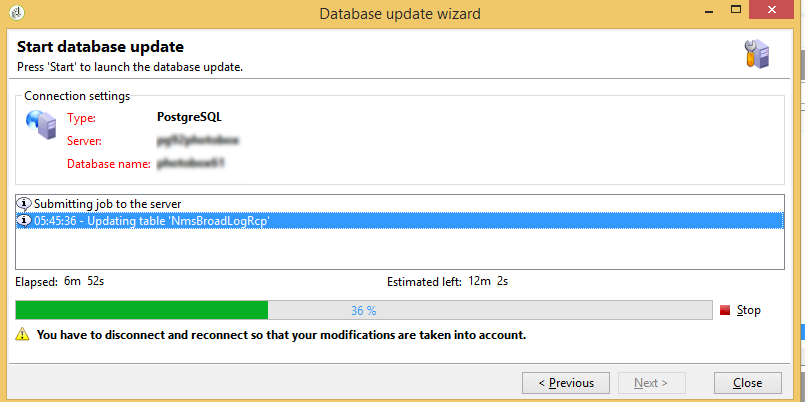

# 배달 대시보드 {#delivery-dashboard}

**배달 대시보드**&#x200B;는 메시지를 보내는 동안 발생하는 배달 및 최종 문제를 모니터링하기 위한 키입니다.

게재에 대한 정보를 검색하고 필요한 경우 편집할 수 있습니다. 배달을 보낸 후에는 탭 내용을 더 이상 변경할 수 없습니다.

대시보드에서 사용할 수 있는 여러 탭을 사용하여 모니터링할 수 있는 정보는 다음과 같습니다.

* [게재 요약](#delivery-summary)
* [게재 보고서](#delivery-reports)
* [배달 로그, 미러 페이지, 제외](#delivery-logs-and-history)
* [배달 추적 로그 및 내역](#tracking-logs)
* [배달 렌더링](#delivery-rendering)
* [배달 감사](#delivery-audit-)


**관련 항목:**

* [게재 실패 이해](../../delivery/using/understanding-delivery-failures.md)
* [격리 관리 이해](../../delivery/using/understanding-quarantine-management.md)
* [게재 모범 사례](../../delivery/using/delivery-best-practices.md)
* [게재 기능 관리](../../delivery/using/about-deliverability.md)

## 게재 요약 {#delivery-summary}

**[!UICONTROL Summary]** 탭에는 전달의 특성이 포함되어 있습니다.배달 상태, 사용된 채널, 보낸 사람 정보, 제목, 실행에 관한 정보

## 게재 보고서 {#delivery-reports}

**[!UICONTROL Summary]** 탭에서 액세스할 수 있는 **[!UICONTROL Reports]** 링크를 사용하면 배달 작업과 관련된 보고서 세트를 볼 수 있습니다.일반 전달 보고서, 세부 보고서, 전달 보고서, 실패한 메시지 배포, 시작 비율, 클릭 수 및 거래 등

이 탭의 내용은 사용자의 요구 사항에 따라 구성할 수 있습니다. 배달 보고서에 대한 자세한 내용은 [이 섹션](../../reporting/using/delivery-reports.md)을 참조하십시오.


## 배달 로그, 작업 내역 및 제외 {#delivery-logs-and-history}

**[!UICONTROL Delivery]** 탭은 이 게재의 발생 내역을 제공합니다. 여기에는 전송 로그(예: 전송된 메시지 목록 및 해당 상태 및 관련 메시지)가 포함됩니다.

배달의 경우(예: 배달 실패 또는 격리 주소가 있는 받는 사람만 표시)할 수 있습니다. 이렇게 하려면 **[!UICONTROL Filters]** 단추를 클릭하고 **[!UICONTROL By state]**&#x200B;을 선택합니다. 그런 다음 드롭다운 목록에서 상태를 선택합니다. 다양한 상태가 [이 페이지](../../delivery/using/delivery-statuses.md)에 나열됩니다.

>[!NOTE]
>
>배달 로그를 표시하는 목록은 Campaign Classic의 모든 목록으로 사용자 정의할 수 있습니다. 예를 들어, 열을 추가하여 각 이메일이 배달되는 IP 주소를 알 수 있습니다. 자세한 내용은 [이 섹션](#use-case)에 자세히 설명된 사용 사례를 참조하십시오.


**[!UICONTROL Display the mirror page for this message...]** 링크를 사용하면 새 창의 목록에서 선택한 배달 컨텐츠의 미러 페이지를 볼 수 있습니다.

미러 페이지는 HTML 컨텐츠가 정의된 게재에만 사용할 수 있습니다. 자세한 내용은 [미러 페이지 생성](../../delivery/using/sending-messages.md#generating-the-mirror-page)을 참조하십시오.


## 배달 추적 로그 및 내역 {#tracking-logs}

**[!UICONTROL Tracking]** 탭에는 이 배달에 대한 추적 내역이 나열됩니다. 이 탭에는 전송된 메시지(예: Adobe Campaign에 의한 추적이 적용되는 모든 URL)에 대한 추적 데이터가 표시됩니다. 추적 데이터는 시간별로 업데이트됩니다.

>[!NOTE]
>
>게재에 대한 추적이 활성화되지 않으면 이 탭이 표시되지 않습니다.

배달 마법사의 적절한 단계에서 추적 구성이 수행됩니다. 추적된 링크](../../delivery/using/how-to-configure-tracked-links.md)를 구성하는 방법을 참조하십시오.[

**[!UICONTROL Tracking]** 데이터는 배달 보고서에서 해석됩니다. [이 섹션](../../reporting/using/delivery-reports.md)을 참조하십시오.


## 받은 편지함 렌더링 {#delivery-rendering}

**[!UICONTROL Inbox rendering]** 탭에서는 메시지를 받을 수 있는 다른 컨텍스트의 메시지를 미리 보고 주요 데스크톱 및 응용 프로그램의 호환성을 확인할 수 있습니다.

이렇게 하면 다양한 웹 클라이언트, 웹 메일 및 장치에서 메시지를 받는 사람에게 최적의 방식으로 표시할 수 있습니다.

받은 편지함 렌더링에 대한 자세한 내용은 [이 페이지](../../delivery/using/inbox-rendering.md)를 참조하십시오.


## 배달 감사 {#delivery-audit-}

**[!UICONTROL Audit]** 탭에는 배달 로그와 교정에 관한 모든 메시지가 포함되어 있습니다.

**[!UICONTROL Refresh]** 단추를 사용하여 데이터를 업데이트할 수 있습니다. **[!UICONTROL Filters]** 단추를 사용하여 데이터에 대한 필터를 정의합니다.

특수 아이콘을 사용하여 오류 또는 경고를 식별할 수 있습니다. [배달 분석](../../delivery/using/steps-validating-the-delivery.md#analyzing-the-delivery)을 참조하십시오.

**[!UICONTROL Proofs]** 하위 탭에서는 전송된 증명 목록을 볼 수 있습니다.


표시할 열을 선택하여 이 창(**[!UICONTROL Delivery]** 및 **[!UICONTROL Tracking]** 탭)에 표시되는 정보를 수정할 수 있습니다. 이렇게 하려면 오른쪽 아래에 있는 **[!UICONTROL Configure list]** 아이콘을 클릭합니다. 목록 표시 구성에 대한 자세한 내용은 [이 섹션](../../platform/using/adobe-campaign-workspace.md#configuring-lists)을 참조하십시오.

## 배달 대시보드 동기화 {#delivery-dashboard-synchronization}

배달 대시보드에서 처리된 메시지 및 배달 로그를 확인하여 배달이 성공적으로 전송되었는지 확인합니다.

일부 지표 또는 상태는 정확하지 않거나 최신 상태가 아닐 수 있습니다. 이 문제는 다음 솔루션으로 해결될 수 있습니다.

* 배달 상태가 잘못된 경우, 이 배달에 필요한 모든 승인이 완료되었는지 또는 **[!UICONTROL operationMgt]** 및 **[!UICONTROL deliveryMgt]** 워크플로우가 오류 없이 실행 중인지 확인하십시오. 이것은 전송 인스턴스에서 구성되지 않은 친화성을 사용한 배달 때문일 수도 있습니다.

* 배달 지표가 여전히 0이고 중간 소싱 구성에 있는 경우 **[!UICONTROL Mid-sourcing (delivery counters)]** 기술 워크플로우를 확인하십시오. 상태가 **[!UICONTROL Started]**&#x200B;이 아닌 경우 시작합니다. 그런 다음 Adobe Campaign 탐색기에서 관련 배달을 마우스 오른쪽 단추로 클릭하고 **[!UICONTROL Actions]** > **[!UICONTROL Recompute delivery and tracking indicators]**&#x200B;을 선택하여 지표를 다시 계산할 수 있습니다. 추적 표시기에 대한 자세한 내용은 이 [섹션](../../reporting/using/delivery-reports.md#tracking-indicators)을 참조하십시오.

* 배달 카운터가 배달과 일치하지 않는 경우, Adobe Campaign 탐색기에서 해당 배달을 마우스 오른쪽 단추로 클릭하고 다시 동기화하려면 **[!UICONTROL Actions]** **[!UICONTROL Recompute delivery and tracking indicators]**&#x200B;을 선택합니다. 추적 표시기에 대한 자세한 내용은 이 [섹션](../../reporting/using/delivery-reports.md#tracking-indicators)을 참조하십시오.

* 중간 소싱 배포에 대한 배달 카운터가 최신 상태가 아닌 경우 **[!UICONTROL Mid-Sourcing (Delivery counters)]** 기술 워크플로우가 실행 중인지 확인하십시오. 자세한 정보는 이 [페이지](../../installation/using/mid-sourcing-deployment.md)를 참조하십시오.

배달 대시보드를 통해 다른 보고서로 배달 내용을 추적할 수도 있습니다. 자세한 정보는 이 [섹션](../../reporting/using/delivery-reports.md)을 참조하십시오.

## 사용 사례:보낸 사람의 IP 주소를 로그 {#use-case}에 추가

이 섹션에서는 배달에서 각 이메일을 보낸 IP 주소와 관련된 배달 로그 정보를 추가하는 방법을 알아봅니다.

>[!NOTE]
>
>단일 인스턴스 또는 중간 소싱 인스턴스를 사용하는 경우 이 수정 사항이 다릅니다. 수정하기 전에 이메일 전송 인스턴스에 연결되어 있는지 확인합니다.

### 1단계:스키마 확장

배달 로그에 **publicID**&#x200B;를 추가하려면 먼저 스키마를 확장해야 합니다. 계속 진행하면 됩니다.

1. **[!UICONTROL Administration]** > **[!UICONTROL Configuration]** > **[!UICONTROL Data Schemas]** > **[!UICONTROL New]**&#x200B;에서 스키마 확장을 만듭니다.

   스키마 확장에 대한 자세한 내용은 [이 페이지](../../configuration/using/extending-a-schema.md)를 참조하십시오.

1. **[!UICONTROL broadLogRcp]**&#x200B;을 선택하여 수신자 배달 로그(nms)를 확장하고 사용자 지정 네임스페이스를 정의합니다. 이 경우 &quot;cus&quot;:

   

   >[!NOTE]
   >
   >인스턴스가 Mid 소싱인 경우 broadLogMid 스키마로 작업해야 합니다.

1. 확장명에 새 필드를 추가합니다. 이 샘플에서는 다음을 교체해야 합니다.

   ```
   <element img="nms:broadLog.png" label="Recipient delivery logs" labelSingular="Recipient delivery log" name="broadLogRcp"/>
   ```

   by:

   ```
   <element img="nms:broadLog.png" label="Recipient delivery logs" labelSingular="Recipient delivery log" name="broadLogRcp">
   <attribute desc="Outbound IP identifier" label="IP identifier"
   name="publicId" type="long"/>
   </element>
   ```

   

### 2단계:데이터베이스 구조 업데이트

수정 작업이 완료되면 데이터베이스 구조를 업데이트하여 데이터베이스 설명과 함께 정렬해야 합니다.

이렇게 하려면 아래 단계를 수행합니다:

1. **[!UICONTROL Tools]** > **[!UICONTROL Advanced]** > **[!UICONTROL Update database structure...]** 메뉴를 클릭합니다.

   

1. **[!UICONTROL Edit tables]** 창에서 아래와 같이 **[!UICONTROL NmsBroadLogRcp]** 테이블이 확인되거나(또는 사용자가 중간 소싱 환경에 있는 경우 **[!UICONTROL broadLogMid]** 테이블):

   

   >[!IMPORTANT]
   >
   >항상 **[!UICONTROL NmsBroadLoGRcp]** 테이블(또는 사용자가 중간 소싱 환경에 있는 경우 **[!UICONTROL broadLogMid]** 테이블)을 제외한 다른 수정 사항이 없는지 확인합니다. 그렇다면 다른 테이블의 선택을 취소합니다.

1. 유효성을 확인하려면 **[!UICONTROL Next]**&#x200B;을 클릭합니다. 다음 화면이 표시됩니다.

   

1. **[!UICONTROL Next]**&#x200B;을 클릭한 다음 **[!UICONTROL Start]**&#x200B;을 클릭하여 데이터베이스 구조 업데이트를 시작합니다. 색인 작성을 시작하고 있습니다. 이 단계는 **[!UICONTROL NmsBroadLogRcp]** 테이블의 행 수에 따라 길어질 수 있습니다.

   

>[!NOTE]
>
>데이터베이스의 물리적 구조 업데이트가 성공적으로 완료되면 연결을 끊고 다시 연결하여 수정 사항을 고려해야 합니다.

### 3단계:수정 내용 확인

모든 것이 제대로 작동하는지 확인하려면 배달 로그 화면을 업데이트해야 합니다.

이렇게 하려면 배달 로그에 액세스하고 &quot;IP 식별자&quot; 열을 추가합니다.


>[!NOTE]
>
>Campaign Classic 인터페이스에서 목록을 구성하는 방법에 대해 알려면 [이 페이지](../../platform/using/adobe-campaign-workspace.md)를 참조하십시오.

다음은 수정 후 **[!UICONTROL Delivery]** 탭에 표시되는 내용입니다.


