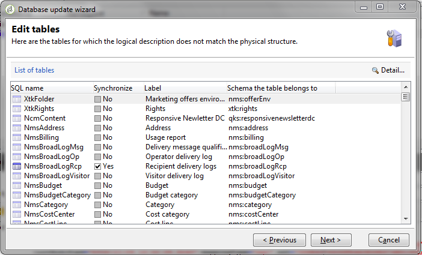

# 게재 대시보드 {#delivery-dashboard}


**게재 대시보드**&#x200B;는 메시지를 보내는 동안 발생하는 게재 및 최종 문제를 모니터링하는 키입니다.

이를 통해 게재 정보를 검색하고 필요한 경우 편집할 수 있습니다. 게재가 전송되면 탭 콘텐츠가 더 이상 변경되지 않을 수 있습니다.

다음은 대시보드에서 사용할 수 있는 몇 가지 탭을 사용하여 모니터링할 수 있는 정보입니다.

* [게재 요약](#delivery-summary)
* [게재 보고서](#delivery-reports)
* [게재 로그, 미러 페이지, 제외](#delivery-logs-and-history)
* [게재 추적 로그 및 내역](#tracking-logs)
* [게재 렌더링](#delivery-rendering)
* [게재 감사](#delivery-audit-)


**관련 항목:**

* [게재 실패 이해](understanding-delivery-failures.md)
* [격리 관리 이해](understanding-quarantine-management.md)
* [게재 모범 사례](https://experienceleague.adobe.com/docs/campaign/campaign-v8/send/delivery-best-practices.html?lang=ko){target="_blank"}
* [게재 기능 관리](about-deliverability.md)

## 게재 요약 {#delivery-summary}

**[!UICONTROL Summary]** 탭에는 게재 특성(게재 상태, 사용한 채널, 보낸 사람 정보, 제목, 실행 관련 정보)이 포함되어 있습니다.

## 게재 보고서 {#delivery-reports}

**[!UICONTROL Reports]** 탭에서 액세스할 수 있는 **[!UICONTROL Summary]** 링크를 사용하면 게재 작업과 관련된 보고서 세트(일반 게재 보고서, 자세한 보고서, 게재 보고서, 실패한 메시지 배포, 열람률, 클릭 수 및 트랜잭션 등)를 볼 수 있습니다.

이 탭의 내용은 요구 사항에 따라 구성할 수 있습니다. 게재 보고서에 대한 자세한 정보는 [이 섹션](../../reporting/using/delivery-reports.md)을 참조하세요.


## 게재 로그, 내역 및 제외 {#delivery-logs-and-history}

**[!UICONTROL Delivery]** 탭에는 이 게재의 발생 기록이 표시됩니다. 여기에는 게재 로그(예: 보낸 메시지 목록, 상태 및 관련 메시지)가 포함됩니다.

게재의 경우 게재가 실패한 수신자 또는 격리 중인 주소만 표시할 수 있습니다(예: ). 이렇게 하려면 **[!UICONTROL Filters]** 단추를 클릭하고 **[!UICONTROL By state]**&#x200B;을(를) 선택합니다. 그런 다음 드롭다운 목록에서 상태를 선택합니다. [이 페이지](delivery-statuses.md)에 다양한 상태가 나열됩니다.

>[!NOTE]
>
>게재 로그를 표시하는 목록은 Campaign Classic의 모든 목록과 같이 사용자 지정할 수 있습니다. 예를 들어 게재에서 각 이메일을 전송한 IP 주소를 알기 위한 열을 추가할 수 있습니다. 자세한 내용은 [이 섹션](#use-case)에 자세히 설명된 사용 사례를 참조하세요.


**[!UICONTROL Display the mirror page for this message...]** 링크를 사용하면 새 창의 목록에서 선택한 게재 내용에 대한 미러 페이지를 볼 수 있습니다.

미러 페이지는 HTML 콘텐츠가 정의된 게재에 대해서만 사용할 수 있습니다. 자세한 내용은 [Campaign v8 설명서](https://experienceleague.adobe.com/docs/campaign/campaign-v8/send/emails/mirror-page.html?lang=ko){target="_blank"}를 참조하세요.


## 게재 추적 로그 및 내역 {#tracking-logs}

**[!UICONTROL Tracking]** 탭에 이 게재의 추적 기록이 나열됩니다. 이 탭에는 전송된 메시지에 대한 추적 데이터, 즉 Adobe Campaign에 의한 추적이 적용되는 모든 URL이 표시됩니다. 추적 데이터는 시간별로 업데이트됩니다.

>[!NOTE]
>
>게재에 대해 추적이 활성화되어 있지 않은 경우 이 탭이 표시되지 않습니다.

추적 구성은 게재 도우미의 적절한 단계에서 수행됩니다. [추적된 링크를 구성하는 방법](how-to-configure-tracked-links.md)을 참조하세요.

**[!UICONTROL Tracking]** 데이터가 게재 보고서에 해석되어 있습니다. [이 섹션](../../reporting/using/delivery-reports.md)을 참조하십시오.


## 받은 편지함 렌더링 {#delivery-rendering}

**[!UICONTROL Inbox rendering]** 탭에서는 메시지를 받을 수 있는 다른 컨텍스트에서 메시지를 미리 보고 주요 데스크톱 및 응용 프로그램의 호환성을 확인할 수 있습니다.

이렇게 하면 메시지가 다양한 웹 클라이언트, 웹 메일 및 디바이스에서 최적의 방식으로 수신자에게 표시되도록 할 수 있습니다.

받은 편지함 렌더링에 대한 자세한 정보는 [이 페이지](inbox-rendering.md)를 참조하세요.


## 게재 감사 {#delivery-audit-}

**[!UICONTROL Audit]** 탭에는 게재 로그와 증명과 관련된 모든 메시지가 포함되어 있습니다.

**[!UICONTROL Refresh]** 단추를 사용하여 데이터를 업데이트할 수 있습니다. **[!UICONTROL Filters]** 단추를 사용하여 데이터에 대한 필터를 정의합니다.

특수 아이콘을 사용하면 오류나 경고를 식별할 수 있습니다. [Campaign v8 설명서](https://experienceleague.adobe.com/docs/campaign/campaign-v8/send/validate/delivery-analysis.html){target="_blank"}에서 이 섹션을 참조하십시오.

**[!UICONTROL Proofs]** 하위 탭에서는 보낸 증명 목록을 볼 수 있습니다.


표시할 열을 선택하여 이 창과 **[!UICONTROL Delivery]** 및 **[!UICONTROL Tracking]** 탭의 정보를 수정할 수 있습니다. 이렇게 하려면 오른쪽 하단에 있는 **[!UICONTROL Configure list]** 아이콘을 클릭합니다. 목록 표시 구성에 대한 자세한 내용은 [이 섹션](../../platform/using/adobe-campaign-workspace.md#configuring-lists)을 참조하세요.

## 게재 대시보드 동기화 {#delivery-dashboard-synchronization}

게재 대시보드에서 처리된 메시지 및 게재 로그를 확인하여 게재가 성공적으로 전송되었는지 확인할 수 있습니다.

일부 지표 또는 상태가 잘못되거나 최신 상태가 아닐 수 있습니다. 다음 솔루션으로 해결할 수 있습니다.

* 게재 상태가 올바르지 않으면 이 게재에 필요한 모든 승인이 수행되었는지 또는 **[!UICONTROL operationMgt]** 및 **[!UICONTROL deliveryMgt]** 워크플로우가 오류 없이 실행되고 있는지 확인하십시오. 전송 인스턴스에 구성되지 않은 선호도를 사용한 게재 때문일 수도 있습니다.

* 게재 지표가 여전히 0이고 중간 소싱 구성을 사용하는 경우 **[!UICONTROL Mid-sourcing (delivery counters)]** 기술 워크플로우를 확인하십시오. 상태가 **[!UICONTROL Started]**&#x200B;이(가) 아니면 시작하십시오. 그런 다음 Adobe Campaign 탐색기에서 관련 게재를 마우스 오른쪽 단추로 클릭하고 **[!UICONTROL Actions]** > **[!UICONTROL Recompute delivery and tracking indicators]**&#x200B;을(를) 선택하여 표시기를 다시 계산할 수 있습니다. 지표 추적에 대한 자세한 내용은 이 [섹션](../../reporting/using/delivery-reports.md#tracking-indicators)을 참조하세요.

* 게재 카운터가 게재와 일치하지 않으면 Adobe Campaign 탐색기에서 관련 게재를 마우스 오른쪽 단추로 클릭하고 **[!UICONTROL Actions]** > **[!UICONTROL Recompute delivery and tracking indicators]**&#x200B;을(를) 선택하여 다시 동기화하여 표시기를 다시 계산해 보십시오. 지표 추적에 대한 자세한 내용은 이 [섹션](../../reporting/using/delivery-reports.md#tracking-indicators)을 참조하세요.

* 중간 소싱 배포에 대한 게재 카운터가 최신 상태가 아닌 경우 **[!UICONTROL Mid-Sourcing (Delivery counters)]** 기술 워크플로우가 실행 중인지 확인하십시오. 자세한 정보는 이 [페이지](../../installation/using/mid-sourcing-deployment.md)를 참조하십시오.

게재 대시보드를 통해 다양한 보고서를 통해 게재를 추적할 수도 있습니다. 자세한 정보는 이 [섹션](../../reporting/using/delivery-reports.md)을 참조하십시오.

## 사용 사례: 로그에 보낸 사람의 IP 주소 추가 {#use-case}

이 섹션에서는 게재에 각 이메일을 전송한 IP 주소에 대한 정보를 게재 로그에 추가하는 방법에 대해 알아봅니다.

>[!NOTE]
>
>이 수정 사항은 단일 인스턴스 또는 중간 소싱 인스턴스를 사용하는 경우에 다릅니다. 수정하기 전에 이메일 전송 인스턴스에 연결되어 있는지 확인하십시오.

### 1단계: 스키마 확장

게재 로그에 **publicID**&#x200B;를 추가하려면 먼저 스키마를 확장해야 합니다. 다음과 같이 진행할 수 있습니다.

1. **[!UICONTROL Administration]** > **[!UICONTROL Configuration]** > **[!UICONTROL Data Schemas]** > **[!UICONTROL New]**&#x200B;에서 스키마 확장을 만듭니다.

   스키마 확장에 대한 자세한 내용은 [이 페이지](../../configuration/using/extending-a-schema.md)를 참조하세요.

1. **[!UICONTROL broadLogRcp]**&#x200B;을(를) 선택하여 NMS(받는 사람 게재 로그)를 확장하고 사용자 지정 네임스페이스를 정의합니다. 이 경우 &quot;cus&quot;가 됩니다.

   

   >[!NOTE]
   >
   >인스턴스가 중간 소싱에 있는 경우 broadLogMid 스키마와 작업해야 합니다.

1. 확장에 새 필드를 추가합니다. 이 샘플에서는 다음을 교체해야 합니다.

   ```
   <element img="nms:broadLog.png" label="Recipient delivery logs" labelSingular="Recipient delivery log" name="broadLogRcp"/>
   ```

   수행한 사람:

   ```
   <element img="nms:broadLog.png" label="Recipient delivery logs" labelSingular="Recipient delivery log" name="broadLogRcp">
   <attribute desc="Outbound IP identifier" label="IP identifier"
   name="publicId" type="long"/>
   </element>
   ```

   

### 2단계: 데이터베이스 구조 업데이트

수정이 완료되면 데이터베이스 구조가 논리적 설명과 일치하도록 업데이트해야 합니다.

이렇게 하려면 아래 단계를 수행합니다.

1. **[!UICONTROL Tools]** > **[!UICONTROL Advanced]** > **[!UICONTROL Update database structure...]** 메뉴를 클릭합니다.

   

1. **[!UICONTROL Edit tables]** 창에서 아래와 같이 **[!UICONTROL NmsBroadLogRcp]** 테이블(또는 중간 소싱 환경에 있는 경우 **[!UICONTROL broadLogMid]** 테이블)을 확인합니다.

   

   >[!IMPORTANT]
   >
   >**[!UICONTROL NmsBroadLoGRcp]** 테이블(또는 중간 소싱 환경에 있는 경우 **[!UICONTROL broadLogMid]** 테이블)을 제외한 다른 수정 사항이 없는지 항상 확인하십시오. 이 경우 다른 테이블의 선택을 취소합니다.

1. 유효성을 검사하려면 **[!UICONTROL Next]**&#x200B;을(를) 클릭하십시오. 다음 화면이 표시됩니다.

   

1. 데이터베이스 구조 업데이트를 시작하려면 **[!UICONTROL Next]**&#x200B;을(를) 클릭한 다음 **[!UICONTROL Start]**&#x200B;을(를) 클릭합니다. 색인 빌드를 시작하고 있습니다. 이 단계는 **[!UICONTROL NmsBroadLogRcp]** 테이블의 행 수에 따라 길어질 수 있습니다.

   

>[!NOTE]
>
>데이터베이스의 물리적 구조 업데이트가 성공적으로 완료되면 수정 사항을 고려하도록 연결을 끊고 다시 연결해야 합니다.

### 3단계: 수정 사항 유효성 검사

모든 것이 올바르게 작동하는지 확인하려면 게재 로그 화면을 업데이트해야 합니다.

이렇게 하려면 게재 로그에 액세스하고 &quot;IP 식별자&quot; 열을 추가합니다.


>[!NOTE]
>
>Campaign Classic 인터페이스에서 목록을 구성하는 방법에 대해 알아보려면 [이 페이지](../../platform/using/adobe-campaign-workspace.md)를 참조하세요.

수정 후 **[!UICONTROL Delivery]** 탭에 표시되는 내용은 다음과 같습니다.


