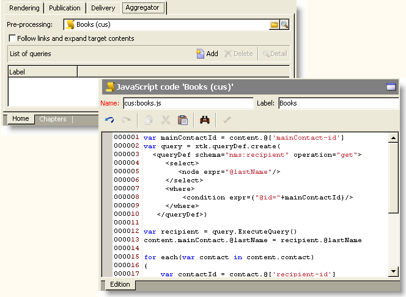

# 콘텐츠 강화{#enriching-content}


집계기를 사용하면 외부 데이터로 콘텐츠를 강화할 수 있습니다. 이 데이터는 일반 쿼리 또는 연결된 테이블에서 가져옵니다.

## 일반 쿼리 {#generic-queries}

쿼리는 의 게시 템플릿을 통해 구성됩니다 **[!UICONTROL Aggregator]** 탭.

검색된 데이터는 기본 요소를 통해 XML 출력 문서를 보강합니다.

수신자 스키마 쿼리의 반환 예(**nms:recipient**):

```
<book name="Content Management">
  ...
  <collection-recipient>
    <recipient lastName="Doe" firstName="John" email="john.doe@aolf.com">
    ...
  </collection-recipient>
</book>
```

다음 **`<collection-recipient>`** element는 쿼리로 인해 발생하는 문서의 입력 요소를 나타냅니다. 검색된 데이터는 이 요소 아래에 반환됩니다(이 예에서는 수신자 목록).

### 쿼리 추가 {#adding-a-query}

쿼리 매개 변수는 마법사를 사용하여 편집됩니다.

1. 첫 번째 페이지에서 검색할 데이터가 포함된 레이블과 스키마를 지정합니다.

   

   >[!NOTE]
   >
   >편집 필드 **경로** 는 쿼리 출력 요소의 이름을 바꾸는 데 사용됩니다.

1. 다음 페이지에서는 검색할 데이터를 선택할 수 있습니다.

   

1. 다음 페이지는 필터 조건을 정의합니다.

   

1. 마지막 페이지는 쿼리에서 반환된 데이터의 미리보기를 시작합니다.

   

## 연결된 테이블 {#linked-tables}

링크를 사용하면 콘텐츠에 연결된 외부 데이터를 검색할 수 있습니다.

연결된 데이터에는 두 가지 유형이 있습니다.

* 컨텐츠 링크: 기본 컨텐츠 관리 모드입니다. 링크의 내용이 XML 출력 문서에 자동으로 통합됩니다.
* 외부 테이블에 대한 링크를 사용하면 집계기를 사용하여 선택한 링크의 데이터를 검색할 수 있는 제약 조건으로 데이터베이스의 다른 모든 테이블에 액세스할 수 있습니다.

### 콘텐츠 스키마에 대한 링크 {#link-to-a-content-schema}

콘텐츠 링크는 다음과 같이 데이터 스키마에서 선언됩니다.

```
<element expandSchemaTarget="cus:chapter" label="Main chapter" name="mainChapter" type="string"/>
```

링크의 정의는 **문자열**-type **`<element>`**&#x200B;및 **expandSchematarget** 속성은 타겟 스키마를 참조합니다( 이 예제의 &quot;cus:chapter&quot;). 참조된 스키마는 콘텐츠 스키마여야 합니다.

타겟팅된 요소의 콘텐츠는 링크 요소, 즉 **`<chapter>`** 예제 스키마의 요소:

```
<mainChapter computeString="Introduction" id="7011" title="Introduction" xtkschema="cus:chapter">    
  <page>Introduction to input <STRONG>forms</STRONG>.</page>
</mainChapter>
```

>[!NOTE]
>
>다음 **계산 문자열** 의 링크는 **computeString** 특성.

입력 양식에서 링크의 편집 컨트롤은 다음과 같이 선언됩니다.

```
<input type="articleEdit" xpath="mainChapter"/>
```


다음 **[!UICONTROL Magnifier]** 아이콘을 사용하면 연결된 요소의 편집 양식을 열 수 있습니다.

#### 링크 컬렉션 {#link-collection}

링크 컬렉션을 채우려면 **unbound=&quot;true&quot;** 데이터 스키마에 있는 link 요소 정의에 대한 특성입니다.

```
<element expandSchemaTarget="cus:chapter" label="List of chapters" name="chapter"  ordered="true" unbound="true"/>
```

targeted 요소의 콘텐츠는 각 수집 요소를 강화합니다.

```
<chapter computeString="Introduction" id="7011" title="Introduction" xtkschema="cus:chapter">    
  <page>Introduction to input <STRONG>forms</STRONG>.</page>
</chapter>
```

입력 폼에서 목록 컨트롤은 다음과 같이 선언됩니다.

```
<input editable="false" nolabel="true" toolbarCaption="List of chapters" type="articleList" xpath="chapter" zoom="true"/>
```


기본 열이 표시되어 **계산 문자열** 을 참조하십시오.

### 외부 표에 대한 링크 {#links-to-external-tables}

외부 테이블에 대한 링크는 다음과 같이 데이터 스키마에서 선언됩니다.

```
<element label="Main contact" name="mainContact" target="nms:recipient" type="link"/>
```

링크의 정의는 **링크**-type **`<element>`**&#x200B;및 **target** 속성은 대상 스키마(&quot;nms:recipient&quot;)를 참조합니다.

규칙에 따라 데이터 스키마의 기본 요소에서 링크를 선언해야 합니다.

다음 **계산 문자열** 및 대상 요소의 키는 **`<name>-id`** 및 **`<name>-cs`** 기본 요소에 대한 특성입니다.

이 예제에서 링크는 &quot;cus:book&quot; 스키마에 채워지고 링크 데이터의 콘텐츠는 &quot;mainContact-id&quot; 및 &quot;mainContact-cs&quot; 속성에 포함됩니다.

```
<book computeString="Content management" date="2006/06/08" id="6106" language="en" mainContact-cs="John Doe (john.doe@adobe.com)" mainContact-id="3012" name="Content management" xtkschema="cus:book">
```

링크 편집 컨트롤은 다음과 같이 선언됩니다.

```
<input xpath="mainContact"/>
```


다음을 추가하여 대상 요소의 선택을 제한할 수 있습니다. **`<sysfilter>`** 입력 양식의 링크 정의를 통한 요소:

```
<input xpath="mainContact">
  <!-- Filter the selection of the link on the Adobe domain -->
  <sysFilter>
    <condition expr="@domain =  'adobe.com '"/>
  </sysFilter>
</input>
```

>[!NOTE]
>
>이 제한 사항은 콘텐츠 링크에도 적용됩니다.

#### 링크 컬렉션 {#link-collection-1}

컬렉션의 정의는 컬렉션 요소에 대한 목록의 정의와 동일합니다.

```
<element label="List of contacts" name="contact" unbound="true">
  <element label="Recipient" name="recipient" target="nms:recipient" type="link"/>
</element>
```

입력 폼에서 목록 컨트롤은 다음과 같이 선언됩니다.

```
<input nolabel="true" toolbarCaption="List of contacts" type="list" xpath="contact">
  <input xpath="recipient"/>
</input>
```


>[!NOTE]
>
>이 목록은 편집할 수 있으며 위에 표시된 &quot;link&quot; 유형의 컨트롤에서 링크를 선택할 수 있습니다.

타겟팅된 요소의 콘텐츠는 출력 문서에서 각 컬렉션 요소를 강화합니다.

```
<contact id="11504978621" recipient-cs="Doe John (john.doe@adobe.com)" recipient-id="3012"/>
<contact id="11504982510" recipient-cs="Martinez Peter (peter.martinez@adobe.com)" recipient-id="3013"/>
```

#### 링크 집계 {#link-aggregation}

참조되는 각 링크의 콘텐츠는 내부 키 및 **계산 문자열** 을 참조하십시오.

JavaScript 스크립트는 SOAP 쿼리를 통해 링크의 콘텐츠를 보강하는 데 사용됩니다.

**예**: &quot;mainContact&quot; 링크 및 &quot;contact&quot; 컬렉션 링크에 수신자 이름 추가:

```
// Update <mainContact> link
var mainContactId = content.@['mainContact-id']
var query = xtk.queryDef.create(
    <queryDef schema="nms:recipient" operation="get">
      <select>
        <node expr="@lastName"/>
      </select>
      <where>
        <condition expr={"@id="+mainContactId}/>
      </where>
    </queryDef>)

var recipient = query.ExecuteQuery()
content.mainContact.@lastName = recipient.@lastName

// Update <contact> link collection
for each(var contact in content.contact)
{
  var contactId = contact.@['recipient-id']
  var query = xtk.queryDef.create(
    <queryDef schema="nms:recipient" operation="get">
      <select>
        <node expr="@lastName"/>
      </select>
      <where>
        <condition expr={"@id="+contactId}/>
      </where>
    </queryDef>
  )
  
  var recipient = query.ExecuteQuery()
  contact.@lastName = recipient.@lastName
}
```

스크립트 실행 후 얻은 결과:

```
<mainContact lastName="Doe"/>

<contact id="11504978621" lastName="Doe" recipient-cs="Doe John (john.doe@adobe.com)" recipient-id="3012"/>  
<contact id="11504982510" lastName="Martinez" recipient-cs="Martinez Peter (peter.martinez@adobe.com)" recipient-id="3013"/> 
```

JavaScript 코드의 콘텐츠는 **[!UICONTROL Administration > Configuration > Content management > JavaScript Codes]** 각 변형에 대해 게시 템플릿에서 폴더 및 을 채워야 합니다.


