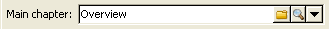

# 콘텐츠 강화{#enriching-content}

집계를 사용하면 외부 데이터로 컨텐츠를 보강할 수 있습니다. 이 데이터는 일반 쿼리 또는 연결된 테이블에서 가져옵니다.

## 일반 쿼리 {#generic-queries}

쿼리는 **[!UICONTROL Aggregator]** 탭의 게시 템플릿을 통해 구성됩니다.

검색된 데이터는 기본 요소를 통해 XML 출력 문서를 보강합니다.

수신자 스키마의 쿼리에서 반환한 예(**nms:recipient**):

```
<book name="Content Management">
  ...
  <collection-recipient>
    <recipient lastName="Doe" firstName="John" email="john.doe@aolf.com">
    ...
  </collection-recipient>
</book>
```

**`<collection-recipient>`** 요소는 쿼리에서 얻은 문서의 입력 요소를 나타냅니다. 검색된 데이터가 이 요소 아래에 반환됩니다.이 예제에서는 수신자 목록입니다.

### 쿼리 {#adding-a-query} 추가

쿼리 매개 변수는 마법사를 사용하여 편집됩니다.

1. 첫 번째 페이지에서 검색할 데이터가 포함된 스키마와 레이블을 지정합니다.

   

   >[!NOTE]
   >
   >편집 필드 **경로**&#x200B;는 쿼리 출력 요소의 이름을 바꾸는 데 사용됩니다.

1. 다음 페이지에서 검색할 데이터를 선택할 수 있습니다.

   

1. 다음 페이지에서는 필터 조건을 정의합니다.

   

1. 마지막 페이지는 쿼리에서 반환한 데이터의 미리 보기를 실행합니다.

   

## 연결된 테이블 {#linked-tables}

링크를 사용하면 컨텐츠에 연결된 외부 데이터를 검색할 수 있습니다.

연결된 데이터에는 두 가지 유형이 있습니다.

* 컨텐츠 링크:기본 컨텐츠 관리 모드입니다. 링크의 컨텐츠는 XML 출력 문서에 자동으로 통합됩니다.
* 외부 테이블에 대한 링크를 사용하면 집계를 사용하여 선택한 링크의 데이터를 검색하는 제약 조건으로 데이터베이스의 다른 모든 테이블에 액세스할 수 있습니다.

### 컨텐츠 스키마 {#link-to-a-content-schema}에 연결

컨텐츠 링크는 데이터 스키마에 다음과 같이 선언됩니다.

```
<element expandSchemaTarget="cus:chapter" label="Main chapter" name="mainChapter" type="string"/>
```

링크의 정의는 **문자열**-type **`<element>`**&#x200B;에 채워지고, **expandSchemaTarget** 속성은 대상 스키마(&quot;cus:chapter&quot;)를 참조합니다. 참조된 스키마가 컨텐츠 스키마여야 합니다.

타깃팅된 요소의 컨텐츠는 링크 요소(예: 예제 스키마의 **`<chapter>`** 요소)를 강화합니다.

```
<mainChapter computeString="Introduction" id="7011" title="Introduction" xtkschema="cus:chapter">    
  <page>Introduction to input <STRONG>forms</STRONG>.</page>
</mainChapter>
```

>[!NOTE]
>
>링크의 **계산 문자열**&#x200B;은 **computeString** 특성에서 표시됩니다.

입력 양식에서 링크의 편집 컨트롤은 다음과 같이 선언됩니다.

```
<input type="articleEdit" xpath="mainChapter"/>
```



**[!UICONTROL Magnifier]** 아이콘을 사용하면 연결된 요소의 편집 양식을 열 수 있습니다.

#### 링크 컬렉션 {#link-collection}

링크 컬렉션을 채우려면 **unbound=&quot;true&quot;** 속성을 데이터 스키마의 링크 요소 정의에 추가합니다.

```
<element expandSchemaTarget="cus:chapter" label="List of chapters" name="chapter"  ordered="true" unbound="true"/>
```

타깃팅된 요소의 컨텐츠는 각 수집 요소를 보강합니다.

```
<chapter computeString="Introduction" id="7011" title="Introduction" xtkschema="cus:chapter">    
  <page>Introduction to input <STRONG>forms</STRONG>.</page>
</chapter>
```

입력 양식에서 목록 컨트롤은 다음과 같이 선언됩니다.

```
<input editable="false" nolabel="true" toolbarCaption="List of chapters" type="articleList" xpath="chapter" zoom="true"/>
```


대상 요소의 **계산 문자열**&#x200B;을 보기 위해 기본 열이 표시됩니다.

### 외부 테이블 {#links-to-external-tables} 링크

외부 테이블에 대한 링크는 데이터 스키마에서 다음과 같이 선언됩니다.

```
<element label="Main contact" name="mainContact" target="nms:recipient" type="link"/>
```

링크의 정의는 **링크**-type **`<element>`**&#x200B;에 채워지고, **target** 속성은 대상 스키마(&quot;nms:recipient&quot;)를 참조합니다.

규칙에 따라 링크는 데이터 스키마의 기본 요소에서 선언되어야 합니다.

**계산 문자열** 및 타깃팅된 요소의 키는 기본 요소의 **`<name>-id`** 및 **`<name>-cs`** 속성을 보강합니다.

이 예제에서 링크는 &quot;cus:book&quot; 스키마에서 채워지고, 링크 데이터의 컨텐츠는 &quot;mainContact-id&quot; 및 &quot;mainContact-cs&quot; 속성에 포함됩니다.

```
<book computeString="Content management" date="2006/06/08" id="6106" language="en" mainContact-cs="John Doe (john.doe@adobe.com)" mainContact-id="3012" name="Content management" xtkschema="cus:book">
```

링크 편집 컨트롤은 다음과 같이 선언됩니다.

```
<input xpath="mainContact"/>
```


입력 양식의 링크 정의를 통해 **`<sysfilter>`** 요소를 추가하여 대상 요소의 선택을 제한할 수 있습니다.

```
<input xpath="mainContact">
  <!-- Filter the selection of the link on the Adobe domain -->
  <sysFilter>
    <condition expr="@domain =  'adobe.com '"/>
  </sysFilter>
</input>
```

>[!NOTE]
>
>이 제한 사항은 콘텐츠 링크에도 적용됩니다.

#### 링크 컬렉션 {#link-collection-1}

컬렉션의 정의는 수집 요소에 대한 목록 정의와 동일합니다.

```
<element label="List of contacts" name="contact" unbound="true">
  <element label="Recipient" name="recipient" target="nms:recipient" type="link"/>
</element>
```

입력 양식에서 목록 컨트롤은 다음과 같이 선언됩니다.

```
<input nolabel="true" toolbarCaption="List of contacts" type="list" xpath="contact">
  <input xpath="recipient"/>
</input>
```


>[!NOTE]
>
>목록을 편집할 수 있으며 위에 표시된 &quot;링크&quot; 유형 컨트롤에서 링크를 선택할 수 있습니다.

타깃팅된 요소의 컨텐츠는 출력 문서의 각 수집 요소를 보강합니다.

```
<contact id="11504978621" recipient-cs="Doe John (john.doe@adobe.com)" recipient-id="3012"/>
<contact id="11504982510" recipient-cs="Martinez Peter (peter.martinez@adobe.com)" recipient-id="3013"/>
```

#### 링크 집계 {#link-aggregation}

참조된 각 링크의 콘텐츠는 내부 키 및 타깃팅된 요소의 **계산 문자열**&#x200B;로 제한됩니다.

JavaScript 스크립트는 SOAP 쿼리를 통해 링크의 컨텐츠를 보강하는 데 사용됩니다.

**예**:받는 사람 이름을 &quot;mainContact&quot; 링크 및 &quot;contact&quot; 컬렉션 링크에 추가:

```
// Update <mainContact> link
var mainContactId = content.@['mainContact-id']
var query = xtk.queryDef.create(
    <queryDef schema="nms:recipient" operation="get">
      <select>
        <node expr="@lastName"/>
      </select>
      <where>
        <condition expr={"@id="+mainContactId}/>
      </where>
    </queryDef>)

var recipient = query.ExecuteQuery()
content.mainContact.@lastName = recipient.@lastName

// Update <contact> link collection
for each(var contact in content.contact)
{
  var contactId = contact.@['recipient-id']
  var query = xtk.queryDef.create(
    <queryDef schema="nms:recipient" operation="get">
      <select>
        <node expr="@lastName"/>
      </select>
      <where>
        <condition expr={"@id="+contactId}/>
      </where>
    </queryDef>
  )
  
  var recipient = query.ExecuteQuery()
  contact.@lastName = recipient.@lastName
}
```

스크립트 실행 후 얻은 결과:

```
<mainContact lastName="Doe"/>

<contact id="11504978621" lastName="Doe" recipient-cs="Doe John (john.doe@adobe.com)" recipient-id="3012"/>  
<contact id="11504982510" lastName="Martinez" recipient-cs="Martinez Peter (peter.martinez@adobe.com)" recipient-id="3013"/> 
```

JavaScript 코드의 컨텐츠는 **[!UICONTROL Administration > Configuration > Content management > JavaScript Codes]** 폴더를 통해 추가되며, 각 변환에 대해 게시 템플릿에서 채워야 합니다.


