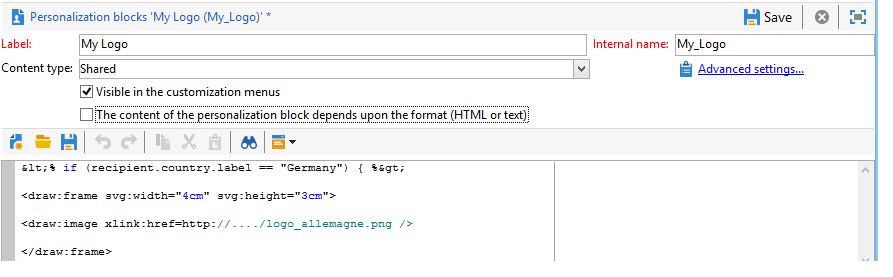

# 맞춤형 PDF 문서 생성{#generating-personalized-pdf-documents}

## 가변 PDF 문서 정보 {#about-variable-pdf-documents}

Adobe Campaign을 사용하면 LibreOffice 또는 Microsoft Word 문서에서 가변 PDF 문서(이메일 첨부 파일, DM 배달)를 생성할 수 있습니다.

다음 익스텐션이 지원됩니다.&quot;.docx&quot;, &quot;.doc&quot; 및 &quot;.odt&quot;.

문서를 개인화하기 위해 이메일 개인화와 동일한 JavaScript 기능을 사용할 수 있습니다.

이 **[!UICONTROL "The content of the file is personalized and converted to PDF during the delivery of each message"]** 옵션을 활성화해야 합니다. 이 옵션은 파일을 배달 이메일에 첨부할 때 액세스할 수 있습니다. 계산된 파일을 첨부하는 방법에 대한 자세한 내용은 파일 [첨부](../../delivery/using/attaching-files.md) 섹션을 참조하십시오.

송장 헤더 개인화의 예:


동적 표를 생성하거나 URL을 통해 이미지를 포함하려면 특정 프로세스를 따라야 합니다.

## 동적 표 생성 {#generating-dynamic-tables}

동적 테이블을 생성하는 절차는 다음과 같습니다.

* 3개의 행과 필요한 만큼 많은 열이 있는 표를 만든 다음 레이아웃(테두리 등)을 구성합니다.
* 커서를 테이블 위에 놓고 **[!UICONTROL Table > Table properties]** 메뉴를 클릭합니다. 탭으로 이동하여 NlJsTable로 시작하는 이름을 **[!UICONTROL Table]** 입력합니다 ****.
* 첫 번째 줄의 첫 번째 셀에서 표에 표시할 값에 대해 반복을 활성화하는 루프(&quot;for&quot;)를 정의합니다.
* 표의 두 번째 줄의 각 셀에서 표시할 값을 반환하는 스크립트를 삽입합니다.
* 표의 세 번째 행과 마지막 행에서 루프를 닫습니다.

   동적 테이블 정의의 예:

   

## 외부 이미지 삽입 {#inserting-external-images}

외부 이미지를 삽입하는 것은 수신자의 필드에 URL을 입력하는 이미지를 사용하여 문서를 개인화하려는 경우 유용합니다.

이렇게 하려면 개인화 블록을 구성한 다음 첨부 파일에 개인화 블록에 대한 호출을 포함해야 합니다.

**예:받는 사람의 국가에 따라 개인화된 로고 삽입**

**1단계:첨부 파일 만들기:**

* 개인화 블록에 호출을 삽입합니다.&lt;%@ include view=&quot;blockname&quot; %> ****.
* 파일의 본문에 컨텐츠(개인화되거나 아님)를 삽입합니다.


**2단계:개인화 블록 만들기:**

* Adobe Campaign 콘솔의 **[!UICONTROL Resources > Campaign management > Personalization blocks]** 메뉴로 이동합니다.
* &quot;My_Logo&quot;를 내부 이름으로 사용하여 새로운 &quot;My Logo&quot; 개인화 블록을 만듭니다.
* 링크를 클릭한 다음 **[!UICONTROL Advanced parameters...]** **[!UICONTROL "The content of the block is included in an attachment"]** 옵션을 선택합니다. 이렇게 하면 개인화 블록의 정의를 OpenOffice 파일의 콘텐츠에 직접 복사할 수 있습니다.

   

   개인화 블록 내에서 두 가지 유형의 선언을 차별화해야 합니다.

   * &quot;open&quot; 및 &quot;closed&quot; 체브론이 각각 이스케이프 문자로 대체되어야 하는 개인화 필드의 Adobe Campaign 코드( `&lt;` 및 `&gt;`)입니다.
   * 전체 OpenOffice XML 코드가 OpenOffice 문서에 복사됩니다.

이 예에서 개인화 블록은 다음과 같습니다.

```
<% if (recipient.country.label == "Germany") { %>
<draw:frame svg:width="4cm" svg:height="3cm">
<draw:image xlink:href=https://..../logo_germany.png />
</draw:frame>
<% } else
if (recipient.country.label == "USA")
{ %>
<draw:frame svg:width="4cm" svg:height="3cm">
<draw:image xlink:href=https://..../logo_USA.png />
</draw:frame>
<% } %>
```

받는 사람의 국가에 따라, 개인화는 게재와 연결된 문서에 표시됩니다.


