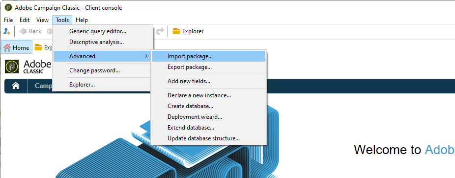

# 앱 구성 시작

이 섹션에서는 온라인 휴일 패키지를 판매하는 회사를 기반으로 한 구성 샘플을 확인할 수 있습니다. 이 모바일 애플리케이션(네오트립)은 고객에게 두 가지 버전으로 제공됩니다. Android 및 iOS용 네오트립.

Adobe Campaign에서 푸시 알림을 전송하려면 다음을 수행해야 합니다.

* 만들기 **[!UICONTROL Mobile application]** 네오트립 모바일 응용 프로그램에 대한 정보 서비스 유형. 을(를) 참조하십시오. [iOS에 대한 이 섹션](configuring-the-mobile-application.md#configuring-ios-service). 및 [Android용 이 섹션](configuring-the-mobile-application-android.md#configuring-android-service).
* 애플리케이션의 iOS 및 Android 버전을 이 서비스에 추가합니다.
* 게재 만들기 [iOS](create-notifications-ios.md) 및 [Android](create-notifications-android.md).

>[!NOTE]
>
>로 이동합니다. **[!UICONTROL Subscriptions]** 서비스의 탭을 사용하여 서비스 구독자 목록(예: 모바일에 애플리케이션을 설치했고 알림을 받는 데 동의한 모든 사용자)을 볼 수 있습니다.

## 패키지 설치 {#installing-package-ios}

 [비디오에 모바일 앱 패키지를 설치하는 방법을 알아봅니다](https://experienceleague.adobe.com/docs/campaign-classic-learn/tutorials/sending-messages/push-channel/installing-the-mobile-app-channel.html?lang=en#sending-messages)

하이브리드/호스팅 고객은 [고객 지원 Adobe](https://helpx.adobe.com/kr/enterprise/admin-guide.html/enterprise/using/support-for-experience-cloud.ug.html) 팀이 Campaign에서 푸시 알림 채널에 액세스할 수 있습니다.

온-프레미스 고객은 기본 제공 패키지를 설치해야 합니다.

>[!CAUTION]
>
>에서 Campaign 기본 제공 패키지, 모범 사례 및 권장 사항에 대해 자세히 알아보십시오 [이 페이지](../../installation/using/installing-campaign-standard-packages.md).

설치 단계는 다음과 같습니다.

1. 에서 패키지 가져오기 마법사에 액세스 **[!UICONTROL Tools > Advanced > Import package]** ( Adobe Campaign 클라이언트 콘솔) 아래에 그룹화됩니다.

   

1. **[!UICONTROL Install a standard package]**&#x200B;을(를) 선택합니다.

1. 목록이 표시되면 **[!UICONTROL Mobile App Channel]**.

   

1. 클릭 **[!UICONTROL Next]**, 그런 다음 **[!UICONTROL Start]** 패키지 설치를 시작하려면 다음을 수행하십시오.

   패키지가 설치되면 진행률 표시줄이 표시됩니다 **100%** 설치 로그에 다음 메시지가 표시됩니다. **[!UICONTROL Installation of packages successful]**.

   

1. **[!UICONTROL Close]** 설치 창

이 단계를 완료하면 Android 및 iOS 앱을 구성할 수 있습니다.
다음 섹션을 참조하십시오.

* [iOS용 구성 단계](configuring-the-mobile-application.md)

* [Android용 구성 단계](configuring-the-mobile-application-android.md)
