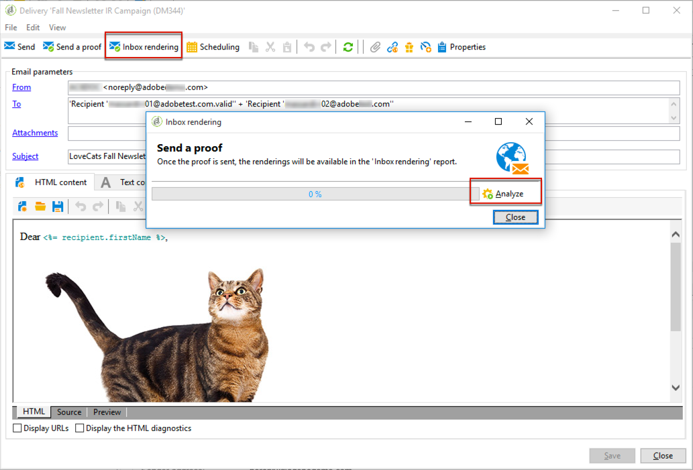

# 받은 편지함 렌더링{#inbox-rendering}

## 받은 편지함 렌더링 정보 {#about-inbox-rendering}

**보내기** 단추를 누르기 전에 다양한 웹 클라이언트, 웹 메일 및 장치에서 최적의 방법으로 수신자에게 메시지가 표시되는지 확인하십시오.

이를 위해 Adobe Campaign은 [리트머스](https://litmus.com/email-testing) 웹 기반 이메일 테스트 솔루션을 활용하여 렌더링을 캡처하고 전용 보고서에서 사용할 수 있도록 합니다. 이렇게 하면 메시지를 받을 수 있는 다른 컨텍스트로 보낸 메시지를 미리 보고 주요 데스크톱 및 응용 프로그램의 호환성을 확인할 수 있습니다.

리트머스 시험지는 기능이 풍부한 이메일 유효성 검사와 애플리케이션 미리 보기입니다. 이메일 컨텐츠 제작자는 Gmail 받은 편지함 또는 Apple Mail 클라이언트와 같은 70개 이상의 이메일 렌더러에서 메시지 컨텐츠를 미리 볼 수 있습니다.

Adobe Campaign의 **받은 편지함 렌더링**&#x200B;에 사용할 수 있는 모바일, 메시지 및 웹메일 클라이언트는 [리트머스 웹 사이트](https://litmus.com/email-testing)(**모든 이메일 클라이언트 보기** 클릭)에 나열됩니다.

>[!NOTE]
>
>배달에서 개인화를 테스트하려면 받은 편지함 렌더링이 필요하지 않습니다. 개인화는 **[!UICONTROL Preview]** 및 [교정쇄도](../../delivery/using/steps-validating-the-delivery.md#sending-a-proof)와 같은 Adobe Campaign 도구로 확인할 수 있습니다.

## 받은 편지함 렌더링 활성화 중 {#activating-inbox-rendering}

호스팅된 클라이언트와 하이브리드 클라이언트의 경우 받은 편지함 렌더링은 Adobe 기술 지원 및 컨설턴트를 통해 인스턴스에 구성됩니다. 자세한 내용은 Adobe 계정 담당자에게 문의하십시오.

온-프레미스 설치의 경우 아래 절차에 따라 받은 편지함 렌더링을 구성합니다.

1. **[!UICONTROL Tools]** > **[!UICONTROL Advanced]** > **[!UICONTROL Import package]** 메뉴를 통해 **[!UICONTROL Inbox rendering (IR)]** 패키지를 설치합니다. 자세한 내용은 [Campaign Classic 표준 패키지 설치](../../installation/using/installing-campaign-standard-packages.md)를 참조하십시오.
1. **[!UICONTROL Administration]** > **[!UICONTROL Platform]** > **[!UICONTROL External Accounts]** 노드를 통해 HTTP 유형의 외부 계정을 구성합니다. 자세한 내용은 [외부 계정 만들기](../../installation/using/external-accounts.md#creating-an-external-account)를 참조하십시오.
1. 외부 계정 매개 변수를 다음과 같이 설정합니다.
   * **[!UICONTROL Label]**:제공 가능 서버 정보
   * **[!UICONTROL Internal name]**:deliveryInstance
   * **[!UICONTROL Type]**: HTTP
   * **[!UICONTROL Server]**:https://deliverability-app.neolane.net/deliverability
   * **[!UICONTROL Encryption]**:없음
   * **[!UICONTROL Enabled]** 옵션을 선택합니다.

   

1. **[!UICONTROL Administration]** > **[!UICONTROL Platform]** > **[!UICONTROL Options]** 노드로 이동합니다. **[!UICONTROL DmRendering_cuid]** 옵션을 검색하고 지원 센터에 문의하여 **[!UICONTROL Value (text)]** 필드에 복사해야 하는 배달 보고서 식별자를 가져옵니다.
1. 리트머스 서버에 대한 호출을 허용하려면 **serverConf.xml** 파일을 편집합니다. `<urlPermission>` 섹션에 다음 줄을 추가합니다.

   ```
   <url dnsSuffix="deliverability-app.neolane.net" urlRegEx="https://.*"/>
   ```

1. 다음 명령을 사용하여 구성을 다시 로드합니다.

   ```
   nlserver config -reload
   ```

>[!NOTE]
>
>콘솔에서 로그아웃하고 다시 로그인해야 받은 편지함 렌더링을 사용할 수 있습니다.

## 리트머스 토큰 정보 {#about-litmus-tokens}

리트머스 는 제3자 서비스이므로 이용당 신용 시스템에서 작동합니다. 사용자가 리트머스 기능을 호출할 때마다 크레딧이 공제됩니다.

Adobe Campaign에서 크레딧은 사용 가능한 렌더링(토큰으로 알려져 있음) 수에 해당합니다.

>[!NOTE]
>
>사용할 수 있는 리트머스 토큰 수는 구입한 캠페인 라이선스에 따라 다릅니다. 사용권 계약을 확인하십시오.

배달에서 **[!UICONTROL Inbox rendering]** 기능을 사용할 때마다 생성된 각 렌더링은 사용 가능한 토큰을 하나씩 감소시킵니다.

>[!IMPORTANT]
>
>토큰은 전체 받은 편지함 렌더링 보고서가 아니라 각 개별 렌더링에 대해 계산됩니다. 즉,
>
>* 받은 편지함 렌더링 보고서가 생성될 때마다 메시징 클라이언트당 하나의 토큰을 공제합니다.Outlook 2000 렌더링을 위한 토큰 1개, Outlook 2010 렌더링을 위한 토큰 하나, Apple Mail 9 렌더링을 위한 토큰 하나 등.
>* 동일한 전달의 경우 받은 편지함 렌더링을 다시 생성할 경우 사용 가능한 토큰 수가 생성된 렌더링 수로 다시 감소합니다.

>


사용 가능한 남은 토큰 수가 [받은 편지함 렌더링 보고서](#inbox-rendering-report)의 **[!UICONTROL General summary]**&#x200B;에 표시됩니다.


일반적으로 받은 편지함 렌더링 기능은 새로 디자인된 이메일의 HTML 프레임워크를 테스트하는 데 사용됩니다. 각 렌더링에는 약 70개의 토큰이 필요합니다(일반적으로 테스트되는 환경의 수에 따라 다름). 그러나 일부 경우 배달을 완전히 테스트하려면 여러 개의 받은 편지함 렌더링 보고서가 필요할 수 있습니다. 따라서 여러 개의 검사를 완료하는 데 토큰이 더 필요할 수 있습니다.

## 받은 편지함 렌더링 보고서 액세스 {#accessing-the-inbox-rendering-report}

전자 메일 게재를 만들고 타겟팅된 모집단과 해당 컨텐츠까지 정의했으면 아래 단계를 따르십시오.

배달 만들기, 디자인 및 타깃팅에 대한 자세한 내용은 [이 섹션](../../delivery/using/about-email-channel.md)을 참조하십시오.

1. 배달의 위쪽 막대에서 **[!UICONTROL Inbox rendering]** 단추를 클릭합니다.
1. 캡처 프로세스를 시작하려면 **[!UICONTROL Analyze]**&#x200B;을 선택합니다.

   

   증거가 전송됩니다. 이메일을 보낸 후 몇 분 후에 해당 교정기에서 렌더링 축소판에 액세스할 수 있습니다. 교정본을 전송하는 방법에 대한 자세한 내용은 [이 섹션](../../delivery/using/steps-validating-the-delivery.md#sending-a-proof)을 참조하십시오.

1. 전송 후 전달 목록에 증명 정보가 표시됩니다. 두 번 클릭합니다.

   

1. 증빙 문서의 **받은 편지함 렌더링** 탭으로 이동합니다.

   

   받은 편지함 렌더링 보고서가 표시됩니다.

## 받은 편지함 렌더링 보고서 {#inbox-rendering-report}

이 보고서에는 수신자에게 나타나는 받은 편지함 렌더링이 표시됩니다. 수신자가 이메일 배달을 여는 방법에 따라 렌더링이 다를 수 있습니다.브라우저, 모바일 디바이스 또는 이메일 애플리케이션을 통해 문서를 전송할 수 있습니다.

**[!UICONTROL General summary]**&#x200B;은 수신 메시지, 원치 않는 메시지(스팸), 수신되지 않은 메시지 또는 대기 중인 메시지 수를 목록 및 그래픽 색상으로 코딩된 표현을 통해 보여 줍니다.


차트 위로 마우스를 가져가면 각 색상에 대한 세부 사항이 표시됩니다.

보고서의 본문은 세 부분으로 나뉘어져 있습니다.**[!UICONTROL Mobile]**, **[!UICONTROL Messaging clients]** 및 **[!UICONTROL Webmails]**. 보고서를 아래로 스크롤하여 이 세 가지 범주로 그룹화된 모든 렌더링을 표시합니다.


각 보고서에 대한 세부 정보를 보려면 해당 카드를 클릭합니다. 선택한 수신 방법에 대해 렌더링이 표시됩니다.


