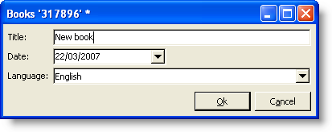

# 입력 양식{#input-forms}

다음은 Adobe Campaign에서 입력 양식 사용에 관한 일반적인 몇 가지 원칙입니다.

Forms은 [이 섹션](../../configuration/using/identifying-a-form.md)에 자세히 설명되어 있습니다.

## 양식 구조 {#form-structure}

입력 양식의 XML 문서에는 각각 양식 이름과 네임스페이스를 채우려면 **name** 및 **namespace** 특성이 있는 **`<form>`** 루트 요소가 포함되어야 합니다.

```
<form name="form_name" namespace="name_space">
...
</form>
```

기본적으로 양식은 이름과 네임스페이스가 같은 데이터 스키마와 연결됩니다. 양식을 다른 이름으로 연결하려면 **`<form>`** 요소의 **entity-schema** 속성에 스키마 키를 입력합니다.

입력 양식의 구조를 설명하기 위해 예제 스키마 &quot;cus:book&quot;:



해당 입력 양식입니다.

```
<form name="book" namespace="cus" type="contentForm">
  <input xpath="@name"/>
  <input xpath="@date"/>
  <input xpath="@language"/>
</form>
```

편집 요소의 설명은 **`<form>`** 루트 요소로 시작합니다.

스키마 필드의 경로를 포함하는 **xpath** 특성이 있는 **`<input>`** 요소에 편집 컨트롤이 입력됩니다.

**XPath 구문에 대한 미리 알림:**

XPath 언어는 Adobe Campaign에서 데이터 스키마에 속하는 요소 또는 특성을 참조하는 데 사용됩니다.

XPath는 XML 문서의 트리에서 노드를 찾을 수 있는 구문입니다.

요소는 이름으로 지정되며 속성은 문자 앞에 &quot;@&quot;가 붙은 이름으로 지정됩니다.

예제:

* **@date**:&quot;date&quot;라는 이름의 속성을 선택합니다.
* **chapter/@title**:요소 아래의 &quot;title&quot; 속성을  `<chapter>` 선택합니다.
* **../@date**:현재 요소의 상위 요소에서 날짜를 선택합니다.

편집 컨트롤은 해당 데이터 유형에 자동으로 적응하며 스키마에 정의된 레이블을 사용합니다.

기본적으로 각 필드는 데이터 유형에 따라 한 줄에 표시되며 사용 가능한 모든 공간을 차지합니다.

>[!CAUTION]
>
>입력 양식은 **`<form>`** 요소에서 **type=&quot;contentForm&quot;** 특성을 참조해야 내용 입력에 필요한 프레임을 자동으로 추가할 수 있습니다.

## 서식 {#formatting}

서로 상대적인 컨트롤의 배열은 컨트롤을 여러 열로 나누거나, 인터레이스 요소를 포함하거나, 사용 가능한 공간의 위치를 지정할 수 있으므로 HTML 표에 사용되는 배열처럼 보입니다. 그러나 서식을 지정하면 비율이 분포됩니다.오브젝트에 고정 치수를 지정할 수 없습니다.

이 작업에 대한 자세한 정보는 [이 섹션](../../configuration/using/form-structure.md#formatting)을 참조하십시오.

## 목록 유형 컨트롤 {#list-type-controls}

컬렉션 요소를 편집하려면 목록 유형 컨트롤을 사용해야 합니다.

### 열 목록 {#column-list}

이 컨트롤은 추가 및 삭제 단추가 포함된 도구 모음과 함께 편집 가능한 열 목록을 표시합니다.


```
<input xpath="chapter" type="list">
  <input xpath="@name"/>
  <input xpath="@number"/>
</input>
```

목록 컨트롤은 **type=&quot;list&quot;** 특성으로 채워야 하며 목록 경로는 컬렉션 요소를 참조해야 합니다.

열은 목록의 자식 **`<input>`** 요소로 선언됩니다.

>[!NOTE]
>
>데이터 스키마의 수집 요소에 대해 **ordered=&quot;true&quot;** 특성이 완료되면 위쪽 및 아래쪽 순서 화살표가 자동으로 추가됩니다.

기본적으로 도구 모음 단추는 세로로 정렬됩니다. 또한 가로로 정렬할 수도 있습니다.


```
<input nolabel="true" toolbarCaption="List of chapters" type="list" xpath="chapter">
  <input xpath="@name"/>
  <input xpath="@number"/>
</input>
```

**toolbarCaption** 속성은 도구 모음의 가로 정렬을 강제 적용하고 목록 위의 제목을 채웁니다.

>[!NOTE]
>
>컬렉션 요소 레이블을 컨트롤 왼쪽에 표시하지 않으려면 **nolabel=&quot;true&quot;** 특성을 추가합니다.

#### 목록 {#zoom-in-a-list} 확대

목록 데이터의 삽입과 편집은 별도의 편집 양식에서 수행할 수 있습니다.

목록 내의 양식 편집은 다음 경우에 사용됩니다.

* 정보를 손쉽게 입력하기 위해서는
* 여러 줄로 된 제어가 있는 경우
* 목록의 열에는 기본 필드만 있고 양식에는 컬렉션 요소의 모든 필드가 표시됩니다.


```
<input nolabel="true" toolbarCaption="List of chapters" type="list" xpath="chapter" zoom="true" zoomOnAdd="true">
  <input xpath="@name"/>
  <input xpath="@number"/>

  <form colcount="2" label="Editing a chapter">
    <input xpath="@name"/>
    <input xpath="@number"/>
    <input colspan="2" xpath="page"/>
  </form>
</input>
```

편집 양식의 정의는 목록 요소 아래의 **`<form>`** 요소를 통해 지정됩니다. 해당 구조는 입력 양식의 구조와 동일합니다.

**[!UICONTROL Detail]** 단추는 목록 정의에 **zoom=&quot;true&quot;** 속성을 입력하면 자동으로 추가됩니다. 이렇게 하면 선택한 행에서 편집 양식을 열 수 있습니다.

>[!NOTE]
>
>**zoomOnAdd=&quot;true&quot;** 특성을 추가하면 목록 요소를 삽입할 때 편집 양식이 호출되도록 합니다.

### 탭 목록 {#tab-list}

이 목록은 탭 형태로 컬렉션 요소를 편집하는 것을 보여줍니다.


```
<container toolbarCaption="List of chapters" type="notebooklist" xpath="chapter" xpath-label="@name">
  <container colcount="2">
    <input xpath="@name"/>
    <input xpath="@number"/>
    <input colspan="2" xpath="page"/>
  </container>
</container>
```

목록 컨트롤은 **type=&quot;notebooklist&quot;** 특성으로 채워야 하며 목록 경로는 컬렉션 요소를 참조해야 합니다.

탭 제목에는 **xpath-label** 속성을 통해 입력한 데이터 값이 포함됩니다.

편집 컨트롤은 목록 컨트롤의 자식인 **`<container>`** 요소 아래에 선언되어야 합니다.

도구 모음 단추를 사용하여 목록 요소를 추가하거나 삭제합니다.

>[!NOTE]
>
>데이터 스키마의 컬렉션 요소에 대해 **ordered=&quot;true&quot;** 특성이 채워지면 왼쪽 및 오른쪽 순서 화살표가 자동으로 추가됩니다.

## 컨테이너 {#containers}

컨테이너에서는 일련의 컨트롤을 그룹화할 수 있습니다. 이러한 지표는 **`<container>`** 요소를 통해 존재합니다. 이미 여러 개의 열에 컨트롤 서식을 지정하고 탭 목록을 제어하기 위해 사용됩니다.

컨테이너 및 입력 양식에서 컨테이너 사용 방법에 대한 자세한 내용은 [이 섹션](../../configuration/using/form-structure.md#containers)을 참조하십시오.

## 양식 편집 {#editing-forms}

편집 영역에서 입력 양식의 XML 내용을 입력할 수 있습니다.


**[!UICONTROL Preview]** 탭에서는 입력 양식을 볼 수 있습니다.


