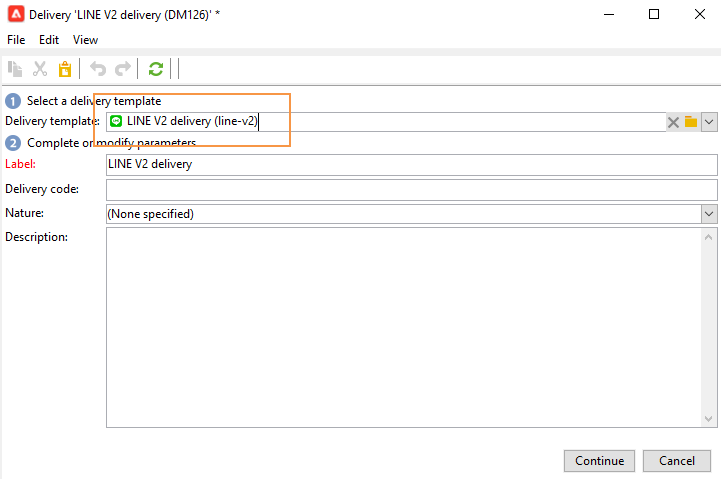
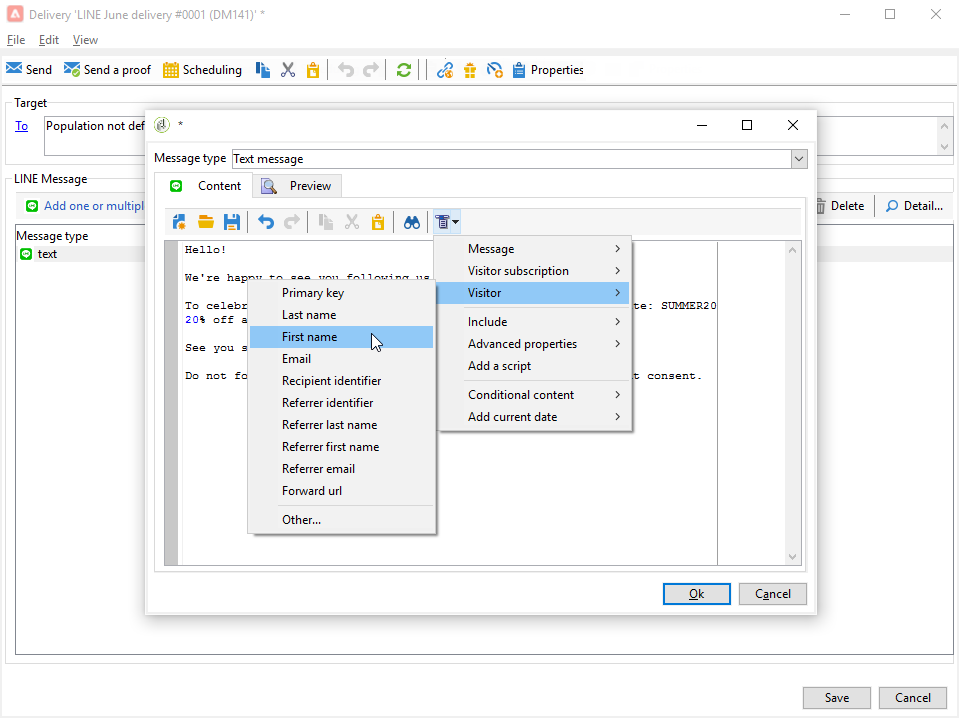

# LINE 채널{#line-channel}

LINE은 iPhone, Android, Windows Phone, Blackberry, Nokia 등 모든 스마트폰과 PC에서 사용할 수 있는 무료 인스턴트 메시징, 음성 및 비디오 호출을 위한 애플리케이션입니다. Adobe Campaign을 사용하면 LINE 메시지를 전송할 수 있습니다.

LINE 파섹

또한 LINE을 트랜잭션 메시지 모듈과 결합하여 소비자 모바일 장치에 설치된 LINE 앱에 실시간으로 메시지를 전송할 수 있습니다. 자세한 내용은 이 [페이지를](../../message-center/using/transactional-messaging-architecture.md#transactional-messaging-and-line)참조하십시오.

아래 섹션에서는 LINE 채널과 관련된 정보를 제공합니다. 배달을 만드는 방법에 대한 글로벌 정보는[이 섹션을](../../delivery/using/steps-about-delivery-creation-steps.md)참조하십시오.

LINE 채널을 사용하는 단계는 다음과 같습니다.

1. 배달 만들기
1. 메시지 컨텐츠 구성
1. 타겟 모집단 선택
1. 메시지 보내기
1. 배달 모니터링(추적, 격리, 보고서 등)

## LINE 채널 설정 {#setting-up-line-channel}

### LINE 계정 및 외부 계정 생성 {#creating-a-line-account-and-an-external-account-}

>[!NOTE]
>
>LINE 계정 및 외부 계정을 만들기 전에 먼저 인스턴스에 LINE 패키지를 설치해야 합니다. 자세한 내용은 설치 안내서의 [LINE](../../installation/using/installing-campaign-standard-packages.md#line-package) 섹션을 참조하십시오.

먼저 LINE 계정을 만들어야 Adobe Campaign에 연결할 수 있습니다. 그런 다음 모바일 애플리케이션에서 LINE 계정을 추가한 사용자에게 LINE 메시지를 보낼 수 있습니다. 외부 계정 및 LINE 계정은 플랫폼의 기능 관리자만 관리할 수 있습니다.

LINE 계정을 만들고 구성하려면 https://developers.line.me/을 [참조하십시오](https://developers.line.me/).

LINE 서비스를 만들고 구성하려면 가입 관리를 [참조하십시오](../../delivery/using/managing-subscriptions.md).

마지막으로 Adobe Campaign에서 외부 계정을 만들려면

1. 관리 **> 플랫폼****** 트리 구조에서 외부 계정 **탭을** 클릭합니다.
1. 그런 다음 새로 **만들기** 아이콘을 클릭합니다.

   

1. 레이블 **및 내부 이름** **** 필드를 완료합니다.
1. 필드에서 **[!UICONTROL Type]** 공정순서를 선택하고 채널 **필드에서** 라인을 선택합니다.
1. 을 **[!UICONTROL Save]** 클릭하여 LINE 외부 계정을 만듭니다.
1. 그런 **다음** LINE **개인화 필드가 일반** 아이콘 아래에나타나면 다음 필드를 채웁니다.

   

   * **채널 별칭**:은 **[!UICONTROL Channels]** > **[!UICONTROL Technical configuration]** 탭에서 LINE 계정을 통해 제공됩니다.
   * **채널 ID**:는 채널 > 기본 정보 **패널** 탭에서 LINE 계정을 통해 **제공됩니다** .
   * **채널 암호 키**:는 채널 > 기본 정보 **패널** 탭에서 LINE 계정을 통해 **제공됩니다** .
   * **액세스 토큰**:를 개발자 포털에서 또는 **[!UICONTROL Get access token]** 단추를 클릭하여 LINE 계정을 통해 제공합니다.
   * **액세스 토큰 만료 날짜**:액세스 토큰의 만료 날짜를 지정할 수 있습니다.
   * **LINE 구독 서비스**:사용자를 구독할 서비스를 지정할 수 있습니다.

>[!NOTE]
>
>워크플로우와 **[!UICONTROL LINE access token update (updateLineAccessToken)]** 워크플로우가 시작되었는지 확인해야 합니다 **[!UICONTROL Delete blocked LINE users (deleteBlockedLineUsers)]** . 탐색기에서 을 클릭하여 워크플로우의 상태를 **[!UICONTROL Administration > Production > Technical workflows > LINE workflows]** 확인합니다.

## 배달 만들기 {#creating-the-delivery}

LINE **배달을** 만들려면 다음 단계를 따라야 합니다.

>[!NOTE]
>
>배달 생성에 대한 글로벌 개념이 [이 섹션에](../../delivery/using/steps-about-delivery-creation-steps.md)설명되어 있습니다.

1. 탭에서 **[!UICONTROL Campaigns]** 을 선택한 다음 **[!UICONTROL Deliveries]** **[!UICONTROL Create]** 단추를 클릭합니다.
1. 표시되는 창에서 **[!UICONTROL LINE V2 delivery]** 배달 템플릿을 선택합니다.

   

1. 레이블, 코드 및 설명을 사용하여 배달을 식별합니다. For more on this, refer to [this section](../../delivery/using/steps-create-and-identify-the-delivery.md#identifying-the-delivery).
1. 을 **[!UICONTROL Continue]** 클릭하여 배달을 만듭니다.

## 컨텐츠 정의 {#defining-the-content}

LINE 게재의 컨텐츠를 정의하려면 먼저 게재에 메시지 유형을 추가해야 합니다. 각 LINE 배달에는 최대 5개의 메시지가 포함될 수 있습니다.

다음 두 가지 메시지 유형 중에서 선택할 수 있습니다.

* 문자 메시지
* 이미지 및 링크

### 문자 메시지 배달 구성 {#configuring-a-text-message-delivery}

텍스트 **메시지** LINE 전달은 문자 양식으로 수신자에게 보내는 메시지입니다.

이 유형의 메시지에 대한 구성은 이메일의 **텍스트** 구성과 유사합니다. 자세한 내용은 이 [페이지를](../../delivery/using/defining-the-email-content.md#message-content)참조하십시오.

### 이미지 및 링크 배달 구성 {#configuring-an-image-and-link-delivery}

이미지 **및 링크** LINE 전달은 하나 또는 여러 URL이 포함될 수 있는 이미지 형식으로 받는 사람에게 보내는 메시지입니다.

다음을 사용할 수 있습니다.

* 개인화된 **이미지**,

   >[!NOTE]
   >
   >%SIZE **%** 변수를 사용할 수 있습니다.이 변수를 사용하면 수신자의 모바일 장치의 화면 크기에 따라 이미지 표시를 최적화할 수 있습니다.

   

* 이미지 **URL**,

   

   이미지 URL을 사용하면 다른 이미지 해상도를 사용하여 모바일 장치에서 전달 가시성을 최적화할 수 있습니다. 높이와 폭이 같은 이미지만 지원됩니다.

   이미지는 화면 크기에 따라 정의할 수 있습니다.

   * 1040px
   * 700px
   * 460px
   * 300px
   * 240px
   >[!NOTE]
   >
   >링크가 있는 모든 LINE 이미지에 대해 1040x1040px 크기는 필수입니다.

   그런 다음 수신자의 모바일 장치에 나타날 대체 텍스트를 추가해야 합니다.

* 및 **[!UICONTROL Links]**.

   

   이 **[!UICONTROL Links]** 섹션에서는 클릭 가능한 여러 영역에서 이미지를 분할할 서로 다른 레이아웃 중에서 선택할 수 있습니다. 그런 다음 각 사용자에게 전용 링크를 할당할 수 있습니다.

>[!NOTE]
>
>&lt;%@ include option=&#39;NmsServer_URL&#39; %>/webApp/APP3?id=&lt;%=escapeUrl(cryptString(visitor.id))%> 구문을 사용하면 LINE 메시지에 웹 앱에 대한 링크를 포함할 수 있습니다.

### Recommendations {#recommendations}

* LINE 배달을 새 수신자에게 처음 보낼 때, 사용 약관 및 동의와 관련된 공식 LINE 메시지를 게재에 추가해야 합니다. 공식 메시지는 다음 링크에서 사용할 수 있습니다.https://terms.line.me/OA_privacy/ .

## 타겟 모집단 선택 {#selecting-the-target-population}

LINE 게재의 수신자를 선택하는 것은 이메일 배달 수신자를 정의하는 것과 비슷합니다. 자세한 내용은 타겟 [모집단](../../delivery/using/steps-defining-the-target-population.md)식별을 참조하십시오.

타깃팅은 **방문자에**&#x200B;대해 수행됩니다.

## 메시지 보내기 {#sending-messages}

게재가 올바르게 만들어지고 구성되면 이전에 정의한 타겟으로 전송할 수 있습니다.

LINE 배달 전송은 이메일 배달 전송과 유사합니다. 배달 보내기에 대한 자세한 내용은 메시지 [보내기를](../../delivery/using/sending-messages.md)참조하십시오.

## 보고서 액세스 {#accessing-reports}

탐색기를 클릭하여 LINE 서비스에서 보고서를 볼 **[!UICONTROL Profiles and Targets > Services and Subscriptions > LINE]** 수 있습니다. 그런 다음 LINE 서비스의 **[!UICONTROL Reports]** 아이콘을 클릭합니다.

LINE 게재에 대한 보고서를 보려면 을 **[!UICONTROL Campaign Management > Deliveries]** 클릭한 다음 원하는 배달을 선택합니다. 추적 보고서는 클릭스루 비율을 나타냅니다. LINE은 개방 비율을 고려하지 않습니다.

## 예:개인화된 LINE 메시지 작성 및 보내기 {#example--create-and-send-a-personalized-line-message}

이 예에서는 텍스트 메시지와 수신자에 따라 개인화된 데이터가 포함된 이미지를 만들고 구성합니다.

1. 탭에서 **[!UICONTROL Create]** 단추를 클릭하여 LINE 배달을 **[!UICONTROL Campaign]** 만듭니다.

   

1. 배달 **[!UICONTROL LINE V2 delivery]** 템플릿을 선택하고 배달 이름을 지정합니다.

   

1. 게재의 구성 창에서 타겟 모집단을 선택합니다.

   

1. 을 **[!UICONTROL Add]** 클릭하여 메시지를 만들고 을 선택합니다 **[!UICONTROL Message type]**.

   먼저 문자 메시지를 만듭니다.

   

1. 맞춤형 텍스트를 삽입할 위치에 커서를 놓고 드롭다운 아이콘을 클릭한 다음 **[!UICONTROL Visitor > First name]**&#x200B;선택합니다.

   

1. 동일한 절차에 따라 이미지를 추가하고 **[!UICONTROL Image and links]** **[!UICONTROL Message type]** 드롭다운에서 선택합니다.

   이미지 URL을 추가합니다.

   

1. 섹션에서 이미지를 여러 클릭 가능한 영역으로 나눌 레이아웃을 **[!UICONTROL Links]** 선택합니다.
1. 이미지의 각 영역에 URL을 할당합니다.

   

1. 게재를 저장한 다음 을 클릭하여 **[!UICONTROL Send]** 분석하여 타겟으로 보냅니다.

   배달이 타겟으로 전송됩니다.

   
