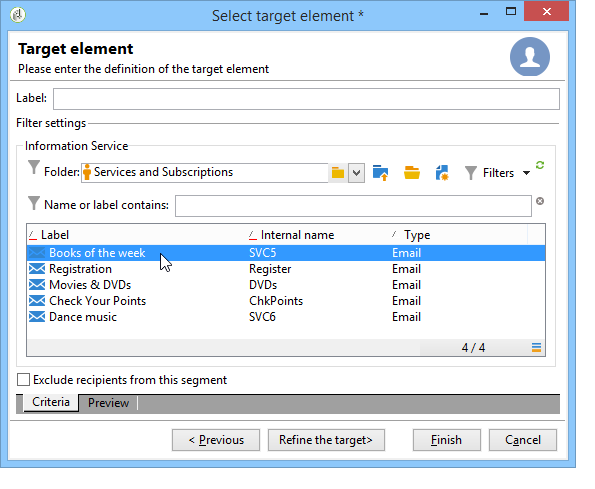

# 구독 관리{#managing-subscriptions}

## 정보 서비스 정보 {#about-information-services}

정보 서비스는 다음과 같이 구성됩니다.

* 등록 및 구독(옵트인),
* 등록 취소, 가입 취소(수신 거부) 또는 자동 가입 취소(시험버전 제공 등의 제한 시간 서비스),
* 가입 및 가입 해지 확인 메커니즘(확인, 이중 옵트인 등의 간단한 메커니즘),
* 가입자 내역 추적.

표준 기능으로, 이러한 서비스에는 특정 통계 보고서가 포함됩니다.가입자 추적, 충성도 수준, 구독 취소 트렌드 등

이메일의 경우, 필수 가입 취소 링크는 자동으로 생성되며, 전체 수신/수신 거부 절차는 Adobe가 완전히 자동화된 것으로, 기록 추적 기능을 통해 규정을 철저히 준수하도록 보장합니다.

서비스 구독/구독 취소 모드는 다음과 같은 세 가지가 있습니다.

1. 수동
1. 가져오기(구독만 해당),
1. 웹 양식을 통해

>[!NOTE]
>
>이중 옵트인 구독 양식을 만드는 샘플이 [이 섹션에](../../web/using/use-cases--web-forms.md#create-a-subscription--form-with-double-opt-in)설명되어 있습니다.

## 정보 서비스 만들기 {#creating-an-information-service}

가입자에게 연결된 확인 메시지 또는 자동 전달을 통해 정보 서비스에 대한 구독을 만들고 관리할 수 있습니다.

정보 서비스 맵에 액세스하려면 **[!UICONTROL Profiles and Targets]** 세계로 이동하여 **[!UICONTROL Services and Subscriptions]** 링크를 클릭합니다.

기존 서비스를 편집하려면 해당 이름을 클릭합니다. 서비스를 만들려면 목록 위에 있는 **[!UICONTROL Create]** 단추를 클릭합니다.

* 필드에 서비스 이름을 **[!UICONTROL Label]** 입력하고 배달 채널을 선택합니다.이메일, 모바일, Facebook, Twitter 또는 모바일 애플리케이션

   >[!NOTE]
   >
   >Facebook 및 Twitter 구독은 [이 섹션에](../../social/using/about-social-marketing.md)자세히 설명되어 있습니다. 모바일 애플리케이션 구독은 모바일 앱 [채널](../../delivery/using/about-mobile-app-channel.md)정보에서 자세히 설명합니다.

* 이메일 유형 서비스의 경우 배달 **모드를**&#x200B;선택합니다. 가능한 모드는 다음과 같습니다. **[!UICONTROL Newsletter]** 또는 **[!UICONTROL Viral]**.
* 구독 또는 구독 취소에 대한 **확인 메시지를** 보낼 수 있습니다. 이렇게 하려면 **[!UICONTROL Subscription]** 및 **[!UICONTROL Unsubscription]** 필드에서 해당 배달을 만드는 데 사용할 배달 템플릿을 선택합니다. 이러한 템플릿은 정의된 대상 없이 **[!UICONTROL Subscription]** 유형 대상 매핑으로 구성해야 합니다. 이메일 [채널](../../delivery/using/about-email-channel.md)정보를 참조하십시오.
* 기본적으로 구독은 무제한 가능합니다. 서비스의 유효 기간을 정의하는 **[!UICONTROL Unlimited]** 옵션을 선택 취소할 수 있습니다. 기간은 일(**[!UICONTROL d]** ) 또는 월(**[!UICONTROL m]** )로 지정할 수 있습니다.

서비스가 저장되면 서비스 및 구독 목록에 추가됩니다.이름을 클릭하여 편집합니다. 여러 탭을 사용할 수 있습니다. 이 **[!UICONTROL Subscriptions]** 탭에서는 정보 서비스(**[!UICONTROL Active subscriptions]** 탭) 또는 구독/구독 취소 내역(**[!UICONTROL History]** 탭)의 가입자 목록을 볼 수 있습니다. 이 탭에서 가입자를 추가 및 삭제할 수도 있습니다. 구독자 [추가 및 삭제를](#adding-and-deleting-subscribers)참조하십시오.

이 **[!UICONTROL Detail...]** 단추를 사용하면 선택한 수신자의 구독 속성을 볼 수 있습니다.

수신자의 구독 속성을 수정할 수 있습니다.

대시보드에서 **[!UICONTROL Reports]** 탭을 클릭하여 구독을 추적합니다.가입 수준, 총 가입자 수 등의 변화 이 탭에서 보고서를 보관하고 내역을 볼 수 있습니다.

## 가입자 추가 및 삭제 {#adding-and-deleting-subscribers}

정보 서비스 **[!UICONTROL Subscriptions]** 탭에서 가입자를 **[!UICONTROL Add]** 클릭합니다. 가입자 목록을 마우스 오른쪽 단추로 클릭하고 선택할 수도 **[!UICONTROL Add]**&#x200B;있습니다. 가입할 프로필이 저장되어 있는 폴더를 선택한 다음 가입할 프로필을 선택하고 클릭하여 유효성을 **[!UICONTROL OK]** 확인합니다.

가입자를 삭제하려면 가입자를 선택하고 을 클릭합니다 **[!UICONTROL Delete]**. 가입자 목록을 마우스 오른쪽 단추로 클릭하고 선택할 수도 **[!UICONTROL Delete]**&#x200B;있습니다.

두 경우 모두, 가입 해지를 위한 배달 템플릿이 서비스에 연결되어 있는지 여부를 사용자에게 확인 메시지를 보낼 수 있습니다(정보 서비스 [만들기](#creating-an-information-service)참조). 경고를 사용하면 이 게재의 유효성을 검사하거나 확인할 수 없습니다.

구독 [및 구독 취소 메커니즘을](#subscription-and-unsubscription-mechanisms)참조하십시오.

## 서비스 가입자에게 제공 {#delivering-to-the-subscribers-of-a-service}

정보 서비스 가입자에게 제공하기 위해 다음 예와 같이 관련 정보 서비스의 가입자를 타깃팅할 수 있습니다.

>[!CAUTION]
>
>대상 매핑은 **[!UICONTROL Subscriptions]**&#x200B;여야 합니다.

을 선택하고 **[!UICONTROL Subscribers of an information service]** 클릭합니다 **[!UICONTROL Next]**.

타깃팅된 정보 서비스를 선택하고 을 **[!UICONTROL Finish]**&#x200B;클릭합니다.

이 **[!UICONTROL Preview]** 탭에서는 선택한 정보 서비스의 가입자 목록을 볼 수 있습니다.

## 구독 및 구독 취소 메커니즘 {#subscription-and-unsubscription-mechanisms}

가입 및 가입 해지 메커니즘을 설정하여 프로세스와 가입자 관리를 자동화할 수 있습니다.

>[!NOTE]
>
>새 구독자에게 확인 메시지를 보낼 수 있습니다.\
>이 메시지의 내용은 **[!UICONTROL Subscription]** 또는 **[!UICONTROL Unsubscription]** 필드를 통해 정보 서비스 구성에 정의됩니다.
>
>확인 메시지는 이러한 필드에 지정된 배달 템플릿을 통해 만들어집니다. 이러한 대상 매핑은 **[!UICONTROL Subscriptions]**&#x200B;여야 합니다.

### 서비스에 수신자 가입 {#subscribing-a-recipient-to-a-service}

정보 서비스에 대한 수신자를 등록하려면 다음을 수행할 수 있습니다.

* 서비스를 수동으로 추가합니다.이렇게 하려면 프로필 **[!UICONTROL Subscriptions]** 탭에서 관련 정보 서비스를 **[!UICONTROL Add]** 클릭하고 선택합니다.

   자세한 내용은 [이 섹션의](../../platform/using/editing-a-profile.md)프로필 편집 섹션을 참조하십시오.

* 이 서비스에 수신자 집합을 자동으로 구독합니다. 받는 사람 목록은 필터링 작업, 그룹, 폴더, 가져오기 또는 마우스를 사용한 직접 선택에서 가져올 수 있습니다. 이러한 수신자를 구독하려면 프로필을 선택하고 마우스 오른쪽 단추를 클릭합니다. 해당 서비스를 **[!UICONTROL Actions > Subscribe selection to a service...]**&#x200B;선택하고 작업을 시작합니다.
* 수신자를 가져와 정보 서비스에 자동으로 가입합니다. 이렇게 하려면 가져오기 마법사의 마지막 단계에서 관련 서비스를 선택합니다.

   For more on this, refer to [this section](../../platform/using/importing-data.md#import-wizard).

* 수신자가 서비스에 가입할 수 있도록 웹 양식을 사용합니다.

   For more on this, refer to [this section](../../web/using/about-web-applications.md).

* 타깃팅 워크플로우 만들기 및 **[!UICONTROL Subscription service]** 상자 사용

   

   워크플로우 및 사용 방법은 [이 섹션에](../../workflow/using/about-workflows.md)자세히 설명되어 있습니다.

### 서비스에서 받는 사람 가입 해지 {#unsubscribing-a-recipient-from-a-service}

#### 수동 가입 해지 {#manual-unsubscribing}

이메일 배달은 법에 따라 가입 해지 링크를 포함해야 합니다. 수신자는 이 링크를 클릭하여 프로필을 업데이트하고 이후 게재 대상에서 제외할 수 있습니다.

기본 구독 취소 링크는 배달 마법사에 제공된 컨텐츠 편집기의 도구 모음에 있는 마지막 단추를 통해 삽입됩니다(개인화 [정보](../../delivery/using/about-personalization.md)참조). 받는 사람이 이 링크를 클릭하면 프로필이 블랙리스트에 추가되어(옵트아웃) 있으므로 이 받는 사람이 더 이상 배달 작업의 대상이 되지 않습니다.

그러나 수신자는 모든 서비스의 구독을 취소하지 않고도 서비스 구독을 취소할 수 있습니다. 이를 허용하려면 웹 양식( [이 섹션](../../web/using/adding-fields-to-a-web-form.md#subscription-checkboxes)참조)을 사용하거나 개인화된 구독 취소 링크를 삽입할 수 있습니다(개인화 블록 [참조](../../delivery/using/personalization-blocks.md)).

수신자 프로필에서 수동으로 수신자의 가입을 해지할 수도 있습니다. 이렇게 하려면 관련 받는 사람 **[!UICONTROL Subscriptions]** 탭을 클릭하고 관련 정보 서비스를 선택한 다음 을 클릭합니다 **[!UICONTROL Delete]**.

관련 정보 서비스를 통해 한 명 이상의 수신자를 구독 취소할 수 있습니다. 이렇게 하려면 서비스의 **[!UICONTROL Subscriptions]** 탭을 클릭하고 관련 수신자를 선택한 다음 을 클릭합니다 **[!UICONTROL Delete]**.

#### 자동 구독 취소 {#automatic-unsubscription}

정보 서비스 기간은 제한적일 수 있습니다. 유효 기간이 만료되면 수신자는 자동으로 가입 취소됩니다. 이 기간은 서비스 속성의 **[!UICONTROL Edit]** 탭에 지정됩니다. 그것은 며칠만에 표현된다.

모집단에서 가입 취소 워크플로우를 설정할 수도 있습니다. 이렇게 하려면 구독 워크플로우와 동일한 절차를 따르지만 **[!UICONTROL Unsubscription]** 옵션을 선택합니다. 서비스에 [수신자](#subscribing-a-recipient-to-a-service)가입을 참조하십시오.

### 가입자 추적 {#subscriber-tracking}

대시보드의 링크를 사용하여 정보 서비스에 대한 구독의 변경 사항을 추적할 수 **[!UICONTROL Reports]** 있습니다.

