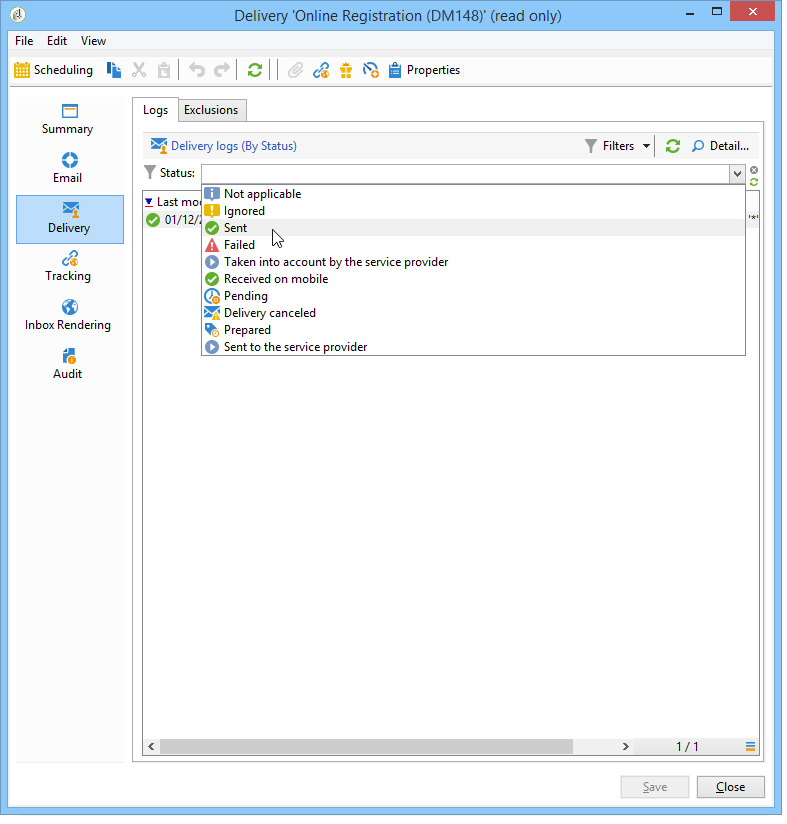
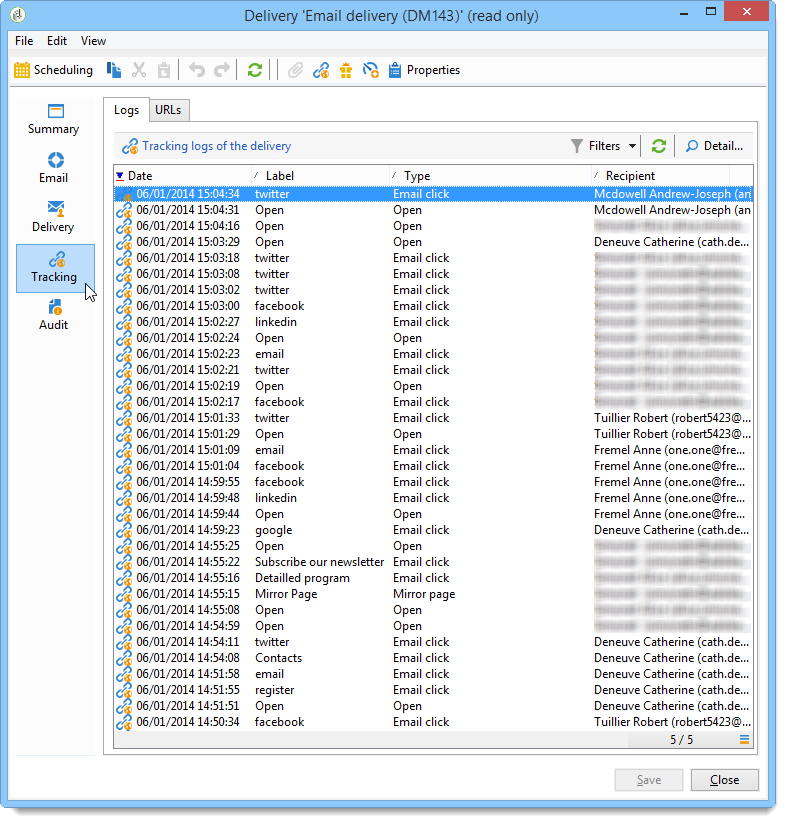

# 게재 모니터링{#monitoring-a-delivery}

배달 **대시보드는** 메시지를 보내는 동안 발생하는 전달 및 최종 문제를 모니터링하는 키 역할을 합니다.

**관련 항목**

* [게재 실패 이해](../../delivery/using/understanding-delivery-failures.md)
* [스팸 차단 관리 이해](../../delivery/using/understanding-quarantine-management.md)
* [전달 모범 사례](https://docs.campaign.adobe.com/doc/AC/getting_started/EN/deliveryBestPractices.html)
* [시작하기:전달 능력 관리](https://docs.campaign.adobe.com/doc/AC/getting_started/EN/deliverability.html)

## 배달 대시보드 {#delivery-dashboard}

게재에 대한 정보를 보려면 해당 정보를 편집하고 대시보드를 보고 사용 가능한 탭을 클릭합니다.

배달이 전송되면 더 이상 탭 내용을 변경할 수 없습니다.


### 게재 요약 {#delivery-summary}

이 **[!UICONTROL Summary]** 탭에는 전달 특성이 포함되어 있습니다.배달 상태, 사용된 채널, 발신자에 대한 정보, 대상, 실행에 관한 정보 자세한 내용은 보낸 [메시지](#number-of-messages-sent)수를 참조하십시오.

이 **[!UICONTROL reports]** 링크를 사용하면 배달 작업과 관련된 보고서 세트를 볼 수 있습니다.일반 배달 보고서, 세부 보고서, 배달 보고서, 실패한 메시지 배포, 시작 비율, 클릭 수 및 거래 등 이 탭의 내용은 사용자의 요구 사항에 따라 구성할 수 있습니다. For more information, refer to [this section](../../reporting/using/delivery-reports.md).

### 배달 로그 및 내역 {#delivery-logs-and-history}

이 **[!UICONTROL Delivery]** 탭에는 이 전달의 발생 내역이 표시됩니다. 여기에는 전송 로그(예: 전송된 메시지 목록 및 해당 상태 및 관련 메시지)가 포함되어 있습니다.

배달의 경우(예: 배달 실패 또는 격리 주소가 있는 수신자만 표시)할 수 있습니다. 이렇게 하려면 **[!UICONTROL Filters]** 단추를 클릭하고 **[!UICONTROL By state]**&#x200B;선택합니다. 그런 다음 드롭다운 목록에서 상태를 선택합니다.



여러 상태가 [이 페이지에](#delivery-statuses)나열됩니다.

>[!NOTE]
>
>이 **[!UICONTROL Display the mirror page for this message...]** 링크를 사용하면 새 창의 목록에서 선택한 배달 컨텐츠의 미러 페이지를 볼 수 있습니다. 미러 페이지는 HTML 컨텐츠가 정의된 게재에만 사용할 수 있습니다. 자세한 내용은 미러 페이지 [생성을 참조하십시오](../../delivery/using/sending-messages.md#generating-the-mirror-page).

### Tracking logs {#tracking-logs}

이 **[!UICONTROL Tracking]** 탭에는 이 게재의 추적 내역이 나열됩니다. 이 탭에는 전송된 메시지의 추적 데이터(즉, Adobe Campaign에 의한 추적의 대상이 되는 모든 URL)가 표시됩니다. 추적 데이터는 시간별로 업데이트됩니다.

>[!NOTE]
>
>게재에 대한 추적을 활성화하지 않으면 이 탭이 표시되지 않습니다.

추적 구성은 배달 마법사의 적절한 단계에서 수행됩니다. 추적된 [링크](../../delivery/using/how-to-configure-tracked-links.md)구성 방법을 참조하십시오.

**[!UICONTROL Tracking]** 데이터는 배달 보고서에서 해석됩니다. 이 [섹션을](../../reporting/using/delivery-reports.md)참조하십시오.



### 배달 감사 {#delivery-audit-}

이 **[!UICONTROL Audit]** 탭에는 배달 로그 및 교정본 관련 모든 메시지가 포함되어 있습니다. 이 **[!UICONTROL Refresh]** 단추를 사용하면 데이터를 업데이트할 수 있습니다. 이 **[!UICONTROL Filters]** 단추를 사용하여 데이터에 대한 필터를 정의합니다.

특수 아이콘을 사용하여 오류 또는 경고를 식별할 수 있습니다. 전달 [분석을](../../delivery/using/steps-validating-the-delivery.md#analyzing-the-delivery)참조하십시오.

하위 **[!UICONTROL Proofs]** 탭에서는 전송된 증명 목록을 볼 수 있습니다.


표시할 열을 선택하여 이 창( **[!UICONTROL Delivery]** 및 **[!UICONTROL Tracking]** 탭의 정보)에 표시되는 정보를 수정할 수 있습니다. 이렇게 하려면 오른쪽 아래에 있는 **[!UICONTROL Configure list]** 아이콘을 클릭합니다. 목록 표시 구성에 대한 자세한 내용은 [이 섹션을](../../platform/using/adobe-campaign-workspace.md#configuring-lists)참조하십시오.

### 배달 대시보드 동기화 {#delivery-dashboard-synchronization}

배달 대시보드에서 처리된 메시지 및 배달 로그를 확인하여 배달이 성공적으로 전송되었는지 확인합니다.

일부 지표 또는 상태가 잘못되었거나 최신 상태가 아닐 수 있습니다. 이 문제는 다음 솔루션으로 해결될 수 있습니다.

* 배달 상태가 잘못된 경우, 이 배달에 필요한 모든 승인이 완료되었는지 또는 **[!UICONTROL operationMgt]** 및 **[!UICONTROL deliveryMgt]** 워크플로우가 오류 없이 실행되는지 확인하십시오. 이것은 전송 인스턴스에서 구성되지 않은 친화성을 사용하여 배달이 원인일 수도 있습니다.
* 배달 표시기가 여전히 0이고 중간 소싱 구성인 경우 **[!UICONTROL Mid-sourcing (delivery counters)]** 기술 워크플로우를 확인하십시오. 상태가 아닐 경우 시작합니다 **[!UICONTROL Started]**. 그런 다음 Adobe Campaign 탐색기에서 관련 전달을 마우스 오른쪽 단추로 클릭하고 **[!UICONTROL Actions]** > **[!UICONTROL Recompute delivery and tracking indicators]**&#x200B;을 선택하여 지표를 다시 계산할 수 있습니다. 추적 표시기에 대한 자세한 내용은 이 [섹션을](../../reporting/using/reports-on-deliveries.md#tracking-indicators)참조하십시오.
* 배달 카운터가 게재와 일치하지 않는 경우 Adobe Campaign 탐색기에서 관련 전달을 마우스 오른쪽 단추로 클릭하고 **[!UICONTROL Actions]** > 을 선택하여 다시 동기화하여 지표를 **[!UICONTROL Recompute delivery and tracking indicators]** 재계산해 보십시오. 추적 표시기에 대한 자세한 내용은 이 [섹션을](../../reporting/using/reports-on-deliveries.md#tracking-indicators)참조하십시오.
* 중간 소싱 배포에 대한 배달 카운터가 최신 버전이 아닌 경우 **[!UICONTROL Mid-Sourcing (Delivery counters)]** 기술 워크플로우가 실행 중인지 확인하십시오. 자세한 내용은 이 [페이지를](../../installation/using/mid-sourcing-deployment.md)참조하십시오.

배달 대시보드를 통해 다른 보고서로 배달을 추적할 수도 있습니다. For more on this, refer to this [section](../../reporting/using/reports-on-deliveries.md#accessing-existing-reports).

## 성능 문제 {#performance-issues}

### 검사 목록 {#checklist-}

배달 실적이 나쁜 경우 다음을 확인할 수 있습니다.

* **배달**&#x200B;크기:큰 배달은 완료하는 데 더 오래 걸릴 수 있습니다. MTA 하위는 대부분의 인스턴스에서 작동하는 기본 배치 크기를 처리하도록 구성되지만 배달 속도가 지속적으로 느려질 때 확인해야 합니다.
* **배달**&#x200B;대상:배달 성능 제한은 다시 시도 구성에 따라 처리되는 소프트 바운스 오류로 인해 영향을 받습니다. 오류 수가 많을수록 더 많은 재시도가 필요합니다.
* **전체 플랫폼 로드**:여러 개의 큰 배달이 전송되면 전체 플랫폼에 영향을 줄 수 있습니다. 또한 IP 명성과 전달 가능성 문제를 확인할 수 있습니다. 자세한 내용은 Adobe Campaign 전달 [가능성 우수 사례 가이드](https://docs.campaign.adobe.com/doc/AC/getting_started/EN/deliverability.html) 및 [이 페이지를](../../delivery/using/about-deliverability.md)참조하십시오.

플랫폼 및 데이터베이스 유지 관리도 전달 전송 성능에 영향을 줄 수 있습니다. For more on this, refer to [this page](../../production/using/database-performances.md).

### 느린 전달 {#slow-deliveries}

이 **[!UICONTROL Send]** 단추를 클릭하면 배달이 평소보다 오래 걸리는 것 같습니다. 이것은 다른 요소로 인해 발생할 수 있습니다.

* 일부 이메일 공급자가 사용자의 IP 주소를 차단했을 수 있습니다. 이 경우 브로드로그를 확인하고 [이 시작을](https://docs.campaign.adobe.com/doc/AC/getting_started/EN/deliverability.html) 참조하십시오.
* 배달이 너무 커서 빠르게 처리할 수 없을 수도 있고, JavaScript 개인화가 높거나 배달 무게가 60KB 이상인 경우 이러한 문제가 발생할 수 있습니다. 콘텐츠 가이드라인에 대한 자세한 내용은 [Adobe Campaign](https://docs.campaign.adobe.com/doc/AC/getting_started/EN/deliveryBestPractices.html) 게재 모범 사례를 참조하십시오.
* Adobe Campaign MTA 내에서 스로틀링이 발생했을 수 있습니다. 이 문제는 다음과 같습니다.

   * 보류 중인 메시지(**[!UICONTROL quotas met]** 메시지):캠페인에 정의된 선언적 MX 규칙으로 선언된 할당량이 충족되었습니다. 이 메시지에 대한 자세한 내용은 [이 페이지를](../../delivery/using/technical-recommendations.md#quota-met)참조하십시오. MX 규칙에 대한 자세한 내용은 [이 페이지를](../../delivery/using/technical-recommendations.md#mx-rules)참조하십시오.
   * 보류 중인 메시지(**[!UICONTROL dynamic flow control]** 메시지):캠페인 MTA가 지정된 ISP에 대한 메시지를 전달하려고 할 때 오류가 발생하여 오류 밀도가 너무 커서 잠재적인 블랙리스트가 발생했습니다.

* 시스템 문제로 인해 서버가 상호 작용할 수 없습니다.이렇게 하면 전체 전송 프로세스가 느려질 수 있습니다. 예를 들어 개인화 데이터를 가져오는 과정에서 Campaign에 영향을 줄 수 있는 메모리 또는 리소스 문제가 없는지 서버를 확인하십시오.

### 성능 모범 사례 {#best-practices-performance}

* 임시 테이블을 유지하고 성능에 영향을 주므로 인스턴스에 배달을 실패한 상태로 유지하지 마십시오.

* 더 이상 필요하지 않은 배달을 제거합니다.

* 주소 품질을 유지하기 위해 최근 12개월 동안 비활성 수신자를 데이터베이스에서 제거합니다.

* 큰 배송을 함께 예약하지 마십시오. 로드를 시스템에 균일하게 분산시키는 데 5-10분의 간격이 있습니다. 팀의 다른 구성원과 배달 일정을 조정하여 최상의 성능을 보장합니다. 마케팅 서버가 동시에 여러 가지 작업을 처리할 때 성능이 느려질 수 있습니다.

* 이메일의 크기를 최대한 낮게 유지하십시오. 권장 최대 이메일 크기는 약 35KB입니다. 이메일 배달의 크기는 전송 서버에서 특정 양을 생성합니다.

* 100만 명 이상의 수신자에게 배달과 같은 큰 배달은 전송 큐에서 공간이 필요합니다. 이러한 문제는 서버 자체만으로는 문제가 되지 않지만 수십 개의 다른 대규모 게재와 함께 동시에 발송되는 경우 전송 지연을 유발할 수 있습니다.

* 이메일의 개인화는 각 수신자에 대해 데이터베이스에서 데이터를 가져옵니다. 개인화 요소가 많은 경우 전달을 준비하는 데 필요한 데이터의 양이 증가합니다.

* 색인 주소. 응용 프로그램에 사용된 SQL 쿼리의 성능을 최적화하기 위해 데이터 스키마의 기본 요소에서 인덱스를 선언할 수 있습니다.

>[!NOTE]
>
>ISP는 비활성 기간 후 주소를 비활성화합니다. 바운스된 메시지는 발송자에게 전송되어 이 새로운 상태에 대해 알립니다.

## 배달 상태 {#delivery-statuses}

배달을 보내는 동안 배달 대시보드에서 다음 상태가 발생할 수 있습니다.

<table> 
 <thead> 
  <tr> 
   <th> 상태<br /> </th> 
   <th> 정의 및 솔루션<br /> </th> 
  </tr> 
 </thead> 
 <tbody> 
  <tr> 
   <td> 해당 사항 없음<br /> </td> 
   <td> 배달은 서버(MTA)에서 고려했지만 처리되지 않았습니다.<br /> </td> 
  </tr> 
  <tr> 
   <td> 무시됨<br /> </td> 
   <td> 주소가 잘못되어 배달이 받는 사람에게 전송되지 않았습니다. 차단됨, 격리됨, 제공되지 않음 또는 복제됨 <br /> </td> 
  </tr> 
  <tr> 
   <td> 전송<br /> </td> 
   <td> 배달이 메시지 제공자에게 올바르게 전송되었지만 받는 사람이 반드시 전달을 받지 않았습니다.<br /> </td> 
  </tr> 
  <tr> 
   <td> 실패<br /> </td> 
   <td> 잘못된 주소 또는 전체 받은 편지함으로 인해 배달이 받는 사람에게 도달할 수 없습니다. 또한 스키마를 배달 매핑과 일치하지 않을 때 오류를 생성할 수 있으므로 개인화 블록의 문제에 연결할 수도 있습니다. 실패 <a href="#failed-status" target="_blank">상태 참조</a><br /> </td> 
  </tr> 
  <tr> 
   <td> 서비스 제공업체가 고려<br /> </td> 
   <td> SMS 서비스 공급자가 배달을 받았습니다.<br /> </td> 
  </tr> 
  <tr> 
   <td> 모바일에서 수신<br /> </td> 
   <td> 수신자는 모바일 장치에서 SMS를 받았습니다.<br /> </td> 
  </tr> 
  <tr> 
   <td> 보류 중<br /> </td> 
   <td> 배달이 전송될 준비가 되었으며 배달 서버(MTA)에서 처리할 예정입니다. 대기 <a href="#pending-status" target="_blank">중 상태를</a>참조하십시오.<br /> </td> 
  </tr> 
  <tr> 
   <td> 배달이 취소되었습니다.<br /> </td> 
   <td> 교환원이 배달을 취소했습니다.<br /> </td> 
  </tr> 
  <tr> 
   <td> 준비 완료<br /> </td> 
   <td> 모바일 채널과 같은 외부 커넥터에만 사용되는 중간 상태입니다. '대기 중' 상태를 따르고 다음 상태를 결정하는 외부 커넥터입니다.<br /> </td> 
  </tr> 
  <tr> 
   <td> 서비스 제공자에게 전송<br /> </td> 
   <td> 배달이 SMS 서비스 제공업체에 보내졌지만 아직 받지 못했습니다.<br /> </td> 
  </tr> 
 </tbody> 
</table>

Adobe Campaign 이메일의 전달 기능을 최적화하는 방법에 대한 자세한 내용은 Adobe Campaign 전달 [가능성 모범 사례 가이드](https://docs.campaign.adobe.com/doc/AC/getting_started/EN/deliverability.html) 및 [이 페이지를](../../delivery/using/about-deliverability.md)참조하십시오.

### 대기 중 상태 {#pending-status}

배달을 확인한 후 배송 상태를 확인할 수 **[!UICONTROL Pending]**&#x200B;있습니다. 이 상태는 실행 프로세스가 일부 리소스의 가용성을 기다리고 있음을 의미합니다.

우선 **[!UICONTROL Pending]** 상태는 배달을 예약했고 지정된 날짜까지 보류 중임을 의미합니다. 자세한 내용은 배달 예약 [섹션을 참조하십시오](../../delivery/using/steps-sending-the-delivery.md#scheduling-the-delivery-sending) .

배달이 전송되지 않고 해당 상태가 남아 **[!UICONTROL Pending]**&#x200B;있는 경우, 다음의 결과가 될 수 있습니다.

* 배달 서버에서 모듈 및 프로세스를 실행하고 이메일 전송을 관리하는 MTA(메시지 전송 에이전트)가 시작되지 않았거나 다시 시작해야 할 필요가 있습니다. 이 확인란을 선택하고 필요한 경우 모듈을 시작하려면 다음 단계를 수행하십시오.

   * 모듈이 MTA 서버에서 실행되는지 확인합니다. `mta@<instance>`

   ```
   nlserver pdump
   HH:MM:SS > Application server for Adobe Campaign Classic (X.Y.Z YY.R build nnnn@SHA1) of DD/MM/YYYY
   [...]
   mta@<INSTANCENAME> (9268) - 23.0 Mb
   [...]
   ```

   * MTA가 목록에 없으면 다음 명령으로 시작합니다.

   ```
   nlserver start mta@<INSTANCENAME>
   ```

   >[!NOTE]
   >
   >인스턴스 이름으로 `<INSTANCENAME>` 대체합니다(프로덕션, 개발 등). 인스턴스 이름은 구성 파일을 통해 식별됩니다. `[path of application]nl6/conf/config-<INSTANCENAME>.xml`

* 전송 서버에 구성되지 않은 친화성을 사용할 수 있습니다. 이 경우 트래픽 관리(IP 친화성)의 구성을 확인하고 이 **[!UICONTROL Managing affinities with IP addresses]** 필드를 사용하여 친화성을 관리하는 MTA에 제공을 연결합니다. For more information on affinities, refer to [this section](../../installation/using/configuring-campaign-server.md#personalizing-delivery-parameters).
* 게재 준비가 보류 중일 때 실행 중인 캠페인이 너무 많아 게재 상태 업데이트가 차단될 수 있습니다. 이 문제를 해결하려면 로 이동하여 값을 **[!UICONTROL Options]** **[!UICONTROL NmsOperation_LimitConcurrency]** 늘립니다(기본값: 10). 이 특정 옵션에 할당된 값보다 더 많은 캠페인을 실행하지 마십시오.

### 실패 상태 {#failed-status}

이메일 배달 상태가 개인화 블록과 관련된 문제에 **[!UICONTROL Failed]**&#x200B;연결될 수 있습니다. 배급의 개인화 블록은 스키마가 배달 매핑과 일치하지 않을 때 오류를 생성할 수 있습니다.

배달 로그는 배달이 실패한 이유를 확인하는 데 중요합니다. 배달 로그에서 감지할 수 있는 가능한 오류는 다음과 같습니다.

* 받는 사람 메시지가 &quot;연결할 수 없음&quot; 오류로 실패하는 경우:스크립트 &#39;content htmlContent&#39; 줄 X를 컴파일하는 동안 **오류가 발생했습니다.가 정의되지`[table]`않았습니다. JavaScript:스크립트 &#39;content htmlContent**&#39;를 평가하는 동안 오류가 발생했습니다. 이 문제의 원인은 업스트림 타깃팅 또는 게재 대상 매핑에서 정의되거나 매핑되지 않은 테이블이나 필드를 호출하려고 시도하는 HTML 내의 개인화입니다.

   이를 해결하려면 워크플로우 및 전달 컨텐츠를 검토하여 특정 개인화가 문제의 표를 호출하려고 시도하고 있는지, 표를 매핑할 수 있는지 여부를 결정해야 합니다. 여기에서 HTML에서 이 테이블에 대한 호출을 제거하거나 배달에 대한 매핑을 수정하는 것이 해결 방법입니다.

* 중간 소싱 배포 모델에서 배달 로그에 다음 메시지가 나타날 수 있습니다.중간 **소싱 서버에서 &#39;AppendDeliveryPart&#39; 메서드를 호출하는 동안 오류가 발생했습니다.&#39;서버에 통신 오류가 있습니다.제대로 구성되어 있는지 확인하십시오. 코드 HTTP 408 &#39;서비스를 일시적으로 사용할 수 없습니다&#39;**.

   원인은 성능 문제와 연결되어 있습니다. 즉, 마케팅 인스턴스는 데이터를 mid-sourcing 서버로 보내기 전에 데이터를 작성하는 데 너무 많은 시간을 소비합니다.

   이 문제를 해결하려면 진공청소기를 수행하고 데이터베이스에 다시 색인을 변경하는 것이 좋습니다. 데이터베이스 유지 관리에 대한 자세한 내용은 [이 섹션을](../../production/using/recommendations.md)참조하십시오.

   또한 예약된 활동과 모든 워크플로우가 실패한 상태로 다시 시작해야 합니다. 이 [섹션을](../../workflow/using/scheduler.md)참조하십시오.

* 배달이 실패하면 배달 로그에 다음 오류가 표시될 수 있습니다.DLV- **XXXX 준비된 메시지 수(123)가 보낼 메시지 수(111)보다 큽니다. 지원 센터에 문의하십시오.**

   일반적으로 이 오류는 이메일 내에 받는 사람에 대한 값이 두 개 이상인 개인화 필드 또는 블록이 있음을 의미합니다. 개인화 블록을 사용하고 있으며 특정 수신자에 대해 둘 이상의 레코드를 가져오는 중입니다.

   이 문제를 해결하려면 사용된 개인화 데이터를 확인한 다음 해당 필드에 대해 둘 이상의 항목이 있는 수신자의 대상을 확인합니다. 배달 활동 전에 타깃팅 워크플로우의 **[!UICONTROL Deduplication]** 활동을 사용하여 한 번에 하나의 개인화 필드만 있는지 확인할 수도 있습니다. 데이터 중복 제거에 대한 자세한 내용은 [이 페이지를](../../workflow/using/deduplication.md)참조하십시오.

* 일부 배달은 &quot;연결할 수 없음&quot; 오류로 실패할 수 있습니다.&quot;인바운드 이메일 바운스(규칙 &#39;자동 회신&#39;이 이 바운스와 일치함). 즉, 배달에 성공했지만 Adobe Campaign은 &#39;자동 회신&#39; 인바운드 이메일 규칙과 일치하는 수신자(&quot;부재 중&quot; 응답)로부터 자동 회신을 수신했습니다. 자동 회신 이메일은 Adobe Campaign에서 무시되며 수신자의 주소는 격리조치에 보내지지 않습니다.

**관련 항목:**

* [배달 로그 및 내역](#delivery-logs-and-history)
* [게재 실패 이해](../../delivery/using/understanding-delivery-failures.md)
* [배달 실패 유형 및 이유](../../delivery/using/understanding-delivery-failures.md#delivery-failure-types-and-reasons)

## 보낸 메시지 수 {#number-of-messages-sent}

트리의 **[!UICONTROL Campaign Management > Deliveries]** 노드를 통해 배달 목록에서 게재에 액세스할 수 있습니다.

기본적으로 배달 목록에는 선택한 노드에서 생성된 게재의 이름과 상태가 포함됩니다. 또한 전송, 처리 및 전송해야 할 메시지 수를 표시합니다.

* 분석 후 및 전달 전 타깃팅된 받는 사람 수에 해당하는 **[!UICONTROL Messages to send]** 수입니다.
* 열의 메시지 수는 **[!UICONTROL success]** 서버가 보내고 받는 메시지 수에 해당합니다.
* 메시지 수는 받은 메시지 수와 오류가 있는 메시지 수에 해당합니다. **[!UICONTROL processed]**

배달 대시보드를 사용하여 보낸 메시지 수를 추적할 수 있습니다.

>[!NOTE]
>
>대량 게재의 경우 이러한 값을 업데이트할 수 있습니다. 이렇게 하려면 문제의 배달을 선택한 다음 마우스 오른쪽 단추로 클릭합니다. 마법사를 **[!UICONTROL Action > Recompute delivery and tracking indicators...]** 선택한 다음 이 정보를 업데이트합니다.

## 예약된 배달 {#scheduled-deliveries-}

배달이 정확한 예약된 날짜에 실행되지 않으면 서버 표준 시간대 간의 차이와 관련이 있을 수 있습니다. 중간 소싱 인스턴스와 프로덕션 인스턴스는 다른 시간대에 있을 수 있습니다.

예를 들어, 중간 소싱 인스턴스가 브리즈번 시간대 에 있고 생산 인스턴스가 Darwin 시간대와 30분 거리에 있는 경우, 두 시간대는 서로 떨어져 있고, 감사 로그에서 배달 일정이 11:56인 경우, 중간으로 예약된 동일한 배달이 30분 차이가 있는 12:26이 될 것임을 분명히 알 수 있습니다.
