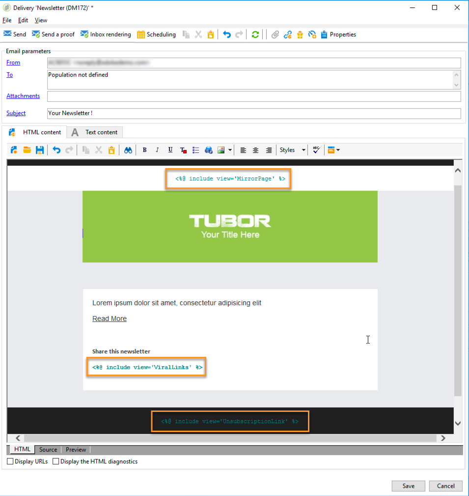

# 개인화 블록{#personalization-blocks}

개인화 블록은 다이내믹하고 개인적이며 전달에 삽입할 수 있는 특정 렌더링을 포함합니다. 예를 들어 로고, 인사말 메시지 또는 미러 페이지에 대한 링크를 추가할 수 있습니다. 개인화 [블록](#inserting-personalization-blocks)삽입을 참조하십시오.

>[!NOTE]
>
>개인화 블록은 에서 사용할 수도 **[!UICONTROL Digital Content Editor (DCE)]** 있습니다. For more on this, refer to [this page](../../web/using/editing-content.md#inserting-a-personalization-block).

개인화 블록은 Adobe Campaign 탐색기의 **[!UICONTROL Resources > Campaign Management > Personalization blocks]** 노드를 통해 액세스합니다. 기본적으로 몇 개의 블록을 사용할 수 있습니다(기본 [개인화 블록](#out-of-the-box-personalization-blocks)참조).

게재 개인화를 최적화할 수 있는 새 블록을 정의할 수 있습니다. 자세한 내용은 맞춤형 개인화 블록 [정의를 참조하십시오](#defining-custom-personalization-blocks).

## 개인화 블록 삽입 {#inserting-personalization-blocks}

메시지에 개인화 블록을 삽입하려면 아래 단계를 따르십시오.

1. 배달 마법사의 컨텐츠 편집기에서 개인화된 필드 아이콘을 클릭하고 **[!UICONTROL Include]** 메뉴를 선택합니다.
1. 목록에서 개인화 블록을 선택하거나(목록에 마지막으로 사용한 블록 10개가 표시됨) 메뉴를 클릭하여 전체 목록에 액세스합니다. **[!UICONTROL Other...]**

   

1. 이 **[!UICONTROL Other...]** 메뉴는 모든 즉시 사용 가능한 개인화 블록과 사용자 정의 개인화 블록에 대한 액세스 권한을 제공합니다( [즉시 사용 가능한 개인화 블록](#out-of-the-box-personalization-blocks) 및 [사용자 정의 개인화 블록](#defining-custom-personalization-blocks)정의 참조).

   

1. 그런 다음 개인화 블록을 스크립트로 삽입합니다. 개인화가 생성되면 수신자 프로필에 자동으로 적용됩니다.

   

1. 탭을 클릭하고 개인화를 볼 수신자를 선택합니다. **[!UICONTROL Preview]**

   

게재 컨텐츠에 개인화 블록의 소스 코드를 포함할 수 있습니다. 이렇게 하려면 선택할 **[!UICONTROL Include the HTML source code of the block]** 때 선택합니다.


HTML 소스 코드가 배달 컨텐츠에 삽입됩니다. 예를 들어 개인화 **[!UICONTROL Greetings]** 블록은 다음과 같이 표시됩니다.


## 개인화 블록 예 {#personalization-blocks-example}

이 예에서는 개인화 블록을 사용하여 수신자가 미러 페이지를 보고, 소셜 네트워크에서 뉴스레터를 공유하고, 향후 게재 구독을 취소할 수 있도록 하는 이메일을 만듭니다.

이를 위해서는 다음 개인화 블록을 삽입해야 합니다.

* **[!UICONTROL Link to mirror page]** .
* **[!UICONTROL Social network sharing links]** .
* **[!UICONTROL Unsubscription link]** .

>[!NOTE]
>
>미러 페이지 생성에 대한 자세한 내용은 미러 페이지 [생성을 참조하십시오](../../delivery/using/sending-messages.md#generating-the-mirror-page).

1. 새 배달을 만들거나 기존 이메일 유형 배달을 엽니다.
1. 배달 마법사에서 메시지 제목을 **[!UICONTROL Subject]** 클릭하여 편집하고 제목을 입력합니다.
1. 메시지 본문에 개인화 블록을 삽입합니다. 이렇게 하려면 메시지 컨텐츠를 클릭하고 개인화된 필드 아이콘을 클릭한 다음 **[!UICONTROL Include]** 메뉴를 선택합니다.
1. 삽입할 첫 번째 블록을 선택합니다. 다른 두 블록을 포함하도록 절차를 갱신합니다.

   

1. 개인화 결과를 보려면 **[!UICONTROL Preview]** 탭을 클릭합니다. 받는 사람의 메시지를 표시하려면 받는 사람을 선택해야 합니다.

   

1. 블록 컨텐츠가 제대로 표시되는지 확인합니다.

## 즉시 사용 가능한 개인화 블록 {#out-of-the-box-personalization-blocks}

메시지 내용을 개인화하는 데 도움이 되도록 개인화 블록 목록을 기본적으로 사용할 수 있습니다.

>[!NOTE]
>
>개인화 블록 목록은 인스턴스에 설치된 모듈 및 옵션에 따라 다릅니다.


* **[!UICONTROL Greetings]** :받는 사람 이름으로 인사를 삽입합니다. 예:&quot;안녕 John Doe,&quot;
* **[!UICONTROL Insert logo]** :인스턴스를 구성할 때 정의된 기본 로고를 삽입합니다.
* **[!UICONTROL Powered by Adobe Campaign]** :&quot;Powered by Adobe Campaign&quot; 로고를 삽입합니다.
* **[!UICONTROL Mirror page URL]** :미러 페이지 URL을 삽입하여 배달 디자이너가 링크를 확인할 수 있도록 합니다.

   >[!NOTE]
   >
   >미러 페이지 생성에 대한 자세한 내용은 미러 페이지 [생성을 참조하십시오](../../delivery/using/sending-messages.md#generating-the-mirror-page).

* **[!UICONTROL Link to mirror page]** :미러 페이지에 대한 링크를 삽입합니다.&quot;이 메시지를 제대로 볼 수 없는 경우 여기를 클릭하십시오.&quot;
* **[!UICONTROL Unsubscription link]** :모든 게재(블랙 리스트)의 구독을 취소할 수 있는 링크를 삽입합니다.
* **[!UICONTROL Formatting function for proper nouns]** :각 **[!UICONTROL toSmartCase]** 단어의 첫 번째 문자를 대문자로 변경하는 Javascript 함수를 생성합니다. 이 블록은 배달의 소스 코드에 **`<script>...</script>`** 태그에 삽입해야 합니다.

   아래 예에서 이 함수는 &quot;My header&quot; 요소를 &quot;My new header&quot;로 대체하기 위해 각 단어에 대문자를 사용합니다.

   ```
   <h1 id="sample">My header</h1>
   <script><%@ include view='toSmartCase'%>;
   document.getElementById("sample").innerHTML = toSmartCase("My new header");
   </script>
   ```

   

* **[!UICONTROL Registration page URL]** :구독 URL을 삽입합니다(서비스 [및 구독](../../delivery/using/about-services-and-subscriptions.md)참조).
* **[!UICONTROL Registration link]** :에서 구독 링크를 삽입합니다. 인스턴스를 구성할 때 정의되었습니다.
* **[!UICONTROL Registration link (with referrer)]** :를 삽입하여 방문자 및 배달을 식별할 수 있도록 구독 링크를 삽입합니다. 인스턴스를 구성할 때 링크가 정의되었습니다.

   >[!NOTE]
   >
   >이 블록은 방문자만 대상으로 하는 배달에서 사용할 수 있습니다.

* **[!UICONTROL Registration confirmation]** :에서 구독을 확인하는 링크를 삽입합니다.
* **[!UICONTROL Social network sharing links]** :수신자가 이메일 클라이언트, Facebook, Twitter, Google + 및 LinkedIn과 미러 페이지 컨텐츠에 대한 링크를 공유할 수 있는 단추를 삽입합니다(바이럴 마케팅 [참조:친구에게](../../delivery/using/viral-and-social-marketing.md#viral-marketing--forward-to-a-friend)전달).
* **[!UICONTROL Style of content emails]** 및 **[!UICONTROL Notification style]** :사전 정의된 HTML 스타일을 사용하여 이메일의 서식을 지정하는 코드를 생성합니다. 이러한 블록은 전달의 소스 코드에 삽입해야 하며, **[!UICONTROL ...]** 섹션의 **`<style>...</style>`** 태그에 삽입해야 합니다.
* **[!UICONTROL Offer acceptance URL in unitary mode]** :상호 작용 오퍼를 설정할 수 있는 URL을 삽입합니다 **[!UICONTROL Accepted]** ( [이 섹션](../../interaction/using/offer-analysis-report.md)참조).

## 맞춤형 개인화 블록 정의 {#defining-custom-personalization-blocks}

메뉴를 통해 개인화된 필드 아이콘에서 삽입할 새 개인화 필드를 정의할 수 **[!UICONTROL Include...]** 있습니다. 이러한 필드는 개인화 블록에서 정의됩니다.

개인화 블록을 만들려면 탐색기로 이동하여 다음 단계를 적용합니다.

1. 노드를 **[!UICONTROL Resources > Campaign Management > Personalization blocks]** 클릭합니다.
1. 블록 목록을 마우스 오른쪽 단추로 클릭하고 을 **[!UICONTROL New]** 선택합니다.
1. 개인화 블록의 설정을 입력합니다.

   

   * 블록의 레이블을 입력합니다. 이 레이블은 개인화 필드 삽입 창에 표시됩니다.
   * 개인화 필드 삽입 아이콘에서 이 블록에 액세스할 **[!UICONTROL Visible in the customization menus]** 수 있도록 하려면 선택합니다.
   * 필요한 경우 HTML 형식의 이메일과 텍스트 형식의 이메일에 대해 두 개의 별도 블록을 **[!UICONTROL The content of the personalization block depends upon the format]** 정의하려면 선택합니다.

      그런 다음 이 편집기의 하단 섹션(HTML 컨텐츠 및 텍스트 컨텐츠)에 두 개의 탭이 표시되어 해당 컨텐츠를 정의합니다.

      

   * 컨텐츠 입력(HTML, 텍스트, JavaScript 등) 를 클릭하고 을 **[!UICONTROL Save]** 클릭합니다.
