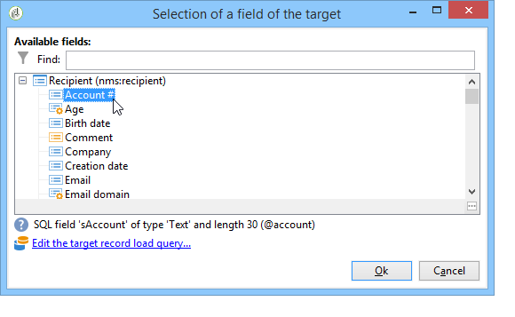

# 개인화 필드{#personalization-fields}

개인화 필드는 전달된 메시지 컨텐츠의 첫 번째 수준 개인화에 사용됩니다. 기본 컨텐츠에 삽입하는 필드는 선택한 데이터 소스의 데이터를 삽입할 위치를 보여줍니다.

예를 들어 **&lt;%= recipient.LastName %>** 구문을 사용하는 개인화 필드는 Adobe Campaign에 받는 사람 이름을 데이터베이스(수신자 테이블)에 삽입하도록 지시합니다.

>[!NOTE]
>
>개인화 필드 콘텐츠는 1024자를 초과할 수 없습니다.

## 데이터 소스 {#data-sources}

개인화 필드는 선택한 전달 모드에 따라 두 가지 데이터 소스에서 가져올 수 있습니다.

* Adobe Campaign 데이터베이스는 데이터 소스입니다. 이는 &#39;수신자 개인화 필드&#39;와 같이 가장 일반적인 경우입니다. 표준 필드(일반적으로 다음과 같은 필드)에 관계없이 수신자 테이블에 정의된 모든 필드입니다.성, 이름, 주소, 마을, 생년월일 등) 또는 사용자 정의 필드.
* 외부 파일은 데이터 소스입니다. 이러한 필드는 외부 파일에 있는 데이터를 사용하여 배달 중에 입력으로 표시된 파일의 열에 정의된 모든 필드입니다.

>[!NOTE]
>
>Adobe Campaign 개인화 태그에는 항상 **&lt;%=table.field%>**&#x200B;형식이 있습니다.

## 개인화 필드 삽입 {#inserting-a-personalization-field}

개인화 필드를 삽입하려면 머리글, 제목 또는 메시지 본문 편집 필드에서 액세스할 수 있는 드롭다운 아이콘을 클릭합니다.

데이터 소스(수신자 필드 또는 파일 필드)를 선택한 후 이 삽입은 Adobe Campaign으로 해석되고 지정된 수신자에 대한 필드 값으로 바뀌는 명령 형식을 취합니다. 그런 다음 **[!UICONTROL Preview]** 탭에서 실제 대체를 볼 수 있습니다.

## 개인화 필드 예 {#personalization-fields-example}

먼저 받는 사람의 이름을 삽입한 다음 메시지 본문에 프로필 작성 날짜를 추가할 이메일을 만듭니다. 이렇게 하려면:

1. 새 배달을 만들거나 기존 이메일 유형 배달을 엽니다.
1. 배달 마법사에서 메시지 제목을 **[!UICONTROL Subject]** 클릭하여 편집하고 제목을 입력합니다.
1. &quot; **[!UICONTROL Special offer for]** &quot;을 입력하고 도구 모음의 단추를 사용하여 개인화 필드를 삽입합니다. 을 **[!UICONTROL Recipients>Title]**&#x200B;선택합니다.

   

1. 받는 사람의 이름을 삽입하려면 작업을 반복합니다. 모든 개인화 필드 사이에 공백을 삽입합니다.
1. 을 **[!UICONTROL OK]** 클릭하여 유효성을 확인합니다.
1. 메시지 본문에 개인화를 삽입합니다. 이렇게 하려면 메시지 내용을 클릭하고 필드 삽입 단추를 클릭합니다.
1. 을 **[!UICONTROL Recipient>Other...]**&#x200B;선택합니다.

   

1. 표시할 정보가 있는 필드를 선택하고 을 **[!UICONTROL OK]**&#x200B;클릭합니다.

   

1. 개인화 결과를 보려면 **[!UICONTROL Preview]** 탭을 클릭합니다. 받는 사람의 메시지를 표시하려면 받는 사람을 선택해야 합니다.

   

   >[!NOTE]
   >
   >게재가 워크플로우의 일부인 경우 임시 워크플로우 테이블의 데이터를 사용할 수 있습니다. 이 데이터는 **[!UICONTROL Target extension]** 메뉴에서 그룹화됩니다. For more on this, refer to [this section](../../workflow/using/executing-a-workflow.md#target-data).

## 개인화 최적화 {#optimizing-personalization}

전용 옵션을 사용하여 개인화를 최적화할 수 있습니다.을 **[!UICONTROL Prepare the personalization data with a workflow]****[!UICONTROL Analysis]** 클릭합니다.

배달 분석 중에 이 옵션은 FDA에 연결된 테이블의 데이터를 포함하여, 대상에 연결된 모든 데이터를 임시 테이블에 저장하는 워크플로우를 자동으로 만들고 실행합니다.

이 옵션을 선택하면 개인화 실행을 위한 성능이 크게 향상될 수 있습니다.

예를 들어 메시지 컨텐츠에서 개인화 필드 및/또는 개인화 블록을 많이 사용하는 동안 많은 수신자에게 전달할 때 성능 문제가 발생하는 경우 이 옵션을 사용하면 개인화 처리 시간을 단축하여 메시지를 전달할 수 있습니다.

이 옵션을 사용하려면 아래 단계를 따르십시오.

1. 캠페인을 만듭니다. For more on this, refer to [this section](../../campaign/using/setting-up-marketing-campaigns.md#creating-a-campaign).
1. 캠페인의 **[!UICONTROL Targeting and workflows]** 탭에서 워크플로우에 **쿼리** 활동을 추가합니다. 이 활동 사용에 대한 자세한 내용은 [이 섹션을](../../workflow/using/query.md)참조하십시오.
1. 워크플로우에 **[!UICONTROL Email delivery]** 활동을 추가하고 엽니다. 이 활동 사용에 대한 자세한 내용은 [이 섹션을](../../workflow/using/delivery.md)참조하십시오.
1. 의 **[!UICONTROL Analysis]** 탭으로 **[!UICONTROL Delivery properties]** 이동하여 **[!UICONTROL Prepare the personalization data with a workflow]** 옵션을 선택합니다.

   

1. 제공을 구성하고 분석을 시작할 워크플로우를 시작합니다.

분석이 완료되면 개인화 데이터는 분석 도중 즉시 생성되는 임시 기술 워크플로우를 통해 임시 테이블에 저장됩니다.

이 워크플로우는 Adobe Campaign 인터페이스에 표시되지 않습니다. 개인화 데이터를 신속하게 저장 및 처리할 수 있는 기술적 수단만을 의미했습니다.

분석이 완료되면 워크플로우로 **[!UICONTROL Properties]** 이동하여 **[!UICONTROL Variables]** 탭을 선택합니다. 여기에서 SQL 호출을 수행하는 데 사용할 수 있는 임시 테이블의 이름을 볼 수 있습니다. 이 이름은 SQL에 포함된 ID를 표시하는 데 사용됩니다.

## 시간 제한 개인화 단계 {#timing-out-personalization}

전달 보호를 개선하기 위해 개인화 단계에서 제한 시간을 설정할 수 있습니다.

의 **[!UICONTROL Delivery]** 탭에서 **[!UICONTROL Delivery properties]**&#x200B;옵션에 대한 최대 값(초)을 선택합니다 **[!UICONTROL Maximum personalization run time]** .

미리 보기 또는 전송 중에 개인화 단계가 이 필드에 설정한 최대 시간을 초과하는 경우, 오류 메시지와 함께 프로세스가 중단되고 배달이 실패합니다.

기본값은 5초입니다.

이 옵션을 0으로 설정하면 개인화 단계에 대한 시간 제한이 없습니다.