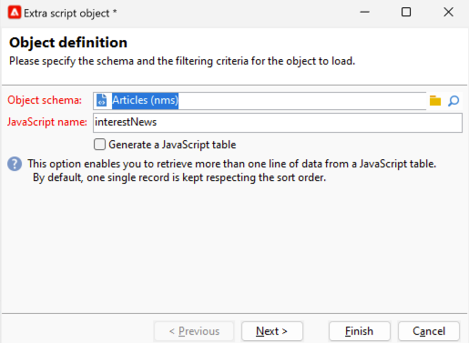

# 개인화 필드{#personalization-fields}

개인화 필드는 게재된 메시지 콘텐츠의 첫 번째 수준 개인화에 사용됩니다. 주 콘텐츠에 삽입하는 필드는 선택한 데이터 소스의 데이터를 삽입할 위치를 보여줍니다.

예를 들어 **&lt;%= recipient.LastName %>** 구문이 있는 개인화 필드는 Adobe Campaign에 수신자의 이름을 데이터베이스(수신자 테이블)에 삽입하도록 지시합니다.

 [비디오에서 이 기능 살펴보기](#personalization-fields-video)

>[!CAUTION]
>
>개인화 필드 콘텐츠는 1,024자를 초과할 수 없습니다.

## 데이터 소스 {#data-sources}

개인화 필드는 선택한 게재 모드에 따라 두 가지 유형의 데이터 소스에서 가져올 수 있습니다.

* Adobe Campaign 데이터베이스가 데이터 소스입니다. 예를 들어 &#39;수신자 개인화 필드&#39;와 같은 가장 일반적인 경우입니다. 다음은 수신자 표에 정의된 모든 필드이며 표준 필드(일반적으로 성, 이름, 주소, 도시, 생년월일 등)가 이러한 필드입니다. 또는 사용자 정의 필드.
* 외부 파일이 데이터 소스입니다. 외부 파일에 있는 데이터를 사용하여 게재 중에 입력으로 표시되는 파일의 열에 정의된 모든 필드입니다.

>[!NOTE]
>
>Adobe Campaign 개인화 태그에는 항상 **&lt;%=table.field%>** 형식이 있습니다.

## 개인화 필드 삽입 {#inserting-a-personalization-field}

개인화 필드를 삽입하려면 헤더, 제목 또는 메시지 본문 편집 필드에서 액세스할 수 있는 드롭다운 아이콘을 클릭합니다.

데이터 소스(수신자 필드 또는 파일 필드)를 선택한 후 이 삽입은 Adobe Campaign으로 해석되고 지정된 수신자에 대한 필드 값으로 대체되는 명령 형식을 사용합니다. 실제 대체 항목은 **[!UICONTROL Preview]** 탭에서 볼 수 있습니다.

## 개인화 필드 예 {#personalization-fields-example}

먼저 수신자의 이름을 삽입한 다음 메시지 본문에 프로필 생성 날짜를 추가하는 이메일을 만듭니다. 방법은 다음과 같습니다.

1. 새 게재를 만들거나 기존 이메일 유형 게재를 엽니다.
1. 게재 도우미에서 **[!UICONTROL Subject]**&#x200B;을(를) 클릭하여 메시지 제목을 편집하고 제목을 입력합니다.
1. &quot; **[!UICONTROL Special offer for]**&quot;을(를) 입력하고 도구 모음의 단추를 사용하여 개인화 필드를 삽입합니다. **[!UICONTROL Recipients>Title]**&#x200B;을(를) 선택합니다.

   

1. 받는 사람의 이름을 삽입하려면 작업을 반복합니다. 모든 개인화 필드 사이에 공백을 삽입합니다.
1. 유효성을 검사하려면 **[!UICONTROL OK]**&#x200B;을(를) 클릭하십시오.
1. 메시지 본문에 개인화를 삽입합니다. 이렇게 하려면 메시지 콘텐츠를 클릭하고 필드 삽입 버튼을 클릭합니다.
1. **[!UICONTROL Recipient>Other...]**&#x200B;을(를) 선택합니다.

   

1. 표시할 정보가 있는 필드를 선택하고 **[!UICONTROL OK]**&#x200B;을(를) 클릭합니다.

   

1. 개인화 결과를 보려면 **[!UICONTROL Preview]** 탭을 클릭하십시오. 수신자의 메시지를 표시할 수신자를 선택해야 합니다.

   

   >[!NOTE]
   >
   >게재가 워크플로우의 일부인 경우 임시 워크플로우 테이블의 데이터를 사용할 수 있습니다. 이 데이터는 **[!UICONTROL Target extension]** 메뉴에 그룹화되어 있습니다. 이 작업에 대한 자세한 정보는 [이 섹션](../../workflow/using/data-life-cycle.md#target-data)을 참조하십시오.

## 개인화 최적화 {#optimizing-personalization}

게재 속성의 **[!UICONTROL Analysis]** 탭에서 사용할 수 있는 전용 옵션 **[!UICONTROL Prepare the personalization data with a workflow]**&#x200B;을(를) 사용하여 개인화를 최적화할 수 있습니다. 게재 분석에 대한 자세한 내용은 [이 섹션](steps-validating-the-delivery.md#analyzing-the-delivery)을 참조하세요.

게재 분석 중에 이 옵션은 FDA에 연결된 테이블의 데이터를 포함하여 대상에 연결된 모든 데이터를 임시 테이블에 저장하는 워크플로우를 자동으로 만들고 실행합니다.

이 옵션을 선택하면 많은 데이터를 처리 중인 경우, 특히 개인화 데이터가 FDA를 통해 외부 테이블에서 전송된 경우 게재 분석 성능을 크게 향상시킬 수 있습니다. 자세한 내용은 [외부 데이터베이스 액세스(FDA)](../../installation/using/about-fda.md)를 참조하십시오.

예를 들어 메시지 콘텐츠에서 많은 개인화 필드 및/또는 개인화 블록을 사용하는 동안 많은 수신자에게 메시지를 전달할 때 성능 문제가 발생하는 경우 이 옵션을 사용하면 개인화를 빠르게 처리하여 메시지를 전달할 수 있습니다.

이 옵션을 사용하려면 아래 단계를 따르십시오.

1. 캠페인을 만듭니다. 이 작업에 대한 자세한 정보는 [이 섹션](../../campaign/using/setting-up-marketing-campaigns.md#creating-a-campaign)을 참조하십시오.
1. 캠페인의 **[!UICONTROL Targeting and workflows]** 탭에서 **쿼리** 활동을 워크플로우에 추가합니다. 이 활동 사용에 대한 자세한 내용은 [이 섹션](../../workflow/using/query.md)을 참조하세요.
1. 워크플로우에 **[!UICONTROL Email delivery]** 활동을 추가하고 엽니다. 이 활동 사용에 대한 자세한 내용은 [이 섹션](../../workflow/using/delivery.md)을 참조하세요.
1. **[!UICONTROL Delivery properties]**&#x200B;의 **[!UICONTROL Analysis]** 탭으로 이동하여 **[!UICONTROL Prepare the personalization data with a workflow]** 옵션을 선택합니다.

   

1. 게재를 구성하고 분석을 시작하도록 워크플로우를 시작합니다.

분석이 완료되면 개인화 데이터는 분석 중에 즉시 생성되는 임시 기술 워크플로우를 통해 임시 테이블에 저장됩니다.

이 워크플로우는 Adobe Campaign 인터페이스에 표시되지 않습니다. 이는 개인화 데이터를 빠르게 저장하고 처리하기 위한 기술적 수단으로만 제공됩니다.

분석이 완료되면 워크플로우 **[!UICONTROL Properties]**(으)로 이동하여 **[!UICONTROL Variables]** 탭을 선택합니다. 여기에 포함된 ID를 표시하기 위해 SQL 호출을 수행하는 데 사용할 수 있는 임시 테이블의 이름이 표시됩니다.

## 개인화 단계 시간 제한 {#timing-out-personalization}

게재 보호를 개선하기 위해 개인화 단계에 대한 시간 제한 기간을 설정할 수 있습니다.

**[!UICONTROL Delivery properties]**&#x200B;의 **[!UICONTROL Delivery]** 탭에서 **[!UICONTROL Maximum personalization run time]** 옵션의 최대값(초)을 선택합니다.

미리보기 또는 전송 중에 개인화 단계가 이 필드에서 설정한 최대 시간을 초과하는 경우 프로세스가 중단되고 오류 메시지가 표시되며 게재가 실패합니다.

기본값은 5초입니다.

이 옵션을 0으로 설정하면 개인화 단계에 대한 시간 제한이 없습니다.

## Personalization 탭 {#personalization-tab}

게재 속성에는 Personalization 탭이 있습니다.

**&quot;수신자 프로필 로드 쿼리 편집&quot;**&#x200B;을(를) 클릭하여 타겟팅 차원의 프로필 쿼리에 데이터를 추가할 수 있습니다. 표현식 내에서 직접 추출된 데이터를 사용하여 필요한 것을 추출할 수 있습니다. 이러한 데이터는 컨텍스트에 추가됩니다.

{zoomable="yes"}

추가하려는 데이터가 타겟팅 차원에 없는 경우 **&quot;스크립트의 실행 컨텍스트에서 개체 추가&quot;**&#x200B;를 클릭할 수 있습니다.

{zoomable="yes"}

필요한 오브젝트 스키마를 선택할 수 있으며 그런 다음 Javascript 코드 내에서 이러한 데이터를 사용할 수 있습니다. 이 데이터는 게재 준비 중에 실행됩니다.

{zoomable="yes"}

개체 스키마를 추가하여 컨텍스트에 추가할 필드를 선택할 수 있습니다.

{zoomable="yes"}

## 튜토리얼 비디오 {#personalization-fields-video}

제목 줄과 이메일 전달 컨텐츠에 개인화 필드를 추가하는 방법을 알아봅니다.

>[!VIDEO](https://video.tv.adobe.com/v/24925?quality=12)

추가 Campaign Classic 방법 비디오를 [여기](https://experienceleague.adobe.com/docs/campaign-classic-learn/tutorials/overview.html?lang=ko)에서 사용할 수 있습니다.
