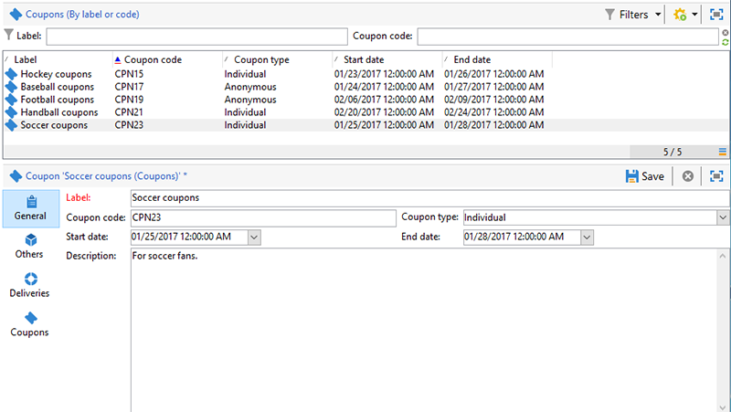
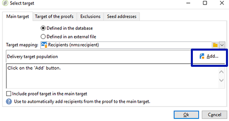
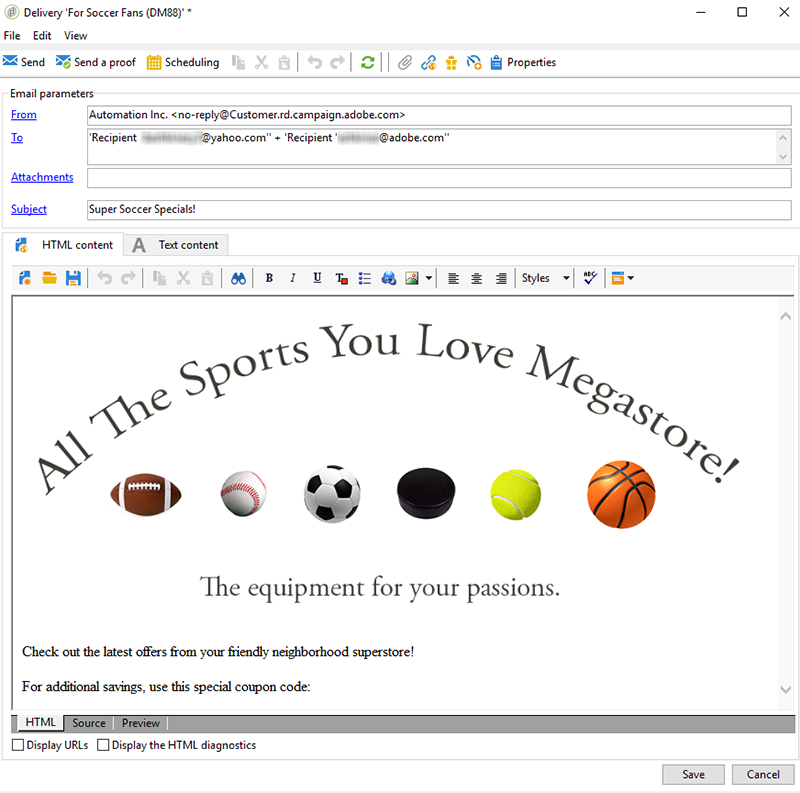
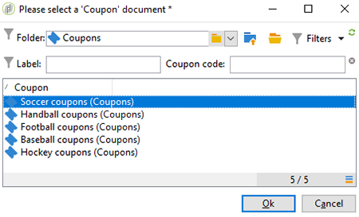
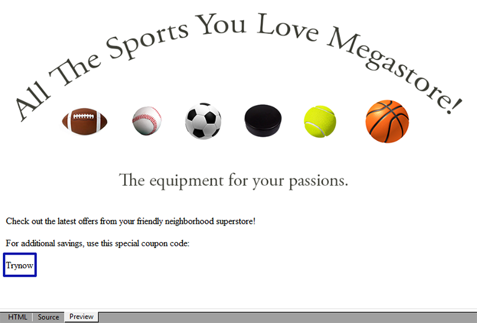

# 개인화된 쿠폰{#personalized-coupons}

배달물에 쿠폰을 추가하면 수신자가 제품 및 서비스에 대한 향상된 가치를 제공할 수 있습니다. 캠페인 쿠폰 모듈을 사용하여 예정된 마케팅 오퍼에 추가할 쿠폰 세트를 만들 수 있습니다. 배달을 만들 준비가 되면 해당 쿠폰을 할당합니다. 쿠폰은 선택한 기간에 대해 유효하므로 지정된 쿠폰은 배달 메시지에 고유하게 연결됩니다. 또한 Campaign은 배달을 보내기 전에 메시지 수에 대한 쿠폰이 충분한지 확인합니다.

>[!NOTE]
>
>쿠폰 관리는 반드시 설치해야 하는 패키지입니다. 쿠폰 관리가 있는지 확인하려면 **[!UICONTROL Administration > Configuration > Package management > Installed packages.]**
>
>쿠폰 데이터는 CSV 및 XML 형식을 사용하여 가져오고 내보낼 수 있습니다. 가져오기 및 내보내기에 대한 자세한 내용은 [이 섹션을 참조하십시오](../../platform/using/generic-imports-and-exports.md).

## 쿠폰 만들기 {#creating-a-coupon}

쿠폰 모듈에서는 쿠폰을 만들 때 두 가지 옵션을 제공합니다.

* **익명**:특정 받는 사람 또는 받는 사람 목록을 위한 일반 쿠폰입니다.
* **개인**:특정 수신자를 위한 개인화된 쿠폰.

아래 단계를 수행하기 전에 만들고자 하는 쿠폰 유형을 알고 있어야 합니다.

1. 캠페인 트리에서 로 이동합니다 **[!UICONTROL Resources > Campaign management > Coupons]**.

   

1. **[!UICONTROL New]** 버튼을 클릭합니다.
1. 필드에 쿠폰 이름을 **[!UICONTROL Label]** 입력합니다. 고유한 코드가 자동으로 입력되었습니다 **[!UICONTROL Coupon code]**. 코드를 유지하거나 새 코드를 입력할 수 있습니다.

   

1. 쿠폰 **[!UICONTROL Start date]** 이 유효한 기간을 선택하고 **[!UICONTROL End date]** 설정합니다.
1. 에서 익명 또는 개인 **[!UICONTROL Coupon type]**&#x200B;을 선택합니다.

   **[!UICONTROL Anonymous coupons]** :익명의 쿠폰은 모든 수신자와 동일합니다. 쿠폰 유형 메뉴에서 익명 **이 선택되었는지** 확인하고 **저장을 클릭하여** 쿠폰을 생성합니다.

   **[!UICONTROL Individual coupons]** :개별 쿠폰은 추가 쿠폰 코드로 개인화할 수 있습니다. 예를 들어, 스포츠 장비 스토어에서 판매용으로 개별 쿠폰이 만들어집니다. 하지만 받는 사람 명단은 길고 한 경기 한 편 한 편 한 편 한 편 할 것 없이 같은 열정을 갖고 있지는 않다. 스포츠(예: 축구, 축구, 야구 등)를 기반으로 개별 쿠폰에 대한 코드 이름을 추가할 수 있습니다. 각 코드를 해당 수신자에게 전송합니다.

   1. [개인]을 선택하면 새 탭인 쿠폰이 왼쪽 하단에 나타납니다. 탭으로 **[!UICONTROL Coupons]** 가서 을 클릭합니다 **[!UICONTROL Add]**.
   1. 팝업 창의 메시지가 표시되면 개별 쿠폰에 대한 고유 코드를 입력합니다.
   1. 쿠폰 **[!UICONTROL Save]** 을 생성하려면 을 클릭합니다.

   쿠폰 탭에 대한 자세한 내용은 개별 쿠폰 [구성을 참조하십시오](#configuring-individual-coupons).

   >[!NOTE]
   >
   >개별 쿠폰은 일괄 가져올 수 있습니다. 가져오기 및 내보내기에 대한 자세한 내용은 [이 섹션을 참조하십시오](../../platform/using/generic-imports-and-exports.md).

### 개별 쿠폰 구성 {#configuring-individual-coupons}

쿠폰 탭은 개별 쿠폰에서만 사용할 수 있습니다. 쿠폰이 게재와 연결되면 쿠폰 탭에 다음과 같은 세부 사항이 제공됩니다.

* **[!UICONTROL Status]** :쿠폰 사용 가능 시기
* **[!UICONTROL Redeemed on]** :쿠폰 상환일
* **[!UICONTROL Channel]** :쿠폰을 보내는 데 사용된 채널입니다.
* **[!UICONTROL Address]** :받는 사람의 이메일 주소입니다.

값 **[!UICONTROL status]**, **[!UICONTROL channel]**&#x200B;및 **[!UICONTROL address]** 은 자동으로 완료됩니다. 하지만, 에 대한 값 **[!UICONTROL redeemed on]** 은 캠페인에서 복구되지 않습니다. 쿠폰 상환에 대한 세부 정보가 있는 파일을 가져와 완료할 수 있습니다.

## 이메일 배달에 쿠폰 삽입 {#inserting-a-coupon-into-an-email-delivery}

아래 예에서 배달은 홈 페이지에서 만들어집니다. 배달을 만드는 방법에 대한 자세한 지침은 [이 섹션을 참조하십시오](../../delivery/using/about-email-channel.md). 워크플로우에서 배달에 쿠폰을 추가할 수도 있습니다.

1. 이동 **[!UICONTROL Campaigns]** 후 선택합니다 **[!UICONTROL Deliveries]**.
1. **[!UICONTROL Create]**&#x200B;을(를) 클릭합니다.

   

1. 이름을 입력하고 **[!UICONTROL Label]** 을 클릭합니다 **[!UICONTROL Continue]**.
1. 수신자 **[!UICONTROL To]** 를 추가하려면 클릭합니다.
1. 배달 **[!UICONTROL Add]** 에 사용할 수신자를 선택하려면 을(를) 클릭합니다. 수신자를 선택한 후 을 클릭하여 배달 **[!UICONTROL Ok]** 으로 돌아갑니다.

   

1. 제목을 입력하고 메시지에 컨텐트를 추가합니다.

   

1. 도구 모음에서 을 클릭하고 탭 **[!UICONTROL Properties]** 을 **[!UICONTROL Advanced]** 선택합니다.
1. 폴더 아이콘을 클릭합니다 **[!UICONTROL Coupon management]**.

   

1. 쿠폰을 선택하고 을 클릭합니다 **[!UICONTROL Ok]**. 다시 **[!UICONTROL Ok]** 클릭합니다.

   

1. 쿠폰을 배치할 위치를 선택하려면 메시지를 클릭합니다.

   

1. 쿠폰 유형에 따라 다음 중 하나를 선택하려면 개인화 아이콘을 클릭합니다.

   * 익명 쿠폰: **[!UICONTROL Coupon > Coupon code]**

      

   * 개별 쿠폰: **[!UICONTROL Coupon value > Coupon code]**

      

      쿠폰은 지정된 이름이 아닌 코드로 메시지에 삽입됩니다. 코드는 캠페인 표준 데이터 모델 내에서 사용됩니다.
   

1. 테스트를 실행하여 쿠폰에 할당한 이름을 확인합니다. 탭으로 **[!UICONTROL Preview]** 가서 을 클릭합니다 **[!UICONTROL Test personalization]**. 테스트에 사용할 수신자를 선택합니다.

   

   테스트 후 쿠폰은 코드가 아닌 지정된 이름으로 표시되어야 합니다.

   

1. 도구 모음에서 **[!UICONTROL Send]** (왼쪽 위)를 클릭하고 배달을 보낼 방법을 선택합니다.

   

1. **[!UICONTROL Analyze]**&#x200B;을(를) 클릭합니다. 분석 로그에 모든 받는 사람이 사용할 수 있는 쿠폰이 충분하다는 것이 확인되면 이 쿠폰을 **[!UICONTROL Confirm delivery]** 보내려면 클릭합니다.

   

>[!NOTE]
>
>배달할 쿠폰 부족 관리 방법에 대한 지침은 [쿠폰 부족 관리를 참조하십시오](#managing-insufficient-coupons)

배달이 성공했는지 확인하려면:

1. 로 **[!UICONTROL Explorer > Resources > Campaign management > Coupons]**&#x200B;이동합니다.
1. 탭을 **[!UICONTROL Deliveries]** 클릭합니다.

   

   상태가 성공적인 전달으로 **[!UICONTROL Finished]** 표시됩니다.

>[!NOTE]
>
>기본적으로 쿠폰 관리 모듈은 nms:recipient **테이블을** 사용합니다. 다른 테이블 사용 방법에 대한 지침은 스키마 [편집을 참조하십시오](../../configuration/using/data-schemas.md).

## 쿠폰 부족 관리 {#managing-insufficient-coupons}

메시지보다 쿠폰이 적으면 배달 분석이 중지됩니다. 이러한 경우 쿠폰을 더 가져오거나 메시지 수를 제한할 수 있습니다. 메시지 수를 제한하려면 아래 지침을 따르십시오.

1. 이메일 배달 창으로 이동합니다.
1. **[!UICONTROL To]**&#x200B;을(를) 클릭합니다.
1. In **[!UICONTROL Select target]**, go to the **[!UICONTROL Exclusions]** tab.

   

1. 제외 설정 섹션에서 을 클릭합니다 **[!UICONTROL Edit]**.
1. 보낼 메시지 수를 입력하고 **[!UICONTROL Limit delivery to...messages]** 클릭합니다 **[!UICONTROL Ok]**. 배달은 보내주시면 됩니다

   

>[!NOTE]
>
>제한된 수의 쿠폰을 관리할 때 배달 워크플로우를 사용하면 기준에 따라 배달을 분할할 수 있습니다. 타겟을 제한하지 않고 특정 모집단으로 쿠폰을 보내려는 경우 좋은 옵션입니다.
