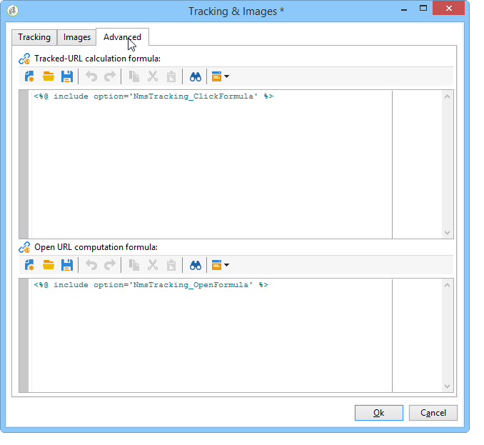

# URL 추적 개인화{#personalizing-url-tracking}

고급 메시지 추적 설정은 배달 마법사의 도구 모음에 있는 **[!UICONTROL Tracking & Images]** 아이콘을 통해 액세스할 수 있습니다.

>[!NOTE]
>
>이메일의 이미지 관리도 이 창에 구성됩니다. [이미지 추가](../../delivery/using/defining-the-email-content.md#adding-images)를 참조하십시오.

추적 옵션을 구성할 수 있습니다.

* 모든 메시지에 대한 URL 추적 활성화/비활성화.

   >[!CAUTION]
   >
   >게재에서 추적이 활성화되지 않는 경우(예:**[!UICONTROL Activate tracking]** 옵션이 선택되지 않음), 추적과 관련된 보고서 및 데이터를 사용할 수 없습니다.열기, 핫 클릭 및 추적된 URL 보고서는 어떠한 데이터도 표시하지 않으며, 이 배달에 대해 **[!UICONTROL Tracking logs]** 탭이 표시되지 않습니다.

* 메시지에 대한 추적 활성화/비활성화가 열립니다.

추적된 URL은 트리 형태로 중앙 창에 나열됩니다.

메시지의 각 URL에 대해 개별적으로 추적을 활성화하거나 비활성화할 수 있습니다. 이 작업에 대한 자세한 정보는 [이 섹션](../../delivery/using/how-to-configure-tracked-links.md)을 참조하십시오.

**[!UICONTROL Advanced]** 탭에서는 추적된 URL 및 여는 URL의 계산 공식을 개인화할 수 있습니다.

>[!CAUTION]
>
>이 탭의 설정은 전문가 사용자만 수정할 수 있습니다.
