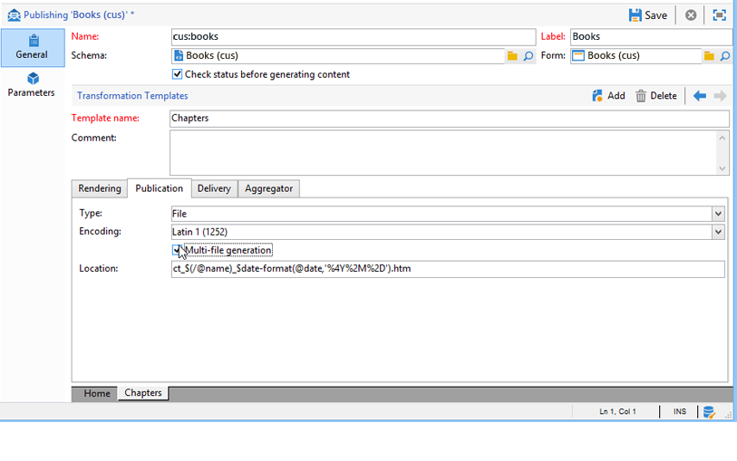

# 발행물 템플릿{#publication-templates}

## 발행물 템플릿 정보 {#about-publication-templates}

게시 템플릿은 게시할 컨텐츠의 ID 카드입니다. 게시 프로세스에서 사용되는 리소스(예:

* 데이터 스키마,
* 입력 양식,
* 각 출력 문서의 변형 템플릿입니다.

## 발행물 템플릿 식별 {#identification-of-a-publication-template}

발행물 템플릿은 이름 및 네임스페이스로 식별됩니다.

The identification key of a stylesheet is a string made of the namespace and the name separated by a colon;예를 들면 다음과 같습니다. **cus:newsletter**.

>[!NOTE]
>
>실제로는 스키마, 양식 및 게시 템플릿에 동일한 키를 사용하는 것이 좋습니다.

## 템플릿 만들기 및 구성 {#creating-and-configuring-the-template}

게시 템플릿은 기본적으로 **[!UICONTROL Administration > Configuration > Publication templates]** 노드에 저장됩니다. 새 템플릿을 만들려면 템플릿 목록 위의 **[!UICONTROL New]** 단추를 클릭합니다.

게시 템플릿을 구성하려면 템플릿의 이름(이름 및 네임스페이스로 구성된 ID 키), 레이블, 데이터 스키마 및 연결된 입력 양식을 채웁니다.


>[!NOTE]
>
>이 게시 템플릿을 기반으로 컨텐츠를 만들 때마다 레이블이 표시됩니다.

콘텐츠 **생성** 유효성 검사 옵션을 사용하면 컨텐츠 인스턴스의 &quot;유효성 검사&quot; 상태를 확인하여 파일 생성을 인증합니다. 자세한 내용은 게시를 [참조하십시오](#publication).

각 출력 문서에 대해 변형 템플릿을 추가해야 합니다. 필요한 만큼 변형 템플릿을 만들 수 있습니다.

이 **[!UICONTROL Name of template]** 필드는 출력에서 렌더링 유형을 설명하는 자유 레이블입니다. 각 변형 템플릿의 경우 발행물 설정을 탭에서 사용할 수 있습니다.

### 렌더링 {#rendering}

탭에서 다음을 **[!UICONTROL Rendering]** 선택합니다.

* 출력 문서를 투영하는 데 사용되는 렌더링 유형:XSL 스타일시트 또는 JavaScript 템플릿,
* 출력 문서의 형식:HTML, 텍스트, XML 또는 RTF,
* 구성 데이터(예: 사용할 스타일시트 또는 JavaScript 템플릿)를 포함하는 템플릿입니다.

### 발행물 {#publication}

선택한 유형이 파일인 경우 출력 문서를 파일 형식으로 생성합니다 **[!UICONTROL File]**.


다음 게시 옵션을 사용할 수 있습니다.

* 출력 파일 인코딩 문자 집합을 **[!UICONTROL Encoding]** 필드를 통해 강제 설정할 수 있습니다. 기본적으로 라틴 1(1252) 문자 집합이 사용됩니다.
* 이 **[!UICONTROL Multi-file generation]** 옵션은 특수 문서 게시 모드를 활성화합니다. 이 옵션은 출력 문서의 각 페이지 시작 부분에 분할 태그를 채우는 것으로 구성됩니다. 컨텐츠를 생성하면 채워진 분할 태그마다 파일이 생성됩니다. 이 모드는 컨텐츠 블록에서 미니 사이트를 생성하는 데 사용됩니다. 자세한 내용은 다중 [파일 생성을](#multi-file-generation)참조하십시오.
* 이 **[!UICONTROL Location]** 필드에는 출력 파일의 이름이 포함되어 있습니다. 자동 파일 이름을 생성하기 위해 이 이름은 변수로 구성될 수 있습니다.

   변수는 다음 형식으로 채워집니다.**`$(<xpath>)`여기서 `<xpath>` 은 발행물 템플릿 데이터 스키마의 필드 경로입니다.

   파일 이름은 날짜 유형 필드로 구성될 수 있습니다. 이 필드의 형식을 올바로 지정하려면 **$date-format** 함수를 필드 경로와 출력 형식을 매개 변수로 사용하십시오.

   기본적으로 파일 이름의 구성 형식은 &quot;@name&quot; 및 &quot;@date&quot; 필드의 변수를 사용합니다.

   ```
   ct_$(@name)_$date-format(@date,'%4Y%2M%2D').htm
   ```

   생성된 파일 이름은 다음과 같습니다.ct_news12_20110901.htm

   >[!NOTE]
   >
   >컨텐츠 생성에 대한 자세한 내용은 컨텐츠 [인스턴스](../../delivery/using/using-a-content-template.md#creating-a-content-instance)만들기를 참조하십시오.

### 게재 {#delivery}

이 탭에서는 컨텐츠에서 직접 배달을 시작하려면 시나리오를 선택할 수 있습니다. 이메일의 컨텐츠는 출력 형식(HTML 또는 텍스트)에 따라 자동으로 채워집니다.


>[!NOTE]
>
>컨텐츠를 기반으로 하는 배달 작성의 예는 컨텐츠 [인스턴스](../../delivery/using/using-a-content-template.md#delivering-a-content-instance)제공을 참조하십시오.

### 수집기 {#aggregator}

스크립트 또는 쿼리 목록에서 데이터를 집계하면 컨텐츠 데이터로 XML 문서를 보완할 수 있습니다. 목적은 링크에서 참조되는 특정 정보를 보충하거나 데이터베이스에서 요소를 추가하는 것입니다.

### 다중 파일 생성 {#multi-file-generation}

여러 파일 생성을 활성화하려면 게시 모델에서 **[!UICONTROL Multi-file generation]** 옵션을 선택합니다. 이 옵션을 사용하면 출력 문서의 각 페이지 시작 부분에 대해 스타일시트에서 분할 태그를 지정할 수 있습니다. 컨텐츠 생성은 발생한 각 분할 태그에 대한 파일을 생성합니다.

The partitioning tag to be integrated in the stylesheet:

**`<xsl:comment> #nl:output_replace(<name_of_file>) </xsl:comment>`** 여기서 **`<name_of_file>`** 는 생성할 페이지의 파일 이름입니다.

**예:**&quot;cus:book&quot; 스키마를 사용한 여러 파일 생성

기본 사항은 장(chapter)의 세부 사항을 외부 페이지에 표시할 수 있는 기본 페이지를 생성하는 것입니다.


해당 스타일시트(&quot;cus:book.xsl&quot;)는 다음과 같습니다.

```
<?xml version="1.0" encoding="ISO-8859-1" ?>
<xsl:stylesheet xmlns:xsl="http://www.w3.org/1999/XSL/Transform" version="1.0">
  <xsl:output encoding="ISO-8859-1" method="html"/>

  <!-- Style sheet entry point -->
  <xsl:template match="/book">
    <html>
      <body>
        <h1><xsl:value-of select="@name"/></h1>
        <lu>
          <xsl:for-each select="chapter">
            <li><a target="_blank" href="chapter{@id}.htm"><xsl:value-of select="@name"/></a></li>  
          </xsl:for-each>
       </lu>
      </body>
    </html>
   </xsl:template>
</xsl:stylesheet>
```

장에 대한 세부 정보를 생성하려면 두 번째 스타일시트(&quot;cus:chapter.xsl&quot;)가 필요합니다.

```
<?xml version="1.0" encoding="ISO-8859-1" ?>
<xsl:stylesheet xmlns:xsl="http://www.w3.org/1999/XSL/Transform" version="1.0">
  <xsl:output encoding="ISO-8859-1" method="html"/>

  <!-- Detail of a chapter -->
  <xsl:template match="chapter">
    <!-- Cut tag -->   
    <xsl:comment> #nl:output_replace($(path)/chapter<xsl:value-of select="@id"/>.htm)</xsl:comment>
    
    <html>
      <body>
        <h1><xsl:value-of select="@name"/></h1>
        <xsl:value-of select="page" disable-output-escaping="yes"/>
      </body>
    </html>
  </xsl:template>

  <!-- Style sheet entry point -->
  <xsl:template match="/book">
    <xsl:apply-templates/>
   </xsl:template>
</xsl:stylesheet>
```

분할 태그는 생성할 파일에 포함할 페이지 시작 부분에 채워집니다.

```
<xsl:comment> #nl:output_replace($(path)/<xsl:value-of select="@id"/>.htm)</xsl:comment>
```

파일 이름은 **$(path)** 변수에 발행물 경로가 들어 있고 입력 문서의 장 식별자와 일치하는 **`<xsl:value-of select="@id" />`**$(경로)변수로 구성됩니다.

출판 모델은 &quot;cus:book.xsl&quot; 및 &quot;cus:chapter.xsl&quot; 스타일 시트로 채워야 합니다.

이 **[!UICONTROL Multi-file generation]** 옵션은 장 변환 모델에서 활성화해야 합니다.



이 **[!UICONTROL Location]** 필드는 여러 파일을 생성하는 데 사용되지 않지만 게시할 때 오류가 발생하지 않도록 이 필드를 채워야 합니다.
