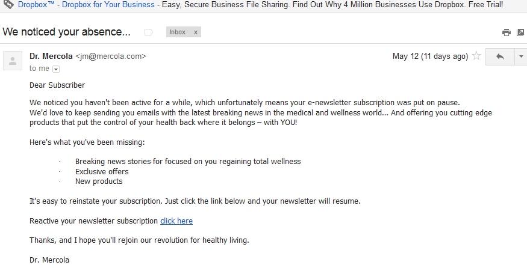

# 재참여를 통한 전달 능력 향상{#re-engagement}

전달 기능을 구현하는 동안, 우수 사례 중 일부는 건강한 가입자 기반을 유지하고 재참여 전략을 통해 전달 능력을 향상시키고자 하는 것입니다.

* 건전한 가입자 기반을 유지하는 것은 선하고 일관된 전달을 보장하는 주요 측면 중 하나입니다. 데이터 처리 과정 및 유지 관리가 취약하여 발생하는 여러 가지 전달 문제
* 오늘날 마케터가 당면하고 있는 가장 일반적인 문제 중 하나는 비활성 구독자 활동(즉, 낮은 또는 비참여도)으로 인해 이메일 전달과 낮은 ROI에 부정적인 영향을 줄 수 있습니다.

>[!NOTE]
>
>재참여 캠페인 전략 및 Adobe의 배달 기능에 대한 자세한 내용은 고객 제공 서비스 컨설턴트에게 문의하거나 Adobe 세일즈 담당자에게 문의하십시오.

## ISP는 비참여 활동을 어떻게 볼 수 있습니까? {#how-do-isps-view-non-engagement-activity-}

수년 동안 ISP는 사용자의 참여 피드백 지표를 사용하여 메시지 배치 위치 또는 메시지 전달 여부를 결정합니다. 사용자 참여는 긍정적 피드백과 ISP 모니터로 모두 일정하게 구성됩니다. 참여가 없는 것은 아마도 부정적인 참여의 주요 기여자 중 하나일 것입니다. 전달 가능성 관점에서, 참여가 없는 사용자에게 캠페인을 일관되게 전송하는 것은 IP 주소 및 도메인의 전반적인 명성을 떨어뜨릴 수도 있습니다.

AOL, Gmail, Microsoft 및 Yahoo!와 같은 ISP 비참여를 원하지 않는 이메일로 보고 메시지를 스팸 폴더로 리디렉션하기 시작합니다. 또한 이러한 가입자는 더 이상 이메일 계정을 소유하지 않을 수 있으며, 이를 &quot;재활용&quot; 스팸 트랩으로 사용할 수 있습니다. 이는 주소가 한동안 유효하지 않아 모든 메시지가 거부됨을 의미합니다. 가입자 관리 시스템에서 &quot;하드 바운스된&quot; 주소를 제거하지 않는 경우 중요한 게재 문제로 이어지는 스팸성 트랩을 발송할 가능성이 높습니다.

## 활동적이지 않은 것에 어떻게 접근해야 합니까? {#how-should-you-approach-inactivity-}

다행히 Adobe Campaign 플랫폼을 사용하는 고객은 열린 데이터를 검토하고 세그먼트에 따라 데이터를 클릭하여 인스턴스 내에서 비활동 상태를 볼 수 있습니다. 비참여는 전달에 지장을 줄 수 있으므로 우선 데이터베이스에서 가입자를 제거하는 것이 좋습니다. 하지만, 이것은 어떤 경우에 잘못된 선택인 것으로 판명될 수 있습니다. 따라서, 재참여(재참여라고도 함) 전략은 메일 수신을 원하는 가입자를 유지하고 더 이상 활동을 표시하지 않는 가입자를 단계적으로 제외하는 것이 가장 좋습니다.

## 재참여 캠페인이 제대로 작동합니까? {#do-re-engagement-campaigns-really-work-}

재방문 경로 연구에 따르면, 재참여 캠페인은 일반 캠페인의 평균 14%와 비교하여 12%의 개방 비율로 나타났습니다. 구독자 중 24%만이 재참여 캠페인을 읽었지만 약 45%가 후속 메시지를 읽었습니다.

## 재참여 캠페인을 만들려면 어떻게 해야 합니까? {#how-do-you-create-a-re-engagement-campaign-}

### 1단계 {#phase-1}

* 첫 번째 단계는 열려 있거나 클릭하는 활동이 거의 없는 가입자를 식별하고 그에 따라 지정된 시간대를 기준으로 이 그룹을 세그먼트화하는 것입니다. thumb 규칙은 지난 90일 이내에 이메일을 열거나 클릭하지 않은 구독자를 검토하는 것입니다. 그러나 비즈니스 특성(예: 계절 전송)에 따라 다릅니다.
* 타임프레임을 정의하면서 기억해야 할 또 다른 점은 ISP와 블랙리스트에서 참여를 1.5년에서 1.8년 사이 어느 곳이라고 고려하는 것입니다. 또한 구매 및 웹 사이트 활동과 같은 행동 활동이나 등록 단계 또는 첫 번째 연락 시 선호하는 기타 접점 등

### 1단계 {#phase-2}

* 세그먼트가 정의되면 다음 단계는 식별된 지표에 따라 가입자에게 제공되는 재참여 캠페인을 만드는 것입니다. 제목 줄을 만들면 가입자의 관심을 높이는 데 도움이 됩니다. 재방문 경로 연구에 따르면 &quot;We miss you&quot;라는 제목 및 컨텐츠는 &quot;We want you back&quot;보다 응답률이 높습니다.
* 이메일을 다시 사용하기 위한 인센티브를 제공할 수도 있습니다. 할인이 있는 오퍼를 고려할 때 달러 금액 대 백분율을 사용하는 것이 가장 좋습니다. 또한 반환 경로는 응답률이 높으므로 이를 수행하는 것을 제안합니다. 마지막으로 A/B 분할 테스트를 수행하여 응답과 성공률을 검토할 수도 있습니다.

### 3단계 {#phase-3}

다음 단계는 재참여 캠페인의 빈도를 결정하는 것입니다. 재확인 메시지와 달리 재참여 캠페인은 시간에 따른 일련의 이메일을 사용하여 구독자를 다시 받아보도록 하기 위한 것입니다. 다음 예에서는 빈도의 예를 제공합니다.

열기 또는 클릭 활동을 팔로우하여 캠페인에 참여하는 구독자는 다시 참여 구독자 목록에 추가됩니다.

### 4단계 {#phase-4}

* 다음 단계는 지속적으로 아무런 활동이 없는 가입자를 식별하고 일정 기간 동안 해당 가입자에게 이메일을 서서히 보내는 것을 줄이는 것입니다. 지난 1년 이내에 활동이 없는 경우 구독자에게 이메일 구독을 일시 중단시키는 것이 좋습니다. 이메일 컨텐츠에 관심이 없더라도 일회성 다시 확인 캠페인을 전송하여 구독을 다시 활성화할 수 있는 마지막 기회가 항상 있습니다.
* 다시 확인 캠페인은 가입자의 가입 목록에 오래 머물고 싶은 경우 오랫동안 비활성화된 가입자에게 묻는 좋은 방법입니다. 캠페인을 만들 때 &quot;여기를 클릭&quot; 링크를 추가하여 작업을 확인하고 주소를 확인하는 것이 좋습니다. 이렇게 하면 작업을 데이터베이스에 기록할 수 있습니다. 다음은 재확인 이메일의 예입니다.

   

   가입자의 조치가 취해지면가입이 재확인되는 랜딩 페이지가 제공될 수 있습니다. 다음은 랜딩 페이지의 예입니다.

   
