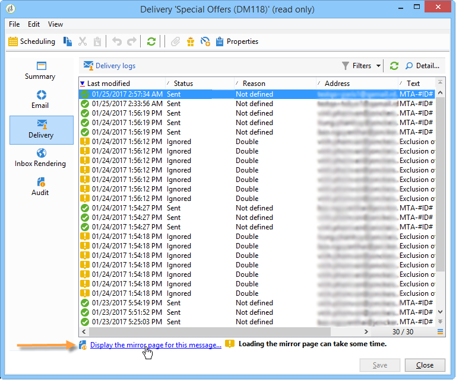

# 이메일 보내기{#sending-an-email}

이메일을 승인하고 작성되는 배달의 수신자에게 보내려면 을 클릭합니다. **[!UICONTROL Send]**

배달을 확인하고 전송할 때의 세부 프로세스는 아래 섹션에 나와 있습니다.

* [배달 유효성 확인](../../delivery/using/steps-validating-the-delivery.md)
* [배달 보내기](../../delivery/using/steps-sending-the-delivery.md)

아래 섹션에서는 이메일을 전달하는 데 필요한 매개 변수에 대해 자세히 설명합니다.

## 이메일 보관 {#archiving-emails}

Adobe Campaign을 사용하면 BCC를 통해 외부 시스템에 메시지를 저장할 수 있습니다. 이 옵션이 활성화되면, 전송된 모든 메시지의 정확한 사본이 이 전달에 보관됩니다.

이메일 숨은 참조 구성에 대한 자세한 내용은 [이 섹션을](../../installation/using/email-archiving.md)참조하십시오.

>[!NOTE]
>
>이 기능은 선택 사항입니다. 라이선스 계약서를 확인하고 계정 담당자에게 문의하여 활성화하십시오.

새 배달 템플릿 또는 배달 템플릿을 만들 때, 옵션을 구입했더라도 이메일 BCC는 기본적으로 활성화되지 않습니다. 사용할 각 게재 또는 템플릿에서 수동으로 활성화해야 합니다.

이렇게 하려면 아래 절차를 따르십시오.

1. > **[!UICONTROL Campaign Management]** 또는 **[!UICONTROL Deliveries]** > **[!UICONTROL Resources]** > **[!UICONTROL Templates]** 으로 이동합니다 **[!UICONTROL Delivery templates]**.
1. 원하는 배달 방법을 선택하거나 즉시 사용 가능한 이메일 **배달** 템플릿을 복제한 다음 중복된 템플릿을 선택합니다.
1. 속성 **단추를** 클릭합니다.
1. 탭을 **[!UICONTROL Delivery]** 선택합니다.
1. 이 **배달 또는 이 템플릿을 기반으로 각 전달에 대해 보낸 모든 메시지의 사본을 보관하려면 이메일** 보관 상자를 선택합니다.

   

   >[!NOTE]
   >
   >BCC 주소로 보낸 이메일이 열리고 클릭스루되는 경우, 전송 분석에서 **[!UICONTROL Total opens]** 및 **[!UICONTROL Clicks]** 수신하게 되므로 계산 오류가 발생할 수 있습니다.

## 미러 페이지 생성 {#generating-the-mirror-page}

미러 페이지는 웹 브라우저를 통해 온라인으로 액세스할 수 있는 HTML 페이지입니다. 컨텐츠는 이메일과 동일합니다.

기본적으로 링크가 메일 컨텐츠에 삽입된 경우 미러 페이지가 생성됩니다. 개인화 블록 삽입에 대한 자세한 내용은 개인화 [블록을](../../delivery/using/personalization-blocks.md)참조하십시오.

배달 속성에서, **[!UICONTROL Mode]** 탭의 **[!UICONTROL Validity]** 필드를 사용하여 이 페이지의 생성 모드를 수정할 수 있습니다.

>[!CAUTION]
>
>미러 페이지를 생성할 HTML 컨텐츠를 정의해야 합니다.

기본 모드 외에 다음 옵션도 사용할 수 있습니다.

* **[!UICONTROL Force the generation of the mirror page]** :미러 페이지에 대한 링크가 게재되지 않아도 미러 페이지가 생성됩니다.
* **[!UICONTROL Do not generate the mirror page]** :배달에 링크가 있어도 미러 페이지가 생성되지 않습니다.
* **[!UICONTROL Generates a mirror page accessible using only the message identifier]** :이 옵션을 사용하면 개인화 정보가 있는 미러 페이지의 컨텐츠를 배달 로그 창에서 액세스할 수 있습니다. 이렇게 하려면 배달이 끝난 후 **[!UICONTROL Delivery]** 탭을 클릭하고 미러 페이지를 보려는 수신자의 라인을 선택합니다. 링크를 **[!UICONTROL Display the mirror page for this message...]** 클릭합니다.

   

## 바운스 이메일 관리 {#managing-bounce-emails}

전달 매개 변수의 **[!UICONTROL SMTP]** 탭을 사용하여 바운스 메일의 관리를 구성할 수 있습니다.

기본적으로 바운스된 이메일은 플랫폼의 기본 오류 상자에 표시되지만 배달에 대한 특정 오류 주소를 정의할 수 있습니다.

이 화면에서 특정 주소를 정의하여 바운스 메일의 자동 적격 여부를 조사할 수도 있습니다. 이러한 각 필드에 대해 &#39;개인화된 필드 추가&#39; 아이콘을 사용하여 개인화 매개 변수를 추가할 수 있습니다.

## 문자 인코딩 {#character-encoding}

전달 매개 변수의 **[!UICONTROL SMTP]** 탭에서 **[!UICONTROL Character encoding]** 섹션에서 특정 인코딩을 설정할 수 있습니다.

기본 인코딩은 UTF-8입니다. 일부 수신자의 이메일 공급자가 UTF-8 표준 인코딩을 지원하지 않는 경우 특정 인코딩을 설정하여 이메일 수신자에게 특수 문자를 제대로 표시할 수 있습니다.

예를 들어 일본어 문자가 포함된 이메일을 보낼 수 있습니다. 일본에서 모든 문자가 수신자에게 올바로 표시되는지 확인하려면 표준 UTF-8이 아닌 일본어 문자를 지원하는 인코딩을 사용할 수 있습니다.

이렇게 하려면 **[!UICONTROL Force the encoding used for messages]** **[!UICONTROL Character encoding]** 섹션에서 옵션을 선택하고 표시되는 드롭다운 목록에서 인코딩을 선택합니다.

## SMTP 헤더 추가 {#adding-smtp-headers}

SMTP 헤더를 게재에 추가할 수 있습니다. 이렇게 하려면 게재의 관련 **[!UICONTROL SMTP]** 탭을 사용합니다.

이 창에 입력된 스크립트는 다음 양식의 라인당 하나의 헤더를 참조해야 합니다. **name:value**.

필요한 경우 값이 자동으로 인코딩됩니다.

>[!CAUTION]
>
>추가 SMTP 헤더 삽입을 위한 스크립트 추가는 고급 사용자를 위해 예약되어 있습니다.
>
>이 스크립트의 구문은 다음 컨텐츠 유형의 요구 사항을 준수해야 합니다.사용하지 않은 공간, 빈 줄 등이 없습니다.
