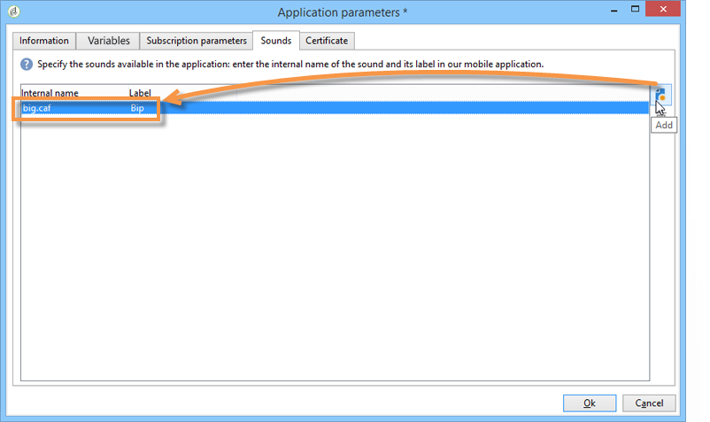
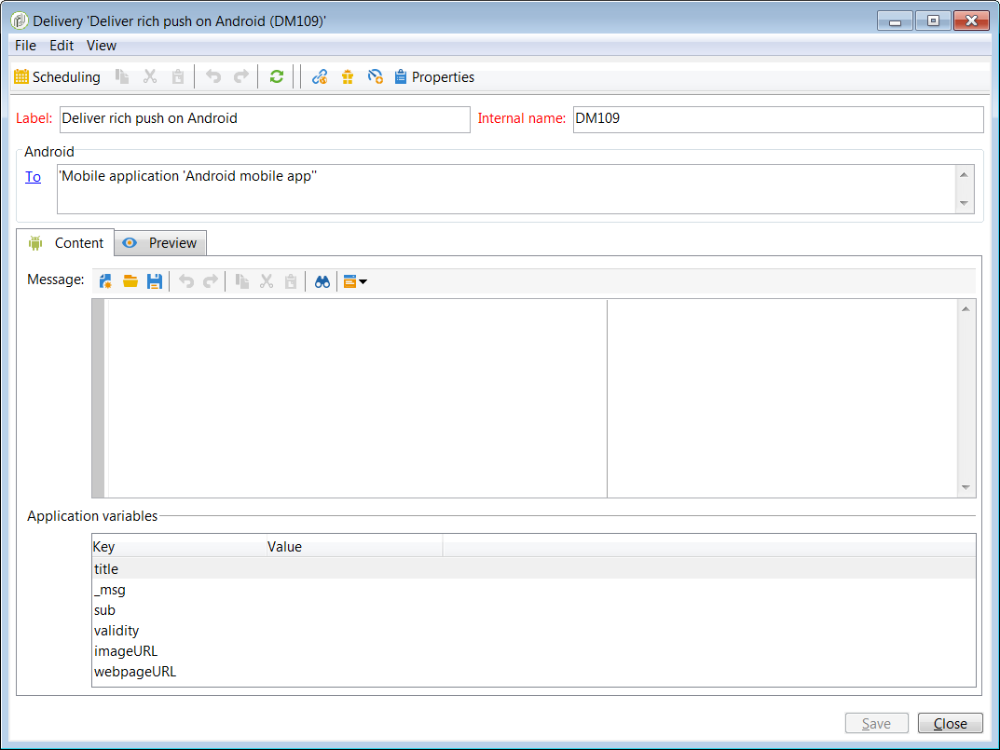

# 모바일 앱 채널 설정{#setting-up-mobile-app-channel}

## 소개 {#introduction}

>[!CAUTION]
>
>모바일 앱 채널 구현은 전문가 사용자가 수행해야 합니다. 도움이 필요한 경우 Adobe 계정 담당자 또는 Professional 서비스 파트너에게 문의하십시오.

모바일 애플리케이션(iOS, Android)의 여러 버전을 만들 수 있습니다.모바일 앱 채널 옵션을 사용하면 애플리케이션이 설치된 터미널에 알림을 보낼 수 있습니다.

Adobe Campaign 모바일 앱 채널의 기능을 사용하려면 모바일 애플리케이션을 변경/조정하여 Adobe Campaign 플랫폼에 통합해야 합니다.

Adobe Campaign과 모바일 애플리케이션을 쉽게 통합하기 위해 Android용 Campaign Classic SDK 및 iOS용 SDK가 두 개 제공됩니다. Java 및 Objective-C에 대한 전문적인 지식이 필요합니다. Campaign SDK에 대한 자세한 설명은 Campaign SDK [를 모바일 애플리케이션에](#integrating-campaign-sdk-into-the-mobile-application)통합에서 찾을 수 있습니다.

>[!NOTE]
>
>Adobe Campaign에서 제공하는 라이브러리는 Xcode(iOS) 및 Android Studio(Android)와 함께 사용하도록 설계되었습니다.

## 커넥터 {#connectors}

### iOS 커넥터 {#ios-connectors}

iOS의 경우 다음 두 개의 커넥터를 사용할 수 있습니다.

* iOS 바이너리 커넥터는 레거시 바이너리 APNS 서버에 알림을 전송합니다.
* iOS HTTP/2 커넥터는 HTTP/2 APNS에 알림을 전송합니다.

사용할 커넥터를 선택하려면 다음 단계를 따르십시오.

1. 로 **[!UICONTROL Administration > Platform > External accounts]**&#x200B;이동합니다.
1. iOS 라우팅 외부 계정을 선택합니다.
1. 탭에서 **[!UICONTROL Connector]** **[!UICONTROL Access URL of the connector]** 필드를 채웁니다.

   iOS 바이너리:https://localhost:8080/nms/jsp/ios.jsp

   iOS HTTP2의 경우:http://localhost:8080/nms/jsp/iosHTTP2.jsp

   

### Android 커넥터 {#android-connectors}

Android의 경우 다음 두 개의 커넥터를 사용할 수 있습니다.

* MTA 자식에 대해 하나의 연결을 허용하는 V1 커넥터입니다.
* FCM 서버에 대한 동시 연결을 통해 처리량을 향상시키는 V2 커넥터

사용할 커넥터를 선택하려면 다음 단계를 따르십시오.

1. 로 **[!UICONTROL Administration > Platform > External accounts]**&#x200B;이동합니다.
1. 외부 계정을 **[!UICONTROL Android routing]** 선택합니다.
1. 탭에서 **[!UICONTROL Connector]** **[!UICONTROL JavaScript used in the connector]** 필드를 채웁니다.

   Android V1의 경우:https://localhost:8080/nms/jsp/androidPushConnector.js

   Android V2의 경우:https://localhost:8080/nms/jsp/androidPushConnectorV2.js

   

1. Android V2의 경우 Adobe Server 구성 파일(serverConf.xml)에서 다음 매개 변수 하나를 추가로 사용할 수 있습니다.

   * **maxGCMConnectPerChild**:각 자식 서버에서 시작한 FCM에 대한 병렬 HTTP 요청의 최대 제한(기본적으로 8개).

## 구성 단계 {#configuration-steps}

### 응용 프로그램 만들기 {#creating-the-application}

모바일 애플리케이션(앱)이 없는 경우 애플리케이션 개발자는 이를 만들어 SDK를 통합해야 합니다. 모바일 애플리케이션이 존재하는 경우, 개발자는 Adobe Campaign SDK를 통합하고 서비스 전용 설정을 추가하여 이를 조정해야 합니다. SDK에 대한 설명은 Campaign SDK [를 모바일 애플리케이션에](#integrating-campaign-sdk-into-the-mobile-application)통합을 참조하십시오.

>[!CAUTION]
>
>Adobe Campaign SDK와 통합하기 전에 푸시 작업에 대해 애플리케이션이 구성되어야 합니다.
>
>그렇지 않은 경우 [이 페이지를](https://developer.apple.com/library/archive/documentation/NetworkingInternet/Conceptual/RemoteNotificationsPG/)참조하십시오.

### 정보 수집 {#collecting-information-}

애플리케이션을 구성하려면 Adobe Campaign 및 모바일 애플리케이션이 통신할 수 있도록 매개 변수 세트를 정의하는 기술 사양을 수집해야 합니다. 이러한 매개 변수는 다음과 같습니다.

* **통합 키**:각 애플리케이션에는 고유한 키가 있습니다. 이 키를 사용하면 Adobe Campaign 서비스와 모바일 애플리케이션을 연결할 수 있습니다. 일반 [정보를](#general-information)참조하십시오.
* **변수**:알림을 활성화할 때 응용 프로그램의 동작을 정의합니다. 일반 [정보를](#general-information)참조하십시오.
* **구독 설정**:기본적으로 Adobe Campaign은 **@userKey** 필드를 복구하여 모바일 장치를 데이터베이스의 수신자와 조정할 수 있도록 합니다. 추가 데이터(예: 복잡한 조정 키)를 수집하려면 구독 설정을 정의할 수 있습니다. 구독 [설정을](#subscription-settings)참조하십시오.
* **사운드** (iOS만 해당):선택한 사운드가 시스템 사운드가 아닌 경우 사운드 파일을 모바일 애플리케이션에 포함해야 합니다. 애플리케이션 [사운드를](#application-sounds)참조하십시오.
* **마케팅 서버 및 추적 서버의** URL:adobe Campaign 관리자는 애플리케이션 개발자에게 마케팅 서버의 URL과 추적 서버의 URL을 제공해야 합니다. 자세한 내용은 다음을 참조하십시오.Campaign [SDK를 모바일 애플리케이션에](#integrating-campaign-sdk-into-the-mobile-application)통합합니다.

### 서비스 만들기 {#creating-the-service}

Adobe Campaign 관리자는 모바일 애플리케이션에 연결된 서비스를 만들고 구성해야 합니다. 자세한 내용은 Adobe Campaign에서 [모바일 애플리케이션 구성을 참조하십시오](#configuring-the-mobile-application-in-adobe-campaign).

### 애플리케이션 테스트 {#testing-the-application}

iOS에서는 테스트 및 승인에 샌드박스 모드를 사용하는 응용 프로그램을 만들어야 합니다. 그런 다음 동일한 Adobe Campaign 서비스 내에서 새 제작 유형 애플리케이션을 만들고 관련 인증서를 입력합니다. 자세한 내용은 Apple 알림 서비스의 설명서를 참조하십시오.

Android에서는 하나의 애플리케이션만 만들어야 합니다. 애플리케이션을 공개하기 전에 전체 구독 및 전달 수집 프로세스를 테스트합니다.

## 데이터 경로 {#data-path}

다음 스키마는 모바일 응용 프로그램이 Adobe Campaign과 데이터를 교환하도록 하는 단계를 자세히 설명합니다. 이 프로세스에는 다음 세 개의 개체가 포함됩니다.

* 모바일 애플리케이션
* 알림 서비스:Apple용 APNS(Apple Push Notification 서비스) 및 Android용 FCM(Firebase Cloud Messaging)
* Adobe Campaign

알림 프로세스의 세 가지 주요 단계는 다음과 같습니다.adobe Campaign(구독 컬렉션), 게재 및 추적의 애플리케이션 등록

### 1단계:구독 컬렉션 {#step-1--subscription-collection}

모바일 응용 프로그램은 사용자가 App Store 또는 Google Play에서 다운로드합니다. 이 응용 프로그램에는 연결 설정(Android용 iOS 인증서 및 프로젝트 키)과 통합 키가 포함되어 있습니다. 구성에 따라 처음 응용 프로그램을 열 때 사용자에게 등록 정보 입력(@userKey:이메일 또는 계정 번호 참조). 동시에 응용 프로그램은 알림 ID(푸시 ID)를 수집하기 위해 알림 서비스에 질문을 합니다. 이 모든 정보(연결 설정, 통합 키, 알림 식별자, userKey)는 Adobe Campaign으로 전송됩니다.


### 2단계:전달 {#step-2--delivery}

마케터는 애플리케이션 가입자를 타깃팅합니다. 배달 프로세스는 알림 서비스(Android용 iOS 인증서 및 프로젝트 키), 알림 ID(푸시 ID) 및 알림의 컨텐츠로 연결 설정을 전송합니다. 알림 서비스는 타깃팅된 터미널에 알림을 보냅니다.

Adobe Campaign에서 다음 정보를 사용할 수 있습니다.

* Android만 해당:알림을 표시한 장치 수(노출 수)
* Android 및 iOS:알림에 대한 클릭 수


Adobe Campaign 서버는 다음 포트에서 APNS 서버에 연결할 수 있어야 합니다.

* iOS 이진 커넥터에 대한 2195(전송) 및 2186(피드백 서비스)
* iOS HTTP/2 커넥터용 443

제대로 작동하는지 확인하려면 다음 명령을 사용합니다.

* 테스트의 경우:

   ```
   telnet gateway.sandbox.push.apple.com
   ```

* 제작 중:

   ```
   telnet gateway.push.apple.com
   ```

iOS 바이너리 커넥터를 사용하는 경우 MTA 및 웹 서버는 포트 2195(전송)의 APNS에 연결할 수 있어야 하며, 워크플로우 서버는 포트 2196(피드백 서비스)의 APNS에 연결할 수 있어야 합니다.

iOS HTTP/2 커넥터를 사용하는 경우 MTA, 웹 서버 및 워크플로우 서버는 포트 443의 APNS에 연결할 수 있어야 합니다.

## 모바일 애플리케이션에 Campaign SDK 통합 {#integrating-campaign-sdk-into-the-mobile-application}

iOS 및 Android용 캠페인 SDK는 모바일 앱 채널 모듈의 구성 요소 중 하나입니다.

>[!NOTE]
>
>Campaign SDK(이전의 Neolane SDK)를 받으려면 Adobe 고객 지원 센터에 문의하십시오.

SDK의 목표는 모바일 애플리케이션을 Adobe Campaign 플랫폼에 쉽게 통합하는 것입니다.

지원되는 다양한 Android 및 iOS 버전에 대한 자세한 내용은 호환성 [매트릭스를](https://helpx.adobe.com/campaign/kb/compatibility-matrix.html#MobileSDK) 참조하십시오.

### 캠페인 SDK 로드 {#loading-campaign-sdk}

* **Android**:neolane_ **sdk-release.aar** 파일은 프로젝트에 연결되어 있어야 합니다.

   다음 권한은 Adobe Campaign 서버에 대한 액세스 권한을 부여합니다.

   ```
   Neolane.getInstance().setIntegrationKey("your Adobe mobile app integration key");
   Neolane.getInstance().setMarketingHost("https://yourMarketingHost:yourMarketingPort/");
   Neolane.getInstance().setTrackingHost("https://yourTrackingHost:yourTrackingPort/");
   ```

   다음 권한을 통해 전화의 고유 ID를 복구할 수 있습니다.

   ```
   <uses-permission android:name="android.permission.READ_PHONE_STATE" /> 
   ```

   SDK 버전 1.0.24부터 이 권한은 Android 6.0 이전 버전에만 사용됩니다.

   SDK 버전 1.0.26에서 이 권한은 더 이상 사용되지 않습니다.

* **iOS에서**:lib **NeolaneSDK.a** 및 **Neolane_SDK.h** 파일은 프로젝트에 연결되어 있어야 합니다. SDK 버전 1.0.24부터 ENABLE_ **BITCODE 옵션이** 활성화됩니다.

   >[!NOTE]
   >
   >SDK 버전 1.0.25의 경우 Neolane_SDK. **h** 파일에서 4개의 아키텍처를 사용할 수 있습니다.

### 통합 설정 선언 {#declaring-integration-settings}

Campaign SDK를 모바일 애플리케이션에 통합하려면 기능 관리자가 개발자에게 다음 정보를 제공해야 합니다.

* **통합 키**:을 클릭하여 Adobe Campaign 플랫폼을 활성화하여 모바일 애플리케이션을 식별합니다.

   >[!NOTE]
   >
   >이 통합 키는 모바일 애플리케이션 전용 서비스의 **[!UICONTROL Information]** 탭에 있는 Adobe Campaign 콘솔에 입력됩니다. 일반 [정보를](#general-information)참조하십시오.

* **추적 URL**:는 Adobe Campaign 추적 서버의 주소와 일치합니다.
* **마케팅 URL**:를 클릭하여 구독을 활성화합니다.

* **Android**:

   ```
   Neolane.getInstance().setIntegrationKey("your Adobe mobile app integration key");
   Neolane.getInstance().setMarketingHost("https://yourMarketingHost:yourMarketingPort/");
   Neolane.getInstance().setTrackingHost("https://yourTrackingHost:yourTrackingPort/"); 
   ```

* **iOS에서**:

   ```
   Neolane_SDK *nl = [Neolane_SDK getInstance];
   [nl setMarketingHost:strMktHost];
   [nl setTrackingHost:strTckHost];
   [nl setIntegrationKey:strIntegrationKey];
   ```

### 등록 함수 {#registration-function}

등록 기능을 사용하면 다음 작업을 수행할 수 있습니다.

* 알림 ID 또는 푸시 ID(iOS용 deviceToken 및 Android용 registrationID)를 Adobe Campaign에 보냅니다.
* 조정 키 또는 userKey 복구(예: 이메일 또는 계정 번호)

* **Android**:

   ```
   void registerInNeolane(String registrationId, String userKey, Context context)
   {
    try{
     Neolane.getInstance().registerDevice(registrationToken, userKey, null, context);
    } catch (NeolaneException e){
     //...
    } catch (IOException e){
     //...
    }
   }
   ```

   FCM(Firebase Cloud Messaging)을 사용하는 경우 **onTokenRefresh** 함수를 호출할 때 **registerDevice** 함수를 사용하여 사용자의 모바일 장치 토큰의 변경 사항을 Adobe Campaign에 알릴 것을 권장합니다.

   ```
   public class NeoTripFirebaseInstanceIDService extends FirebaseInstanceIdService {
     @Override
     public void onTokenRefresh() {
       String registrationToken = FirebaseInstanceId.getInstance().getToken();
       NeolaneAsyncRunner neolaneAs = new NeolaneAsyncRunner(Neolane.getInstance());
       ...
       ...
       // Neolane Registration
       neolaneAs.registerDevice(registrationToken, userKey, additionnalParam, this, new NeolaneAsyncRunner.RequestListener() {
       public void onComplete(String e, Object state) { ... }
       public void onNeolaneException(NeolaneException e, Object state) { ... }
       public void onIOException(IOException e, Object state) { ... }
       });
       ...
       ...
     }
   }
   ```

* **iOS에서**:

   ```
   // Callback called on successful registration to the APNS
   - (void)application:(UIApplication*)application didRegisterForRemoteNotificationsWithDeviceToken:(NSData*)deviceToken
   {
       // Pass the token to Adobe Campaign
       Neolane_SDK *nl = [Neolane_SDK getInstance];
       [nl registerDevice:tokenString:self.userKey:dic];
   }
   ```

### 추적 함수 {#tracking-function}

* **Android**:

   추적 기능을 사용하면 알림 활성화(열기)와 알림 표시(스크린샷)를 추적할 수 있습니다.

   알림 표시를 추적하려면(SDK의 **notifyReceive** 함수를 호출하여 완료) 아래 구현을 따르십시오. FCM(Firebase Cloud Messaging)을 사용하는 경우 Android 시스템에서 **onMessageReceived** 함수를 호출할 **때** notifyReceive 함수를 사용하는 것이 좋습니다.

   ```
   package com.android.YourApplication;
   
   import android.content.Context;
   import android.content.SharedPreferences;
   import android.os.Bundle;
   import android.util.Log;
   
   import com.google.firebase.messaging.FirebaseMessagingService;
   import com.google.firebase.messaging.RemoteMessage;
   
   import java.util.Iterator;
   import java.util.Map;
   import java.util.Map.Entry;
   
   public class YourApplicationFirebaseMessagingService extends FirebaseMessagingService {
     private static final String TAG = "MyFirebaseMsgService";
   
     @Override
     public void onMessageReceived(RemoteMessage message) {
       Log.d(TAG, "Receive message from: " + message.getFrom());
       Map<String,String> payloadData = message.getData();
       final Bundle extras = new Bundle();
       final Iterator<Entry<String, String>> iter = payloadData.entrySet().iterator();
       while(iter.hasNext())
       {
         final Entry<String, String>  entry =iter.next();
         extras.putString(entry.getKey(), entry.getValue());
       }
   
       SharedPreferences settings = this.getSharedPreferences(YourApplicationActivity.APPLICATION_PREF_NAME, Context.MODE_PRIVATE);
       String mesg = payloadData.get("_msg");
       String title = payloadData.get("title");
       String url = payloadData.get("url");
       String messageId = payloadData.get("_mId");
       String deliveryId = payloadData.get("_dId");
       YourApplicationActivity.handleNotification(this, mesg, title, url, messageId, deliveryId, extras);
     }
   }
   ```

   ```
   public static void handleNotification(Context context, String message, String title, String url, String messageId, String deliveryId, Bundle extras){
       if( message == null ) message = "No Content";
       if( title == null )   title = "No title";
       if( url == null )     url = "https://www.tripadvisor.fr";
       int iconId = R.drawable.notif_neotrip;
   
       // notify Neolane that a notification just arrived
       NeolaneAsyncRunner nas = new NeolaneAsyncRunner(Neolane.getInstance());
       nas.notifyReceive(Integer.valueOf(messageId), deliveryId, new NeolaneAsyncRunner.RequestListener() {
         public void onNeolaneException(NeolaneException arg0, Object arg1) {}
         public void onIOException(IOException arg0, Object arg1) {}
         public void onComplete(String arg0, Object arg1){}
       });
       if (yourApplication.isActivityVisible())
       {
         Log.i("INFO", "The application has the focus" );
         ...
       }
       else
       {
         // notification creation :
         NotificationManager notificationManager = (NotificationManager) context.getSystemService(Context.NOTIFICATION_SERVICE);
         Notification notification;
   
         // Activity to start :
         Intent notifIntent = new Intent(context.getApplicationContext(), NotificationActivity.class);
         notifIntent.putExtra("notificationText", message);
         notifIntent.putExtra(NotificationActivity.NOTIFICATION_URL_KEYNAME, url);
         notifIntent.putExtra("_dId", deliveryId);
         notifIntent.putExtra("_mId", messageId);
         notifIntent.addFlags(Intent.FLAG_ACTIVITY_NEW_TASK);
         PendingIntent contentIntent = PendingIntent.getActivity(context, 1, notifIntent, PendingIntent.FLAG_UPDATE_CURRENT);
   
         notification = new Notification.Builder(context)
                 .setContentTitle(title)
                 .setContentText(message)
                 .setSmallIcon(iconId)
                 .setContentIntent(contentIntent)
                 .build();
   
         // launch the notification :
         notification.flags |= Notification.FLAG_AUTO_CANCEL;
         notificationManager.notify(Integer.valueOf(messageId), notification);
       }
   }
   ```

   다음은 열린 알림 추적을 위한 구현 예입니다(SDK의 notifyOpening **함수를 호출하여** 실행됨). NotificationActivity **클래스는** 이전 예제에서 **notifIntent** 개체를 만드는 데 사용되는 클래스에 해당합니다.

   ```
   public class NotificationActivity extends Activity {
    public static final String NOTIFICATION_URL_KEYNAME = "NotificationUrl";
    .....
    public void onCreate(Bundle savedBundle) {
     super.onCreate(savedBundle);
     setContentView(R.layout.notification_viewer);  
     .....  
     Bundle extra = getIntent().getExtras();  
     .....  
     //get the messageId and the deliveryId to do the tracking  
     String deliveryId = extra.getString("_dId");
     String messageId = extra.getString("_mId");
     if (deliveryId != null && messageId != null) {
      NeolaneAsyncRunner neolaneAs = new NeolaneAsyncRunner(Neolane.getInstance());
      neolaneAs.notifyOpening(Integer.valueOf(messageId), deliveryId, new NeolaneAsyncRunner.RequestListener() {
       public void onNeolaneException(NeolaneException arg0, Object arg1) {}
       public void onIOException(IOException arg0, Object arg1) {}
       public void onComplete(String arg0, Object arg1) {}
       });
     }
    }
   }
   ```

* **iOS에서**:

   추적 기능을 사용하면 알림이 활성화되는 시간(열기)을 추적할 수 있습니다.

   ```
   (void)application:(UIApplication *)application didReceiveRemoteNotification:(NSDictionary *)launchOptions
   fetchCompletionHandler:(void (^)(UIBackgroundFetchResult))completionHandler
   {
   if( launchOptions ) { // Retrieve notification parameters here ... // Track application opening Neolane_SDK
   *nl = [Neolane_SDK getInstance]; [nl track:launchOptions:NL_TRACK_CLICK]; } 
   ...  
   completionHandler(UIBackgroundFetchResultNoData);
   }
   ```

   >[!NOTE]
   >
   >버전 7.0에서 **application:didReceiveRemoteNotification:fetchCompletionHandler** 함수가 구현되면 운영 체제에서 이 함수를 호출합니다. 따라서 **application:didReceiveRemoteNotification** 함수가 호출되지 않습니다.

### 자동 알림 추적 {#silent-notification-tracking}

iOS를 사용하면 자동 알림, 알림 또는 데이터를 전송하여 표시하지 않고 모바일 애플리케이션으로 바로 전송할 수 있습니다. Adobe Campaign을 통해 추적할 수 있습니다.

자동 알림을 추적하려면 아래 예를 따르십시오.

```
// AppDelegate.m
...
...
#import "AppDelegate.h"
#import "Neolane_SDK.h"
...
...
// Callback called when the application is already launched (whether the application is running foreground or background)
- (void)application:(UIApplication *)application didReceiveRemoteNotification:(NSDictionary *)launchOptions fetchCompletionHandler:(void (^)(UIBackgroundFetchResult))completionHandler
{
 NSLog(@"IN didReceiveRemoteNotification:fetchCompletionHandler");
 if (launchOptions) NSLog(@"IN launchOptions: %@", [launchOptions description]);
 NSLog(@"Application state: %ld", (long)application.applicationState);

 // Silent Notification (specific case, can use NL_TRACK_RECEIVE as the user doesn't have click/open the notification)
 if ([launchOptions[@"aps"][@"content-available"] intValue] == 1 )
       {
  NSLog(@"Silent Push Notification");
  ...  
  ...
  //Call receive tracking
        Neolane_SDK *nl = [Neolane_SDK getInstance];
  [nl track:launchOptions:NL_TRACK_RECEIVE];

  completionHandler(UIBackgroundFetchResultNoData); //Do not show notification
  return;
 }  
 ...
 ...
        completionHandler(UIBackgroundFetchResultNoData);
}
```

### RegisterDeviceStatus 위임 {#registerdevicestatus-delegate}

>[!NOTE]
>
>iOS에서만 사용할 수 있습니다.

iOS에서 위임 프로토콜을 사용하면 **registerDevice** 호출 결과를 얻을 수 있으며 등록 중 오류가 발생했는지 여부를 확인하는 데 사용할 수 있습니다.

registerDeviceStatus **프로토타입은** 다음과 같습니다.

```
- (void) registerDeviceStatus: (ACCRegisterDeviceStatus) status:(NSString *) errorReason;
```

**상태를** 사용하면 등록에 성공했는지 또는 오류가 발생했는지 알 수 있습니다.

**ErrorReason** 은 발생한 오류에 대한 자세한 정보를 제공합니다. 사용 가능한 오류 및 설명에 대한 자세한 내용은 아래 표를 참조하십시오.

<table> 
 <thead>
  <tr>
   <th> 상태<br /> </th>
   <th> 설명<br /> </th>
   <th> ErrorReason<br /> </th>
  </tr>
 </thead>
 <tbody>
  <tr>
   <td> ACCReisterDeviceStatusSuccess <br /> </td>
   <td> 등록 성공<br /> </td>
   <td> 비어 있음<br /> </td>
  </tr>
  <tr> 
   <td> ACCRegisterDeviceStatusFailureMarketingServerHostnameEmpty <br /> </td>
   <td> ACC 마케팅 서버 호스트 이름이 비어 있거나 설정되지 않았습니다.<br /> </td>
   <td> 비어 있음<br /> </td>
  </tr>
  <tr> 
   <td> ACCReisterDeviceStatusFailureIntegrationKeyEmpty <br /> </td>
   <td> 통합 키가 비어 있거나 설정되지 않았습니다.<br /> </td>
   <td> 비어 있음<br /> </td>
  </tr>
  <tr> 
   <td> ACCRegisterDeviceStatusFailureConnectionIssue<br /> </td>
   <td> ACC 연결 문제<br /> </td>
   <td> 자세한 정보(OS 현재 언어)<br /> </td>
  </tr>
  <tr> 
   <td> ACCRegisterDeviceStatusFailureUnknownUUID<br /> </td>
   <td> 제공된 UUID(통합 키)를 알 수 없습니다.<br /> </td>
   <td> 비어 있음<br /> </td>
  </tr>
  <tr> 
   <td> ACCReisterDeviceStatusFailureUnexpectedError<br /> </td>
   <td> ACC 서버에 예기치 않은 오류가 반환되었습니다.<br /> </td>
   <td> ACC에 오류 메시지가 반환되었습니다.<br /> </td>
  </tr>
 </tbody>
</table>

**Neolane_SDKDelegate** 프로토콜 및 **registerDeviceStatus** 위임 정의는 다음과 같습니다.

```
//  Neolane_SDK.h
//  Neolane SDK
..
.. 
// Register Device Status Enum
typedef NS_ENUM(NSUInteger, ACCRegisterDeviceStatus) {
 ACCRegisterDeviceStatusSuccess,                               // Resistration Succeed
 ACCRegisterDeviceStatusFailureMarketingServerHostnameEmpty,   // The ACC marketing server hostname is Empty or not set
 ACCRegisterDeviceStatusFailureIntegrationKeyEmpty,            // The integration key is empty or not set
 ACCRegisterDeviceStatusFailureConnectionIssue,                // Connection issue with ACC, more information in errorReason
 ACCRegisterDeviceStatusFailureUnknownUUID,                    // The provided UUID (integration key) is unknown
 ACCRegisterDeviceStatusFailureUnexpectedError                 // Unexpected error returned by ACC server, more information in errorReason
};
// define the protocol for the registerDeviceStatus delegate
@protocol Neolane_SDKDelegate <NSObject>
@optional
- (void) registerDeviceStatus: (ACCRegisterDeviceStatus) status :(NSString *) errorReason;
@end
@interface Neolane_SDK: NSObject {
} 
...
...
// registerDeviceStatus delegate
@property (nonatomic, weak) id <Neolane_SDKDelegate> delegate;
...
...
@end
```

registerDeviceStatus **위임을 구현하려면** 다음 단계를 따르십시오.

1. SDK **초기화** 중에 setDelegate를 구현합니다.

   ```
   // AppDelegate.m
   ...
   ... 
   - (BOOL)application:(UIApplication *)application didFinishLaunchingWithOptions:(NSDictionary *)launchOptions
   {
   ...
   ...
    // Get the stored settings
   
    NSUserDefaults *defaults = [NSUserDefaults standardUserDefaults];
    NSString *strMktHost = [defaults objectForKey:@"mktHost"];
    NSString *strTckHost = [defaults objectForKey:@"tckHost"];
    NSString *strIntegrationKey = [defaults objectForKey:@"integrationKey"];
    userKey = [defaults objectForKey:@"userKey"];
   
    // Configure Neolane SDK on first launch
    Neolane_SDK *nl = [Neolane_SDK getInstance];
    [nl setMarketingHost:strMktHost];
    [nl setTrackingHost:strTckHost];
    [nl setIntegrationKey:strIntegrationKey];
    [nl setDelegate:self];    // HERE
   ...
   ...
   }
   ```

1. 클래스의 **@interface** 에 프로토콜을 추가합니다.

   ```
   //  AppDelegate.h
   
   #import <UIKit/UIKit.h>
   #import <CoreLocation/CoreLocation.h>
   #import "Neolane_SDK.h"
   
   @class LandingPageViewController;
   
   @interface AppDelegate : UIResponder <UIApplicationDelegate, CLLocationManagerDelegate, Neolane_SDKDelegate> {
       CLLocationManager *locationManager;
       NSString *userKey;
       NSString *mktServerUrl;
       NSString *tckServerUrl;
       NSString *homeURL;
       NSString *strLandingPageUrl;
       NSTimer *timer;
   }
   ```

1. AppDelegate에서 위임 **구현**.

   ```
   //  AppDelegate.m
   
   #import "AppDelegate.h"
   #import "Neolane_SDK.h"
   #import "LandingPageViewController.h"
   #import "RootViewController.h"
   ...
   ...
   - (void) registerDeviceStatus: (ACCRegisterDeviceStatus) status :(NSString *) errorReason
   {
       NSLog(@"registerStatus: %lu",status);
   
       if ( errorReason != nil )
           NSLog(@"errorReason: %@",errorReason);
   
       if( status == ACCRegisterDeviceStatusSuccess )
       {
           // Registration successful
           ...
           ...
       }
       else { // An error occurred
           NSString *message;
           switch ( status ){
               case ACCRegisterDeviceStatusFailureUnknownUUID:
                   message = @"Unkown IntegrationKey (UUID)";
                   break;
               case ACCRegisterDeviceStatusFailureMarketingServerHostnameEmpty:
                   message = @"Marketing URL not set or Empty";
                   break;
               case ACCRegisterDeviceStatusFailureIntegrationKeyEmpty:
                   message = @"Integration Key not set or empty";
                   break;
               case ACCRegisterDeviceStatusFailureConnectionIssue:
                   message = [NSString stringWithFormat:@"%@ %@",@"Connection issue:",errorReason];
                   break;
               case ACCRegisterDeviceStatusFailureUnexpectedError:
               default:
                   message = [NSString stringWithFormat:@"%@ %@",@"Unexpected Error",errorReason];
                   break;
           }
    ...
    ...
       }
   }
   @end
   ```

### 변수 {#variables}

이 변수를 사용하면 알림을 받은 후 모바일 애플리케이션 동작을 정의할 수 있습니다. 이러한 변수는 모바일 애플리케이션 코드와 Adobe Campaign 콘솔의 전용 모바일 애플리케이션 서비스 **[!UICONTROL Variables]** 탭에서 정의해야 합니다(일반 [정보](#general-information)참조). 다음은 모바일 애플리케이션에서 알림의 추가된 변수를 수집할 수 있도록 하는 코드의 예입니다. 이 예에서는 &quot;VAR 파섹&quot; 변수를 사용합니다.

* **Android**:

   ```
   public void onReceive(Context context, Intent intent) {
        ...
       String event = intent.getStringExtra("VAR");
        ...
   }
   ```

* **iOS에서**:

   ```
   - (BOOL)application:(UIApplication *)application didFinishLaunchingWithOptions:(NSDictionary *)launchOptions
   {
       ....
       if( launchOptions )
       {
           // When application is not already launched, the notification data if any are stored in the key 'UIApplicationLaunchOptionsRemoteNotificationKey'
           NSDictionary *localLaunchOptions = [launchOptions objectForKey:@"UIApplicationLaunchOptionsRemoteNotificationKey"];
           if( localLaunchOptions )
           {
            ...
            [localLaunchOptions objectForKey:@"VAR"];
           ...
           }
      }
   }
   
   // Callback called when the application is already launched (whether the application is running foreground or background)
   - (void)application:(UIApplication *)application didReceiveRemoteNotification:(NSDictionary *)launchOptions
   {
       if( launchOptions )
       {
        ...
           [launchOptions objectForKey:@"VAR"];
       }
   }
   ```

>[!CAUTION]
>
>iOS 및 Android의 경우 알림 크기가 4kB로 제한되므로 짧은 변수 이름을 선택하는 것이 좋습니다.

## Adobe Campaign에서 모바일 애플리케이션 구성 {#configuring-the-mobile-application-in-adobe-campaign}

온라인 휴일 패키지를 판매하는 회사를 기반으로 구성 샘플을 아래에서 찾을 수 있습니다. 모바일 애플리케이션(등록 트립)은 두 가지 버전으로 고객에게 제공됩니다.Android용 Neotrips 및 iOS용 Neotrips Adobe Campaign에서 모바일 애플리케이션을 구성하려면 다음을 수행해야 합니다.

1. Neotrips 모바일 응용 프로그램의 **[!UICONTROL Mobile application]** 유형 [정보 서비스를](#creating-the-service-and-collecting-subscriptions) 만듭니다.
1. 이 서비스에 애플리케이션의 iOS 및 Android 버전을 추가합니다.


>[!NOTE]
>
>서비스의 **[!UICONTROL Subscriptions]** 탭으로 이동하여 해당 서비스의 가입자 목록을 봅니다. 즉, 해당 애플리케이션을 모바일에 설치했고 알림을 수신하기로 동의한 모든 사람입니다.

### 서비스 만들기 및 구독 수집 {#creating-the-service-and-collecting-subscriptions}

1. 노드로 **[!UICONTROL Profiles and Targets > Services and subscriptions]** 이동하고 을 클릭합니다 **[!UICONTROL New]**.

   

1. a **[!UICONTROL Label]** 및 an을 **[!UICONTROL Internal name]**&#x200B;정의합니다.
1. 필드로 이동하여 **[!UICONTROL Type]** 선택합니다 **[!UICONTROL Mobile application]**.

   >[!NOTE]
   >
   >기본 **[!UICONTROL Subscriber applications (nms:appSubscriptionRcp)]** 대상 매핑은 수신자 테이블에 연결됩니다. 다른 대상 매핑을 사용하려면 새 대상 매핑을 만들고 서비스의 **[!UICONTROL Target mapping]** 필드에 입력해야 합니다. 대상 매핑 만들기에 대한 자세한 내용은 구성 [안내서를](../../configuration/using/about-custom-recipient-table.md)참조하십시오.

1. 그런 다음 **[!UICONTROL Add]** 단추를 클릭하여 모바일 응용 프로그램의 다양한 버전(iOS, Android)을 정의합니다.

   

각 버전에 대한 구성 단계에 대한 자세한 내용은 아래를 참조하십시오.

>[!NOTE]
>
>iOS 응용 프로그램을 만들 때 마법사에서 응용 프로그램의 개발 버전(샌드박스)과 프로덕션 버전을 구성할 것을 초대합니다. 애플리케이션이 만들어지면 두 버전의 애플리케이션이 추가됩니다.

### 일반 정보 {#general-information}


1. 을 입력하여 **[!UICONTROL Label]**&#x200B;시작합니다.
1. Adobe Campaign과 애플리케이션 코드(SDK를 통해)에서 동일한지 확인합니다. **[!UICONTROL Integration key]** 자세한 내용은 다음을 참조하십시오.Campaign [SDK를 모바일 애플리케이션에](#integrating-campaign-sdk-into-the-mobile-application)통합합니다. 각 응용 프로그램에만 적용되는 이 통합 키를 사용하면 모바일 응용 프로그램을 Adobe Campaign 플랫폼에 연결할 수 있습니다.
1. 응용 프로그램에서 응용 프로그램 아이콘(알림의 왼쪽 위 모서리)을 처리하는 경우 미리 보기가 실제 배달 스타일에 더 충실하도록 여기에 추가할 수 있습니다. 컨텐츠에 이미지를 추가하려면(리치 알림) [알림](#rich-notifications) 섹션을 참조하십시오.

   >[!CAUTION]
   >
   >iOS의 경우 이미지 해상도가 48x48픽셀입니다.

1. Android의 경우 응용 프로그램의 연결 설정을 입력합니다.모바일 애플리케이션 개발자가 제공한 프로젝트 키를 입력합니다.
1. 그런 다음 애플리케이션 변수를 입력합니다.

   

   변수를 사용하면 알림을 받은 후 애플리케이션 행동을 정의할 수 있습니다.예를 들어 사용자가 알림을 활성화하면 응용 프로그램 특정 화면이 나타나도록 구성할 수 있습니다. 이러한 변수는 모바일 응용 프로그램의 코드에 정의해야 합니다. 단추를 클릭하여 Adobe Campaign에 추가합니다. **[!UICONTROL Add]**

   배달 마법사를 사용하여 이러한 변수의 값을 정의할 수 있습니다. 알림 [만들기를](../../delivery/using/creating-notifications.md)참조하십시오.

### 구독 설정 {#subscription-settings}

>[!NOTE]
>
>이 탭은 추가 데이터를 수집하려는 경우에만 구성해야 합니다.


기본적으로 Adobe Campaign은 **[!UICONTROL User identifier]** 테이블의 **[!UICONTROL Subscriber applications (nms:appSubscriptionRcp)]** (@userKey) 필드에 키를 저장합니다. 이 키를 사용하면 구독을 수신자에게 연결할 수 있습니다. 추가 데이터(예: 복잡한 조정 키)를 수집하려면 다음 구성을 적용해야 합니다.

1. 스키마의 확장을 **[!UICONTROL Subscriber applications (nms:appsubscriptionRcp)]** 만들고 새 필드를 정의합니다.
1. 탭에서 매핑을 **[!UICONTROL Subscription parameters]** 정의합니다.

   >[!CAUTION]
   >
   >탭의 구성 이름이 모바일 애플리케이션 코드의 구성 이름과 동일한지 **[!UICONTROL Subscription parameters]** 확인하십시오. 모바일 애플리케이션에 [Campaign SDK](#integrating-campaign-sdk-into-the-mobile-application) 통합 섹션을 참조하십시오.

### 애플리케이션 사운드 {#application-sounds}

>[!NOTE]
>
>이 탭은 iOS 버전의 응용 프로그램에서만 사용할 수 있습니다.



iOS 응용 프로그램에 포함된 사운드가 있는 경우 이 탭을 사용하여 사운드를 추가합니다. 그런 다음 전달 마법사를 사용하여 알림을 받을 때 재생할 사운드 중 하나를 선택할 수 있습니다. 자세한 내용은 iOS에서 알림 [전송을 참조하십시오](../../delivery/using/creating-notifications.md#sending-notifications-on-ios).

>[!NOTE]
>
>시스템 사운드는 이 화면에서도 정의할 수 있습니다.

화면에서 **[!UICONTROL Application setting]** **[!UICONTROL Internal name]** 필드는 응용 프로그램에 포함된 파일의 이름이나 시스템 사운드 이름을 포함해야 합니다. 필드에 입력한 값이 배달 **[!UICONTROL Label]** 마법사의 **[!UICONTROL Play a sound]** 드롭다운 목록에 나타납니다.

### 인증서 {#certificate}

>[!NOTE]
>
>이 탭은 iOS 버전의 응용 프로그램에서만 사용할 수 있습니다.

이 화면에서 응용 프로그램 연결 설정을 입력합니다.


링크를 클릭한 다음 인증 인증서를 선택하고 모바일 애플리케이션 개발자가 제공한 암호를 입력합니다 **[!UICONTROL Enter the certificate...]** .

>[!NOTE]
>
>개발 버전(샌드박스)과 응용 프로그램의 프로덕션 버전에 동일한 인증서를 사용하지 않도록 하십시오.

## 풍부한 알림 {#rich-notifications}

풍부한 알림을 통해 이미지, 비디오 등과 같은 알림에 다른 유형의 미디어를 포함할 수 있습니다.

### Android {#android}

Adobe Campaign을 사용하면 컨텐츠 외에 애플리케이션 변수를 정의할 수 있습니다(Android에서 알림 [보내기 참조](../../delivery/using/creating-notifications.md#sending-notifications-on-android)). 이러한 변수를 사용하여 모바일 애플리케이션에 대한 이미지 URL과 같은 정보를 제공할 수 있습니다. 그런 다음 모바일 애플리케이션에서 사용자 지정 알림을 생성할 수 있습니다.

먼저 Adobe Campaign에서 모바일 애플리케이션을 만들고 해당 애플리케이션에 대한 애플리케이션 변수를 정의해야 합니다.

1. > **[!UICONTROL Profiles and Targets]** 로 **[!UICONTROL Services and Subscriptions]**&#x200B;이동합니다.
1. 서비스를 **[!UICONTROL New]** 만들려면 을 클릭합니다.
1. 탭에서 **[!UICONTROL Edit]** 로 **[!UICONTROL Mobile application]** 선택하고 **[!UICONTROL Type]** (nms:appSubscriptionRcp)를 **[!UICONTROL Subscriber application]** **[!UICONTROL Target mapping]**&#x200B;선택합니다.
1. 에서 **[!UICONTROL List of mobile applications that use the service]**&#x200B;새 응용 프로그램을 추가하고 **[!UICONTROL Create an Android application]**&#x200B;선택합니다.
1. 클릭 **[!UICONTROL Next]**.
1. 만들기 마법사의 **[!UICONTROL Information]** 탭에서 레이블을 입력합니다.
1. 필드에서 **[!UICONTROL Application variables]** 리치 푸시를 전송하는 데 사용할 매개 변수를 추가합니다.

   * title
   * sub
   * 유효성
   * imageURL
   * webpageURL

1. 서비스를 **[!UICONTROL Finish]** 클릭하여 저장합니다.

   

그런 다음 새 배달 템플릿을 만들어 만든 모바일 애플리케이션에 연결해야 합니다.

1. > **[!UICONTROL Resources]** > **[!UICONTROL Templates]** > **[!UICONTROL Delivery templates]**&#x200B;로 이동합니다.
1. 템플릿을 **[!UICONTROL Deliver on Android]** 복제합니다.
1. 레이블을 변경하고 을 클릭합니다 **[!UICONTROL Continue]**.
1. 응용 프로그램의 가입자를 타게팅하려면 **[!UICONTROL To]** 링크를 클릭합니다.
1. 를 (으)로 **[!UICONTROL Target mapping]** 변경합니다 **[!UICONTROL Subscriber applications (nms:appSubscriptionRcp)]**.

   

1. 을 **[!UICONTROL Add]**&#x200B;클릭하고 **[!UICONTROL Subscribers of an Android mobile application]** 선택한 다음 을 클릭합니다 **[!UICONTROL Next]**.
1. 레이블을 입력하고 만든 서비스와 이 서비스 내에서 만든 모바일 응용 프로그램을 선택합니다.

   

1. 클릭 **[!UICONTROL Finish]**.

모바일 애플리케이션 내에서 만든 매개 변수가 애플리케이션 변수 **필드에** 표시됩니다.



마지막으로 새 Android 배달을 만들고 모바일 응용 프로그램에서 정의한 매개 변수에 대해 원하는 값을 추가합니다.

1. > **[!UICONTROL Campaign management]** 로 **[!UICONTROL Deliveries]**&#x200B;이동합니다.
1. 클릭 **[!UICONTROL New]**.
1. 방금 만든 배달 템플릿을 선택하고 **[!UICONTROL Continue]**&#x200B;클릭합니다.
1. 필드에서 다른 매개 변수에 대해 원하는 값을 추가합니다. **[!UICONTROL Application variables]**

   

1. 전달을 클릭하고 **[!UICONTROL Save]** 보냅니다.

구독자의 모바일 Android 장치에서 수신할 때 푸시 알림에 이미지 및 웹 페이지가 표시되어야 합니다.

### iOS {#ios}

iOS 10 이상에서는 다양한 알림을 생성할 수 있습니다. Adobe Campaign은 장치가 리치 알림을 표시할 수 있도록 해주는 변수를 사용하여 알림을 전송할 수 있습니다.

>[!NOTE]
>
>리치 알림을 사용하려면 iOS HTTP/2 커넥터를 사용해야 합니다. 커넥터 [섹션을 참조하십시오](#connectors) .

Adobe Campaign에서 다음 매개 변수를 모바일 애플리케이션으로 전송해야 합니다.

* 알림 편집 창에서 **[!UICONTROL Mutable content]** 상자를 선택합니다. 이렇게 하면 모바일 애플리케이션에서 미디어 컨텐츠를 다운로드할 수 있습니다.
* 필드를 **[!UICONTROL Category]** 설정해야 합니다. 값은 모바일 응용 프로그램의 컨텐츠 확장(매개 변수 UNNotificationExtensionCategory) 중 하나와 **일치해야 합니다**.
* 응용 프로그램 변수에서 모바일 응용 프로그램을 다운로드하고 표시할 미디어 파일의 URL을 추가합니다.

   

모바일 애플리케이션에서 리치 알림을 구현하려면 프로젝트에 다음 확장 기능을 추가해야 합니다.

* 알림 서비스 확장
* 알림 컨텐츠 확장(구현에 따라 하나 이상)

**알림 서비스 확장**

미디어는 알림 서비스 확장 수준에서 다운로드해야 합니다.

```
#import "NotificationService.h"

@interface NotificationService ()

@property (nonatomic, strong) void (^contentHandler)(UNNotificationContent *contentToDeliver);
@property (nonatomic, strong) UNMutableNotificationContent *bestAttemptContent;

@end

@implementation NotificationService

- (void)didReceiveNotificationRequest:(UNNotificationRequest *)request withContentHandler:(void (^)(UNNotificationContent * _Nonnull))contentHandler {
    NSDictionary *userInfo = nil;
    NSString *url = nil;

    self.contentHandler = contentHandler;
    self.bestAttemptContent = [request.content mutableCopy];

    userInfo = request.content.userInfo;
    if ( userInfo != nil )
    {
        url = userInfo[@"mediaUrl"];  // Get the url of the media to download (Adobe Campaign additional variable)
    }
    ...
    // Perform the download to local storage
```

**알림 컨텐츠 확장**

이 수준에서는 다음을 수행해야 합니다.

* 컨텐츠 확장을 Adobe Campaign에서 보낸 카테고리에 연결합니다.

   모바일 응용 프로그램에서 이미지를 표시하려면 Adobe Campaign 및 모바일 응용 프로그램에서 카테고리 값을 &quot;image&quot;로 설정할 수 있습니다. UNotificationExtensionCategory **매개 변수를 &quot;image&quot;로** 설정하여 알림 확장을 만듭니다. 장치에서 푸시 알림을 받으면 정의된 카테고리 값에 따라 확장이 호출됩니다.

* 알림 레이아웃 정의

   관련 위젯을 사용하여 레이아웃을 정의해야 합니다. 이미지의 경우 위젯의 이름은 UIImageView **입니다**.

* 미디어 표시

   미디어 데이터를 위젯에 피드하려면 코드를 추가해야 합니다. 다음은 이미지에 대한 코드의 예입니다.

   ```
   #import "NotificationViewController.h"
   #import <UserNotifications/UserNotifications.h>
   #import <UserNotificationsUI/UserNotificationsUI.h>
   
   @interface NotificationViewController () <UNNotificationContentExtension>
   
   @property (strong, nonatomic) IBOutlet UIImageView *imageView;
   @property (strong, nonatomic) IBOutlet UILabel *notifContent;
   @property (strong, nonatomic) IBOutlet UILabel *label;
   
   @end
   
   @implementation NotificationViewController
   
   - (void)viewDidLoad {
       [super viewDidLoad];
       // Do any required interface initialization here.
   }
   
   - (void)didReceiveNotification:(UNNotification *)notification {
       self.label.text = notification.request.content.title;
       self.notifContent.text = notification.request.content.body;
       UNNotificationAttachment *attachment = [notification.request.content.attachments objectAtIndex:0];
       if ([attachment.URL startAccessingSecurityScopedResource])
       {
         NSData * imageData = [[NSData alloc] initWithContentsOfURL:attachment.URL];
         self.imageView.image =[UIImage imageWithData: imageData];
         [attachment.URL stopAccessingSecurityScopedResource];
       }
   }
   @end
   ```
