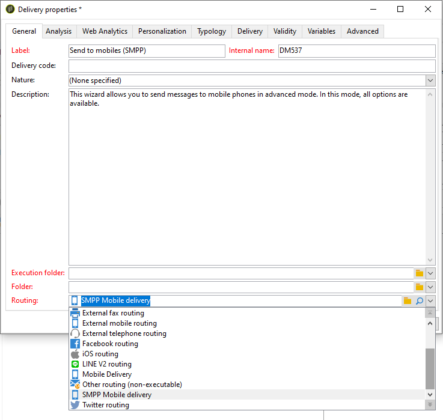
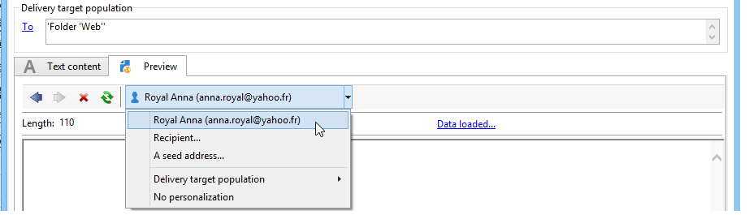

# SMS 채널{#sms-channel}

Adobe Campaign을 사용하면 SMS 메시지를 대량으로 개인화하여 전달할 수 있습니다. 받는 사람 프로필에 모바일 전화 번호 이상이 포함되어야 합니다.

>[!NOTE]
>
>또한 Adobe Campaign을 사용하면 NMAC(Adobe Campaign Mobile App **Channel)** 옵션을 통해 모바일 터미널에 알림을 제출할 수 있습니다.
> 
>자세한 내용은 모바일 앱 채널 [](../../delivery/using/about-mobile-app-channel.md) 정보 섹션을 참조하십시오.

아래 섹션에서는 SMS 채널과 관련된 정보를 제공합니다. 배달을 만드는 방법에 대한 글로벌 정보는[이 섹션을](../../delivery/using/steps-about-delivery-creation-steps.md)참조하십시오.

## SMS 채널 설정 {#setting-up-sms-channel}

휴대폰으로 전송하려면 다음이 필요합니다.

1. 커넥터 및 메시지 유형을 지정하는 외부 계정.

   사용 가능한 커넥터는 다음과 같습니다.NetSize, 일반 SMPP(바이너리 모드 지원 SMPP 버전 3.4), Sybase365(SAP SMS 365), CLX Communications, Tele2, O2 및 Extended 일반 SMPP.

1. 이 외부 계정이 참조되는 배달 템플릿입니다.

### 외부 계정 활성화 {#activating-an-external-account}

외부 계정 목록은 Adobe Campaign 탐색기 트리의 **[!UICONTROL Platform]** > **[!UICONTROL External accounts]** 노드에서 찾을 수 있습니다.

* 예를 들어, 기본 계정( **[!UICONTROL NetSize mobile delivery]**
* 탭에서 **[!UICONTROL General]** **[!UICONTROL Enabled]** 상자를 선택합니다.

   

* 필드에 대해 **[!UICONTROL Mobile]** 옵션이 선택되어 있는지 **[!UICONTROL Channel]** 확인합니다.
* 탭의 **[!UICONTROL Mobile]** 드롭다운 목록에서 커넥터를 선택합니다.NetSize, 일반 SMPP, Sybase365(SAP SMS 365), CLX Communications, Tele2, O2 또는 Extended 일반 SMPP. 확장 일반 SMPP 커넥터에 대한 자세한 내용은 SMPP [외부 계정](#creating-an-smpp-external-account) 만들기 섹션을 참조하십시오.

   

* 공급자가 제공한 정보에 따라 커넥터를 구성합니다. 아래 예에서 연산자는 NetSize입니다.

   

* 탭에서 기본적으로 **[!UICONTROL Connector]** **[!UICONTROL Call Web Service]** 활성화 모드를 선택된 상태로 둡니다.

   

* 탭이 **[!UICONTROL Connector]** 표시되면 커넥터에 대한 액세스 URL을 지정합니다. 공급자가 NetSize인 **경우 주소는 netsize.jsp** 로 끝나야 합니다. 다른 모든 커넥터의 경우 URL 주소가 smpp34.jsp로 **끝납니다**.

### SMPP 외부 계정 만들기 {#creating-an-smpp-external-account}

SMPP 프로토콜을 사용하려면 새 외부 계정을 만들 수도 있습니다.

SMS 프로토콜 및 설정에 대한 자세한 내용은 이 [기술 문서를](https://helpx.adobe.com/campaign/kb/sms-connector-protocol-and-settings.html)참조하십시오.

이렇게 하려면 아래 절차를 따르십시오.

1. 트리의 **[!UICONTROL Platform]** > **[!UICONTROL External accounts]** 노드에서 **[!UICONTROL New]** 아이콘을 클릭합니다.
1. 계정 유형을 라우팅 **,**&#x200B;채널 **(SMS)****및 배달 모드를 일괄 배달로**&#x200B;정의합니다.

   

1. 체크 **[!UICONTROL Enabled]** 상자를 선택합니다.
1. 탭의 **[!UICONTROL Mobile]** 드롭다운 목록에서 **[!UICONTROL Extended generic SMPP]** **[!UICONTROL Connector]** 선택합니다.

   

   이 **[!UICONTROL Enable verbose SMPP traces in the log file]** 옵션을 사용하면 모든 SMPP 트래픽을 로그 파일에 덤프할 수 있습니다. 커넥터 문제를 해결하고 공급자가 보는 트래픽과 비교하려면 이 옵션을 활성화해야 합니다.

1. SMS 서비스 제공업체에 문의하여 **[!UICONTROL Connection settings]** 탭에서 다른 외부 계정 필드를 완료하는 방법을 설명합니다.

   그런 다음 선택한 항목에 따라 제공업체에 연락하여 **[!UICONTROL SMSC implementation name]** 필드에 입력할 값을 제공합니다.

   MTA 하위 항목당 공급자에 대한 연결 수를 정의할 수 있습니다. 기본적으로 1로 설정됩니다.

1. 기본적으로 SMS의 문자 수는 GSM 표준을 충족합니다.

   GSM 인코딩을 사용하는 SMS 메시지는 SMS당 160자, SMS당 153자로 제한됩니다.

   >[!NOTE]
   >
   >특정 문자는 두 개(중괄호, 대괄호, 유로 기호 등)로 계산됩니다.
   >
   >사용 가능한 GSM 문자 목록은 아래에 나와 있습니다.

   원하는 경우 해당 상자를 선택하여 문자 변환을 승인할 수 있습니다.

   

   For more on this, refer to [this section](#about-character-transliteration).

1. 이 **[!UICONTROL Throughput and delays]** 탭에서 초당 MT로 아웃바운드 메시지의 최대 처리량(&quot;MT&quot;, Mobile Terminated)을 지정할 수 있습니다. 해당 필드에 &quot;0&quot;을 입력하면 처리량은 무제한이 됩니다.

   기간에 해당하는 모든 필드의 값을 초 단위로 완료해야 합니다.

1. 탭에서 인코딩을 정의할 수 **[!UICONTROL Mapping of encodings]** 있습니다.

   For more on this, refer to [this section](#about-text-encodings).

1. 이 **[!UICONTROL SMSC specificities]** 탭에서 이 **[!UICONTROL Send full phone number]** 옵션은 기본적으로 비활성화됩니다. SMPP 프로토콜을 존중하고 SMSC(SMS 공급자)의 서버에 숫자만 전송하려는 경우 활성화하지 마십시오.

   그러나 특정 공급자가 &#39;+&#39; 접두사를 사용해야 하는 경우 공급자에게 확인하면 필요한 경우 이 옵션을 활성화하라는 메시지가 나타납니다.

   이 **[!UICONTROL Enable TLS over SMPP]** 확인란을 사용하여 SMPP 트래픽을 암호화할 수 있습니다. 자세한 내용은 이 [기술 문서를](https://helpx.adobe.com/campaign/kb/sms-connector-protocol-and-settings.html)참조하십시오.

1. 커넥터를 구성하는 경우 자동 답글을 설정할 수 **[!UICONTROL Extended generic SMPP]** 있습니다.

   For more on this, refer to [this section](#automatic-reply).

### 문자 변환 정보 {#about-character-transliteration}

SMPP 모바일 배달 외부 계정의 **[!UICONTROL Mobile]** 탭 아래에서 문자 변환을 설정할 수 있습니다.

교역은 GSM 표준으로 간주되지 않을 때 SMS의 한 문자를 다른 문자로 바꾸는 것으로 이루어집니다.

* 음역법이 **[!UICONTROL authorized]**&#x200B;인 경우, 메시지를 전송할 때 고려되지 않는 각 문자는 GSM 문자로 대체됩니다. 예를 들어 &quot;레크&quot;는 &quot;e&quot;로 대체됩니다. 따라서 메시지는 약간 변경되지만 문자 제한은 그대로 유지됩니다.
* 음역 지정이 **[!UICONTROL not authorized]**&#x200B;설정되면 고려되지 않은 문자가 포함된 각 메시지는 바이너리 형식(유니코드)으로 전송됩니다.따라서 모든 문자가 그대로 전송됩니다. 그러나 유니코드를 사용하는 SMS 메시지는 70자(여러 부분으로 전송된 메시지의 경우 SMS당 67자)로 제한됩니다. 최대 문자 수가 초과되면 몇 개의 메시지가 전송되어 추가 비용이 발생할 수 있습니다.

>[!CAUTION]
>
>SMS 메시지의 컨텐츠에 개인화 필드를 삽입하면 GSM 인코딩에 의해 고려되지 않는 문자가 삽입될 수 있습니다.

기본적으로 문자 음역은 비활성화됩니다. SMS 메시지의 모든 문자를 그대로 유지하려면 적절한 이름을 변경하지 않는 것이 좋습니다. 이 옵션을 활성화하지 않는 것이 좋습니다.

그러나 SMS 메시지에 유니코드 메시지를 생성하는 문자가 많이 포함된 경우 이 옵션을 활성화하여 메시지 전송 비용을 제한할 수 있습니다.

다음 표에서는 GSM 표준에서 고려하는 문자를 보여 줍니다. 아래에 언급된 문자 외에 메시지 본문에 삽입된 모든 문자는 전체 메시지를 바이너리 형식(유니코드)으로 변환하여 70자로 제한합니다.

**기본 문자**

<table> 
 <tbody> 
  <tr> 
   <td> @ </td> 
   <td>  </td> 
   <td> SP </td> 
   <td> 0 </td> 
   <td> ¡ </td> 
   <td> P </td> 
   <td> ¿ </td> 
   <td> p </td> 
  </tr> 
  <tr> 
   <td> £ </td> 
   <td> _ </td> 
   <td> ! </td> 
   <td> 1 </td> 
   <td> A </td> 
   <td> Q </td> 
   <td> a </td> 
   <td> q </td> 
  </tr> 
  <tr> 
   <td> $ </td> 
   <td>  </td> 
   <td> " </td> 
   <td> 2 </td> 
   <td> B </td> 
   <td> R </td> 
   <td> b </td> 
   <td> r </td> 
  </tr> 
  <tr> 
   <td> ¥ </td> 
   <td>  </td> 
   <td> # </td> 
   <td> 3 </td> 
   <td> C </td> 
   <td> S </td> 
   <td> c </td> 
   <td> s </td> 
  </tr> 
  <tr> 
   <td> 승 </td> 
   <td>  </td> 
   <td> ¤ </td> 
   <td> 4 </td> 
   <td> D </td> 
   <td> T </td> 
   <td> d </td> 
   <td> t </td> 
  </tr> 
  <tr> 
   <td> é </td> 
   <td>  </td> 
   <td> % </td> 
   <td> 5 </td> 
   <td> E </td> 
   <td> U </td> 
   <td> e </td> 
   <td> u </td> 
  </tr> 
  <tr> 
   <td> 우 </td> 
   <td>  </td> 
   <td> &amp; </td> 
   <td> 6 </td> 
   <td> F </td> 
   <td> V </td> 
   <td> f </td> 
   <td> v </td> 
  </tr> 
  <tr> 
   <td> 2차 </td> 
   <td>  </td> 
   <td> ' </td> 
   <td> 7 </td> 
   <td> G </td> 
   <td> W </td> 
   <td> g </td> 
   <td> w </td> 
  </tr> 
  <tr> 
   <td> 보 </td> 
   <td>  </td> 
   <td> ( </td> 
   <td> 8 </td> 
   <td> H </td> 
   <td> X </td> 
   <td> h </td> 
   <td> x </td> 
  </tr> 
  <tr> 
   <td> 비치 </td> 
   <td>  </td> 
   <td> ) </td> 
   <td> 9 </td> 
   <td> I </td> 
   <td> Y </td> 
   <td> i </td> 
   <td> y </td> 
  </tr> 
  <tr> 
   <td> LF </td> 
   <td>  </td> 
   <td> * </td> 
   <td> : </td> 
   <td> J </td> 
   <td> Z </td> 
   <td> j </td> 
   <td> z </td> 
  </tr> 
  <tr> 
   <td> 쇠 </td> 
   <td> ESC </td> 
   <td> + </td> 
   <td> ; </td> 
   <td> K </td> 
   <td> Ae </td> 
   <td> k </td> 
   <td> a </td> 
  </tr> 
  <tr> 
   <td> 쇠 </td> 
   <td> AE </td> 
   <td> , </td> 
   <td> &lt; </td> 
   <td> L </td> 
   <td> 5시 </td> 
   <td> l </td> 
   <td> 5 </td> 
  </tr> 
  <tr> 
   <td> CR </td> 
   <td> æ </td> 
   <td> - </td> 
   <td> = </td> 
   <td> M </td> 
   <td> Clncage </td> 
   <td> m </td> 
   <td> 팽년생 </td> 
  </tr> 
  <tr> 
   <td> 오 </td> 
   <td> 섬 </td> 
   <td> . </td> 
   <td> &gt; </td> 
   <td> N </td> 
   <td> 여우 </td> 
   <td> n </td> 
   <td> 여우 </td> 
  </tr> 
  <tr> 
   <td> o </td> 
   <td> É </td> 
   <td> / </td> 
   <td> ? </td> 
   <td> O </td> 
   <td> § </td> 
   <td> o </td> 
   <td> à </td> 
  </tr> 
 </tbody> 
</table>

SP:공간

ESC:Escape

LF:라인 피드

CR:캐리지 리턴

**고급 문자(두 번 카운트됨)**

^ { } `[ ~ ]` | €

### 텍스트 인코딩 정보 {#about-text-encodings}

SMS 메시지를 보낼 때 Adobe Campaign은 하나 또는 여러 개의 텍스트 인코딩을 사용할 수 있습니다. 각 인코딩에는 고유한 문자 집합이 있으며 SMS 메시지에 맞는 문자 수를 결정합니다.

새 SMPP 모바일 배달 외부 계정을 구성할 때 **[!UICONTROL Mapping of encodings]** **[!UICONTROL Mobile]** 탭에서 다음을 정의할 수 있습니다.이 **[!UICONTROL data_coding]** 필드를 사용하면 Adobe Campaign에서 SMSC에 사용되는 인코딩을 통신할 수 있습니다.

>[!NOTE]
>
>data_coding **** 값과 실제로 사용된 인코딩 간의 매핑이 표준화되어 있습니다. 그러나 특정 SMSC에는 고유한 매핑이 있습니다.이 경우 Adobe Campaign **관리자가** 이 매핑을 선언해야 합니다. 자세한 내용은 제공업체에 문의하십시오.

필요에 따라 **data_coding을** 선언하고 인코딩을 강제 적용할 수 있습니다.이렇게 하려면 표에 단일 인코딩을 지정합니다.

* 인코딩의 매핑이 정의되지 않은 경우 커넥터는 일반 비헤이비어를 사용합니다.

   * GSM 인코딩을 사용하여 **data_coding = 0을**&#x200B;지정합니다.
   * GSM 인코딩이 실패할 경우 **UCS2** 인코딩을 사용하여 값을 **data_coding = 8**&#x200B;지정합니다.

* 연결된 **[!UICONTROL data_coding]** 필드 값과 함께 사용할 인코딩을 정의하면 Adobe Campaign에서 목록의 첫 번째 인코딩을 사용하려고 하면 첫 번째 인코딩이 불가능할 경우 다음 사항이 표시됩니다.

>[!CAUTION]
>
>선언의 순서는 중요합니다.각 SMS 메시지에서 가능한 한 많은 문자를 입력할 수 있도록 인코딩을 **위해 목록을 오름차순으로** 입력하는 것이 좋습니다.
>
>사용할 인코딩만 선언합니다. SMSC 파섹

### 자동 회신 {#automatic-reply}

확장된 일반 SMPP 커넥터를 설정할 때 자동 답글을 구성할 수 있습니다.

구독자가 Adobe Campaign을 통해 전송한 SMS 메시지에 응답하고 메시지에 &quot;STOP&quot;과 같은 키워드가 포함되어 있으면 **[!UICONTROL Automatic reply sent to the MO]** 섹션에서 자동으로 다시 발송되는 메시지를 구성할 수 있습니다.

>[!NOTE]
>
>키워드는 대/소문자를 구분하지 않습니다.

각 키워드에 대해, 일반적으로 배달을 보내는 데 사용되는 숫자인 짧은 코드를 지정한 다음, 구독자에게 전송할 메시지를 입력합니다.

동작을 자동 응답에 연결할 수도 있습니다. **[!UICONTROL Send to quarantine]** 또는 **[!UICONTROL Remove from quarantine]**. 예를 들어, 수신자가 &quot;STOP&quot; 키워드를 전송하는 경우 자동으로 가입 해지 확인 메시지를 수신하고 격리로 전송됩니다.


동작을 자동 응답에 연결하면 해당 키워드를 전송하는 수신자가 자동으로 격리되지 않습니다. **[!UICONTROL Remove from quarantine]**

수신자는 **[!UICONTROL Non deliverables and addresses]** > **[!UICONTROL Administration]** > **[!UICONTROL Campaign Management]** **[!UICONTROL Non deliverables Management]** 메뉴를 통해 사용할 수 있는 표에 나열되어 있습니다.

* 짧은 코드에 관계없이 동일한 답글을 보내려면 **[!UICONTROL Short code]** 열을 비워 두십시오.
* 키워드에 상관없이 동일한 답글을 보내려면 **[!UICONTROL Keyword]** 열을 비워 두십시오.
* 응답을 보내지 않고 작업을 수행하려면 **[!UICONTROL Response]** 열을 비워 둡니다. 예를 들어 &quot;중지&quot; 이외의 메시지로 응답한 사용자를 격리 조치에서 제거할 수 있습니다.

동일한 공급자 계정의 확장 일반 SMPP 커넥터를 사용하는 여러 외부 계정이 있는 경우 다음 문제가 발생할 수 있습니다.짧은 코드에 회신을 보낼 때 외부 계정 연결에서 수신할 수 있습니다. 따라서 전송된 자동 회신은 예상 메시지가 될 수 없습니다.
이를 방지하려면 사용 중인 공급자에 따라 다음 솔루션 중 하나를 적용합니다.
* 각 외부 계정에 대해 하나의 공급자 계정을 만듭니다.
* > **[!UICONTROL System type]** 탭에서 필드를 **[!UICONTROL Mobile]** **[!UICONTROL Connection settings]** 사용하여 각 짧은 코드를 구별합니다. 공급자마다 다른 값을 요청하십시오.

   

확장 일반 SMPP 커넥터를 사용하여 외부 계정을 설정하는 단계는 SMPP 외부 계정 [만들기](../../delivery/using/sms-channel.md#creating-an-smpp-external-account) 섹션에 자세히 설명되어 있습니다.

### 배달 템플릿 변경 {#changing-the-delivery-template}

Adobe Campaign은 모바일에 전달하는 템플릿을 제공합니다. 이 템플릿은 **[!UICONTROL Resources > Templates > Delivery templates]** 노드에서 사용할 수 있습니다. 자세한 내용은 템플릿 [정보](../../delivery/using/about-templates.md) 섹션을 참조하십시오.

SMS 채널을 통해 전달하려면 채널 커넥터를 참조하는 템플릿을 만들어야 합니다.

기본 배달 템플릿을 유지하려면 복제한 다음 구성하는 것이 좋습니다.

아래 예에서는 NetSize 계정을 통해 메시지를 전달하는 템플릿을 만듭니다. 이렇게 하려면:

1. 노드로 **[!UICONTROL Delivery templates]** 이동합니다.
1. 템플릿을 마우스 오른쪽 단추로 클릭하고 **[!UICONTROL Send to mobiles]** 선택합니다 **[!UICONTROL Duplicate]**.

   

1. 템플릿의 레이블을 변경합니다.

   

1. 클릭 **[!UICONTROL Properties]**.
1. 예를 들어, **[!UICONTROL General]** 탭에서 구성한 외부 계정에 해당하는 라우팅 모드를 선택합니다. **[!UICONTROL NetSize mobile delivery]**

   

1. 아이콘을 **[!UICONTROL Save]** 클릭하여 템플릿을 만듭니다.

   

이제 외부 계정 및 SMS를 통해 전달할 수 있는 배달 템플릿이 있습니다.

## SMS 배달 만들기 {#creating-a-sms-delivery}

### 배달 채널 선택 {#selecting-the-delivery-channel}

새 SMS 배달을 만들려면 아래 절차를 따르십시오.

>[!NOTE]
>
>배달 생성에 대한 글로벌 개념이 [이 섹션에](../../delivery/using/steps-about-delivery-creation-steps.md)설명되어 있습니다.

1. 배달 대시보드와 같은 새 배달을 만듭니다.
1. 이전에 **[!UICONTROL Send to mobiles (NetSize)]** 만든 배달 템플릿을 선택합니다. 자세한 내용은 배달 템플릿 [변경](#changing-the-delivery-template) 섹션을 참조하십시오.

   

1. 레이블, 코드 및 설명을 사용하여 배달을 식별합니다. For more on this, refer to [this section](../../delivery/using/steps-create-and-identify-the-delivery.md#identifying-the-delivery).
1. 을 **[!UICONTROL Continue]** 클릭하여 이 정보를 확인하고 메시지 구성 창을 표시합니다.

## SMS 컨텐츠 정의 {#defining-the-sms-content}

SMS의 컨텐츠를 만들려면 아래 단계를 따르십시오.

1. 마법사의 **[!UICONTROL Text content]** 섹션에 메시지 내용을 입력합니다. 도구 모음 단추를 사용하여 내용을 가져오거나 저장 또는 검색할 수 있습니다. 마지막 단추는 개인화 필드를 삽입하는 데 사용됩니다.

   

   개인화 필드는 개인화 정보 [섹션에](../../delivery/using/about-personalization.md) 있습니다.

1. 페이지 **[!UICONTROL Preview]** 하단에서 을 클릭하여 개인화로 메시지 렌더링을 봅니다. 미리 보기를 시작하려면 도구 모음의 **[!UICONTROL Test personalization]** 단추를 사용하여 수신자를 선택합니다. 정의된 대상에서 수신자를 선택하거나 다른 수신자를 선택할 수 있습니다.

   

   SMS 메시지를 승인할 수 있습니다. 또한 컨텐츠 편집기 오른쪽에 표시되는 휴대폰 화면에서 SMS 컨텐츠를 볼 수 있습니다. 화면을 클릭하고 마우스를 사용하여 내용을 스크롤합니다.

   

1. 수신자와 관련된 정보를 보려면 해당 **[!UICONTROL Data loaded]** 링크를 클릭합니다.

   

   >[!NOTE]
   >
   >Latin-1(ISO-8859-1) 코드 페이지가 사용되는 경우 SMS 메시지의 길이는 160자로 제한됩니다. 유니코드로 작성된 메시지는 70자를 초과할 수 없습니다. 특정 특수 문자는 메시지 길이에 영향을 줄 수 있습니다. 메시지 길이에 대한 자세한 내용은 문자 [변환](#about-character-transliteration) 섹션을 참조하십시오.
   >
   >개인화 필드 또는 조건부 컨텐츠 필드가 있으면 메시지 크기가 받는 사람마다 다릅니다. 개인화가 수행되면 메시지 길이를 평가해야 합니다.
   >
   >분석을 실행하면 메시지 길이가 확인되고 오버플로가 발생하면 경고가 표시됩니다.

1. NetSize 커넥터 또는 SMPP 커넥터를 사용하는 경우, 배달 보낸 사람의 이름을 개인화할 수 있습니다. 자세한 내용은 고급 매개 변수 [섹션을 참조하십시오](#advanced-parameters) .

## 타겟 모집단 선택 {#selecting-the-target-population}

게재의 대상 모집단을 선택할 때의 세부 프로세스는 [이 섹션에](../../delivery/using/steps-defining-the-target-population.md)설명되어 있습니다.

개인화 필드 사용에 대한 자세한 내용은 개인화 [정보를 참조하십시오](../../delivery/using/about-personalization.md).

시드 목록 포함에 대한 자세한 내용은 [시드 주소](../../delivery/using/about-seed-addresses.md)정보를 참조하십시오.

## SMS 메시지 보내기 {#sending-sms-messages}

메시지를 승인하고 작성되는 배달의 수신자에게 보내려면 을 클릭합니다. **[!UICONTROL Send]**

배달을 확인하고 전송할 때의 세부 프로세스는 아래 섹션에 나와 있습니다.

* [배달 유효성 확인](../../delivery/using/steps-validating-the-delivery.md)
* [배달 보내기](../../delivery/using/steps-sending-the-delivery.md)

### 고급 매개 변수 {#advanced-parameters}

이 **[!UICONTROL Properties]** 단추를 사용하면 고급 배달 매개 변수에 액세스할 수 있습니다. SMS 게재와 관련된 매개 변수는 **[!UICONTROL SMS parameters]** 탭의 **[!UICONTROL Delivery]** 섹션에 있습니다.

다음 옵션을 사용할 수 있습니다.

* **보낸 사람 주소** (NetSize 커넥터 및 SMPP 커넥터에 대해서만 해당):11자로 제한된 영숫자 문자열을 사용하여 배달 보낸 사람의 이름을 개인화할 수 있습니다. 그 분야는 숫자로만 구성되어서는 안 된다. 표시할 조건(예: 수신자의 영역 코드에 따라 다른 이름)을 정의할 수 있습니다.

   ```
   <% if( String(recipient.mobilePhone).indexOf("+1") == 0){ %>NeoShopUS<%} else %>
   ```

   >[!CAUTION]
   >
   >발신자 이름 편집과 관련하여 해당 국가의 법을 확인하십시오. 운영자가 이 기능을 제공하는지 여부도 확인해야 합니다.

* **전송 모드**:SMS를 통한 메시지 전송
* **우선 순위**:메시지에 할당된 중요도 수준입니다. **[!UICONTROL Normal]** 우선 순위는 기본적으로 선택됩니다. 서비스 제공업체에 **[!UICONTROL High]** 우선 순위로 전송된 SMS 비용을 문의하십시오.
* **애플리케이션**&#x200B;유형:sms 배달에 할당할 애플리케이션을 선택합니다. 이 **[!UICONTROL Direct Marketing]** 옵션은 기본적으로 선택되어 있으며 가장 일반적으로 사용됩니다.

**NetSize 커넥터에 대한 매개 변수**


* **단일 메시지에**&#x200B;여러 SMS를 사용하십시오.따라서 여러 SMS 메시지를 통해 160자 이상의 메시지를 보낼 수 있습니다.

**SMPP 커넥터에 대한 매개 변수**


* **메시지당**&#x200B;최대 SMS 수:이 옵션을 사용하면 메시지를 보내는 데 사용할 SMS 수를 설정할 수 있습니다. 번호가 0으로 설정된 경우 SMS를 사용하여 메시지를 전달할 수 있습니다. 예를 들어 SMS 수가 1 또는 2로 설정되고 메시지가 이 임계값을 초과하는 경우 전송되지 않습니다.

## SMS 전달 모니터링 및 추적 {#monitoring-and-tracking-sms-deliveries}

메시지를 보낸 후 배달을 모니터링하고 추적할 수 있습니다. 자세한 내용은 다음 섹션을 참조하십시오.

* [게재 모니터링](../../delivery/using/monitoring-a-delivery.md)
* [게재 실패 이해](../../delivery/using/understanding-delivery-failures.md)
* [메시지 추적 정보](../../delivery/using/about-message-tracking.md)

## 인바운드 메시지 처리 {#processing-inbound-messages}

nlserver **sms** 모듈은 정기적으로 SMS 라우터를 쿼리합니다. 이를 통해 Adobe Campaign은 게재 진행 상황을 추적하고 상태 보고서와 수신자의 구독 취소 요청을 처리할 수 있습니다.

* **상태 보고서**:전달 로그를 확인하여 메시지 상태를 확인합니다.

   >[!NOTE]
   >
   >전송된 모든 SMS는 기본 키에 외부 계정에 연결됩니다. 이 방법은 다음과 같습니다.
   >
   > * 삭제된 외부 SMS 계정의 상태 보고서가 제대로 처리되지 않았습니다.
   > * SMS 계정은 상태 보고서가 올바른 계정에 속하는지 확인하기 위해 단일 외부 계정에만 연결할 수 있습니다


* **구독 취소**:SMS 배달 수신을 중지하려는 수신자는 STOP이라는 단어가 포함된 메시지를 반환할 수 있습니다. 공급자가 계약 조건에 따라 메시지를 허용하는 경우 인바운드 SMS 워크플로우 **활동을 통해 메시지를 검색한 다음 쿼리를 만들어** 더 이상 수신자에게 **** 연락하지 않음 옵션을 활성화할 수 있습니다.

   워크플로우 [가이드를](../../workflow/using/executing-a-workflow.md#architecture) 참조하십시오.

## InSMS 스키마 {#insms-schema}

InSMS 스키마에는 들어오는 SMS와 관련된 정보가 포함되어 있습니다. 이러한 필드에 대한 설명은 desc 속성을 통해 사용할 수 있습니다.

* **메시지**:받은 SMS의 내용.
* **원본**:메시지 원본의 모바일 번호입니다.
* **providerId**:SMSC(메시지 센터)가 반환하는 메시지의 식별자입니다.
* **생성됨**:수신 메시지가 Adobe Campaign에 삽입된 날짜입니다.
* **extAccount**:Adobe Campaign 외부 계정.

   >[!CAUTION]
   >
   >다음 필드는 NetSize에만 해당됩니다.
   >
   >사용 중인 연산자가 NetSize가 아닌 경우 이러한 필드는 비어 있는 것으로 간주됩니다.

* **별칭**:받는 메시지의 별칭입니다.
* **구분 기호**:별칭과 메시지 본문 사이의 구분 기호.
* **messageDate**:메시지 날짜가 연산자가 제공한 날짜입니다.
* **receivvalDate**:smsc(메시지 센터)에서 연산자로부터 날짜 메시지를 받았습니다.
* **deliveryDate**:smsc가 보낸 날짜 메시지(메시지 센터).
* **largeAccount**:수신 SMS에 연결된 고객 계정 코드
* **countryCode**:연산자 국가 코드.
* **operatorCode**:연산자 네트워크 코드.
* **linkedSmsId**:Adobe Campaign ID(broadlogId)가 발신 SMS에 연결되어 있습니다. 여기서 이 SMS는 응답입니다.

## 자동 회신 관리(미국 규정) {#managing-automatic-replies--american-regulation-}

구독자가 Adobe Campaign을 통해 전송된 SMS 메시지에 응답하고 STOP, HELP 또는 YES와 같은 키워드를 사용하는 경우 미국 시장에서 자동으로 반환되는 메시지를 구성해야 합니다.

예를 들어 수신자가 STOP 키워드를 전송하는 경우 구독이 취소되었음을 나타내는 확인 메시지를 자동으로 받게 됩니다.

이 유형의 메시지에 대한 보낸 사람 이름은 일반적으로 배달을 보내는 데 사용되는 짧은 코드입니다.

>[!CAUTION]
>
>다음 세부 절차는 확장 일반 SMPP 커넥터를 제외하고 SMPP 커넥터에만 유효합니다. 자세한 내용은 SMPP 외부 계정 [만들기](#creating-an-smpp-external-account) 섹션을 참조하십시오.
>
>이는 미국 마케팅 캠페인에 대해 미국 운영업체가 수행하는 인증 프로세스의 일부를 구성합니다. 키워드가 포함된 가입자 SMS 메시지에 대한 이러한 응답은 해당 구독자로부터 메시지를 받은 후 즉시 구독자에게 전송해야 합니다.

1. 다음 유형의 XML 파일을 만듭니다.

   ```
   <autoreply>
     <shortcode name="12345">
       <reply keyword="STOP" text="You will not receive SMS anymore" />
       <reply keyword="HELP" text="Powered by Adobe Campaign" />
     </shortcode>
     <shortcode name="43115">
       <reply keyword="STOP" text="Vous ne recevrez plus de SMS" />
       <reply keyword="HELP" text="Service rendu par Adobe Campaign" />
     </shortcode>
     <shortcode name="*">
       <reply keyword="ADOBE" text="This text is replied when you send ADOBE to any short code" />
     </shortcode>
   </autoreply>
   ```

1. 태그의 **name** **`<shortcode>`** 특성에 대해 메시지 보낸 사람 이름 대신 표시할 짧은 코드를 지정합니다.

   각 **`<reply>`** 태그에 키워드와 함께 **키워드** 속성을 입력하고 이 키워드에 보낼 메시지와 함께 **text** 속성을 입력합니다.

   >[!NOTE]
   >
   >각 키워드는 대문자로 작성해야 합니다.

   여러 키워드에 대해 동일한 메시지를 보내려면 해당 줄을 복제합니다.

   예:

   ```
   <reply keyword="STOP" text="You will not receive SMS anymore" />
   <reply keyword="QUIT" text="You will not receive SMS anymore" />
   ```

1. 완료되면 smsAutoReply.xml이라는 이름으로 이 파일을 **저장합니다**.

   Linux에서는 파일 이름이 대/소문자를 구분합니다.

1. 이 파일을 웹 서버와 같은 위치에 Adobe Campaign의 **conf** 디렉토리에 복사합니다.

>[!CAUTION]
>
>이런 자동 메시지는 역사를 보존하지 않는다. 따라서 [배달 대시보드에](../../delivery/using/monitoring-a-delivery.md#delivery-dashboard)나타나지 않습니다.
>
>이러한 메시지는 [상업용 압력 규정의](../../campaign/using/pressure-rules.md)일부로 간주되지 않습니다.
