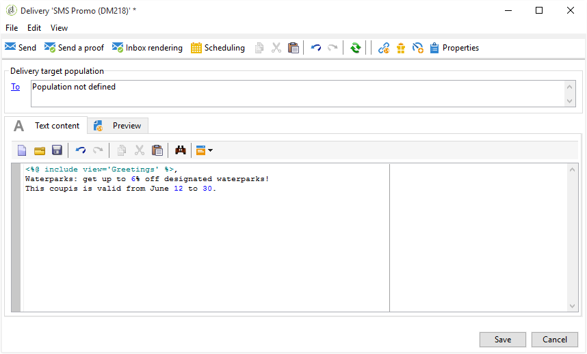
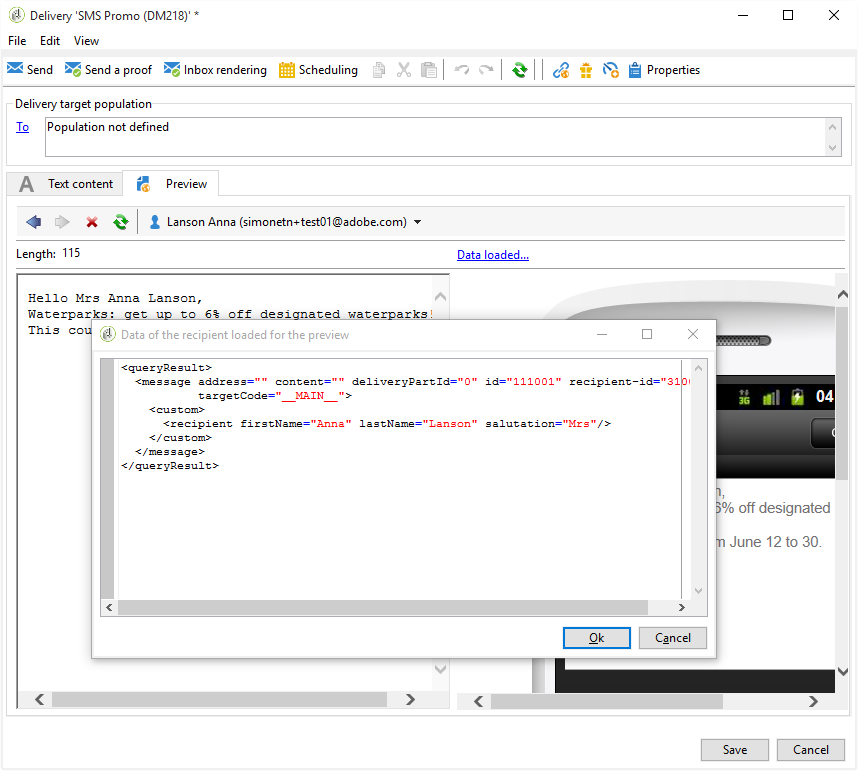

# SMS 게재 만들기 {#creating-a-sms-delivery}

## 게재 채널 선택 {#selecting-the-delivery-channel}

새 SMS 게재를 만들려면 아래 단계를 수행합니다.

>[!NOTE]
>
>게재 만들기에 대한 전체 개념은 [Campaign v8 설명서](https://experienceleague.adobe.com/docs/campaign/campaign-v8/send/create-message.html?lang=ko){target="_blank"}에 나와 있습니다.

1. 게재 대시보드 등에서 새 게재를 만듭니다.
1. 이전에 만든 게재 템플릿 **모바일(SMPP)에 전송됨**&#x200B;을(를) 선택합니다. 자세한 내용은 [게재 템플릿 변경](sms-set-up.md#changing-the-delivery-template) 섹션을 참조하세요.

   

1. 레이블, 코드 및 설명을 사용하여 게재를 식별합니다. 자세한 내용은 [Campaign v8 설명서](https://experienceleague.adobe.com/docs/campaign/campaign-v8/send/create-message.html#create-the-delivery){target="_blank"}에서 이 섹션을 참조하세요.
1. **[!UICONTROL Continue]**&#x200B;을(를) 클릭하여 이 정보를 확인하고 메시지 구성 창을 표시합니다.

## SMS 콘텐츠 정의 {#defining-the-sms-content}

SMS의 콘텐츠를 만들려면 아래 단계를 수행합니다.

1. 도우미의 **[!UICONTROL Text content]** 섹션에 메시지 내용을 입력하십시오. 도구 모음 단추를 사용하여 콘텐츠를 가져오거나 저장하거나 검색할 수 있습니다. 마지막 버튼은 개인화 필드를 삽입하는 데 사용됩니다.

   

   개인화 필드 사용은 [개인화 정보](about-personalization.md) 섹션에 나와 있습니다.

1. 개인화된 메시지 렌더링을 보려면 페이지 하단의 **[!UICONTROL Preview]**&#x200B;을(를) 클릭합니다. 미리 보기를 시작하려면 도구 모음의 **[!UICONTROL Test personalization]** 단추를 사용하여 받는 사람을 선택합니다. 정의된 대상에서 수신자를 선택하거나 다른 수신자를 선택할 수 있습니다.

   

   SMS 메시지를 승인할 수 있습니다. 콘텐츠 편집기 오른쪽에 표시된 휴대폰 화면에서 SMS의 콘텐츠를 볼 수도 있습니다. 화면을 클릭하고 마우스를 사용하여 컨텐츠를 스크롤합니다.

   

1. 받는 사람과 관련된 정보를 보려면 **[!UICONTROL Data loaded]** 링크를 클릭하십시오.

   

   >[!NOTE]
   >
   >SMS 메시지는 Latin-1(ISO-8859-1) 코드 페이지를 사용하는 경우 160자로 제한됩니다. 메시지가 유니코드로 작성되면 70자를 초과할 수 없습니다. 특정 특수 문자는 메시지 길이에 영향을 줄 수 있습니다. 메시지 길이에 대한 자세한 내용은 [SMS 문자 음역](#about-character-transliteration) 섹션을 참조하세요.
   >
   >개인화 필드 또는 조건부 콘텐츠 필드가 있으면 메시지 크기가 받는 사람마다 다릅니다. 개인화가 수행되면 메시지 길이를 평가해야 합니다.
   >
   >분석을 시작할 때 메시지 길이를 확인하고 오버플로 시 경고가 표시됩니다.

1. NetSize 커넥터 또는 SMPP 커넥터를 사용하는 경우 게재 발신자의 이름을 개인화할 수 있습니다. 자세한 내용은 [고급 매개 변수](#advanced-parameters) 섹션을 참조하십시오.

## 대상 모집단 선택 {#selecting-the-target-population}

게재의 대상 모집단을 선택할 때의 자세한 프로세스는 [이 섹션](steps-defining-the-target-population.md)에 나와 있습니다.

개인화 필드 사용에 대한 자세한 내용은 [이 섹션](about-personalization.md)을 참조하세요.

시드 목록 포함에 대한 자세한 내용은 [이 페이지](about-seed-addresses.md)를 참조하세요.
