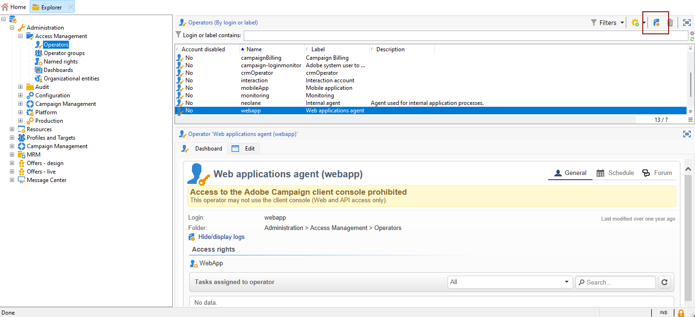
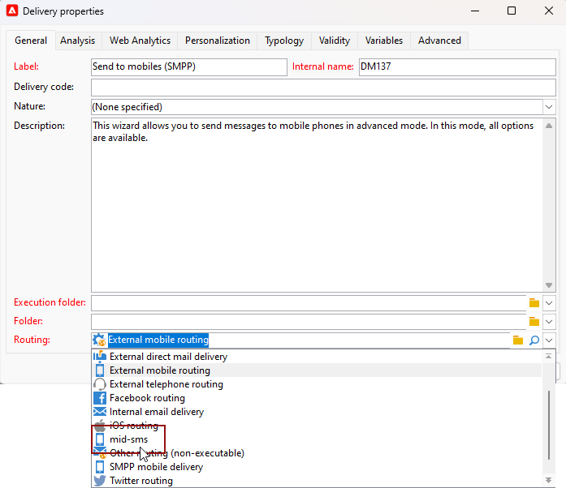

# 중간 소싱 인프라에서 SMS 채널 구성 {#setting-up-sms-channel}

중간 서버가 있는 휴대폰으로 보내려면 다음이 필요합니다.

1. 마케팅 서버에서 만든 SMS 외부 계정에 사용되는 중간 서버에서 만든 SMS 연산자입니다.

1. 채널 및 게재 모드를 지정하는 마케팅 서버의 외부 계정입니다.

1. 커넥터와 메시지 유형을 자세히 설명하는 중간 서버의 외부 계정입니다.

1. 외부 계정을 참조하여 전송 프로세스를 간소화하는 게재 템플릿입니다.

>[!NOTE]
>
> SMS 게재의 경우 유형화는 **one** 전용 응용 프로그램 서버 컨테이너에서 만들어진 특정 SMS 선호도를 사용해야 합니다. [자세히 알아보기](../../installation/using/configure-delivery-settings.md#managing-outbound-smtp-traffic-with-affinities)

## 중간 서버에서 SMS 연산자 생성 {#create-sms-operator}

구성 프로세스를 시작하려면 특히 외부 계정에 대해 중간 서버에서 SMS 연산자를 만들어야 합니다.

>[!IMPORTANT]
>
>각 SMS 커넥터에는 고유한 SMS 연산자가 필요합니다.

1. 트리의 **[!UICONTROL Administration]** > **[!UICONTROL Access management]** > **[!UICONTROL Operators node]** 노드에서 **[!UICONTROL New]** 아이콘을 클릭합니다.

   

1. 로그인, 암호 및 이름을 포함하여 사용자의 **[!UICONTROL Identification parameters]**&#x200B;을(를) 지정하십시오. 운영자가 Adobe Campaign에 안전하게 로그인하려면 로그인 및 암호가 필요합니다.

   **[!UICONTROL Name (login)]**&#x200B;은(는) 나중에 중간 서버에서 SMPP 외부 계정의 이름을 지정하는 데 사용됩니다.

   

1. 운영자 액세스 권한 섹션에서 운영자에게 부여된 권한을 선택합니다.

   연산자에 권한을 할당하려면 권한 목록 위에 있는 **[!UICONTROL Add]** 단추를 클릭합니다. 사용 가능한 그룹 목록에서 **[!UICONTROL Operator group]** 또는 **[!UICONTROL Named rights]**&#x200B;을(를) 선택합니다.

   

1. **[!UICONTROL Save]**&#x200B;을(를) 클릭하여 연산자 만들기를 완료합니다. 이제 프로필이 기존 연산자 목록에 포함됩니다.

## 마케팅 서버에 SMS 외부 계정 만들기 {#create-accound-mkt}

중간 서버가 있는 휴대폰에 SMS를 전송하려면 먼저 마케팅 서버에 SMS 외부 계정을 만들어야 합니다.

1. 트리의 **[!UICONTROL Platform]** > **[!UICONTROL External accounts]** 노드에서 **[!UICONTROL New]** 아이콘을 클릭합니다.

   

1. **[!UICONTROL Label]** 및 **[!UICONTROL Internal name]**&#x200B;을(를) 입력하십시오. 내부 이름은 나중에 중간 서버에서 SMPP 외부 계정의 이름을 지정하는 데 사용됩니다.

1. 계정 유형은 **[!UICONTROL Routing]**, 채널은 **[!UICONTROL Mobile (SMS)]**, 게재 모드는 **[!UICONTROL Mid-sourcing]**(으)로 정의합니다.

   

1. **[!UICONTROL Mid-Sourcing]** 탭에서 중간 소싱 서버 연결 매개 변수를 지정합니다.

   [ 및 ](#create-sms-operator) 필드에 **[!UICONTROL Account]**&#x200B;이전에 만든 SMS 커넥터&#x200B;**[!UICONTROL Password]**&#x200B;의 세부 정보를 입력하십시오.

   

1. **[!UICONTROL Test the connection]**&#x200B;을(를) 클릭하여 구성을 확인합니다.

1. **[!UICONTROL Save]**&#x200B;을(를) 클릭합니다.

## 중간 서버에서 SMPP 외부 계정 만들기 {#creating-smpp-mid}

>[!IMPORTANT]
>
>여러 외부 SMS 계정에 동일한 계정과 암호를 사용하면 계정 간에 충돌과 겹칠 수 있습니다. [SMS 문제 해결 페이지](troubleshooting-sms.md#external-account-conflict)를 참조하세요.

마케팅 서버에서 SMS 외부 계정을 성공적으로 설정했으면 다음 단계에서 중간 서버에서 SMPP 외부 계정을 설정하는 것입니다.

SMS 프로토콜 및 설정에 대한 자세한 내용은 이 [페이지](sms-protocol.md)를 참조하세요.

이렇게 하려면 아래 단계를 수행합니다.

1. 트리의 **[!UICONTROL Platform]** > **[!UICONTROL External accounts]** 노드에서 **[!UICONTROL New]** 아이콘을 클릭합니다.

1. **[!UICONTROL Label]** 및 **[!UICONTROL Internal name]**&#x200B;을(를) 입력하십시오.

   >[!WARNING]
   >
   >**[!UICONTROL Internal name]**을(를) 할당할 때 지정된 명명 규칙을 따라야 합니다.
   >  `SMS Operator Name_Internal Name of the Marketing SMS external account`

   

1. 계정 유형은 **라우팅**, 채널은 **모바일(SMS)**, 게재 모드는 **대량 게재**&#x200B;로 정의합니다.

   

1. **[!UICONTROL Enabled]** 상자를 선택합니다.

1. **[!UICONTROL Mobile]** 탭의 **[!UICONTROL Extended generic SMPP]** 드롭다운 목록에서 **[!UICONTROL Connector]**&#x200B;을(를) 선택합니다.

   

1. **[!UICONTROL Enable verbose SMPP traces in the log file]** 옵션을 사용하면 모든 SMPP 트래픽을 로그 파일로 덤프할 수 있습니다. 이 옵션은 커넥터 문제를 해결하고 공급자가 보는 트래픽과 비교하기 위해서만 활성화되어야 합니다.

1. SMS 서비스 공급자에게 문의하여 **[!UICONTROL Connection settings]** 탭에서 다양한 외부 계정 필드를 완료하는 방법을 설명하십시오.

   선택한 항목에 따라 공급자에게 문의하여 **[!UICONTROL SMSC implementation name]** 필드에 입력할 값을 제공합니다.

   MTA 하위 항목당 공급자에 대한 연결 수를 정의할 수 있습니다. 기본적으로 1로 설정되어 있습니다.

1. 기본적으로 SMS의 문자 수는 GSM 표준을 충족합니다.

   GSM 인코딩을 사용하는 SMS 메시지는 SMS당 160자, 또는 여러 부분으로 나누어 전송되는 메시지의 경우 153자로 제한됩니다.

   >[!NOTE]
   >
   >특정 문자(중괄호, 대괄호, 유로 기호 등)는 2로 계산됩니다.
   >
   >사용 가능한 GSM 문자 목록이 [이 섹션](sms-set-up.md#about-character-transliteration)에 표시됩니다.

   해당 상자를 선택하여 문자 변환을 승인할 수도 있습니다.

   

1. **[!UICONTROL Throughput and delays]** 탭에서 아웃바운드 메시지의 최대 처리량(&quot;MT&quot;, 모바일 착신)을 초당 MT 단위로 지정할 수 있습니다. 해당 필드에 &quot;0&quot;을 입력하면 처리량이 무제한이 됩니다.

   지속 시간에 해당하는 모든 필드의 값은 초 단위로 입력해야 합니다.

1. **[!UICONTROL Mapping of encodings]** 탭에서 인코딩을 정의할 수 있습니다.

   이 작업에 대한 자세한 정보는 [이 섹션](sms-set-up.md#about-text-encodings)을 참조하십시오.

1. **[!UICONTROL SMSC specificities]** 탭에서 **[!UICONTROL Send full phone number]** 옵션은 기본적으로 비활성화되어 있습니다. SMPP 프로토콜을 준수하고 SMS 공급자(SMSC) 서버로 숫자만 전송하려면 활성화하지 마십시오.

   그러나 특정 공급자가 &#39;+&#39; 접두사 사용을 요청하는 경우 해당 공급자에게 확인하는 것이 좋습니다. 필요한 경우 공급자가 이 옵션을 활성화하라고 요청할 것입니다.

   **[!UICONTROL Enable TLS over SMPP]** 확인란을 사용하면 SMPP 트래픽을 암호화할 수 있습니다. 자세한 정보는 이 [페이지](sms-protocol.md)를 참조하십시오.

1. **[!UICONTROL Extended generic SMPP]** 커넥터를 구성하는 경우 자동 회신을 설정할 수 있습니다.

   이 작업에 대한 자세한 정보는 [이 섹션](sms-set-up.md#automatic-reply)을 참조하십시오.

## 게재 템플릿 변경 {#changing-the-delivery-template}

Adobe Campaign은 **[!UICONTROL Resources > Templates > Delivery templates]** 노드에 있는 모바일 게재 템플릿을 제공합니다. 자세한 내용은 [Campaign v8 설명서](https://experienceleague.adobe.com/docs/campaign/campaign-v8/send/create-templates.html){target="_blank"}를 참조하세요.

SMS 채널을 통해 메시지를 전송하려면 채널 커넥터에 대한 참조를 포함하는 템플릿을 만들어야 합니다.

기본 게재 템플릿을 유지하려면 복제한 다음 구성하는 것이 좋습니다.

아래 예에서는 이전에 만든 SMPP 계정을 통해 메시지를 쉽게 게재할 수 있는 템플릿을 생성합니다. 방법은 다음과 같습니다.

1. 트리의 **[!UICONTROL Resources]** > **[!UICONTROL Templates]** > **[!UICONTROL Delivery templates]** 노드에서 **[!UICONTROL Send to mobiles]** 템플릿을 마우스 오른쪽 단추로 클릭하고 **[!UICONTROL Duplicate]**&#x200B;을(를) 선택합니다.

   

1. 템플릿의 레이블을 변경합니다(예: **SMPP(모바일로 전송)**).

   

1. **[!UICONTROL Properties]**&#x200B;을(를) 클릭합니다.

1. **[!UICONTROL General]** 탭에서 [마케팅 서버에서 SMS 외부 계정 만들기](#create-accound-mkt) 섹션에서 만든 외부 계정에 해당하는 라우팅 모드를 선택합니다.

   

1. 템플릿을 만들려면 **[!UICONTROL Save]**&#x200B;을(를) 클릭합니다.

   

이제 SMS를 통해 게재할 수 있는 외부 계정 및 게재 템플릿이 있습니다.

## 관련 항목 {#related-topics}

* [SMS 문자 변환](sms-set-up.md#about-character-transliteration)
* [텍스트 인코딩](sms-set-up.md#about-text-encodings)
* [자동 회신](sms-set-up.md#automatic-reply)
