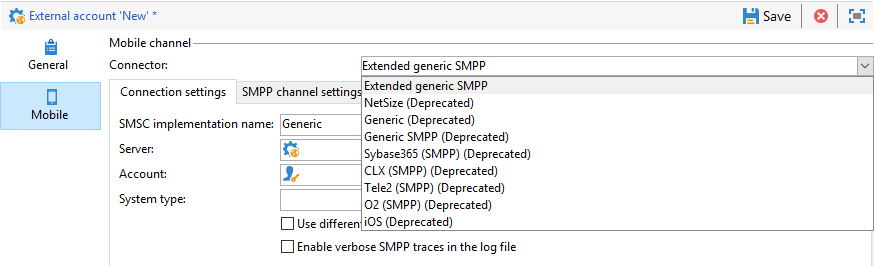

# SMS 채널 {#setting-up-sms-channel} 구성

휴대폰으로 전송하려면 다음이 필요합니다.

1. 커넥터와 메시지 유형을 지정하는 외부 계정.

   이제 레거시 커넥터는 사용되지 않습니다. 더 이상 사용되지 않는 기능은 여전히 사용할 수 있지만 더 이상 향상되거나 지원되지 않습니다. 이 페이지](../../rn/using/deprecated-features.md)에서 [에 대해 자세히 알아보십시오.

1. 이 외부 계정이 참조되는 배달 템플릿입니다.

## SMPP 외부 계정 {#creating-an-smpp-external-account} 만들기

휴대폰에 SMS를 보내려면 먼저 SMPP 외부 계정을 만들어야 합니다.
SMS 프로토콜 및 설정에 대한 자세한 내용은 이 [페이지](../../delivery/using/sms-protocol.md)를 참조하십시오.

이렇게 하려면 아래 단계를 수행합니다:

1. 트리의 **[!UICONTROL Platform]** > **[!UICONTROL External accounts]** 노드에서 **[!UICONTROL New]** 아이콘을 클릭합니다.
1. 계정 유형을 **라우팅**, 채널을 **모바일(SMS)**&#x200B;으로 정의하고 배달 모드는 **대량 배달**&#x200B;으로 정의합니다.

   

1. **[!UICONTROL Enabled]** 상자를 선택합니다.
1. **[!UICONTROL Mobile]** 탭의 **[!UICONTROL Connector]** 드롭다운 목록에서 **[!UICONTROL Extended generic SMPP]**&#x200B;을 선택합니다.

   

   >[!CAUTION]
   >
   > 릴리스 20.2부터 레거시 커넥터는 사용되지 않으며 지원되지 않습니다. **[!UICONTROL Extended generic SMPP]** 커넥터를 사용하는 것이 좋습니다. 권장 커넥터로 마이그레이션하는 방법에 대한 자세한 내용은 이 [페이지](../../delivery/using/unsupported-connector-migration.md)를 참조하십시오.

1. **[!UICONTROL Enable verbose SMPP traces in the log file]** 옵션을 사용하면 모든 SMPP 트래픽을 로그 파일에 덤프할 수 있습니다. 커넥터의 문제를 해결하고 공급자가 보는 트래픽과 비교하려면 이 옵션을 활성화해야 합니다.

1. **[!UICONTROL Connection settings]** 탭에서 다른 외부 계정 필드를 완료하는 방법에 대해 설명하는 SMS 서비스 공급업체에 문의하십시오.

   그런 다음 선택한 항목에 따라 **[!UICONTROL SMSC implementation name]** 필드에 입력할 값을 제공하는 공급자에게 문의하십시오.

   MTA 하위 항목당 공급자에 대한 연결 수를 정의할 수 있습니다. 기본적으로 1로 설정됩니다.

1. 기본적으로 SMS의 문자 수는 GSM 표준을 충족합니다.

   GSM 인코딩을 사용하는 SMS 메시지는 SMS당 160자, 또는 여러 부분으로 나누어 전송되는 메시지의 경우 153자로 제한됩니다.

   >[!NOTE]
   >
   >특정 문자(중괄호, 대괄호, 유로 심벌 등)는 두 글자로 계산합니다.
   >
   >사용 가능한 GSM 문자 목록은 아래에 나와 있습니다.

   원하는 경우 해당 상자를 선택하여 문자 변환을 승인할 수 있습니다.

   

   이 작업에 대한 자세한 정보는 [이 섹션](#about-character-transliteration)을 참조하십시오.

1. **[!UICONTROL Throughput and delays]** 탭에서 아웃바운드 메시지의 최대 처리량(&quot;MT&quot;, 모바일 종료됨)을 초당 MT로 지정할 수 있습니다. 해당 필드에 &quot;0&quot;을 입력하면 처리량이 무제한이 됩니다.

   지속 시간에 해당하는 모든 필드의 값은 초 단위로 입력해야 합니다.

1. **[!UICONTROL Mapping of encodings]** 탭에서 인코딩을 정의할 수 있습니다.

   이 작업에 대한 자세한 정보는 [이 섹션](#about-text-encodings)을 참조하십시오.

1. **[!UICONTROL SMSC specificities]** 탭에서 기본적으로 **[!UICONTROL Send full phone number]** 옵션이 비활성화됩니다. SMPP 프로토콜을 존중하고 SMS 공급자(SMSC)의 서버에 숫자만 전송하려는 경우 활성화하지 마십시오.

   그러나 특정 공급자가 &#39;+&#39; 접두사를 사용해야 하는 경우 공급자에게 확인하는 것이 좋습니다. 필요한 경우 이 옵션을 사용하도록 설정하는 것이 좋습니다.

   **[!UICONTROL Enable TLS over SMPP]** 확인란을 사용하여 SMPP 트래픽을 암호화할 수 있습니다. 자세한 정보는 이 [페이지](../../delivery/using/sms-protocol.md)를 참조하십시오.

1. **[!UICONTROL Extended generic SMPP]** 커넥터를 구성하는 경우 자동 답글을 설정할 수 있습니다.

   이 작업에 대한 자세한 정보는 [이 섹션](#automatic-reply)을 참조하십시오.

## SMS 문자 변환 {#about-character-transliteration}

문자 변환 기능은 SMPP 모바일 배달 외부 계정의 **[!UICONTROL Mobile]** 탭에서 설정할 수 있습니다.

변환은 GSM 표준에서 고려하지 않는 SMS 문자를 다른 문자로 바꾸는 작업입니다.

* 음역법이 **[!UICONTROL authorized]**&#x200B;이면 메시지를 보낼 때 고려되지 않는 각 문자가 GSM 문자로 대체됩니다. 예를 들어 &quot;ë&quot;라는 글자는 &quot;e&quot;로 대체됩니다. 따라서 메시지는 약간 변경되지만 글자 수 제한은 그대로 유지됩니다.
* 음역설이 **[!UICONTROL not authorized]**&#x200B;이면 계산에 포함되지 않은 문자가 포함된 각 메시지가 이진 형식(유니코드)으로 전송됩니다.따라서 모든 문자가 그대로 전송됩니다. 그러나 유니코드를 사용하는 SMS 메시지는 70자(또는 여러 부분으로 나누어 보내는 SMS의 경우 67자)로 제한됩니다. 최대 글자 수를 초과하면 메시지가 여러 개로 보내져 추가 비용이 발생할 수 있습니다.

>[!IMPORTANT]
>
>SMS 메시지의 콘텐츠에 개인화 필드를 삽입하면 GSM 인코딩에서 고려하지 않는 문자가 들어갈 수 있습니다.

문자 변환은 기본적으로 비활성화되어 있습니다. SMS 메시지의 모든 문자를 그대로 유지하려는 경우, 예를 들어 제대로 된 이름이 바뀌지 않게 하려는 경우 이 옵션을 활성화하지 않는 것을 추천합니다.

그러나 SMS 메시지에 유니코드 메시지를 생성하는 문자가 많이 포함된 경우, 이 옵션을 활성화하여 메시지 전송 비용을 제한할 수 있습니다.

다음 표에서는 GSM 표준에서 고려하여 지정한 문자를 보여 줍니다. 아래에 언급된 문자 외에 메시지 본문에 삽입된 모든 문자는 전체 메시지를 이진 형식(유니코드)으로 전환하여 70자로 제한합니다.

**기본 문자**

<table> 
 <tbody> 
  <tr> 
   <td> @ </td> 
   <td>  </td> 
   <td> SP </td> 
   <td> 0 </td> 
   <td> "라는 </td> 
   <td> P </td> 
   <td> 음란 </td> 
   <td> p </td> 
  </tr> 
  <tr> 
   <td> £ </td> 
   <td> ] </td> 
   <td> ! </td> 
   <td> 1 </td> 
   <td> A </td> 
   <td> Q </td> 
   <td> a </td> 
   <td> q </td> 
  </tr> 
  <tr> 
   <td> $ </td> 
   <td>  </td> 
   <td> " </td> 
   <td> 2 </td> 
   <td> B </td> 
   <td> R </td> 
   <td> b </td> 
   <td> r </td> 
  </tr> 
  <tr> 
   <td> ¥ </td> 
   <td>  </td> 
   <td> # </td> 
   <td> 3 </td> 
   <td> C </td> 
   <td> S </td> 
   <td> c </td> 
   <td> s </td> 
  </tr> 
  <tr> 
   <td> è </td> 
   <td>  </td> 
   <td> ¤ </td> 
   <td> 4 </td> 
   <td> D </td> 
   <td> T </td> 
   <td> d </td> 
   <td> t </td> 
  </tr> 
  <tr> 
   <td> é </td> 
   <td>  </td> 
   <td> % </td> 
   <td> 5 </td> 
   <td> E </td> 
   <td> U </td> 
   <td> e </td> 
   <td> u </td> 
  </tr> 
  <tr> 
   <td> ù </td> 
   <td>  </td> 
   <td> &amp; </td> 
   <td> 6 </td> 
   <td> F </td> 
   <td> V </td> 
   <td> f </td> 
   <td> v </td> 
  </tr> 
  <tr> 
   <td> ì </td> 
   <td>  </td> 
   <td> ' </td> 
   <td> 7 </td> 
   <td> G </td> 
   <td> W </td> 
   <td> g </td> 
   <td> w </td> 
  </tr> 
  <tr> 
   <td> ò </td> 
   <td>  </td> 
   <td> ( </td> 
   <td> 8 </td> 
   <td> H </td> 
   <td> X </td> 
   <td> h </td> 
   <td> x </td> 
  </tr> 
  <tr> 
   <td> Ç </td> 
   <td>  </td> 
   <td> ) </td> 
   <td> 9 </td> 
   <td> I </td> 
   <td> Y </td> 
   <td> i </td> 
   <td> y </td> 
  </tr> 
  <tr> 
   <td> LF </td> 
   <td>  </td> 
   <td> * </td> 
   <td> : </td> 
   <td> J </td> 
   <td> Z </td> 
   <td> j </td> 
   <td> z </td> 
  </tr> 
  <tr> 
   <td> Ø </td> 
   <td> ESC </td> 
   <td> + </td> 
   <td> ; </td> 
   <td> K </td> 
   <td> Ä </td> 
   <td> k </td> 
   <td> ä </td> 
  </tr> 
  <tr> 
   <td> ø </td> 
   <td> Æ </td> 
   <td> , </td> 
   <td> &lt;&gt; </td> 
   <td> L </td> 
   <td> Ö </td> 
   <td> l </td> 
   <td> ö </td> 
  </tr> 
  <tr> 
   <td> CR </td> 
   <td> æ </td> 
   <td> - </td> 
   <td> = </td> 
   <td> M </td> 
   <td> Ñ </td> 
   <td> m </td> 
   <td> ñ </td> 
  </tr> 
  <tr> 
   <td> Å </td> 
   <td> ß </td> 
   <td> . </td> 
   <td> &gt; </td> 
   <td> N </td> 
   <td> Ü </td> 
   <td> n </td> 
   <td> ü </td> 
  </tr> 
  <tr> 
   <td> å </td> 
   <td> É </td> 
   <td> / </td> 
   <td> ? </td> 
   <td> O </td> 
   <td> § </td> 
   <td> o </td> 
   <td> à </td> 
  </tr> 
 </tbody> 
</table>

SP: 스페이스

ESC: 이스케이프

LF: 라인 피드

CR: 캐리지 리턴

**고급 문자(두 글자로 계산)**

^ { } `[ ~ ]` | €

## 텍스트 인코딩 {#about-text-encodings}

SMS 메시지를 보낼 때 Adobe Campaign에서는 하나 또는 여러 개의 텍스트 인코딩을 사용할 수 있습니다. 각 인코딩은 고유한 문자 세트를 가지며 SMS 메시지에 맞는 글자 수를 정합니다.

새 SMPP 모바일 배달 외부 계정을 구성할 때 **[!UICONTROL Mobile]** 탭에서 **[!UICONTROL Mapping of encodings]**&#x200B;을 정의할 수 있습니다.**[!UICONTROL data_coding]** 필드를 사용하면 Adobe Campaign에서 SMSC에 사용되는 인코딩을 통신할 수 있습니다.

>[!NOTE]
>
>**data_coding** 값과 실제로 사용되는 인코딩 간의 매핑은 표준화되어 있습니다. 그러나 특정 SMSC에는 고유한 매핑이 있습니다.이 경우 **Adobe Campaign** 관리자가 이 매핑을 선언해야 합니다. 자세한 내용은 공급자에게 문의하십시오.

**data_codings**&#x200B;를 선언할 수 있으며 필요한 경우 인코딩을 강제 적용할 수 있습니다.이렇게 하려면 표에 단일 인코딩을 지정합니다.

* 인코딩의 매핑을 정의하지 않으면 커넥터는 일반 비헤이비어를 수행합니다.

   * 이는 GSM 인코딩을 사용하여 **data_coding = 0** 값을 할당하려고 합니다.
   * GSM 인코딩이 실패할 경우 **UCS2** 인코딩을 사용하여 **data_coding = 8** 값을 할당합니다 .

* 연결된 **[!UICONTROL data_coding]** 필드 값과 함께 사용할 인코딩을 정의할 때 Adobe Campaign은 목록에서 첫 번째 인코딩을 사용하려고 합니다. 첫 번째 인코딩이 불가능하다고 확인되면 다음 사항이 표시됩니다.

>[!IMPORTANT]
>
>선언의 순서가 중요합니다. 목록을 **비용** 오름차순으로 배치하는 것을 추천합니다. 이렇게 하면 각 SMS 메시지에 가능한 많은 문자를 입력할 수 있는 인코딩을 선호하도록 할 수 있습니다.
>
>사용하려는 인코딩만 선언해야 합니다. SMSC에서 제공하는 인코딩 중 일부가 사용자의 사용 목적에 맞지 않을 경우 목록에 선언하지 마십시오.

## 자동 답글 {#automatic-reply}

확장된 일반 SMPP 커넥터를 설정할 때 자동 응답을 구성할 수 있습니다.

구독자가 Adobe Campaign을 통해 전송한 SMS 메시지에 답글을 보내고 &quot;STOP&quot;과 같은 키워드가 포함된 경우 **[!UICONTROL Automatic reply sent to the MO]** 섹션에서 자동으로 다시 보내는 메시지를 구성할 수 있습니다.

>[!NOTE]
>
>키워드는 대/소문자를 구분하지 않습니다.

각 키워드에 대해 일반적으로 배달을 보내는 데 사용되는 숫자인 짧은 코드를 지정하고 발신자 이름으로 사용할 메시지를 가입자에게 입력합니다.

동작을 자동 응답에 연결할 수도 있습니다.**[!UICONTROL Send to quarantine]** 또는 **[!UICONTROL Remove from quarantine]**. 예를 들어 수신자가 &quot;STOP&quot; 키워드를 보낼 경우 구독 취소 확인 메시지를 자동으로 수신하여 격리하도록 전송됩니다.

**[!UICONTROL Remove from quarantine]** 액션을 자동 응답에 연결하면 해당 키워드를 전송하는 수신자는 자동으로 격리되지 않습니다.

수신자는 **[!UICONTROL Administration]** > **[!UICONTROL Campaign Management]** > **[!UICONTROL Non deliverables Management]** 메뉴를 통해 사용할 수 있는 **[!UICONTROL Non deliverables and addresses]** 테이블에 나열됩니다.

* 짧은 코드가 무엇이든 동일한 응답을 보내려면 **[!UICONTROL Short code]** 열을 비워 두십시오.
* 키워드에 상관없이 동일한 응답을 보내려면 **[!UICONTROL Keyword]** 열을 비워 두십시오.
* 응답을 보내지 않고 작업을 수행하려면 **[!UICONTROL Response]** 열을 비워 두십시오. 예를 들어 &quot;중지&quot; 이외의 메시지로 응답하는 사용자를 격리 조치에서 제거할 수 있습니다.

동일한 공급자 계정의 확장 일반 SMPP 커넥터를 사용하는 외부 계정이 여러 개 있는 경우 다음 문제가 발생할 수 있습니다.짧은 코드에 회신을 보낼 때 외부 계정 연결 시 회신을 받을 수 있습니다. 따라서 전송된 자동 회신은 예상 메시지가 될 수 없습니다.
이를 방지하려면 사용 중인 공급자에 따라 다음 솔루션 중 하나를 적용합니다.

* 각 외부 계정에 대해 공급자 계정을 하나 만듭니다.
* **[!UICONTROL Mobile]** > **[!UICONTROL Connection settings]** 탭에서 **[!UICONTROL System type]** 필드를 사용하여 각 짧은 코드를 구분합니다. 각 계정에 대해 다른 값을 제공자에게 요청합니다.

   

확장 범용 SMPP 커넥터를 사용하여 외부 계정을 설정하는 단계는 [SMPP 외부 계정 만들기](#creating-an-smpp-external-account) 섹션에 자세히 설명되어 있습니다.

## 배달 템플릿 {#changing-the-delivery-template} 변경

Adobe Campaign은 모바일에 전달하기 위한 템플릿을 제공합니다. 이 템플릿은 **[!UICONTROL Resources > Templates > Delivery templates]** 노드에서 사용할 수 있습니다. 자세한 내용은 [템플릿 정보](../../delivery/using/about-templates.md) 섹션을 참조하십시오.

SMS 채널을 통해 전달하려면 채널 커넥터를 참조하는 템플릿을 만들어야 합니다.

기본 배달 템플릿을 유지하려면 복제한 다음 구성하는 것이 좋습니다.

아래 예에서, 이전에 활성화된 SMPP 계정을 통해 메시지를 전달하는 템플릿을 만듭니다. 방법은 다음과 같습니다.

1. **[!UICONTROL Delivery templates]** 노드로 이동합니다.
1. **[!UICONTROL Send to mobiles]** 템플릿을 마우스 오른쪽 단추로 클릭하고 **[!UICONTROL Duplicate]** 을 선택합니다.

   

1. 템플릿의 레이블을 변경합니다(예: **모바일로 전송(SMPP)**).

   

1. **[!UICONTROL Properties]**&#x200B;을(를) 클릭합니다.
1. **[!UICONTROL General]** 탭에서 이전 단계에서 만든 외부 계정에 해당하는 라우팅 모드를 선택합니다.

   

1. 템플릿을 만들려면 **[!UICONTROL Save]**&#x200B;을 클릭합니다.

   

이제 외부 계정 및 SMS를 통해 전달할 수 있는 배달 템플릿이 있습니다.
