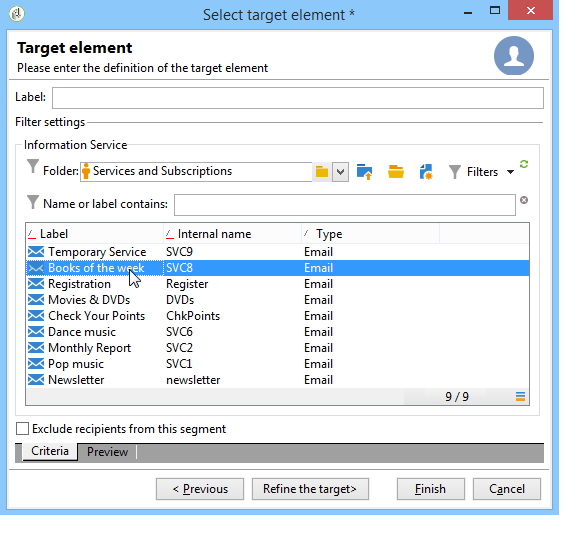

# 타겟 모집단 정의 {#defining-the-target-population}

## 타겟 모집단 정보 {#about-target-populations}

각 게재에 대해 몇 가지 유형의 타겟 모집단을 정의할 수 있습니다. 아래 섹션에서는 선택 방법에 대한 자세한 내용을 제공합니다.

* **배달의**&#x200B;기본 받는 사람. [자세한 내용](../../delivery/using/steps-defining-the-target-population.md#selecting-the-main-target)보기
* **유효성 검사 주기를 설정하기 위해 proof 메시지의**&#x200B;받는 사람. [자세한 내용](../../delivery/using/steps-defining-the-target-population.md#defining-a-specific-proof-target)보기

또한 [시드 주소를](../../delivery/using/about-seed-addresses.md)정의하고 [그룹을](../../campaign/using/marketing-campaign-deliveries.md#defining-a-control-group)제어할 수도 있습니다. 배달이 마케팅 캠페인에 포함된 경우

## 게재의 기본 수신자 선택 {#selecting-the-main-target}

대부분의 경우 기본 타겟은 캠페인 데이터베이스(기본 모드)에서 추출됩니다.

수신자는 외부 파일에 저장할 수도 있습니다. 이 유형의 배달은 외부 수신자 선택에 [표시됩니다](../../delivery/using/steps-defining-the-target-population.md#selecting-external-recipients).

생성할 게재의 수신자를 선택하려면 다음 단계를 수행합니다.

1. 링크를 **[!UICONTROL To]** 클릭합니다.
1. 수신자가 데이터베이스에 저장된 경우 첫 번째 옵션을 선택합니다.

   

1. 드롭다운 목록에서 대상 매핑을 **[!UICONTROL Target mapping]** 선택합니다. Adobe Campaign 기본 대상 매핑은 입니다 **[!UICONTROL Recipients]**.

   다른 대상 매핑을 사용할 수 있으며, 일부 대상 매핑은 특정 구성과 관련될 수 있습니다. 대상 매핑에 대한 자세한 내용은 대상 [매핑](../../delivery/using/selecting-a-target-mapping.md)선택을 참조하십시오.

1. 제한 필터를 정의하려면 **[!UICONTROL Add]** 단추를 클릭합니다.

   그런 다음 적용할 필터링 유형을 선택할 수 있습니다.

   

   데이터베이스에 정의된 타깃팅 유형을 사용하여 수신자를 선택할 수 있습니다. 대상 유형을 사용하려면 해당 유형을 선택하고 을 클릭합니다 **[!UICONTROL Next]**. 각 대상에 대해 **[!UICONTROL Preview]** 탭을 클릭하여 관련 받는 사람을 표시할 수 있습니다. 특정 유형의 대상에 대해 이 **[!UICONTROL Refine target]** 단추를 사용하면 여러 타깃팅 기준을 결합할 수 있습니다.

   기본적으로 다음 타겟 유형이 제공됩니다.

   * **[!UICONTROL Filtering conditions]** :이 옵션을 사용하면 쿼리를 정의하고 결과를 표시할 수 있습니다. 쿼리를 정의하는 방법은 [이 섹션에](../../platform/using/creating-filters.md#creating-an-advanced-filter)있습니다.
   * **[!UICONTROL Subscribers of an information service]** :이 옵션을 사용하면 작성되는 게재의 대상이 될 수신자에게 가입해야 하는 뉴스레터를 선택할 수 있습니다.

      

   * **[!UICONTROL Recipients of a delivery]** :이 옵션을 사용하면 기존 게재의 수신자를 타깃팅 기준으로 정의할 수 있습니다. 그런 다음 목록에서 배달을 선택해야 합니다.

      

   * **[!UICONTROL Delivery recipients belonging to a folder]** :이 옵션을 사용하면 배달 폴더를 선택하고 해당 폴더에서 배달 수신자를 타깃팅할 수 있습니다.

      

      드롭다운 목록에서 선택하여 수신자의 동작을 필터링할 수 있습니다.

      

      >[!NOTE]
      >
      >이 **[!UICONTROL Include sub-folders]** 옵션을 사용하면 선택한 노드 아래의 트리 구조에 있는 폴더에 포함된 배달을 타깃팅할 수도 있습니다.

   * **[!UICONTROL Recipients included in a folder]** :이 옵션을 사용하면 트리의 특정 폴더에 포함된 프로필을 타깃팅할 수 있습니다.
   * **[!UICONTROL A recipient]** :이 옵션을 사용하면 데이터베이스의 프로필에서 특정 수신자를 선택할 수 있습니다.
   * **[!UICONTROL A list of recipients]** :이 옵션을 사용하면 수신자 목록을 타깃팅할 수 있습니다. 목록은 [이 섹션에](../../platform/using/creating-and-managing-lists.md)있습니다.
   * **[!UICONTROL User filters]** :이 옵션을 사용하면 미리 구성된 필터에 액세스하여 데이터베이스의 프로파일에 대한 필터링 기준으로 사용할 수 있습니다. 미리 구성된 필터가 [이 섹션에](../../platform/using/creating-filters.md#saving-a-filter)표시됩니다.
   * 이 옵션을 **[!UICONTROL Exclude recipients corresponding to this segment]** 사용하면 정의된 타겟 기준을 충족하지 않는 수신자를 타깃팅할 수 있습니다. 이 옵션을 사용하려면 해당 상자를 선택한 다음, 앞에서 정의된 대로 타깃팅을 적용하여 결과 프로필을 제외합니다.

      

1. 필드에 이 타깃팅의 이름을 **[!UICONTROL Label]** 입력합니다. 기본적으로 레이블은 첫 번째 타깃팅 기준의 레이블이 됩니다. 조합의 경우 명시적 이름을 사용하는 것이 좋습니다.
1. 구성된 타깃팅을 **[!UICONTROL Finish]** 확인하려면 을 클릭합니다.

   정의된 타깃팅 기준은 기본 대상 구성 탭의 중앙 섹션에 요약됩니다. 조건을 클릭하여 해당 내용(구성 및 미리 보기)을 봅니다. 기준을 삭제하려면 레이블 다음에 있는 십자 기호를 클릭합니다.

   

### 외부 수신자 선택 {#selecting-external-recipients}

데이터베이스에 저장되지 않았지만 외부 파일에 저장된 수신자에 대한 배달을 시작할 수 있습니다. 예를 들어 텍스트 파일에서 가져온 수신자에게 배달을 보낼 것입니다.

이렇게 하려면:

1. 링크를 클릭하여 배달 받는 사람을 선택합니다. **[!UICONTROL To]**
1. 옵션을 **[!UICONTROL Defined in an external file]** 선택합니다.

   

1. 기본적으로 수신자는 데이터베이스에 가져옵니다. 를 선택해야 **[!UICONTROL Target mapping]**&#x200B;합니다. 대상 매핑에 대한 자세한 내용은 대상 [매핑 선택을 참조하십시오](../../delivery/using/selecting-a-target-mapping.md)

   선택할 수도 **[!UICONTROL Do not import the recipients into the database]**&#x200B;있습니다.

1. 수신자를 가져올 때 링크를 클릭하여 외부 파일을 선택하고 구성합니다. **[!UICONTROL File format definition...]**

   데이터 가져오기에 대한 자세한 내용은 [이 섹션을](../../platform/using/importing-data.md#step-2---source-file-selection)참조하십시오.

1. 을 **[!UICONTROL Finish]** 클릭하고 배달을 표준 배달로 구성합니다.

>[!CAUTION]
>
>이메일 전달을 위한 메시지 컨텐츠를 정의할 때 미러 페이지에 대한 링크를 포함하지 마십시오.이 배달 모드에서 생성할 수 없습니다.

### 제외 설정 설정 {#customizing-exclusion-settings}

주소 오류 및 품질 등급은 IAP(서비스 제공업체)에서 제공합니다. 이 정보는 배달 작업 후 수신자 프로필에서 자동으로 업데이트되며 서비스 제공업체에서 반환된 파일이 함께 업데이트됩니다. 프로필에서 읽기 전용으로 볼 수 있습니다.

특정 수의 연속 오류에 도달했거나 이 창에서 지정된 임계값 미만인 주소를 제외하도록 선택할 수 있습니다. 데이터가 반환되지 않은 비적격 주소를 승인할지 여부를 선택할 수도 있습니다.

>[!NOTE]
>
>두 받는 사람의 이름, 성, 우편 번호 및 구/군/시가 DM에서 같은 이름을 갖는 경우 이중 오류가 발생하고 중복이 고려되지 않습니다.

이 **[!UICONTROL Exclusions]** 탭은 메시지 수를 제한하는 데 사용됩니다.

>[!NOTE]
>
>기본 매개 변수는 권장되지만 필요에 따라 설정을 조정할 수 있습니다. 그러나 이러한 옵션은 사용 오류 및 오류를 방지하려면 전문가 사용자만이 변경해야 합니다.

기본 구성을 수정하려면 **[!UICONTROL Edit...]** 링크를 클릭합니다.

다음 옵션을 사용할 수 있습니다.

* **[!UICONTROL Exclude duplicate addresses during delivery]**. 이 옵션은 기본적으로 활성화되어 있습니다.이를 통해 배달 중 중복된 이메일 주소를 제거할 수 있습니다. 적용된 전략은 Adobe Campaign 사용 방식과 데이터베이스의 데이터 유형에 따라 달라질 수 있습니다.

   옵션의 기본값은 각 배달 템플릿에 대해 구성할 수 있습니다.

   예:

   * 뉴스레터 또는 전자 문서 전달. 데이터에 기본 중복 항목이 없는 경우 일부 경우 중복을 제외하지 않습니다. 동일한 이메일 주소를 사용하는 커플 가입은 두 가지 개인화된 이메일 메시지를 받게 됩니다.한 사람 한 사람 한 사람 한 사람 한 사람 한 사람 한 사람 한 사람 한 사람 한 사람 한 사람 한 사람 한 사람 한 사람 한 사람 한 사람 한 사람의 이름으로 주소를 알려 주고 있습니다. 이 경우 이 옵션을 선택 취소할 수 있습니다.
   * 마케팅 캠페인 전달:중복 제외는 동일한 수신자에게 너무 많은 메시지를 보내지 않도록 하기 위해 반드시 필요합니다. 이 경우 이 옵션을 선택할 수 있습니다.

      이 옵션을 선택 해제하면 추가 옵션에 액세스할 수 있습니다. **[!UICONTROL Keep duplicate records (same identifier)]** Adobe 여러 타깃팅 기준을 충족하는 수신자에게 여러 전달을 승인할 수 있습니다.

      

* **[!UICONTROL Exclude recipients who no longer want to be contacted]** , 즉 이메일 주소가 블랙리스트에 있는 받는 사람(&#39;수신 거부&#39;). 전자 마케팅의 전문적인 윤리 및 전자 상거래에 관한 법률을 준수하기 위해 이 옵션을 선택해야 합니다.
* **[!UICONTROL Exclude quarantined recipients]**. 이 옵션을 사용하면 응답하지 않는 주소가 있는 모든 프로필을 대상에서 제외할 수 있습니다. 이 옵션을 계속 선택하는 것이 좋습니다.

   >[!NOTE]
   >
   >격리 관리에 대한 자세한 내용은 검역 관리 [이해를 참조하십시오](../../delivery/using/understanding-quarantine-management.md).

* **[!UICONTROL Limit delivery]** 를 지정된 수의 메시지에 추가합니다. 이 옵션을 사용하면 보낼 최대 메시지 수를 입력할 수 있습니다. 대상의 컨텐츠가 표시된 메시지 수를 초과하는 경우 임의 선택이 대상에 적용됩니다.

### 대상 모집단 크기 줄이기 {#reducing-the-size-of-the-target-population}

대상 모집단 크기를 줄일 수 있습니다. 이렇게 하려면 **[!UICONTROL Requested quantity]** 필드에 내보낼 받는 사람 수를 지정합니다.

## 증명 메시지 받는 사람 선택 {#selecting-the-proof-target}

증명은 기본 타겟으로 전달을 보내기 전에 테스트할 수 있는 특수 메시지입니다. 입증 받는 사람은 메시지의 양식과 내용을 모두 승인해야 합니다.

교정본 대상을 선택하려면 아래 단계를 따르십시오.

1. 링크를 **[!UICONTROL To]** 클릭합니다.
1. 탭을 **[!UICONTROL Target of the proofs]** 클릭합니다.
1. 적용할 방법을 선택하려면 **[!UICONTROL Targeting mode]** 필드를 클릭합니다., **[!UICONTROL Definition of a specific proof target]** **[!UICONTROL Substitution of the address]** 또는 **[!UICONTROL Seed addresses]** **[!UICONTROL Specific target and seed addresses]**&#x200B;를 선택합니다.

>[!NOTE]
>
>일반적으로, 증표의 대상을 주 대상에 추가할 수 있습니다. 이렇게 하려면 **[!UICONTROL Main target]** 탭의 하단 섹션에서 해당 옵션을 선택합니다.

## 특정 증명 대상 정의 {#defining-a-specific-proof-target}

증명 대상을 선택할 때 이 **[!UICONTROL Definition of a specific proof target]** 옵션을 사용하면 데이터베이스의 프로필에서 증명 수신자를 선택할 수 있습니다.

기본 대상을 정의하는 경우와 마찬가지로 **[!UICONTROL Add]** 단추를 사용하여 수신자를 선택하려면 이 옵션을 선택합니다. 기본 [대상](../../delivery/using/steps-defining-the-target-population.md#selecting-the-main-target)선택을 참조하십시오.

For more on proof sending, refer to [this section](../../delivery/using/steps-validating-the-delivery.md#sending-a-proof).

### 증명 시 주소 대체 사용 {#using-address-substitution-in-proof}

데이터베이스에서 전용 수신자를 선택하는 대신 이 **[!UICONTROL Substitution of the address]** 옵션을 사용할 수 있습니다.

이 옵션을 사용하면 배달을 받는 사람 프로필을 사용하고 해당 이메일 주소를 증빙 자료를 수신할 하나 이상의 다른 주소로 바꿀 수 있습니다.

이 옵션을 선택하면 대체를 구성할 수 있는 특수 편집기를 통해 증명 주소가 채워집니다.

구성은 다음과 같이 수행됩니다.

1. 대체를 정의하려면 **[!UICONTROL Add]** 아이콘을 클릭합니다.
1. 사용할 수신자 주소를 입력하거나 목록에서 선택합니다.
1. 증표에 사용할 프로파일을 선택합니다.proof에 있는 대상의 프로필의 데이터를 사용하려면 **[!UICONTROL Random]** **[!UICONTROL Profile to use]** 열에 값을 저장합니다.

   

1. 다음 예와 같이 기본 대상에서 프로파일을 선택하려면 아이콘을 **[!UICONTROL Detail]** 클릭합니다.

   

   필요한 만큼 대체 주소를 정의할 수 있습니다.

## 시드 주소를 증명으로 사용 {#using-seed-addresses-as-proof}

교정본을 대상으로 사용할 **[!UICONTROL Seed addresses]** 수 있습니다.이 옵션을 사용하면 기존 시드 주소 목록을 사용하거나 가져올 수 있습니다.

>[!NOTE]
>
>시드 주소는 [시드 주소에](../../delivery/using/about-seed-addresses.md)표시됩니다.

이 **[!UICONTROL Specific target and Seed addresses]** 옵션을 사용하여 특정 증명 대상의 정의와 시드 주소의 사용을 결합할 수 있습니다. 관련 구성은 두 개의 개별 하위 탭에 정의됩니다.
