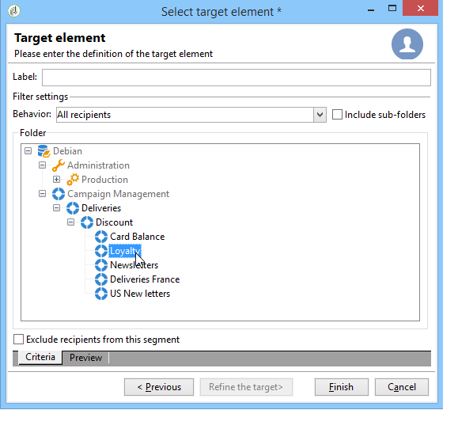

# 대상 모집단 정의 {#defining-the-target-population}

## 대상 모집단 기본 정보 {#about-target-populations}

각 게재에 대해 몇 가지 유형의 대상 모집단을 정의할 수 있습니다.

* **기본 대상**: 메시지를 받을 프로필. [자세히 알아보기](steps-defining-the-target-population.md#selecting-the-main-target)
* **증명**: 유효성 검사 주기에 관련된 증명 메시지 수신자 [자세히 알아보기](steps-defining-the-target-population.md#defining-a-specific-proof-target)
* **시드 주소**: 게재 타겟이 아니지만 게재를 받을 수신자(마케팅 캠페인의 컨텍스트에서만)입니다. [자세히 알아보기](about-seed-addresses.md)
* **컨트롤 그룹**: 게재를 받지 않고, 동작 및 캠페인 영향을 추적하는 데 사용되는 모집단(마케팅 캠페인의 컨텍스트에서만). [자세히 알아보기](../../campaign/using/marketing-campaign-target.md#defining-a-control-group)

## 게재의 주요 수신자 선택 {#selecting-the-main-target}

대부분의 경우 기본 타겟은 Adobe Campaign 데이터베이스(기본 모드)에서 추출됩니다. 그러나 수신자는 외부 파일에도 저장할 수 있습니다. 추가 정보 [이 섹션](steps-defining-the-target-population.md#selecting-external-recipients).

게재 수신자를 선택하려면 아래 단계를 수행하십시오.

1. 게재 편집기에서 을 선택합니다 **[!UICONTROL To]**.
1. 수신자가 데이터베이스에 저장된 경우 첫 번째 옵션을 선택합니다.

   

1. 에서 대상 매핑을 선택합니다 **[!UICONTROL Target mapping]** 드롭다운 목록. Adobe Campaign 기본 대상 매핑은 **[!UICONTROL Recipients]**, **nms:recipient** 스키마.

   다른 대상 매핑을 사용할 수 있으며, 일부는 특정 구성과 관련되어 있을 수 있습니다. 대상 매핑에 대한 자세한 내용은 [대상 매핑 선택](selecting-a-target-mapping.md).

1. 을(를) 클릭합니다. **[!UICONTROL Add]** 제한 필터를 정의하는 단추입니다.

   그런 다음 적용할 필터링 유형을 선택할 수 있습니다.

   

   데이터베이스에 정의된 타겟팅 유형을 사용하여 수신자를 선택할 수 있습니다. 대상 유형을 사용하려면 대상 유형을 선택하고 을 클릭합니다 **[!UICONTROL Next]**. 각 대상에 대해 **[!UICONTROL Preview]** 탭. 특정 유형의 대상의 경우, **[!UICONTROL Refine target]** 버튼을 사용하면 여러 타깃팅 기준을 결합할 수 있습니다.

   기본적으로 다음 대상 유형이 제공됩니다.

   * **[!UICONTROL Filtering conditions]** : 이 옵션을 사용하면 쿼리를 정의하고 결과를 표시할 수 있습니다. 쿼리 정의 방법은 [이 섹션](../../platform/using/creating-filters.md#creating-an-advanced-filter).
   * **[!UICONTROL Subscribers of an information service]** : 이 옵션을 사용하면 만들어지는 게재의 타겟팅할 수신자를 구독해야 하는 뉴스레터를 선택할 수 있습니다.

      

   * **[!UICONTROL Recipients of a delivery]** : 이 옵션을 사용하면 기존 게재의 수신자를 타겟팅 기준으로 정의할 수 있습니다. 그런 다음 목록에서 게재를 선택해야 합니다.

      

   * **[!UICONTROL Delivery recipients belonging to a folder]** : 이 옵션을 사용하면 게재 폴더를 선택하고 해당 폴더에서 게재 수신자를 타겟팅할 수 있습니다.

      

      드롭다운 목록에서 을(를) 선택하여 수신자의 동작을 필터링할 수 있습니다.

      

      >[!NOTE]
      >
      >다음 **[!UICONTROL Include sub-folders]** 또한 옵션을 사용하면 선택한 노드 아래의 트리 구조에 있는 폴더에 포함된 게재를 타깃팅할 수 있습니다.

   * **[!UICONTROL Recipients included in a folder]** : 이 옵션을 사용하면 트리의 특정 폴더에 포함된 프로필을 타겟팅할 수 있습니다.
   * **[!UICONTROL A recipient]** : 이 옵션을 사용하면 데이터베이스의 프로필에서 특정 수신자를 선택할 수 있습니다.
   * **[!UICONTROL A list of recipients]** : 이 옵션을 사용하면 수신자 목록을 타겟팅할 수 있습니다. 목록은 [이 섹션](../../platform/using/creating-and-managing-lists.md).
   * **[!UICONTROL User filters]** : 이 옵션을 사용하면 사전 구성된 필터에 액세스하여 데이터베이스의 프로필에 대한 필터링 기준으로 사용할 수 있습니다. 사전 구성된 필터는 [이 섹션](../../platform/using/creating-filters.md#saving-a-filter).
   * 옵션 **[!UICONTROL Exclude recipients corresponding to this segment]** 정의된 대상 기준을 충족하지 않는 수신자를 타깃팅할 수 있습니다. 이 옵션을 사용하려면 해당 상자를 선택한 다음 앞에서 정의한 대로 타겟팅을 적용하여 결과 프로필을 제외합니다.

      

1. 에서 이 타깃팅의 이름을 입력합니다 **[!UICONTROL Label]** 필드. 기본적으로 레이블은 첫 번째 타깃팅 기준의 레이블이 됩니다. 조합의 경우 명시적인 이름을 사용하는 것이 좋습니다.
1. 클릭 **[!UICONTROL Finish]** 구성된 타겟팅의 유효성을 검사하려면

   정의된 타깃팅 기준은 기본 타겟 구성 탭의 중앙 섹션에 요약되어 있습니다. 해당 컨텐츠(구성 및 미리 보기)를 보려면 기준을 클릭합니다. 기준을 삭제하려면 해당 레이블 뒤에 있는 횡단면을 클릭합니다.

   

### 외부 수신자 선택 {#selecting-external-recipients}

데이터베이스에 저장되지 않고 외부 파일에 저장된 수신자에게 게재를 시작할 수 있습니다. 예를 들어 텍스트 파일에서 가져온 수신자에게 게재를 보냅니다.

방법은 다음과 같습니다.

1. 을(를) 클릭합니다. **[!UICONTROL To]** 링크를 클릭하여 게재 수신자를 선택합니다.
1. 을(를) 선택합니다 **[!UICONTROL Defined in an external file]** 선택 사항입니다.

   

1. 기본적으로 수신자는 데이터베이스에 가져옵니다. 을(를) 선택해야 합니다 **[!UICONTROL Target mapping]**. 대상 매핑에 대한 자세한 내용은 [대상 매핑 선택](selecting-a-target-mapping.md)

   선택할 수도 있습니다 **[!UICONTROL Do not import the recipients into the database]**.

1. 수신자를 가져올 때 **[!UICONTROL File format definition...]** 링크를 클릭하여 외부 파일을 선택하고 구성합니다.

   데이터 가져오기에 대한 자세한 내용은 [이 섹션](../../platform/using/executing-import-jobs.md#step-2---source-file-selection).

1. 클릭 **[!UICONTROL Finish]** 게재를 표준 게재로 구성합니다.

>[!CAUTION]
>
>이메일 전송을 위한 메시지 콘텐츠를 정의할 때 미러 페이지에 대한 링크를 포함하지 마십시오. 이 게재 모드에서는 생성할 수 없습니다.

### 제외 설정 설정 {#customizing-exclusion-settings}

주소 오류 및 품질 등급은 서비스 공급자(IAP)에서 제공합니다. 이 정보는 게재 작업 및 서비스 공급자가 반환하는 파일과 함께 수신자 프로필에서 자동으로 업데이트됩니다. 프로필에서 읽기 전용으로 볼 수 있습니다.

특정 수의 연속 오류에 도달했거나 품질 등급이 이 창에 지정된 임계값 미만인 주소를 제외하도록 선택할 수 있습니다. 반환되지 않은 비적격 주소를 승인할지 여부를 선택할 수도 있습니다.

>[!NOTE]
>
>DM 게재에서 두 수신자의 이름, 성, 우편 번호 및 시가 동일한 경우 두 개의 오류가 발생하고 중복이 고려되지 않습니다.

다음 **[!UICONTROL Exclusions]** 메시지 수를 제한하는 데 탭이 사용됩니다.

>[!NOTE]
>
>기본 매개 변수가 권장되지만 필요에 따라 설정을 조정할 수 있습니다. 그러나 사용 오류 및 오류를 방지하려면 전문가 사용자만이 이러한 옵션을 변경해야 합니다.

을(를) 클릭합니다. **[!UICONTROL Edit...]** 링크를 클릭하여 기본 구성을 수정합니다.

다음 옵션을 사용할 수 있습니다.

* **[!UICONTROL Exclude duplicate addresses during delivery]**. 이 옵션은 기본적으로 활성화되어 있습니다. 게재하는 동안 중복 이메일 주소를 제거할 수 있습니다. 적용된 전략은 Adobe Campaign 사용 방법과 데이터베이스의 데이터 유형에 따라 달라질 수 있습니다.

   옵션 기본값은 각 게재 템플릿에 대해 구성할 수 있습니다.

   예제:

   * 뉴스레터 또는 전자 문서 게재. 데이터에 기본 중복 항목이 없는 경우 중복 항목을 제외하지 않습니다. 동일한 이메일 주소를 사용하는 두 가입을 하면 두 개의 특정 개인화된 이메일 메시지를 받을 수 있습니다. 각 개인에게 이름으로 지정된 하나. 이 경우 이 옵션을 선택 취소할 수 있습니다.
   * 마케팅 캠페인 게재: 동일한 수신자에게 너무 많은 메시지를 보내지 않으려면 중복 제외가 필요합니다. 이 경우 이 옵션을 선택할 수 있습니다.

      이 옵션을 선택 취소하면 추가 옵션에 액세스할 수 있습니다. **[!UICONTROL Keep duplicate records (same identifier)]**. 여러 타겟팅 기준을 충족하는 수신자에게 여러 게재를 승인할 수 있도록 해줍니다.

      

* **[!UICONTROL Exclude recipients who no longer want to be contacted]** : 이메일 주소가에 있는 수신자차단 목록(&#39;옵트아웃&#39;)입니다. 전자 마케팅의 전문 윤리와 전자 상거래를 제어하는 법을 준수하려면 이 선택 사항을 계속 선택해야 합니다.
* **[!UICONTROL Exclude quarantined recipients]**. 이 옵션을 사용하면 응답하지 않는 주소가 있는 모든 프로필을 대상에서 제외할 수 있습니다. 이 옵션을 선택된 상태로 유지하는 것이 좋습니다.

   >[!NOTE]
   >
   >격리 관리에 대한 자세한 내용은 [격리 관리 이해](understanding-quarantine-management.md).

* **[!UICONTROL Limit delivery]** 메시지를 지정된 개수의 메시지로 표시합니다. 이 옵션을 사용하면 보낼 최대 메시지 수를 입력할 수 있습니다. 타겟 콘텐츠가 표시된 메시지 수를 초과하는 경우 임의 선택이 대상에 적용됩니다.

### 대상 모집단 크기 축소 {#reducing-the-size-of-the-target-population}

대상 모집단 크기를 줄일 수 있습니다. 이렇게 하려면 에서 내보낼 수신자 수를 지정합니다 **[!UICONTROL Requested quantity]** 필드.

## 증명 메시지 수신자 선택 {#selecting-the-proof-target}

증명은 주요 타겟에게 보내기 전에 게재를 테스트할 수 있는 특수 메시지입니다. 증명 수신자는 메시지의 양식과 콘텐츠를 모두 승인할 책임이 있습니다.

 [비디오에서 이 기능 살펴보기](#seeds-and-proofs-video)

증명 대상을 선택하려면 아래 단계를 따르십시오.

1. **[!UICONTROL To]** 링크를 클릭합니다.
1. 을(를) 클릭합니다. **[!UICONTROL Target of the proofs]** 탭.
1. 을(를) 클릭합니다. **[!UICONTROL Targeting mode]** 적용할 방법을 선택할 필드: **[!UICONTROL Definition of a specific proof target]** , **[!UICONTROL Substitution of the address]** , **[!UICONTROL Seed addresses]** 또는 **[!UICONTROL Specific target and seed addresses]**.

>[!NOTE]
>
>일반적으로 증명의 대상을 기본 타겟에 추가할 수 있습니다. 이렇게 하려면 **[!UICONTROL Main target]** 탭.

## 특정 증명 대상 정의 {#defining-a-specific-proof-target}

증명 대상을 선택하면 **[!UICONTROL Definition of a specific proof target]** 옵션을 사용하면 데이터베이스의 프로필에서 증명 수신자를 선택할 수 있습니다.

수신자를 선택하려면 이 옵션을 선택합니다 **[!UICONTROL Add]** 버튼을 클릭합니다. 자세한 내용은 [기본 대상 선택](steps-defining-the-target-population.md#selecting-the-main-target).

증명 전송에 대한 자세한 내용은 [이 섹션](steps-validating-the-delivery.md#sending-a-proof).

### 증명 시 주소 대체 사용 {#using-address-substitution-in-proof}

데이터베이스에서 전용 수신자를 선택하는 대신 **[!UICONTROL Substitution of the address]** 선택 사항입니다.

이 옵션을 사용하면 게재 수신자 프로필을 사용하고 해당 이메일 주소를 증명을 받을 하나 이상의 다른 주소로 바꿀 수 있습니다.

이 옵션을 선택하면 대체를 구성할 수 있는 특수 편집기를 통해 증명 주소가 입력됩니다.

구성은 다음과 같이 수행됩니다.

1. 을(를) 클릭합니다. **[!UICONTROL Add]** 아이콘 을 클릭하여 대체를 정의합니다.
1. 사용할 수신자 주소를 입력하거나 목록에서 선택합니다.
1. 증명에서 사용할 프로필을 선택합니다. 저장 **[!UICONTROL Random]** 값에서 **[!UICONTROL Profile to use]** 열에서 타겟 프로필의 데이터를 반환합니다.

   

1. 을(를) 클릭합니다. **[!UICONTROL Detail]** 아이콘을 사용하여 다음 예와 같이 기본 대상에서 프로필을 선택합니다.

   

   필요한 만큼 대체 주소를 정의할 수 있습니다.

## 시드 주소를 증명으로 사용 {#using-seed-addresses-as-proof}

다음을 사용할 수 있습니다 **[!UICONTROL Seed addresses]** 증명을 대상으로 하는 경우: 이 옵션을 사용하면 기존 시드 주소 목록을 사용하거나 가져올 수 있습니다.

>[!NOTE]
>
>시드 주소는 [시드 주소 기본 정보](about-seed-addresses.md).

를 사용하여 특정 증명 대상의 정의와 시드 주소의 사용을 결합할 수 있습니다 **[!UICONTROL Specific target and Seed addresses]** 선택 사항입니다. 그런 다음 관련 구성이 두 개의 개별 하위 탭에서 정의됩니다.

또한 다음을 참조하십시오:

* [증명 대상 선택](#selecting-the-proof-target)
* [시드 주소 정보](about-seed-addresses.md)
* [사용 사례: 기준 시드 주소 선택](use-case--selecting-seed-addresses-on-criteria.md)

## 튜토리얼 비디오 {#seeds-and-proofs-video}

이 비디오에서는 기존 이메일에 시드 및 증명을 추가하는 방법과 보내는 방법을 알아봅니다.

>[!VIDEO](https://video.tv.adobe.com/v/25606?quality=12)

추가 Campaign Classic 방법 비디오를 사용할 수 있습니다 [여기](https://experienceleague.adobe.com/docs/campaign-classic-learn/tutorials/overview.html?lang=ko).
