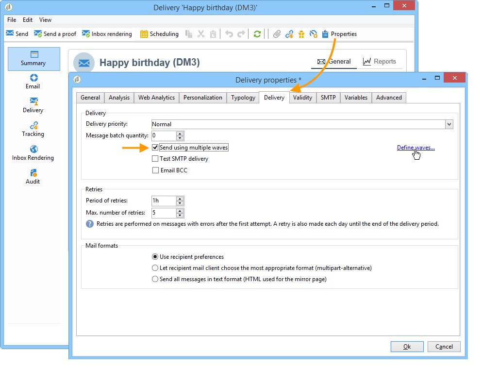
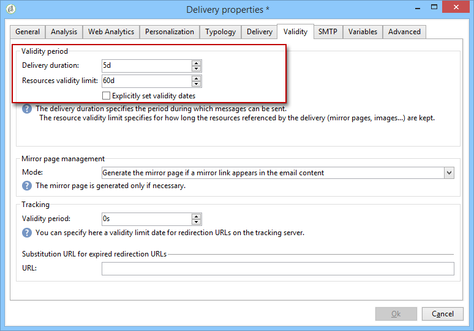

# 배달 {#configuring-and-sending-the-delivery} 구성 및 전송

>[!NOTE]
>
>배달 소유자만 배달을 시작할 수 있습니다. 다른 연산자(또는 연산자 그룹)가 배달을 시작할 수 있으려면 **[!UICONTROL Delivery start:]** 필드에 검토자로 추가해야 합니다.
>
>자세한 내용은 [이 섹션](../../campaign/using/marketing-campaign-approval.md#selecting-reviewers)을 참조하십시오.

## 추가 매개 변수 {#delivery-additiona-parameters} 전달

배달을 전송하기 전에 **[!UICONTROL Delivery]** 탭을 통해 전달 속성에서 전송 매개 변수를 정의할 수 있습니다.

* **[!UICONTROL Delivery priority]**:이 옵션을 사용하면 우선순위 수준(일반, 높음 또는 낮음)을 표시하여 게재의 전송 주문에 영향을 줄 수 있습니다. 이렇게 하면 특정 긴급한 배달 주문에 대해 다른 제품에 비해 우선 순위를 지정할 수 있습니다.

* **[!UICONTROL Message batch quantity]**:이 옵션을 사용하면 동일한 XML 배달 패키지 내에서 그룹화된 메시지 수를 정의할 수 있습니다. 매개 변수가 0으로 설정된 경우 메시지가 자동으로 그룹화됩니다. 패키지 크기는 최소 8개, 최대 256개의 메시지가 패키지로 계산되는 `<delivery size>/1024`에 의해 정의됩니다.

   >[!CAUTION]
   >
   >배달이 중복되면 매개 변수가 재설정됩니다.

* **[!UICONTROL Send using multiple waves]**:자세한 내용은 여러 파도로  [보내기를 참조하십시오](#sending-using-multiple-waves).

* **[!UICONTROL Test SMTP delivery]**:이 옵션을 사용하면 SMTP를 통해 배달 전송을 테스트할 수 있습니다. 배달은 SMTP 서버에 대한 연결까지 처리되지만 전송되지 않습니다.

   >[!NOTE]
   >
   >mta를 호출하지 않도록 mid-sourcing을 사용하는 경우 이 옵션을 사용하는 것이 권장되지 않습니다.
   >
   >SMTP 서버 구성에 대한 자세한 내용은 이 섹션](../../installation/using/configuring-campaign-server.md#personalizing-delivery-parameters)에서 [을 참조하십시오.

* **[!UICONTROL Email BCC]**:이 옵션을 사용하면 메시지 대상에 숨은 참조 이메일 주소를 추가하면 BCC를 통해 외부 시스템에 이메일을 저장할 수 있습니다. 자세한 내용은 [이 섹션](../../delivery/using/sending-messages.md#archiving-emails)을 참조하십시오.

배달을 구성하고 전송할 준비가 되었으면 [배달 분석](../../delivery/using/steps-validating-the-delivery.md#analyzing-the-delivery)을(를) 실행했는지 확인하십시오. 완료되면 **[!UICONTROL Confirm delivery]**&#x200B;을 클릭하여 메시지 배달을 시작합니다.

그런 다음 배달 마법사를 닫고 **[!UICONTROL Delivery]** 탭에서 배달 실행을 추적할 수 있습니다. 이 배달의 세부 정보나 배달 목록을 통해 액세스할 수 있습니다.

메시지를 보낸 후 배달을 모니터링하고 추적할 수 있습니다. 자세한 정보는 다음 섹션을 참조하십시오.

* [게재 모니터링](../../delivery/using/about-delivery-monitoring.md)
* [게재 실패 이해](../../delivery/using/understanding-delivery-failures.md)
* [메시지 추적 기본 정보](../../delivery/using/about-message-tracking.md)

## 배달 전송 예약 {#scheduling-the-delivery-sending}

게재 예약이나 판매 압력을 관리하고 모집단을 지나치게 모집하지 않기 위해 메시지 게재를 연기할 수 있습니다.

1. **[!UICONTROL Send]** 단추를 클릭하고 **[!UICONTROL Postpone delivery]** 옵션을 선택합니다.

1. **[!UICONTROL Contact date]** 필드에 시작 날짜를 지정합니다.

1. 그런 다음 배달 분석을 시작한 다음 배달 전송을 확인할 수 있습니다. 그러나 배달 보내기는 **[!UICONTROL Contact date]** 필드에 지정된 날짜까지 시작되지 않습니다.

>[!CAUTION]
>
>분석을 시작하면 정의한 연락처 날짜가 수정됩니다. 이 날짜를 수정하는 경우 수정을 고려하도록 분석을 다시 시작해야 합니다.

배달 목록에 **[!UICONTROL Pending]** 상태로 배달이 나타납니다.

게재의 **[!UICONTROL Scheduling]** 단추를 통해 업스트림 일정을 구성할 수도 있습니다.

이 기능을 사용하면 배달을 나중 날짜로 연기하거나 임시 달력에 배달을 저장할 수 있습니다.

* **[!UICONTROL Schedule delivery (no automatic execution)]** 옵션을 사용하면 배달에 대한 잠정적인 분석을 예약할 수 있습니다.

   이 구성이 저장되면 배달이 **[!UICONTROL Targeting pending]** 상태로 변경됩니다. 분석은 지정된 날짜에 실행됩니다.

* **[!UICONTROL Schedule delivery (automatic execution on planned date)]** 옵션을 사용하면 배달 날짜를 지정할 수 있습니다.

   **[!UICONTROL Send]**&#x200B;을 클릭하고 **[!UICONTROL Postpone delivery]**&#x200B;을 선택한 다음 분석을 실행하고 배달을 확인합니다. 분석이 완료되면 전달 대상이 준비되고 지정된 날짜에 메시지가 자동으로 전송됩니다.

날짜와 시간은 현재 연산자의 시간대로 표시됩니다. 연락처 날짜 입력 필드 아래에 있는 **[!UICONTROL Time zone]** 드롭다운 목록을 사용하면 입력한 날짜와 시간을 선택한 시간대로 자동으로 변환할 수 있습니다.

예를 들어, 영국 런던 시간으로 8시에 게재가 자동으로 실행되도록 예약하는 경우 시간이 선택한 시간대로 자동 변환됩니다.

## 여러 파도를 사용하여 보내기 {#sending-using-multiple-waves}

로드 밸런싱을 위해 여러 개의 배치로 납품을 나눌 수 있습니다. 전체 배달을 기준으로 배치의 수와 비율을 구성합니다.

>[!NOTE]
>
>두 연속된 파도 사이의 크기와 지연만 정의할 수 있습니다. 각 웨이브에 대한 수신자 선택 기준을 구성할 수 없습니다.

1. 배달 속성 창을 열고 **[!UICONTROL Delivery]** 탭을 클릭합니다.
1. **[!UICONTROL Send using multiple waves]** 옵션을 선택하고 **[!UICONTROL Define waves...]** 링크를 클릭합니다.

   

1. 파도를 구성하려면 다음 중 하나를 수행합니다.

   * 각 웨이브의 크기를 정의합니다. 예를 들어 해당 필드에 **[!UICONTROL 30%]**&#x200B;을 입력하면 마지막 메시지 이외의 메시지 30%가 전달에 포함되며, 이는 메시지의 10%를 나타냅니다.

      **[!UICONTROL Period]** 필드에서 연속되는 두 파고의 시작 사이의 지연을 지정합니다. 예를 들어 **[!UICONTROL 2d]**&#x200B;을 입력하면 첫 번째 물결이 즉시 시작되고, 두 번째 물결은 2일 후에 시작되고, 세 번째 물결은 4일 후에 시작하는 등의 작업을 수행합니다.

      

   * 각 웨이브를 보낼 달력을 정의합니다.

      **[!UICONTROL Start]** 열에서 연속된 두 파고의 시작 사이의 지연을 지정합니다. **[!UICONTROL Size]** 열에 고정 숫자나 백분율을 입력합니다.

      아래 예에서 첫 번째 물결은 전달에 포함된 총 메시지 수의 25%를 나타내며 즉시 시작됩니다. 다음 두 파도는 배달을 완료하고 6시간 간격으로 시작할 예정입니다.

      
   특정 유형 규칙 **[!UICONTROL Wave scheduling check]**&#x200B;은 마지막 물결이 배달 유효성 제한 전에 계획되도록 합니다. 배달 속성의 **[!UICONTROL Typology]** 탭에 구성된 캠페인 유형 및 해당 규칙은 [분류 유형](../../delivery/using/steps-validating-the-delivery.md#validation-process-with-typologies)이 있는 유효성 검사 프로세스에서 제공됩니다.

   >[!CAUTION]
   >
   >마지막 물결이 **[!UICONTROL Validity]** 탭에 정의된 배달 마감일을 초과하지 않도록 하십시오. 그렇지 않으면 일부 메시지가 전송되지 않을 수 있습니다.
   >
   >마지막 파도를 구성할 때 다시 시도할 시간도 충분해야 합니다. [이 섹션](../../delivery/using/steps-sending-the-delivery.md#configuring-retries)을 참조하십시오.

1. 전송을 모니터링하려면 배달 로그로 이동합니다. [이 페이지](../../delivery/using/delivery-dashboard.md#delivery-logs-and-history)를 참조하십시오.

   처리된 파도(**[!UICONTROL Sent]** 상태)에서 이미 전송된 게재와 나머지 파도로 보낼 배달(**[!UICONTROL Pending]** 상태)을 볼 수 있습니다.

아래의 두 가지 예는 여러 파동을 사용하는 데 가장 일반적인 사용 사례입니다.

* **구현 프로세스 중**

   새로운 플랫폼을 사용하여 이메일이 전송되면 인터넷 서비스 제공업체(ISP)는 인식할 수 없는 IP 주소를 의심하게 됩니다. 대량의 이메일이 갑자기 전송되는 경우 ISP는 종종 이메일을 스팸으로 표시합니다.

   스팸으로 표시되지 않도록 물결을 사용하여 보낸 양을 점진적으로 늘릴 수 있습니다. 이렇게 하면 시작 단계를 원활하게 개발하고 잘못된 주소의 전체 비율을 줄일 수 있습니다.

   이렇게 하려면 **[!UICONTROL Schedule waves according to a calendar]** 옵션을 사용합니다. 예를 들어 첫 번째 물결을 10%, 두 번째 물결 중 하나를 15%로 설정하는 등의 작업을 수행합니다.

   

* **콜센터를 포함하는 캠페인**

   전화 충성도 캠페인을 관리할 때 조직은 가입자에 대한 통화 수를 처리할 수 있는 제한된 권한을 가집니다.

   파도를 사용하여 메시지 수를 하루 20개로 제한할 수 있습니다. 이는 콜센터의 일일 처리 용량으로,

   이렇게 하려면 **[!UICONTROL Schedule multiple waves of the same size]** 옵션을 선택합니다. 파도 크기로 **[!UICONTROL 20]**&#x200B;을 입력하고 **[!UICONTROL Period]** 필드에 **[!UICONTROL 1d]**&#x200B;을 입력합니다.

   

## 재시도 구성 {#configuring-retries}

**Soft** 또는 **Ignored** 오류로 인해 일시적으로 배달되지 않은 메시지가 자동 재시도가 적용됩니다. 배달 실패 유형 및 이유는 이 [섹션](../../delivery/using/understanding-delivery-failures.md#delivery-failure-types-and-reasons)에 제공됩니다.

배달 매개 변수에 대한 **[!UICONTROL Delivery]** 탭의 중앙 섹션은 배달 후 하루 동안 재시도할 횟수와 재시도 사이의 최소 지연을 나타냅니다.

기본적으로 배달된 첫 날에 5회 재시도 횟수가 예정되어 있으며 최소 1시간 간격은 하루 24시간에 걸쳐 전달됩니다. 1일 동안 1회 재시도는 그 후 **[!UICONTROL Validity]** 탭에 정의된 배달 마감일까지 프로그래밍됩니다([유효성 기간 정의](../../delivery/using/steps-sending-the-delivery.md#defining-validity-period) 참조).

>[!NOTE]
>
>호스팅 또는 하이브리드 설치의 경우 향상된 MTA로 업그레이드한 경우, 게재의 재시도 설정은 더 이상 Campaign에서 사용되지 않습니다. 소프트 바운스 재시도 횟수와 그 사이의 시간은 메시지의 이메일 도메인에서 돌아오는 바운스 응답 유형 및 심각도를 기준으로 향상된 MTA에 의해 결정됩니다.
>
>모든 영향이 [Adobe Campaign 향상된 MTA](https://helpx.adobe.com/kr/campaign/kb/acc-campaign-enhanced-mta.html) 문서에 자세히 설명되어 있습니다.

## 유효성 기간 정의 {#defining-validity-period}

배달을 시작하면 배달 최종 시간까지 메시지(및 재시도)를 보낼 수 있습니다. 배달 속성에 **[!UICONTROL Validity]** 탭을 통해 표시됩니다.

* **[!UICONTROL Delivery duration]** 필드에서 전역 배달 재시도 횟수를 입력할 수 있습니다. 즉, Adobe Campaign이 시작 날짜에 시작된 메시지를 보낸 다음 오류를 반환하는 메시지의 경우 유효성 제한에 도달할 때까지 정기적으로 구성 가능한 재시도를 수행합니다.

   날짜를 지정할 수도 있습니다. 이렇게 하려면 **[!UICONTROL Explicitly set validity dates]**&#x200B;을 선택합니다. 이 경우 배달 및 유효성 제한 날짜에서도 시간을 지정할 수 있습니다. 현재 시간은 기본적으로 사용되지만 입력 필드에서 직접 수정할 수 있습니다.

* **리소스의 유효성 제한**:이  **[!UICONTROL Validity limit]** 필드는 주로 미러 페이지와 이미지에 대해 업로드된 리소스에 사용됩니다. 이 페이지의 리소스는 제한된 시간 동안 유효합니다(디스크 공간을 절약하기 위함).

   이 필드의 값은 [이 섹션](../../platform/using/adobe-campaign-workspace.md#default-units)에 나열된 단위로 표시할 수 있습니다.

>[!NOTE]
>
>호스팅 또는 하이브리드 설치의 경우 향상된 MTA로 업그레이드한 경우 캠페인 배달의 **[!UICONTROL Delivery duration]** 설정은 **3.5**&#x200B;일 이내로 설정된 경우에만 사용됩니다. 3.5일 이상의 값을 정의하면 고려되지 않습니다.
>
>모든 영향이 [Adobe Campaign 향상된 MTA](https://helpx.adobe.com/campaign/kb/acc-campaign-enhanced-mta.html) 문서에 자세히 설명되어 있습니다.
