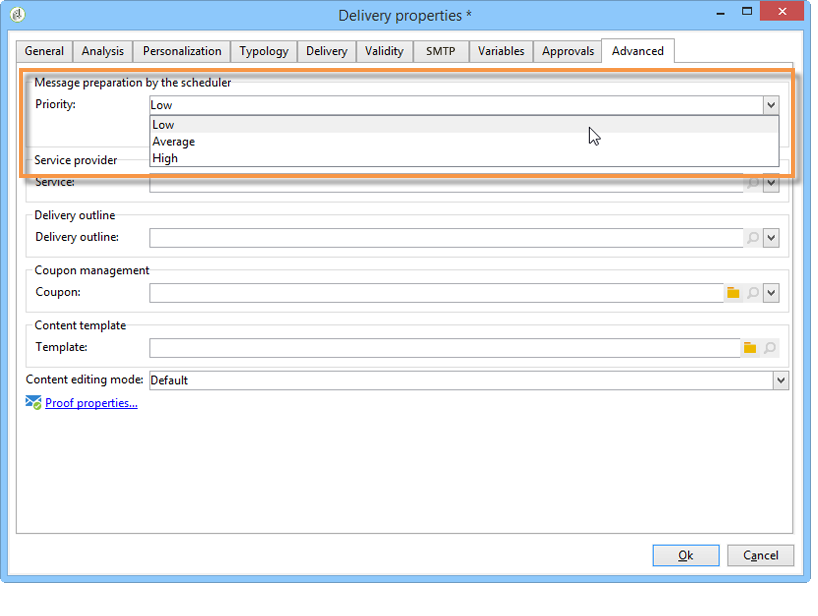
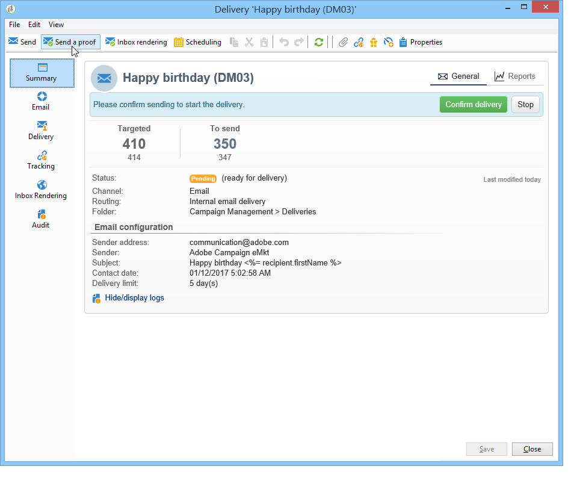
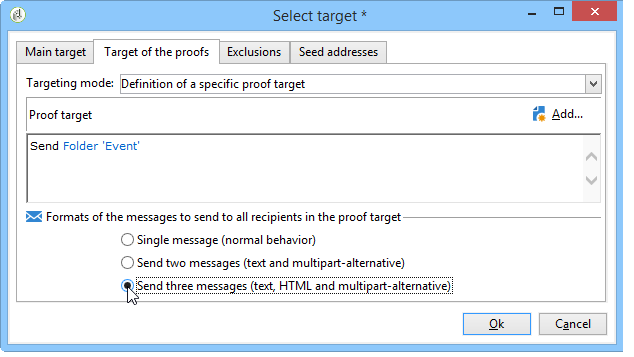
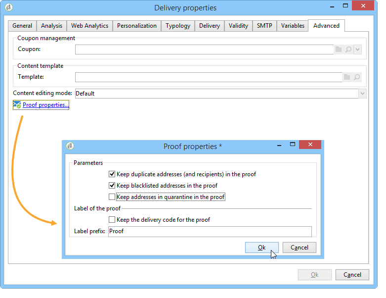
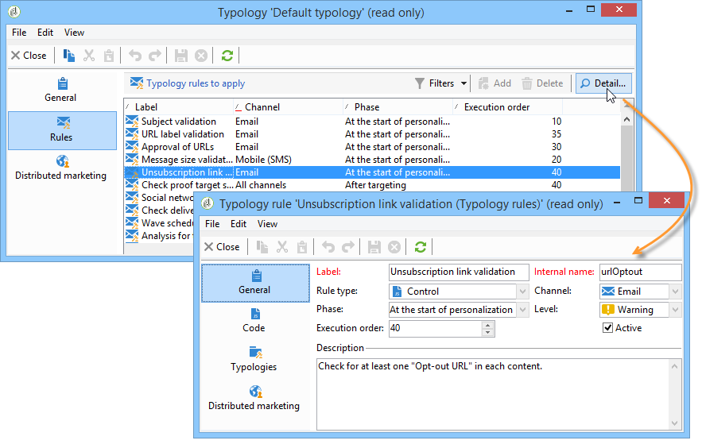

# 배달 유효성 확인 {#validating-the-delivery}

배달을 만들고 구성한 경우 기본 타겟으로 전송하기 전에 유효성을 확인해야 합니다.

이렇게 하려면:

1. **배달 분석**:이 단계에서는 전달할 메시지를 준비할 수 있습니다. 배달 [분석을](#analyzing-the-delivery)참조하십시오.

   사용 가능한 유효성 검사 모드는 승인 [모드](../../delivery/using/steps-validating-the-delivery.md#changing-the-approval-mode)변경에 자세히 설명되어 있습니다.

1. **증명 보내기**:이 단계에서는 컨텐츠, URL, 개인화 필드 등을 승인할 수 있습니다. 증명 [보내기 및](../../delivery/using/steps-validating-the-delivery.md#sending-a-proof) 특정 증명 대상 정의를 참조하십시오.

>[!CAUTION]
>
>이 두 단계는 메시지 컨텐츠를 매번 수정한 후에 반드시 수행해야 합니다.

## 배달 분석 {#analyzing-the-delivery}

분석은 대상 모집단이 계산되고 게재 컨텐츠가 준비된 단계입니다. 완료되면 배송을 보낼 수 있습니다. 배달 분석을 시작하려면 을 클릭하고 **[!UICONTROL Send]**&#x200B;을 선택합니다 **[!UICONTROL Deliver as soon as possible]**.

이 **[!UICONTROL Analyze]** 단추를 사용하면 분석을 수동으로 시작할 수 있습니다. 진행률 표시줄에는 분석 진행률이 표시됩니다. 창의 아래쪽 섹션에 분석 결과가 표시됩니다. 특수 아이콘은 경고를 표시합니다.

>[!NOTE]
>
>유효성 검사 규칙은 유형 분류를 [포함하는 유효성 검사 프로세스에 설명되어 있습니다](../../delivery/using/steps-validating-the-delivery.md#validation-process-with-typologies).

이 작업은 언제든지 클릭하여 중지할 수 **[!UICONTROL Stop]**&#x200B;있습니다.

분석 단계 중에는 메시지가 전송되지 않습니다. 따라서 위험 없이 이 작업을 시작하거나 취소할 수 있습니다.

>[!CAUTION]
>
>분석은 분석 시 전달(또는 증명)을 중지시킵니다. 게재(또는 증명)에 대한 수정 사항은 적용 전에 다른 분석이 뒤따라야 합니다.

마지막 로그 메시지에는 오류 메시지와 오류 수가 표시됩니다. 특수 아이콘에는 오류 유형이 표시됩니다.노란색 아이콘은 중요하지 않은 처리 오류를 나타내며 빨간색 아이콘은 배달 시작을 방해하는 중요한 오류를 나타냅니다.

을 **[!UICONTROL Close]** 클릭하여 오류를 수정합니다. 변경 후 분석을 다시 시작해야 합니다.

을 클릭하여 지정된 타겟으로 메시지를 보내기 전에 분석 결과를 **[!UICONTROL Confirm delivery]** 확인합니다. 확인 메시지를 통해 배달을 시작할 수 있습니다.

>[!NOTE]
>
>전송할 메시지 수가 구성과 일치하지 않는 경우 **[!UICONTROL Change the main delivery target]** 링크를 클릭합니다. 이를 통해 대상 모집단 정의를 변경하고 분석을 다시 시작할 수 있습니다.

전달 매개 변수 **[!UICONTROL Analysis]** 탭에서는 분석 단계 동안 메시지 준비에 대한 정보 세트를 정의할 수 있습니다.

이 탭에서는 다음 옵션에 액세스할 수 있습니다.

* **[!UICONTROL Label and code of the delivery]** :화면의 이 섹션에 대한 옵션은 배달 분석 단계 동안 이러한 필드의 값을 계산하는 데 사용됩니다. 이 **[!UICONTROL Calculate the execution folder during the delivery analysis]** 필드는 분석 단계 동안 이 배달 작업을 포함할 폴더의 이름을 계산합니다.
* **[!UICONTROL Approval mode]** :이 필드를 사용하면 배달 승인 유형을 선택할 수 있습니다. 승인 모드는 유형 지정 [프로세스를 통해 제공됩니다](../../delivery/using/steps-validating-the-delivery.md#validation-process-with-typologies).
* **[!UICONTROL Prepare the personalization data with a workflow]** :이 옵션을 사용하면 자동 워크플로우에서 전달에 포함된 개인화 데이터를 준비할 수 있습니다. 특히 개인화 데이터가 FDA를 통해 외부 표를 통해 제공되는 경우, 많은 데이터를 처리할 때 전달 분석 성능을 크게 향상시킬 수 있습니다. 외부 데이터베이스 [액세스(FDA)](../../platform/using/accessing-an-external-database.md#optimizing-email-personalization-with-external-data) 섹션을 참조하십시오.
* **[!UICONTROL Start job in a detached process]** :이 옵션을 사용하면 별도의 프로세스에서 배달 분석을 시작할 수 있습니다. 분석 함수는 기본적으로 Adobe Campaign 애플리케이션 서버 프로세스(웹 클라이언트 서버)를 사용합니다. 이 옵션을 선택하면 응용 프로그램 서버 오류가 발생하는 경우에도 분석이 완료되도록 합니다.
* **[!UICONTROL Log SQL queries generated during the analysis in the journal]** :이 옵션은 분석 단계 동안 배달 저널에 SQL 쿼리 로그를 추가합니다.
* **[!UICONTROL Ignore personalization scripts during sending]** :이 옵션을 사용하면 HTML 컨텐츠에 있는 JavaScript 지시문의 해석을 우회할 수 있습니다. 배달된 컨텐츠에 그대로 표시됩니다. 이러한 지시어는 **&lt;%=** 태그)와 함께 도입됩니다.

### 분석 우선 순위 구성 {#analysis-priority-}

게재가 캠페인의 일부인 경우 이 **[!UICONTROL Advanced]** 탭에는 추가 옵션이 제공됩니다. 이렇게 하면 동일한 캠페인에서 배달을 위한 처리 순서를 구성할 수 있습니다.

보내기 전에 각 전달이 분석됩니다. 분석 기간은 배달 추출 파일에 따라 다릅니다. 파일 크기가 클수록 분석이 더 오래 걸리고 다음 배달이 대기합니다.

캠페인 워크플로우에서 배달 분석의 우선 순위를 지정할 수 **[!UICONTROL Message preparation by the scheduler]** 있도록 하는 옵션을 제공합니다.

배달이 너무 크면 다른 워크플로우 전달의 분석이 느려지지 않도록 낮은 우선 순위를 지정하는 것이 좋습니다.

>[!NOTE]
>
>더 큰 전달 분석이 워크플로우의 진행을 지연시키지 않도록 하려면 을(를) 똑바르게 하여 실행 일정을 예약할 수 **[!UICONTROL Schedule execution for a time of low activity]**&#x200B;있습니다.

## 증명 보내기 {#sending-a-proof}

메시지 구성에서 발생할 수 있는 오류를 검색하려면 배달 유효성 검사 주기를 설정하는 것이 좋습니다. 테스트 수신자에게 교정본을 전송하여 필요에 따라 자주 컨텐츠가 승인되었는지 확인합니다. 컨텐츠를 승인하려면 변경 사항이 있을 때마다 증명을 보내야 합니다.

>[!NOTE]
>
>* 사용 가능한 유효성 검사 모드는 승인 [모드](../../delivery/using/steps-validating-the-delivery.md#changing-the-approval-mode)변경에 자세히 설명되어 있습니다.
>* 증명 대상의 구성은 특정 증명 [대상](../../delivery/using/steps-defining-the-target-population.md#defining-a-specific-proof-target)정의에 설명되어 있습니다.
>

증거를 전송하려면 아래 절차를 따르십시오.

1. 특정 증명 대상 정의에 설명된 대로 증명 타겟이 구성되었는지 확인합니다.
1. 배달 마법사의 상단 **[!UICONTROL Send a proof]** 막대를 클릭합니다.

   

1. 메시지 분석을 시작합니다. 전달 [분석을](../../delivery/using/steps-validating-the-delivery.md#analyzing-the-delivery)참조하십시오.
1. 이제 배달을 보낼 수 있습니다(배달 [보내기](../../delivery/using/steps-sending-the-delivery.md)참조).

   배달이 전송되면 증명 자료가 배달 목록에 표시되고 자동으로 생성되고 번호가 매겨집니다. 컨텐츠와 속성에 액세스하려면 편집할 수 있습니다. 자세한 내용은 이 [페이지를](../../delivery/using/monitoring-a-delivery.md#delivery-dashboard)참조하십시오.

   

   >[!NOTE]
   >
   >전달을 위해 여러 형식(HTML 및 텍스트)을 만든 경우 창의 하단 섹션에서 증명 수신자에게 보낼 메시지의 형식을 선택할 수 있습니다.

   

검증을 받은 검증 그룹에 의한 모든 댓글의 결과로 전달 내용을 수정할 수 있습니다. 변경한 후 분석을 다시 실행한 다음 다른 증거를 전송해야 합니다. 각 새로운 증명서에 번호가 매겨져 배달 저널에 기록됩니다.

배달을 분석하면 로그의 **[!UICONTROL Proofs]** 하위 탭(**[!UICONTROL Audit]** 탭)을 통해 전송된 다양한 교정본을 볼 수 있습니다.

전달 내용이 완료될 때까지 필요한 만큼 교정본을 보내야 합니다. 그런 다음 배달을 기본 타겟으로 보내고 유효성 검사 주기를 닫을 수 있습니다.

전달 속성의 **[!UICONTROL Advanced]** 탭에서는 증명 자료의 속성을 정의할 수 있습니다. 필요한 경우 수신자 제외 규칙을 무시할 수 있습니다.

다음 옵션을 사용할 수 있습니다.

* 첫 번째 옵션을 사용하면 교정 인쇄본을 두 배로 유지할 수 있습니다.
* 다음 옵션 모두 블랙리스트에 추가된 받는 사람 및 주소를 격리 상태로 유지할 수 있습니다. 제외 설정 사용자 지정에서 기본 대상에 대한 이러한 옵션에 대한 [설명을](../../delivery/using/steps-defining-the-target-population.md#customizing-exclusion-settings)참조하십시오. 이러한 주소는 기본적으로 제외되는 배달 대상과 달리, 기본적으로 증명 대상에 대해 유지됩니다.
* 이 **[!UICONTROL Keep the delivery code for the proof]** 옵션을 사용하면 관련된 전달에 대해 정의된 것과 동일한 배달 코드를 증표에 제공할 수 있습니다. 이 코드는 배달 마법사의 첫 번째 단계에서 지정됩니다.
* 기본적으로, 입증 제목에는 &#39;Proof #&#39;라는 접두사가 붙습니다. 여기서 #은 증표의 번호입니다. 필드에서 이 접두사를 변경할 수 **[!UICONTROL Label prefix]** 있습니다.

## 유형 분류를 사용한 유효성 검사 프로세스 {#validation-process-with-typologies}

메시지를 전송하기 전에 캠페인을 분석하여 해당 컨텐츠 및 구성을 승인해야 합니다. 분석 단계 동안 적용된 확인 규칙은 유형 **분석에 정의됩니다**. 기본적으로 이메일의 경우 분석은 다음 사항을 다룹니다.

* 객체 승인
* URL 및 이미지 승인
* URL 레이블 승인
* 구독 취소 링크 승인
* 교정본 크기 확인
* 유효 기간 확인
* 파도 예약 확인

각 게재에 적용할 유형은 배달 매개 변수의 **[!UICONTROL Typologies]** 탭에서 선택됩니다.

승인 규칙, 해당 컨텐츠, 실행 순서 및 **[!UICONTROL Administration > Campaign execution > Typology management > Typology rules]** 노드를 통해 전체 설명을 보고 편집할 수 있습니다.

이 노드에서 새 규칙을 만들고 새 유형을 정의할 수 있습니다. 그러나 이러한 작업은 JavaScript를 알고 있는 전문 사용자를 위해 예약되어 있습니다.

현재 유형을 편집하려면 필드 오른쪽에 있는 **[!UICONTROL Edit link]** 아이콘을 클릭합니다 **[!UICONTROL Typology]** .

이 **[!UICONTROL Rule]** 탭에는 적용할 유형 규칙 목록이 있습니다. 규칙을 선택하고 **[!UICONTROL Detail...]** 아이콘을 클릭하여 구성을 봅니다.

>[!NOTE]
>
>**[!UICONTROL Arbitration]** 유형 유형은 판매 압력 관리의 프레임워크에서 사용됩니다. For more on this, refer to [this section](../../campaign/using/about-marketing-resource-management.md).

## 승인 모드 변경 {#changing-the-approval-mode}

배달 속성의 **[!UICONTROL Analysis]** 탭에서는 유효성 검사 모드를 선택할 수 있습니다. 분석 중에 경고가 생성되는 경우(예: 특정 문자가 배달 주체에서 입력되는 경우 등) 게재를 구성하여 여전히 실행되어야 하는지 여부를 정의할 수 있습니다. 기본적으로 사용자는 분석 단계 마지막에 메시지 전송을 확인해야 합니다.이것은 **수동** 유효성 검사입니다.

해당 필드의 드롭다운 목록에서 다른 승인 모드를 선택합니다.

다음 승인 모드를 사용할 수 있습니다.

* **[!UICONTROL Manual]**:분석 단계가 끝날 때 사용자가 전송을 시작하려면 배달을 확인해야 합니다. 이렇게 하려면 **[!UICONTROL Start]** 단추를 클릭하여 배달을 시작합니다.
* **[!UICONTROL Semi-automatic]**:분석 단계가 경고 메시지를 생성하지 않는 경우 자동으로 전송이 시작됩니다.
* **[!UICONTROL Automatic]**:전송은 결과에 관계없이 분석 단계가 끝날 때 자동으로 시작됩니다.
