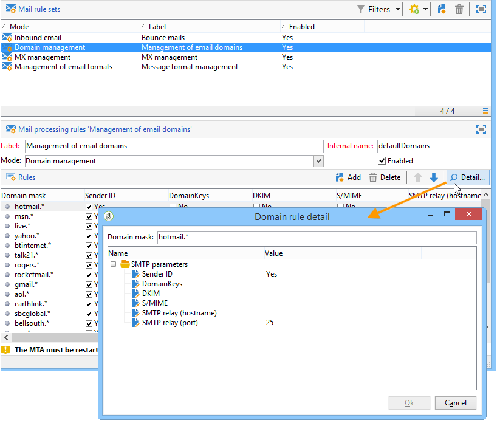

# 게재 실패 이해{#understanding-delivery-failures}

## 게재 실패 기본 정보 {#about-delivery-failures}

프로필에 메시지(이메일, SMS, 푸시 알림)를 보낼 수 없으면 원격 서버에서 오류 메시지를 자동으로 전송합니다. 오류 메시지는 Adobe Campaign 플랫폼에서 선택하며 이메일 주소 또는 전화 번호 격리 여부를 결정할 수 있습니다. 다음을 참조하십시오 [바운스 메일 관리](#bounce-mail-management).

>[!NOTE]
>
>**이메일** 오류 메시지(또는 &quot;반송&quot;)는 Enhanced MTA(동기 반송) 또는 inMail 프로세스(비동기 반송)에 의해 검증됩니다.
>
>**SMS** 오류 메시지(또는 &quot;상태 보고서&quot;의 경우 &quot;SR&quot;)는 MTA 프로세스에 의해 검증됩니다.

메시지가 전송되면 게재 로그를 통해 각 프로필의 게재 상태, 관련 실패 유형 및 이유를 확인할 수 있습니다.

주소가 격리되거나 프로필이 차단 목록에 추가하다에서 제외된 경우 게재 준비 중에 메시지가 제외될 수도 있습니다. 제외된 메시지는 게재 대시보드에 나열됩니다.

**관련 항목:**

* [게재 로그 및 내역](delivery-dashboard.md#delivery-logs-and-history)
* [실패 상태](delivery-performances.md#failed-status)
* [게재 실패 유형 및 이유](#delivery-failure-types-and-reasons)

## 게재 실패 유형 및 이유 {#delivery-failure-types-and-reasons}

메시지가 실패하는 경우 세 가지 유형의 오류가 있습니다. 각 오류 유형은 주소가 격리로 전송되는지 여부를 결정합니다. 자세한 내용은 다음을 참조하십시오. [주소를 격리하는 조건](understanding-quarantine-management.md#conditions-for-sending-an-address-to-quarantine)

* **하드**: &quot;하드&quot; 오류는 잘못된 주소를 나타냅니다. 여기에는 &quot;알 수 없는 사용자&quot;와 같이 주소가 유효하지 않다는 오류 메시지가 명시적으로 표시됩니다.
* **소프트**: 일시적인 오류이거나 &quot;잘못된 도메인&quot; 또는 &quot;사서함 가득 참&quot;과 같이 분류할 수 없는 오류일 수 있습니다.
* **무시됨**: &quot;부재 중&quot;과 같이 일시적인 것으로 알려진 오류이거나 예를 들어 발신자 유형이 &quot;postmaster&quot;인 경우와 같이 기술적인 오류입니다.

게재 실패 이유는 다음과 같습니다.

<table> 
 <tbody> 
  <tr> 
   <td> 오류 레이블 </td> 
   <td> 오류 유형 </td> 
   <td> 기술적 가치 </td> 
   <td> 설명 </td> 
  </tr> 
  <tr> 
   <td> 계정 비활성화 </td> 
   <td> 소프트/하드 </td> 
   <td> 4 </td> 
   <td> 주소에 연결된 계정이 더 이상 활성화되지 않습니다. IAP(인터넷 접속 제공자)가 장기간 동안 비활성화 상태를 감지하면 사용자의 계정을 닫을 수 있습니다. 그러면 사용자의 주소로 배달이 불가능합니다. 6개월 동안 활동이 없어 계정이 일시적으로 비활성화되고 아직 활성화될 수 있는 경우 오류 포함 상태가 할당되고 오류 카운터가 5에 도달할 때까지 계정이 다시 시도됩니다. 오류가 계정이 영구적으로 비활성화되었음을 나타내는 경우 해당 계정은 즉시 격리됨으로 설정됩니다.  </td> 
  </tr> 
  <tr> 
   <td> 격리에 보관된 주소 </td> 
   <td> 하드 </td> 
   <td> 9 </td> 
   <td> 주소가 격리되었습니다.  </td> 
  </tr> 
  <tr> 
   <td> 주소가 지정되지 않음 </td> 
   <td> 하드 </td> 
   <td> 7 </td> 
   <td> 수신자에 대해 주소가 지정되지 않았습니다.  </td> 
  </tr> 
  <tr> 
   <td> 잘못된 품질의 주소 </td> 
   <td> 무시됨 </td> 
   <td> 14 </td> 
   <td> 이 주소의 품질 등급이 너무 낮습니다.  </td> 
  </tr> 
  <tr> 
   <td> 차단 목록에 추가된 주소 </td> 
   <td> 하드 </td> 
   <td> 8 </td> 
   <td> 발송 시 주소가 차단 목록에 추가하다에 추가되었습니다. 이 상태는 외부 목록과 외부 시스템에서 Adobe Campaign 격리 목록으로 데이터를 가져오는 데 사용됩니다.  </td> 
  </tr> 
  <tr> 
   <td> 컨트롤 주소 </td> 
   <td> 무시됨 </td> 
   <td> 127 </td> 
   <td> 수신자 주소는 컨트롤 그룹에 속합니다.  </td> 
  </tr> 
  <tr> 
   <td> 더블 </td> 
   <td> 무시됨 </td> 
   <td> 10 </td> 
   <td> 수신자 주소가 이미 이 게재에 있습니다.  </td> 
  </tr> 
  <tr> 
   <td> 무시된 오류 </td> 
   <td> 무시됨 </td> 
   <td> 25 </td> 
   <td> 주소는 허용 목록에 추가하다에 있습니다. 따라서 오류가 무시되고 이메일이 전송됩니다.  </td> 
  </tr> 
  <tr> 
   <td> 중재 후 제외됨 </td> 
   <td> 무시됨 </td> 
   <td> 12 </td> 
   <td> 수신자가 '중재' 유형 캠페인 유형화 규칙에 의해 제외되었습니다.  </td> 
  </tr> 
  <tr> 
   <td> SQL 규칙에 의해 제외됨 </td> 
   <td> 무시됨 </td> 
   <td> 11 </td> 
   <td> 수신자가 'SQL' 유형 캠페인 유형화 규칙에 의해 제외되었습니다.  </td> 
  </tr> 
  <tr> 
   <td> 잘못된 도메인 </td> 
   <td> 소프트 </td> 
   <td> 2 </td> 
   <td> 이메일 주소의 도메인이 잘못되었거나 더 이상 존재하지 않습니다. 이 프로필은 오류 수가 5개에 도달할 때까지 다시 타겟팅됩니다. 이후 레코드가 격리 상태로 설정되며 다시 시도되지 않습니다.  </td> 
  </tr> 
  <tr> 
   <td> 사서함 가득 참 </td> 
   <td> 소프트 </td> 
   <td> 5 </td> 
   <td> 이 사용자의 사서함이 가득 차서 더 이상의 메시지를 받을 수 없습니다. 이 프로필은 오류 수가 5개에 도달할 때까지 다시 타겟팅됩니다. 이후 레코드가 격리 상태로 설정되며 다시 시도되지 않습니다.  이 유형의 오류는 정리 프로세스에서 관리되며, 주소는 30일 후 유효한 상태로 설정됩니다.  경고: 격리된 주소 목록에서 주소를 자동으로 제거하려면, 데이터베이스 정리 기술 워크플로우를 시작해야 합니다.  </td> 
  </tr> 
  <tr> 
   <td> 연결되지 않음 </td> 
   <td> 무시됨 </td> 
   <td> 6 </td> 
   <td> 메시지가 전송될 때 수신자의 휴대폰은 꺼져 있거나 네트워크에 연결되어 있지 않습니다.  </td> 
  </tr> 
  <tr> 
   <td> 정의되지 않음 </td> 
   <td> 정의되지 않음 </td> 
   <td> 0 </td> 
   <td> 오류가 아직 증가하지 않았기 때문에 주소가 유효합니다. 이 유형의 오류는 서버에서 새 오류 메시지를 보낼 때 발생합니다. 이는 격리된 오류일 수 있지만 다시 발생하면 오류 카운터가 증가하여 기술 팀에게 알립니다. 그런 다음 를 통해 메시지 분석을 수행하고 이 오류를 평가할 수 있습니다. 관리 / Campaign Management / 비게재 항목 관리 트리 구조의 노드  </td> 
  </tr> 
  <tr> 
   <td> 오퍼에 적합하지 않음 </td> 
   <td> 무시됨 </td> 
   <td> 16 </td> 
   <td> 수신자는 게재에서 오퍼에 적합하지 않았습니다.  </td> 
  </tr> 
  <tr> 
   <td> 거부됨 </td> 
   <td> 소프트/하드 </td> 
   <td> 20 </td> 
   <td> 스팸 보고서로 보안 피드백이 발생하여 주소가 격리되었습니다. 오류에 따라 오류 카운터가 5에 도달할 때까지 주소를 다시 시도하거나 격리로 직접 전송됩니다.  </td> 
  </tr> 
  <tr> 
   <td> 크기가 제한된 대상 </td> 
   <td> 무시됨 </td> 
   <td> 17 </td> 
   <td> 수신자의 최대 게재 크기에 도달했습니다.  </td> 
  </tr> 
  <tr> 
   <td> 부적격 주소 </td> 
   <td> 무시됨 </td> 
   <td> 15 </td> 
   <td> 우편 주소가 적격하지 않습니다.  </td> 
  </tr> 
  <tr> 
   <td> 연결할 수 없음 </td> 
   <td> 소프트/하드 </td> 
   <td> 3 </td> 
   <td> 메시지 게재 체인에서 오류가 발생했습니다. SMTP 릴레이, 일시적으로 연결할 수 없는 도메인 등에 문제가 있을 수 있습니다. 오류에 따라 오류 카운터가 5에 도달할 때까지 주소를 다시 시도하거나 격리로 직접 전송됩니다.  </td> 
  </tr> 
  <tr> 
   <td> 사용자 알 수 없음 </td> 
   <td> 하드 </td> 
   <td> 1 </td> 
   <td> 주소가 존재하지 않습니다. 이 프로필에 대해 더 이상 게재를 시도하지 않습니다.  </td> 
  </tr> 
 </tbody> 
</table>

## 일시적 게재 실패 후 다시 시도 {#retries-after-a-delivery-temporary-failure}

다음 이유로 메시지가 실패하는 경우: **소프트** 또는 **무시됨** 일시적인 오류입니다. 게재 기간 동안 다시 시도됩니다.

>[!NOTE]
>
>일시적으로 게재되지 않은 메시지는 **소프트** 또는 **무시됨** 오류이지만 **하드** 오류(참조) [게재 실패 유형 및 이유](#delivery-failure-types-and-reasons)).

>[!IMPORTANT]
>
>호스팅 또는 하이브리드 설치의 경우 를 로 업그레이드한 경우 [향상된 MTA](sending-with-enhanced-mta.md), 게재의 다시 시도 설정은 Campaign에서 더 이상 사용되지 않습니다. 소프트 바운스 재시도 및 재시도 간 시간은 메시지 이메일 도메인에서 돌아오는 바운스 응답의 유형 및 심각도에 따라 고급 MTA에 의해 결정됩니다.

기존 Campaign MTA를 사용하는 온-프레미스 설치 및 호스팅/하이브리드 설치의 경우 게재 기간을 수정하려면 게재 또는 게재 템플릿의 고급 매개 변수로 이동하여 해당 필드에 원하는 기간을 지정합니다. 다음을 참조하십시오 [유효 기간 정의](steps-sending-the-delivery.md#defining-validity-period).

기본 구성에서는 1시간 간격으로 5회 재시도한 후 4일 동안 매일 1회 재시도할 수 있습니다. 다시 시도 횟수는 전체적으로(Adobe 기술 관리자에게 문의) 또는 각 게재 또는 게재 템플릿에 대해 변경할 수 있습니다. 다음을 참조하십시오 [다시 시도 구성](steps-sending-the-delivery.md#configuring-retries).

## 동기 및 비동기 오류 {#synchronous-and-asynchronous-errors}

메시지가 전송된 후 즉시(동기 오류) 또는 나중에(비동기 오류) 실패할 수 있습니다.

* 동기 오류: Adobe Campaign 게재 서버가 접속한 원격 메일 서버에서 즉시 오류 메시지를 반환하여 게재를 프로필 서버로 보낼 수 없습니다. Adobe Campaign은 관련 이메일 주소를 격리해야 하는지 여부를 결정하기 위해 각 오류를 검증합니다. [반송 메일 조건](#bounce-mail-qualification)을 참조하십시오.
* 비동기 오류: 반송 메일 또는 SR이 나중에 수신 서버에 의해 다시 전송되었습니다. 이 메일은 응용 프로그램에서 오류가 있는 메시지에 레이블을 지정하는 데 사용하는 기술 사서함에 로드됩니다. 게재를 보낸 후 1주일까지 비동기 오류가 발생할 수 있습니다.

  >[!NOTE]
  >
  >바운스 사서함 구성에 대해서는 다음에서 자세히 설명합니다. [이 섹션](../../installation/using/deploying-an-instance.md#managing-bounced-emails).

  다음 [되먹임 루프](https://experienceleague.adobe.com/docs/deliverability-learn/deliverability-best-practice-guide/transition-process/infrastructure.html#feedback-loops) 바운스 이메일처럼 작동합니다. 사용자가 이메일을 스팸 처리하면 Adobe Campaign에서 이메일 규칙을 구성하여 이 사용자에게 모든 게재를 차단할 수 있습니다. 이메일을 스팸으로 인증한 사용자에게 전송된 메시지는 이러한 목적을 위해 특별히 만든 이메일 상자를 향해 자동으로 리디렉션됩니다. 구독 취소 링크를 클릭하지 않았는데도 이 사용자들의 주소가 차단 목록에 추가하다에 있습니다. 주소는 ( )에 있는 차단 목록에 추가하다입니다.**Nms 주소**) 격리 테이블이며 (**NmsRecipient**) 수신자 테이블.

  >[!NOTE]
  >
  >컴플레인 관리는 다음에 자세히 설명되어 있습니다. [전달성 관리](about-deliverability.md) 섹션.

## 바운스 메일 관리 {#bounce-mail-management}

Adobe Campaign 플랫폼을 사용하면 바운스 메일 기능을 통해 이메일 게재 실패를 관리할 수 있습니다.

전자 메일을 수신자에게 배달할 수 없는 경우 원격 메시징 서버는 이를 위해 설계된 기술 받은 편지함에 오류 메시지(반송 메일)를 자동으로 반환합니다.

기존 Campaign MTA를 사용하는 온-프레미스 설치 및 호스팅/하이브리드 설치의 경우 오류 메시지는 Adobe Campaign 플랫폼에서 수집하며 inMail 프로세스에서 검증하여 이메일 관리 규칙 목록을 보강합니다.

>[!IMPORTANT]
>
>호스팅 또는 하이브리드 설치의 경우 를 로 업그레이드한 경우 [향상된 MTA](sending-with-enhanced-mta.md), 대부분의 이메일 관리 규칙은 더 이상 사용되지 않습니다. 자세한 내용은 [이 섹션](#email-management-rules)을 참조하십시오.

### 반송 메일 조건 {#bounce-mail-qualification}

>[!IMPORTANT]
>
>호스팅 또는 하이브리드 설치의 경우 를 로 업그레이드한 경우 [향상된 MTA](sending-with-enhanced-mta.md):
>
>* 의 반송 조건 **[!UICONTROL Delivery log qualification]** 표는 더 이상 다음에 사용되지 않습니다: **동시-** 게재 실패 오류 메시지. Enhanced MTA는 바운스 유형 및 자격을 결정하고 해당 정보를 Campaign에 다시 전송합니다.
>
>* ****&#x200B;비동기 반송은 **[!UICONTROL Inbound email]** 규칙을 통해 inMail 프로세스에 의해 계속 검증됩니다. 자세한 내용은 [이메일 관리 규칙](#email-management-rules).
>
>* Enhanced MTA를 사용하는 인스턴스의 경우 **웹후크 없음**, **[!UICONTROL Inbound email]** 규칙은 비동기 바운스 이메일과 동일한 이메일 주소를 사용하여 Enhanced MTA에서 오는 동기 바운스 이메일을 처리하는 데에도 사용됩니다.

기존 Campaign MTA를 사용하는 온-프레미스 설치 및 호스팅/하이브리드 설치의 경우 이메일 배달이 실패하면 Adobe Campaign 배달 서버가 메시징 서버 또는 원격 DNS 서버로부터 오류 메시지를 수신합니다. 오류 목록은 원격 서버에서 반환된 메시지에 포함된 문자열로 구성됩니다. 각 오류 메시지에는 실패 유형 및 이유가 지정됩니다.

이 목록은 다음을 통해 사용할 수 있습니다. **[!UICONTROL Administration > Campaign Management > Non deliverables Management > Delivery log qualification]** 노드. 여기에는 Adobe Campaign에서 게재 실패를 평가하는 데 사용하는 모든 규칙이 포함되어 있습니다. 완벽하지 않으며, Adobe Campaign에 의해 정기적으로 업데이트되며 사용자가 관리할 수도 있습니다.

이 오류 유형이 처음 발생할 때 원격 서버에서 반환한 메시지가 **[!UICONTROL First text]** 열 **[!UICONTROL Delivery log qualification]** 테이블. 이 열이 표시되지 않으면 **[!UICONTROL Configure list]** 목록의 오른쪽 하단에 있는 단추를 클릭하여 선택합니다.

Adobe Campaign은 이 메시지를 필터링하여 변수 콘텐츠(예: ID, 날짜, 이메일 주소, 전화번호 등)를 삭제합니다. 필터링된 결과를 **[!UICONTROL Text]** 열. 변수는 로 대체됩니다. **`#xxx#`**&#x200B;로 대체되는 주소 제외 **`*`**.

이 프로세스를 통해 동일한 유형의 모든 오류를 종합하고 게재 로그 자격 표에서 유사한 오류에 대한 여러 항목을 방지할 수 있습니다.

>[!NOTE]
>
>다음 **[!UICONTROL Number of occurrences]** 필드에는 목록에 있는 메시지의 발생 횟수가 표시됩니다. 발생 횟수는 100,000회로 제한됩니다. 예를 들어 필드를 재설정하려면 필드를 편집할 수 있습니다.

바운스 메일의 자격 상태는 다음과 같습니다.

* **[!UICONTROL To qualify]** : 바운스 메일을 정규화할 수 없습니다. 효율적인 플랫폼 전달성을 보장하기 위해 자격 조건을 전달성 팀에 할당해야 합니다. 자격이 없는 한 바운스 메일은 이메일 관리 규칙 목록을 보강하는 데 사용되지 않습니다.
* **[!UICONTROL Keep]** : 바운스 메일이 적격이며 다음에 의해 사용됩니다. **게재 가능성을 위해 새로 고침** 기존 이메일 관리 규칙과 비교되고 목록을 보강하는 워크플로우입니다.
* **[!UICONTROL Ignore]** : Campaign MTA에서 바운스 메일을 무시합니다. 즉, 이 바운스로 인해 받는 사람의 주소가 격리되지 않습니다. 에서 사용하지 않습니다. **게재 가능성을 위해 새로 고침** 워크플로우는 클라이언트 인스턴스로 전송되지 않습니다.

>[!NOTE]
>
>ISP가 중단되는 경우 Campaign을 통해 전송된 이메일이 바운스로 잘못 표시됩니다. 이 문제를 해결하려면 바운스 자격을 업데이트해야 합니다. 자세한 내용은 [이 페이지](update-bounce-qualification.md)를 참조하십시오.

### 이메일 관리 규칙 {#email-management-rules}

>[!IMPORTANT]
>
>호스팅 또는 하이브리드 설치의 경우 를 로 업그레이드한 경우 [향상된 MTA](sending-with-enhanced-mta.md), 대부분의 이메일 관리 규칙은 더 이상 사용되지 않습니다. 자세한 내용은 아래 섹션을 참조하십시오.

메일 규칙은 **[!UICONTROL Administration > Campaign Management > Non deliverables Management > Mail rule sets]** 노드. 전자 메일 관리 규칙은 창의 아래쪽에 표시됩니다.

>[!NOTE]
>
>플랫폼의 기본 매개 변수는 배포 마법사에서 구성됩니다. 자세한 내용은 다음을 참조하십시오. [이 섹션](../../installation/using/deploying-an-instance.md).

기본 규칙은 다음과 같습니다.

>[!IMPORTANT]
>
>* 매개변수가 변경된 경우 게재 서버(MTA)를 다시 시작해야 합니다.
>* 관리 규칙을 수정하거나 만드는 것은 전문가 사용자만을 위한 것입니다.

#### 인바운드 이메일 {#inbound-email}

<!--
STATEMENT ONLY TRUE with Momentum and EFS+:
For hosted or hybrid installations, if you have upgraded to the [Enhanced MTA](sending-with-enhanced-mta.md), and if your instance has **Webhooks** functionality, the **[!UICONTROL Inbound email]** rules are no longer used for synchronous delivery failure error messages. For more on this, see [this section](#bounce-mail-qualification).

For on-premise installations and hosted/hybrid installations using the legacy Campaign MTA, these rules contain the list of character strings which can be returned by remote servers and which let you qualify the error (**Hard**, **Soft** or **Ignored**).-->

다음 **[!UICONTROL Inbound email]** 규칙에는 원격 서버에서 반환할 수 있는 문자 문자열 목록이 포함되어 있어 오류를 평가할 수 있습니다(**하드**, **소프트** 또는 **무시됨**).

이메일이 실패하면 원격 서버는 바운스 메시지를 [플랫폼 매개 변수](../../installation/using/deploying-an-instance.md). Adobe Campaign은 각 바운스 메일의 콘텐츠를 규칙 목록의 문자열과 비교한 다음 세 가지 중 하나를 지정합니다 [오류 유형](#delivery-failure-types-and-reasons).

>[!NOTE]
>
>사용자는 고유한 규칙을 만들 수 있습니다. 패키지를 가져올 때 및 를 통해 데이터를 업데이트할 때 **게재 가능성을 위해 새로 고침** 워크플로우는 사용자가 만든 규칙을 덮어씁니다.

바운스 메일 자격에 대한 자세한 내용은 [이 섹션](#bounce-mail-qualification).

#### 도메인 관리 {#domain-management}

>[!IMPORTANT]
>
>호스팅 또는 하이브리드 설치의 경우 를 로 업그레이드한 경우 [향상된 MTA](sending-with-enhanced-mta.md), **[!UICONTROL Domain management]** 규칙은 더 이상 사용되지 않습니다. **DKIM(DomainKeys Identified Mail)** 전자 메일 인증 서명은 모든 도메인이 있는 모든 메시지에 대해 Enhanced MTA에서 수행합니다. Enhanced MTA 수준에서 별도로 지정하지 않는 한 **발신자 ID**, **도메인 키** 또는 **S/MIME**&#x200B;으로 서명하지않습니다.

기존 Campaign MTA를 사용하는 온-프레미스 설치 및 호스팅/하이브리드 설치의 경우 Adobe Campaign 메시징 서버는 단일 **도메인 관리** 모든 도메인에 대한 규칙.

<!---->

* 다음과 같은 도메인 이름을 확인하기 위해 특정 식별 표준 및 암호화 키를 활성화할지 여부를 선택할 수 있습니다. **보낸 사람 ID**, **도메인 키**, **D김**, 및 **S/MIME**.
* 다음 **SMTP 릴레이** 매개 변수를 사용하면 특정 도메인에 대한 릴레이 서버의 IP 주소와 포트를 구성할 수 있습니다. 자세한 내용은 [이 섹션](../../installation/using/configuring-campaign-server.md#smtp-relay)을 참조하십시오.

메시지가 Outlook에 **[!UICONTROL on behalf of]** 보낸 사람 주소에서 이메일에 서명하지 않는지 확인합니다. **보낸 사람 ID**: Microsoft의 오래된 독점 이메일 인증 표준입니다. 다음과 같은 경우 **[!UICONTROL Sender ID]** 옵션이 활성화되었습니다. 해당 상자를 선택 취소하고 연락처 표시 [Adobe 고객 지원 센터](https://helpx.adobe.com/kr/enterprise/admin-guide.html/enterprise/using/support-for-experience-cloud.ug.html). 전달성은 영향을 받지 않습니다.

#### MX 관리 {#mx-management}

>[!IMPORTANT]
>
>호스팅 또는 하이브리드 설치의 경우 를 로 업그레이드한 경우 [향상된 MTA](sending-with-enhanced-mta.md), **[!UICONTROL MX management]** 게재 처리량 규칙은 더 이상 사용되지 않습니다. Enhanced MTA는 자체 MX 규칙을 사용하여 사용자의 과거 전자 메일 신뢰도를 기반으로, 전자 메일을 전송하는 도메인에서 오는 실시간 피드백에 따라 도메인별로 처리량을 사용자 정의할 수 있습니다.

기존 Campaign MTA를 사용하는 온-프레미스 설치 및 호스팅/하이브리드 설치의 경우:

* MX 관리 규칙은 특정 도메인에 대한 발신 전자 메일의 흐름을 규제하는 데 사용됩니다. 바운스 메시지를 샘플링하고 해당되는 경우 전송을 차단합니다.

* Adobe Campaign 메시징 서버는 도메인에 대한 규칙을 적용한 다음 규칙 목록에 별표로 표시된 일반 사례에 대한 규칙을 적용합니다.

* MX 관리 규칙을 구성하려면 임계값을 설정하고 특정 SMTP 매개변수를 선택하면 됩니다. A **임계값** 는 특정 도메인에 대한 모든 메시지가 차단되는 오류 백분율로 계산된 제한입니다. 예를 들어 일반적으로 최소 300개의 메시지에 대해 오류율이 90%에 도달하면 3시간 동안 이메일 전송이 차단됩니다.

MX 관리에 대한 자세한 내용은 [이 섹션](../../installation/using/email-deliverability.md#mx-configuration).
