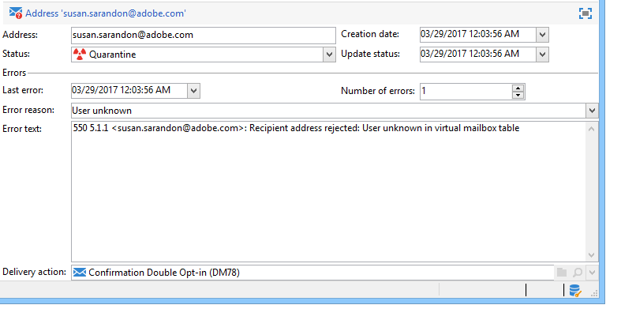

# 스팸 차단 관리 이해{#understanding-quarantine-management}

## 검열에 대해 {#about-quarantines}

Adobe Campaign에서 격리된 주소 목록을 관리합니다. 주소가 격리된 수신자는 배달 분석 중에 기본적으로 제외되며 타깃팅되지 않습니다. 예를 들어, 사서함이 가득 찼거나 주소가 없는 경우 이메일 주소를 격리할 수 있습니다. 어떤 경우든 격리 절차는 아래에 설명된 특정 규칙을 준수합니다.

>[!NOTE]
>
>이 조항은 온라인 채널에 적용됩니다.이메일, SMS, 푸시 알림

### 검역을 통한 전달 최적화 {#optimizing-your-delivery-through-quarantines}

이메일 주소 또는 전화 번호가 격리된 프로필은 메시지 준비 동안 자동으로 제외됩니다(배달할 [격리된 주소](#identifying-quarantined-addresses-for-a-delivery)확인 참조). 이 경우 오류 비율이 배달 속도에 중요한 영향을 주므로 배달 시간을 단축할 수 있습니다.

일부 인터넷 액세스 공급자는 잘못된 주소 비율이 너무 높을 경우 이메일을 스팸으로 자동 간주합니다. 따라서 격리 기능을 사용하면 이러한 제공자에 의한 블랙리스트가 발생하지 않습니다.

게다가, 검역원은 잘못된 전화 번호를 배달에서 제외함으로써 SMS를 보내는 비용을 줄이는 데 도움을 주었다. 게재 보안 및 최적화를 위한 우수 사례에 대한 자세한 내용은 [이 페이지를](https://docs.campaign.adobe.com/doc/AC/getting_started/EN/deliveryBestPractices.html)참조하십시오.

### 격리 대 블랙리스트 {#quarantine-vs-blacklisting}

**검역은** 프로필 자체가 아닌 주소에만 적용됩니다. 즉, 두 프로필의 이메일 주소가 같은 경우 주소가 격리되면 두 프로필 모두에 영향을 줍니다.

마찬가지로, 격리된 이메일 주소를 가진 프로필은 프로필을 업데이트하고 새 주소를 입력한 다음 배달 작업으로 다시 타깃팅될 수 있습니다.

**반면에 블랙리스트는**&#x200B;더 이상 어떤 게재에서도 프로필을 타깃팅하지 않습니다(예: 가입 해지).

>[!NOTE]
>
>사용자가 SMS 전달에서 옵트아웃하기 위해 &quot;STOP&quot;과 같은 키워드로 SMS 메시지에 댓글을 달면, 이 프로필은 이메일 옵트아웃 프로세스와 같이 블랙리스트에 추가되지 않습니다. 프로필 전화 번호는 격리 상태로 전송되어 사용자가 이메일 메시지를 계속 수신하게 됩니다.

## 격리된 주소 확인 {#identifying-quarantined-addresses}

격리된 주소는 특정 배달 또는 전체 플랫폼에 대해 나열될 수 있습니다.

### 배달할 격리된 주소 식별 {#identifying-quarantined-addresses-for-a-delivery}

배달 준비 단계 중에 배달 대시보드의 배달 로그에 특정 게재에 대해 격리된 주소가 [나열됩니다(배달 로그 및 내역](../../delivery/using/monitoring-a-delivery.md#delivery-logs-and-history)참조).

### 전체 플랫폼의 격리된 주소 확인 {#identifying-quarantined-addresses-for-the-entire-platform}

관리자는 **[!UICONTROL Administration > Campaign Management > Non deliverables Management > Non deliverables and addresses]** 노드의 전체 플랫폼에 대해 격리된 주소를 나열할 수 있습니다.

>[!NOTE]
>
>이 메뉴는 **이메일**, SMS 및 **푸시 알림** 채널에 대해 격리된 요소를 **나열합니다** .

각 주소에 대해 다음 정보를 사용할 수 있습니다.



>[!NOTE]
>
>격리의 증가는 데이터베이스의 &quot;마모&quot;와 관련된 일반적인 효과이다. 예를 들어 이메일 주소의 수명이 3년으로 간주되고 수신자의 테이블이 매년 50% 증가하면 격리의 증가는 다음과 같이 계산될 수 있습니다.
>
>연말 1년:(1*0.33)/(1+0.5)=22%
연말 2일:((1.22*0.33)+0.33)/(1.5+0.75)=32.5%

### 배달 보고서에서 격리된 주소 확인 {#identifying-quarantined-addresses-in-delivery-reports}

다음 보고서에서는 격리의 주소에 대한 정보를 제공합니다.

* 배달할 때마다 **[!UICONTROL Delivery summary]** 보고서는 배달 대상의 격리 주소 수를 보여줍니다. 표시되는 항목:

   * 배달 분석 중 격리된 주소 수,

   * 배달 작업 후 격리된 주소 수입니다.

* 이 **[!UICONTROL Non-deliverables and bounces]** 보고서는 격리 주소, 발생한 오류 유형 등에 대한 정보와 도메인별 실패 분류를 표시합니다.

플랫폼의 모든 배달(홈 페이지>보고서)이나&#x200B;**특정 전달에**&#x200B;대해 이 정보를 조회할 수 있습니다. 사용자 지정된 보고서를 만들고 표시할 정보를 선택할 수도 있습니다.

### 받는 사람에 대해 격리된 주소 확인 {#identifying-quarantined-addresses-for-a-recipient}

수신자의 이메일 주소 상태를 조회할 수 있습니다. 이렇게 하려면 수신자 프로필을 선택하고 **[!UICONTROL Deliveries]** 탭을 클릭합니다. 해당 수신자에 대한 모든 배달의 경우, 해당 주소가 실패했는지, 분석 중 격리되었는지 등을 확인할 수 있습니다. 각 폴더에 대해 이메일 주소가 격리 상태인 수신자만 표시할 수 있습니다. 이렇게 하려면 **[!UICONTROL Quarantined email address]** 응용 프로그램 필터를 사용합니다.


### 격리된 주소 제거 {#removing-a-quarantined-address}

격리 시 주소를 제거해야 하는 경우 상태를 수동으로 로 **[!UICONTROL Valid]**&#x200B;변경합니다.


상태를 로 변경하면 오류가 **[!UICONTROL Whitelisted]**&#x200B;발생할 때마다 주소가 체계적으로 타깃팅됩니다.

>[!CAUTION]
블랙리스트에 추가된 주소는 격리 시스템에 영향을 받지 않으며, 주소의 상태를 변경하더라도 타깃팅되지 않습니다.

오류 수와 오류 사이의 기간을 변경할 수도 있습니다. 이렇게 하려면 배포 마법사의 설정을 변경합니다(이메일 채널/고급 설정). 배포 마법사에 대한 자세한 내용은 [이 섹션을](../../installation/using/deploying-an-instance.md)참조하십시오.

## 격리 시 주소를 전송하는 조건 {#conditions-for-sending-an-address-to-quarantine}

Adobe Campaign은 게재 실패 유형 및 오류 메시지 자격(바운스 메일 자격 [참조) 및 배달](../../delivery/using/understanding-delivery-failures.md#bounce-mail-qualification)실패 유형 및 이유에 [](../../delivery/using/understanding-delivery-failures.md#delivery-failure-types-and-reasons)따라 격리됩니다.

* **무시된 오류**:무시된 오류는 주소를 격리로 보내지 않습니다.
* **오류**:해당 이메일 주소는 즉시 격리되도록 전송됩니다.
* **소프트 오류**:소프트 오류는 즉시 격리된 주소를 전송하지 않지만 오류 카운터를 증가시킵니다. 오류 카운터가 제한 임계값에 도달하면 주소가 격리됩니다. 기본 구성에서 임계값은 5개의 오류로 설정되며, 최소 24시간 간격으로 발생하는 경우 두 개의 오류가 중요합니다. 6번째 오류 시 주소가 격리됩니다. 오류 카운터 임계값을 수정할 수 있습니다. 자세한 내용은 배달 임시 실패 [후 재시도를](../../delivery/using/understanding-delivery-failures.md#retries-after-a-delivery-temporary-failure)참조하십시오.

   다시 시도 후 배달을 성공하면 격리된 주소 이전의 오류 카운터가 다시 초기화됩니다. 주소 상태가 **유효로** 변경되고 데이터베이스 정리 **워크플로에 의해 이틀 후 격리 목록에서** 삭제됩니다.

사용자가 이메일을 스팸으로 자격이 되는 경우(**피드백 루프**) 메시지는 Adobe에서 관리하는 기술 사서함으로 자동 리디렉션됩니다. 그러면 사용자의 이메일 주소가 자동으로 격리되도록 전송됩니다.

격리된 주소 목록에서 선택한 주소가 격리된 이유를 **[!UICONTROL Error reason]** 나타내는 필드가 표시됩니다. Adobe Campaign에서 격리 기능은 대소문자를 구분합니다. 이메일 주소를 나중에 다시 타깃팅되지 않도록 소문자로 가져와야 합니다.


## 푸시 알림 검역서 {#push-notification-quarantines}

푸시 알림의 격리 메커니즘은 전체 프로세스와 전역적으로 동일합니다. 검역을 [참조하십시오](#about-quarantines). 그러나 푸시 알림에 대해 특정 오류는 다르게 관리됩니다. 예를 들어 특정 소프트 오류의 경우 동일한 배달 내에서 재시도가 수행되지 않습니다. 푸시 알림에 대한 특구는 아래에 나와 있습니다. 재시도 메커니즘(재시도 횟수, 빈도)은 이메일과 동일합니다.

격리된 항목은 장치 토큰입니다.

### iOS 격리 {#ios-quarantine}

**iOS의 경우 - 이진 커넥터**

각 알림에 대해 Adobe Campaign은 APNS 서버로부터 동기 및 비동기 오류를 수신합니다. 다음 동기 오류에 대해 Adobe Campaign은 소프트 오류를 생성합니다.

* 페이로드 길이 문제:재시도가 없습니다. 실패 이유는 **[!UICONTROL Unreachable]**&#x200B;입니다.
* 인증서 만료 문제:재시도가 없습니다. 실패 이유는 **[!UICONTROL Unreachable]**&#x200B;입니다.
* 배달 중 연결이 끊겼습니다.다시 시도합니다. 실패 이유는 **[!UICONTROL Unreachable]**&#x200B;입니다.
* 서비스 구성 문제(잘못된 인증서, 잘못된 인증서 암호, 인증서 없음):재시도가 없습니다. 실패 이유는 **[!UICONTROL Unreachable]**&#x200B;입니다.

APNS 서버는 장치 토큰이 등록되지 않았음을 Adobe Campaign에 비동기식으로 알려줍니다(사용자가 모바일 응용 프로그램을 제거했을 때). 워크플로우는 6시간마다 **[!UICONTROL mobileAppOptOutMgt]** 실행되어 APNS 피드백 서비스에 문의하여 AppSubscriptionRcp **테이블을 업데이트합니다** . 비활성화된 모든 토큰의 경우 **비활성화** 필드가 True로 설정되고 **** 해당 장치 토큰에 연결된 구독이 자동으로 전달에서 제외됩니다.

**iOS용 - HTTP/2 커넥터**

http/2 프로토콜을 사용하면 각 푸시 전달에 대한 직접적인 피드백과 상태를 확인할 수 있습니다. http/2 프로토콜 커넥터를 사용하는 경우 더 이상 **[!UICONTROL mobileAppOptOutMgt]** 워크플로우에서 피드백 서비스를 호출하지 않습니다. 등록되지 않은 토큰은 iOS 이진 커넥터와 iOS http/2 커넥터 간에 다르게 처리됩니다. 모바일 응용 프로그램을 제거하거나 다시 설치한 경우 토큰은 등록되지 않은 것으로 간주됩니다.

동기적으로, APNS가 메시지에 대해 &quot;등록되지 않은&quot; 상태를 반환하면 대상 토큰은 즉시 격리됩니다.

<table> 
 <tbody> 
  <tr> 
   <td> <strong>시나리오</strong><br /> </td> 
   <td> <strong>상태</strong><br /> </td> 
   <td> <strong>오류 메시지</strong><br /> </td> 
   <td> <strong>실패 유형</strong><br /> </td> 
   <td> <strong>실패 이유</strong><br /> </td> 
   <td> <strong>다시 시도</strong><br /> </td> 
  </tr> 
  <tr> 
   <td> 대상 디바이스 제공<br /> </td> 
   <td> 확인<br /> </td> 
   <td> </td> 
   <td> </td> 
   <td> </td> 
   <td> </td> 
  </tr> 
  <tr> 
   <td> 대상 장치 전원이 꺼짐<br /> </td> 
   <td> 확인<br /> </td> 
   <td> </td> 
   <td> </td> 
   <td> </td> 
   <td> </td> 
  </tr> 
  <tr> 
   <td> 사용자가 응용 프로그램에 대한 알림을 비활성화합니다.<br /> </td> 
   <td> 확인<br /> </td> 
   <td> </td> 
   <td> </td> 
   <td> </td> 
   <td> </td> 
  </tr> 
  <tr> 
   <td> 메시지 생성/분석 단계 - 페이로드가 너무 큽니다.<br /> </td> 
   <td> 실패<br /> </td> 
   <td> 페이로드가 너무 깁니다.<br /> </td> 
   <td> 소프트<br /> </td> 
   <td> 거부됨<br /> </td> 
   <td> 아니요<br /> </td> 
  </tr> 
  <tr> 
   <td> 메시지 생성/분석 단계 - 예기치 않은 컨텐츠 형식 문제<br /> </td> 
   <td> 실패<br /> </td> 
   <td> 오류에 따른 다양한 오류 메시지<br /> </td> 
   <td> 소프트<br /> </td> 
   <td> 정의되지 않음<br /> </td> 
   <td> 아니요<br /> </td> 
  </tr> 
  <tr> 
   <td> 인증서 문제(암호, 손상 등) 및 APNS 문제에 대한 연결 테스트<br /> </td> 
   <td> 실패<br /> </td> 
   <td> 오류에 따른 다양한 오류 메시지<br /> </td> 
   <td> 소프트<br /> </td> 
   <td> 거부됨<br /> </td> 
   <td> 아니요<br /> </td> 
  </tr> 
  <tr> 
   <td> 보내는 동안 네트워크 연결이 끊겼습니다.<br /> </td> 
   <td> 실패<br /> </td> 
   <td> 연결 오류<br /> </td> 
   <td> 정의되지 않음<br /> </td> 
   <td> 연결할 수 없음<br /> </td> 
   <td> 예<br /> </td> 
  </tr> 
  <tr> 
   <td> APNS 메시지 거부:사용자가<br /> 응용 프로그램을 제거했거나 토큰이 만료되었습니다.<br /> </td> 
   <td> 실패<br /> </td> 
   <td> 등록되지 않음<br /> </td> 
   <td> 하드<br /> </td> 
   <td> 사용자를 알 수 없음<br /> </td> 
   <td> 아니요<br /> </td> 
  </tr> 
  <tr> 
   <td> APNS 메시지 거부:기타 모든 오류<br /> </td> 
   <td> 실패<br /> </td> 
   <td> 오류 메시지에 오류 거부 원인이 표시됩니다.<br /> </td> 
   <td> 소프트<br /> </td> 
   <td> 거부됨<br /> </td> 
   <td> 아니요<br /> </td> 
  </tr> 
 </tbody> 
</table>

### Android 격리 {#android-quarantine}

**Android V1용**

각 알림에 대해 Adobe Campaign은 FCM 서버로부터 직접 동기 오류를 수신합니다. Adobe Campaign은 이러한 오류를 신속하게 처리하고 오류 심각도에 따라 하드 또는 소프트 오류를 생성하고 재시도를 수행할 수 있습니다.

* 페이로드 길이 초과, 연결 문제, 서비스 가용성 문제:다시 시도, 소프트 오류, 실패 이유는 **[!UICONTROL Refused]**&#x200B;입니다.
* 장치 할당량 초과:재시도 없음, 소프트 오류, 실패 이유는 **[!UICONTROL Refused]**&#x200B;입니다.
* 잘못되었거나 등록되지 않은 토큰, 예기치 않은 오류, 보낸 사람 계정 문제:다시 시도 없음, 하드 오류, 실패 이유는 **[!UICONTROL Refused]**&#x200B;입니다.

AppSubscriptionRcp 테이블을 업데이트하는 **[!UICONTROL mobileAppOptOutMgt]** 워크플로우는 6시간마다 **실행됩니다** . 등록되지 않았거나 더 이상 유효하지 않다고 선언된 토큰의 경우 **비활성화됨** 필드가 True로 설정되고 **** 해당 장치 토큰에 연결된 구독이 자동으로 이후 배달에서 제외됩니다.

배달 분석 중에 대상에서 제외된 모든 장치가 자동으로 excludeLogAppSubRcp **표에 추가됩니다** .

>[!NOTE]
Baidu 커넥터를 사용하는 고객의 경우 다음과 같은 다양한 유형의 오류가 발생합니다.
* 배달 시작 시 연결 문제:실패 유형 **[!UICONTROL Undefined]**, 실패 이유, **[!UICONTROL Unreachable]**&#x200B;재시도가 수행됩니다.
* 배달 중 연결이 끊겼습니다.소프트 오류, 실패 이유, **[!UICONTROL Refused]**&#x200B;재시도가 수행됩니다.
* 전송 중 Baidu가 반환하는 동기 오류:하드 오류, 실패 이유, **[!UICONTROL Refused]**&#x200B;재시도가 수행되지 않습니다.

Adobe Campaign은 10분마다 Baidu 서버에 연결하여 보낸 메시지의 상태를 검색하고 브로드로그를 업데이트합니다. 메시지가 전송됨으로 선언되면 브로드로그의 메시지 상태가 로 설정됩니다 **[!UICONTROL Received]**. Baidu가 오류를 선언하면 상태가 로 **[!UICONTROL Failed]**&#x200B;설정됩니다.

**Android V2용**

Android V2 격리 메커니즘은 Android V1과 동일한 프로세스를 사용하므로 구독 및 제외 업데이트에 대해서도 마찬가지입니다. 자세한 내용은 Android V1 [섹션을](#android-quarantine) 참조하십시오.

<table> 
 <tbody> 
  <tr> 
   <td> <strong>시나리오</strong><br /> </td> 
   <td> <strong>상태</strong><br /> </td> 
   <td> <strong>오류 메시지</strong><br /> </td> 
   <td> <strong>실패 유형</strong><br /> </td> 
   <td> <strong>실패 이유</strong><br /> </td> 
   <td> <strong>다시 시도</strong><br /> </td> 
  </tr> 
  <tr> 
   <td> 메시지 생성/분석 단계:사용자 지정 필드에 사용된 키워드가 잘못되었습니다.<br /> </td> 
   <td> 실패<br /> </td> 
   <td> 다음 키워드는 사용할 수 없습니다.{1}<br /> </td> 
   <td> 소프트<br /> </td> 
   <td> </td> 
   <td> 아니요<br /> </td> 
  </tr> 
  <tr> 
   <td> 메시지 생성/분석 단계:페이로드가 너무 커<br /> </td> 
   <td> 실패<br /> </td> 
   <td> 알림이 너무 많습니다.{2}만 인증되는 동안 {1}비트<br /> </td> 
   <td> 소프트<br /> </td> 
   <td> 거부됨<br /> </td> 
   <td> 아니요<br /> </td> 
  </tr> 
  <tr> 
   <td> 보내는 동안 네트워크 연결이 끊겼습니다.<br /> </td> 
   <td> 실패<br /> </td> 
   <td> 다음 주소에서 Firebase Cloud Messaging 서비스의 응답이 없습니다.{1}<br /> </td> 
   <td> 소프트<br /> </td> 
   <td> 연결할 수 없음<br /> </td> 
   <td> 예<br /> </td> 
  </tr> 
  <tr> 
   <td> FCM 메시지 거부:FCM 서버를 일시적으로 사용할 수 없습니다(예: 시간 초과). <br /> </td> 
   <td> 실패<br /> </td> 
   <td> Firebase Cloud Messaging 서비스를 일시적으로 사용할 수 없습니다.<br /> </td> 
   <td> 소프트<br /> </td> 
   <td> 연결할 수 없음<br /> </td> 
   <td> 예<br /> </td> 
  </tr> 
  <tr> 
   <td> FCM 메시지 거부:보낸 사람 계정 인증 오류<br /> </td> 
   <td> 실패<br /> </td> 
   <td> 개발자 계정을 식별하지 못했습니다. ID와 암호를 확인하십시오.<br /> </td> 
   <td> 소프트<br /> </td> 
   <td> 거부됨<br /> </td> 
   <td> 아니요<br /> </td> 
  </tr> 
  <tr> 
   <td> FCM 메시지 거부:장치 할당량 초과<br /> </td> 
   <td> 실패<br /> </td> 
   <td> </td> 
   <td> 소프트<br /> </td> 
   <td> 거부됨<br /> </td> 
   <td> 예<br /> </td> 
  </tr> 
  <tr> 
   <td> FCM 메시지 거부:잘못된 등록/등록되지 않음<br /> </td> 
   <td> 실패<br /> </td> 
   <td> </td> 
   <td> 하드<br /> </td> 
   <td> 사용자를 알 수 없음<br /> </td> 
   <td> 아니요<br /> </td> 
  </tr> 
  <tr> 
   <td> FCM 메시지 거부:기타 모든 오류<br /> </td> 
   <td> 실패<br /> </td> 
   <td> Firebase Cloud Messaging 서버에서 예기치 않은 오류 코드를 반환했습니다.{1} </td> 
   <td> </td> 
   <td> 거부됨<br /> </td> 
   <td> 아니요<br /> </td> 
  </tr> 
 </tbody> 
</table>

## SMS 검역이 {#sms-quarantines}

**표준 커넥터의 경우**

SMS 메시지의 격리 메커니즘은 전체적으로 일반적인 프로세스와 동일합니다. 검역을 [참조하십시오](#about-quarantines). SMS에 대한 설명은 아래에 나와 있습니다.

>[!NOTE]
이 **[!UICONTROL Delivery log qualification]** 테이블은 확장 일반 SMPP **커넥터에 적용되지 않습니다** .

<table> 
 <tbody> 
  <tr> 
   <td> <strong>시나리오</strong><br /> </td> 
   <td> <strong>상태</strong><br /> </td> 
   <td> <strong>오류 메시지</strong><br /> </td> 
   <td> <strong>실패 유형</strong><br /> </td> 
   <td> <strong>실패 이유</strong><br /> </td> 
  </tr> 
  <tr> 
   <td> 공급자에게 전송<br /> </td> 
   <td> 전송<br /> </td> 
   <td> </td> 
   <td> </td> 
   <td> </td> 
  </tr> 
  <tr> 
   <td> 모바일에서 수신됨<br /> </td> 
   <td> 수신<br /> </td> 
   <td> </td> 
   <td> </td> 
   <td> </td> 
  </tr> 
  <tr> 
   <td> 공급자가 반환하는 오류<br /> </td> 
   <td> 실패<br /> </td> 
   <td> 데이터 수신 중 오류 발생(SR 또는 MO)<br /> </td> 
   <td> 소프트<br /> </td> 
   <td> 연결할 수 없음<br /> </td> 
  </tr> 
  <tr> 
   <td> 잘못된 MT 확인<br /> </td> 
   <td> 실패<br /> </td> 
   <td> 쿼리 전송을 위한 승인 프레임을 처리하는 동안 오류 '{1}'<br /> </td> 
   <td> 소프트<br /> </td> 
   <td> 연결할 수 없음<br /> </td> 
  </tr> 
  <tr> 
   <td> MT를 전송하는 동안 오류가 발생했습니다.<br /> </td> 
   <td> 실패<br /> </td> 
   <td> 메시지를 보내는 동안 오류가 발생했습니다.<br /> </td> 
   <td> 소프트<br /> </td> 
   <td> 연결할 수 없음<br /> </td> 
  </tr> 
 </tbody> 
</table>

**확장 일반 SMPP 커넥터의 경우**

SMPP 프로토콜을 사용하여 SMS 메시지를 보낼 때 오류 관리는 다르게 처리됩니다. 확장 일반 SMPP 커넥터에 대한 자세한 내용은 [이 페이지를](../../delivery/using/sms-channel.md#creating-an-smpp-external-account)참조하십시오.

SMPP 커넥터는 정규 표현식(등록)을 사용하여 반환되는 SR(상태 보고서) 메시지의 데이터를 검색하여 컨텐츠를 필터링합니다. 그런 다음 이 데이터는 **[!UICONTROL Delivery log qualification]** 표에 있는 정보와 일치합니다( **[!UICONTROL Administration]** > **[!UICONTROL Campaign Management]** > **[!UICONTROL Non deliverables Management]** 메뉴를 통해 사용 가능).

새로운 유형의 오류가 검증되기 전에 실패 이유는 항상 **기본적으로 거부됨으로** 설정됩니다.

>[!NOTE]
실패 유형 및 실패 이유는 이메일과 동일합니다. 게재 [실패 유형 및 이유를](../../delivery/using/understanding-delivery-failures.md#delivery-failure-types-and-reasons)참조하십시오.
제공 로그 자격 테이블에서 적절한 실패 유형 및 실패 이유를 설정하려면 공급자에게 상태 및 오류 코드 목록을 요청하십시오.

생성된 메시지의 예:

```
SR Generic DELIVRD 000|#MESSAGE#
```

* 모든 오류 메시지는 SR **로** 시작하여 SMS 오류 코드와 이메일 오류 코드를 구별합니다.
* 오류 메시지의 두 번째&#x200B;**부분** (이 예에서는 일반)은 SMS 외부 계정 **[!UICONTROL SMSC implementation name]** 필드에 정의된 것과 같이 SMSC 구현의 이름을 나타냅니다. 이 [페이지를](../../delivery/using/sms-channel.md#creating-an-smpp-external-account)참조하십시오.

   동일한 오류 코드는 각 공급자에 대해 다른 의미를 가질 수 있으므로 이 필드를 통해 오류 코드를 생성한 공급자를 알 수 있습니다. 그런 다음 관련 공급자의 설명서에서 오류를 찾을 수 있습니다.

* 오류 메시지의 세 번째&#x200B;**부분(이** 예제의 DELIVRD)은 SMS 외부 계정에 정의된 상태 추출 규칙을 사용하여 SR에서 검색한 상태 코드에 해당합니다.

   이 참조는 외부 계정의 **[!UICONTROL SMSC specificities]** 탭에 지정됩니다. 이 [페이지를](../../delivery/using/sms-channel.md#creating-an-smpp-external-account)참조하십시오.

   

   **기본적으로 regex는**&#x200B;통계를 추출합니다.필드를 참조하십시오. **** ****

* 오류 메시지의 네 번째 부분(**이** 예에서는 000)은 SMS 외부 계정에 정의된 오류 코드 추출 규칙을 사용하여 SR에서 추출된 오류 코드에 해당합니다.

   이 참조는 외부 계정의 **[!UICONTROL SMSC specificities]** 탭에 지정됩니다. 이 [페이지를](../../delivery/using/sms-channel.md#creating-an-smpp-external-account)참조하십시오.

   **기본적으로 regex는**&#x200B;오류를 추출합니다.필드를 참조하십시오. **** ****

* 파이프 기호(|) 다음에 오는 모든 내용은 **[!UICONTROL First text]** 표의 **[!UICONTROL Delivery log qualification]** 열에만 표시됩니다. 이 컨텐츠는 메시지가 표준화된 **#MESSAGE#** 로 대체됩니다. 이 프로세스에서는 유사한 오류에 대해 여러 항목을 사용하지 않고 이메일과 동일합니다. 자세한 내용은 바운스 [메일 자격을](../../delivery/using/understanding-delivery-failures.md#bounce-mail-qualification)참조하십시오.

확장 일반 SMPP 커넥터는 합리적인 기본값을 찾기 위해 휴리스틱을 적용합니다.상태가 DELIV로 시작하는 **경우**&#x200B;대부분의 제공자가 사용하는 일반적인 상태 DELIVERD **또는 DELIVERED와** 일치하므로 **성공으로** 간주됩니다. 다른 모든 상태는 심각한 실패로 이어진다.
