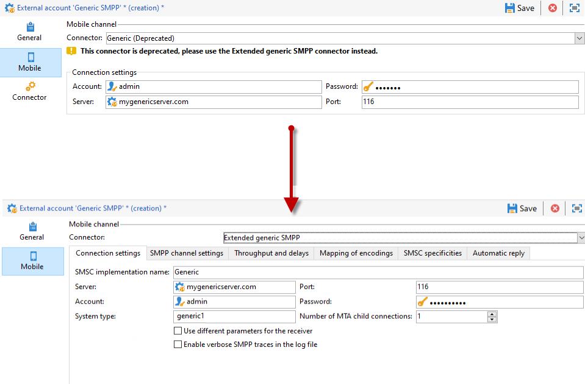

# 지원되지 않는 SMS 커넥터를 확장된 일반 SMPP 커넥터로 마이그레이션합니다{#unsupported-connector-migration}

릴리스 20.2부터 레거시 커넥터는 사용되지 않습니다. 이 문서는 이전 시스템에서 아직 실행 중인 커넥터를 권장 SMPP 커넥터로 마이그레이션하는 데 도움이 됩니다.

>[!CAUTION]
>
>이 마이그레이션은 필수는 아니지만 Adobe에서 권장되며 지원되는 최신 버전의 소프트웨어를 사용하여 실행 중인지 확인합니다.

## SMS 커넥터 정보 {#about-sms-connectors}

다음 커넥터는 릴리스 20.2부터 사용되지 않습니다.

* **[!UICONTROL Generic SMPP]** (SMPP 버전 3.4 지원 바이너리 모드)
* **[!UICONTROL Sybase365]** (SAP SMS 365)
* **[!UICONTROL CLX Communications]**
* **[!UICONTROL Tele2]**
* **[!UICONTROL O2]**
* **[!UICONTROL iOS]**

사용 중단되는 기능은 계속 사용 및 지원되지만 더 이상 개선되지는 않습니다. **[!UICONTROL Extended generic SMPP]** 커넥터를 사용하는 것이 좋습니다.

더 이상 사용되지 않는 기능과 제거된 기능에 대한 자세한 내용은 이 [page](../../rn/using/deprecated-features.md)을 참조하십시오.

이전 SMS 커넥터는 웹 프로세스를 오버로드하는 Java SMS 커넥터를 사용합니다. 새 **[!UICONTROL Extended Generic SMPP]** 커넥터로 마이그레이션하면 이 로드를 지원할 수 있는 MTA로 이동합니다.

## 확장 일반 SMPP 커넥터로 마이그레이션 {#migrating-extended-generic-smpp}

>[!CAUTION]
>
>매개 변수를 바꿀 수 있더라도 **[!UICONTROL Extended Generic SMPP]** 커넥터를 구성하려면 공급자에게 문의하여 나머지 매개 변수를 채우는 데 필요한 정보를 제공합니다. 자세한 정보는 이 [페이지](sms-protocol.md)를 참조하십시오.

먼저 새 **[!UICONTROL Extended Generic SMPP]** 외부 계정을 만들어야 합니다. 그런 다음 일부 매개 변수를 바꿀 수 있습니다. 이 [page](sms-set-up.md#creating-an-smpp-external-account)에서 자세한 단계를 찾을 수 있습니다.

이제 이전 커넥터에 따라 새로 만든 **[!UICONTROL Extended Generic SMPP]** 외부 계정의 **[!UICONTROL Mobile]** 탭에서 매개 변수를 입력해야 합니다.

### 일반 커넥터에서 {#from-generic-connector}

**[!UICONTROL Generic]** 커넥터를 선택할 때 각 상황에 맞는 사용자 지정 JavaScript 커넥터가 있어야 합니다.

이 커넥터가 이미 SMPP 프로토콜을 사용하고 있음을 알고 있으면 **[!UICONTROL Extended Generic SMPP]** 커넥터로 마이그레이션할 수 있습니다. 그렇지 않은 경우 공급자가 SMPP 프로토콜을 지원하는지 공급자에게 확인하고 컨설턴트의 도움을 받아 새 커넥터를 설정합니다.

**[!UICONTROL Generic]** 커넥터에서 새로 만든 **[!UICONTROL Extended SMPP]** 계정으로 이동할 수 있습니다.

**[!UICONTROL Connection Settings]** 탭에서 다음을 수행합니다.

* **[!UICONTROL Account]**
* **[!UICONTROL Password]**
* **[!UICONTROL Server]**
* **[!UICONTROL Port]**

### 일반 SMPP 커넥터에서 {#from-generic-smpp-connector}

**[!UICONTROL Generic SMPP]** 커넥터에서 새로 만든 **[!UICONTROL Extended SMPP]** 계정으로 이동할 수 있습니다.

**[!UICONTROL Connection Settings]** 탭에서 다음을 수행합니다.

* **[!UICONTROL Account]**
* **[!UICONTROL Password]**
* **[!UICONTROL Server]**
* **[!UICONTROL Port]**
* **[!UICONTROL System Type]**

**[!UICONTROL SMPP Channel Settings]** 탭에서 다음을 수행합니다.

* **[!UICONTROL Source number]**
* **[!UICONTROL Source NPI]**
* **[!UICONTROL Destination NPI]**
* **[!UICONTROL Source TON]**
* **[!UICONTROL Destination TON]**

**[!UICONTROL Mapping of Encoding]** 탭에서 다음을 수행합니다.

* **[!UICONTROL Outbound SMS coding]**

**[!UICONTROL SMSC specificities]** 탭에서 다음을 수행합니다.

* **[!UICONTROL Coding when sending]** 에 해당함  **[!UICONTROL ID Format in MT acknowledgement]**
* **[!UICONTROL Coding when receiving]** 에 해당함  **[!UICONTROL ID Format in the SR]**

### Sybase365 커넥터에서 {#from-sybase}

**[!UICONTROL Sybase365]** 커넥터에서 새로 만든 **[!UICONTROL Extended SMPP]** 계정으로 이동할 수 있습니다.

**[!UICONTROL Connection Settings]** 탭에서 다음을 수행합니다.

* **[!UICONTROL Account]**
* **[!UICONTROL Password]**
* **[!UICONTROL Server]**
* **[!UICONTROL Port]**
* **[!UICONTROL System Type]**

### CLX 커넥터에서 {#from-clx}

**[!UICONTROL CLX]** 커넥터에서 새로 만든 **[!UICONTROL Extended SMPP]** 계정으로 이동할 수 있습니다.

**[!UICONTROL Connection Settings]** 탭에서 다음을 수행합니다.

* **[!UICONTROL Account]**
* **[!UICONTROL Password]**
* **[!UICONTROL Server]**
* **[!UICONTROL Port]**
* **[!UICONTROL System Type]**

**[!UICONTROL SMPP Channel Settings]** 탭에서 다음을 수행합니다.

* **[!UICONTROL Source number]**

**[!UICONTROL SMSC specificities]** 탭에서 다음을 수행합니다.

* **[!UICONTROL Coding when sending]** 에 해당함  **[!UICONTROL ID Format in MT acknowledgement]**
* **[!UICONTROL Coding when receiving]** 에 해당함  **[!UICONTROL ID Format in the SR]**

### Tele2 커넥터에서 {#from-tele2}

**[!UICONTROL Tele2]** 커넥터에서 새로 만든 **[!UICONTROL Extended SMPP]** 계정으로 이동할 수 있습니다.

**[!UICONTROL Connection Settings]** 탭에서 다음을 수행합니다.

* **[!UICONTROL Account]**
* **[!UICONTROL Password]**
* **[!UICONTROL Server]**
* **[!UICONTROL Port]**
* **[!UICONTROL System Type]**

**[!UICONTROL SMPP Channel Settings]** 탭에서 다음을 수행합니다.

* **[!UICONTROL Source number]**
* **[!UICONTROL Source NPI]**
* **[!UICONTROL Destination NPI]**
* **[!UICONTROL Source TON]**

**[!UICONTROL Mapping of Encoding]** 탭에서 다음을 수행합니다.

* **[!UICONTROL Outbound SMS coding]**

### O2 커넥터에서 {#from-O2}

**[!UICONTROL O2]** 커넥터에서 새로 만든 **[!UICONTROL Extended SMPP]** 계정으로 이동할 수 있습니다.

**[!UICONTROL Connection Settings]** 탭에서 다음을 수행합니다.

* **[!UICONTROL Account]**
* **[!UICONTROL Password]**
* **[!UICONTROL Server]**
* **[!UICONTROL Port]**
* **[!UICONTROL System Type]**

**[!UICONTROL SMPP Channel Settings]** 탭에서 다음을 수행합니다.

* **[!UICONTROL Source number]**
* **[!UICONTROL Source NPI]**
* **[!UICONTROL Destination NPI]**
* **[!UICONTROL Source TON]**
* **[!UICONTROL Destination TON]**
