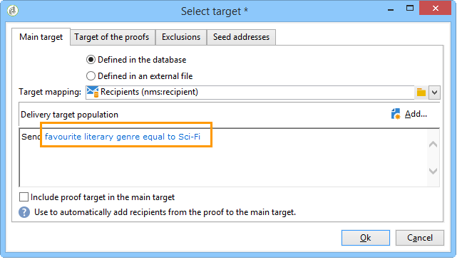

# 사용 사례: 필드 대체 구성{#use-case-configuring-the-field-substitution}

임의 필드 대체를 사용하면 사용자가 배달에 이 값을 사용할 때 비어 있는 시드 주소로 수신자 목록의 값을 지정할 수 있습니다(예:이름, 구/군/시 등).

이 대체를 사용하면 배달을 만들 때 시간을 절약할 수 있습니다.원하는 값을 시드 주소에 수동으로 추가하는 대신 대체는 배달이 타깃팅한 받는 사람 목록에서 이 값을 무작위로 회수하여 시드 주소에 적용합니다.

## 컨텍스트 {#context}

이 경우, **My online library** 사이트가 고객이 좋아하는 문학 장르를 기반으로 고객에게 할인 혜택을 제공하려고 합니다.

Adobe Delivery Manager는 즐겨 사용하는 장르와 연계된 개인화 필드를 이메일에 통합했습니다. 그는 약간의 종자 주소를 사용하고 싶어한다. 이러한 시드 주소는 테이블에 개인화 필드가 있지만 값이 저장되지 않습니다.

무작위 필드 대체를 사용하려면 다음을 수행해야 합니다.

* 하나 또는 여러 개인화 필드가 포함된 전달
* 전달에 사용된 개인화 필드에 따라 **데이터 스키마가** 수정된 시드 주소.

## 배달 만들기 {#step-1---creating-a-delivery}

배달을 만드는 단계는 [이메일 배달](../../delivery/using/creating-an-email-delivery.md) 만들기 섹션에 자세히 설명되어 있습니다.

이 예에서는 게재 관리자가 뉴스레터를 만들었습니다.


## 시드 주소 데이터 스키마 편집 {#editing-the-seed-addresses-data-schema}

데이터 스키마를 수정하는 방법에 대한 지침은 섹션에 자세히 설명되어 있습니다.

이 예에서 시드 주소 데이터 스키마는 받는 사람 데이터 스키마에서 생성된 값을 가져옵니다.

```
 <attribute label="Favorite literary genre" length="80" name="favoriteLiteraryGenre"
               type="string" userEnum="favoriteLiteraryGenre"/>
```

이 열거형을 사용하면 사용자가 클라이언트의 즐겨 사용하는 문학 장르를 지정할 수 있습니다.

이 데이터 스키마 수정이 시드 주소 입력 양식에서 **볼 수 있게 하려면**&#x200B;업데이트해야 합니다. 입력 양식 [업데이트 섹션을](../../delivery/using/use-case--selecting-seed-addresses-on-criteria.md#updating-the-input-form) 참조하십시오.

## 개인화 구성 {#configuring-personalization}

1. 배달을 엽니다.

   이 예에서 전달에는 두 개의 개인화 필드가 있습니다.수령인의 **이름** 과 수령인이 **가장 좋아하는 문학 장르**.

   

1. 배달 목록 및 시드 주소를 구성합니다. 타겟 [모집단 식별을 참조하십시오](../../delivery/using/steps-defining-the-target-population.md).

   이 예에서는 사용자가 주요 대상 모집단으로 **가장 좋아하는 문학 장르** SCI를 사용하는 사용자를 선택합니다.

   

   사용자가 게재에 시드 주소를 추가합니다.

   

   >[!NOTE]
   >
   >링크에 대한 자세한 내용은 **[!UICONTROL Edit the dynamic condition...]** 사용 사례 [를 참조하십시오.기준에 대한 시드 주소 선택](../../delivery/using/use-case--selecting-seed-addresses-on-criteria.md).

1. 탭 **[!UICONTROL Preview]** 을 클릭한 다음 시드 주소를 선택하여 개인화를 테스트합니다.

   

   개인화 필드 중 하나가 비어 있는 것을 확인할 수 있습니다. 시드 주소에 이 필드에 대한 데이터가 없으므로 HTML 콘텐츠 미리 보기에 값이 표시되지 않습니다.

   필드의 임의 대체는 배달 **시 수행됩니다**.

1. **[!UICONTROL Send]** 버튼을 클릭합니다.
1. 배달을 분석한 다음 **배달을 확인합니다**.

   시드 주소는 받은 편지함에 배달됩니다.

   필드 개인화는 효과적입니다.

   
