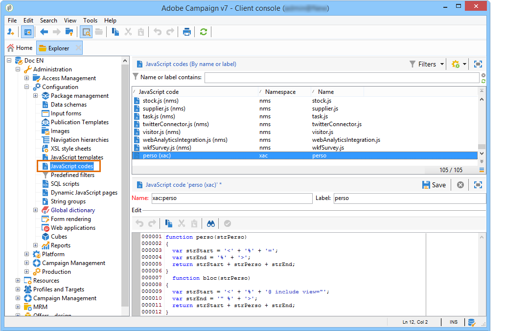

# 사용 사례: 콘텐츠 관리 만들기{#use-case-creating-content-management}

Adobe Campaign에서 컨텐츠 관리를 만들려면 다음 단계가 필요합니다.

* [1단계 - 제작할](#step-1---analyzing-the-content-to-be-produced)컨텐츠 분석,
* [2단계 - 데이터 스키마](#step-2---creating-the-data-schema)만들기,
* [3단계 - 입력 양식](#step-3---creating-the-input-form)만들기,
* [4단계 - 구성 템플릿](#step-4---creating-the-construction-template)생성,
* [5단계 - 게시 템플릿](#step-5---creating-the-publication-template)만들기,
* [6단계 - 내용](#step-6---creating-contents)만들기

## 1단계 - 생성할 컨텐츠 분석 {#step-1---analyzing-the-content-to-be-produced}

시작하기 전에 제작될 컨텐츠의 정확한 분석을 수행해야 합니다.표시할 요소를 식별하고, 연결된 제한 사항을 연구하며, 각 요소에 대한 유형을 정의하는 등 또한 정적 요소와 변수 요소를 구분해야 합니다.

예를 들어 다음 유형의 컨텐츠가 포함된 뉴스레터를 HTML로 만들려면:


이 뉴스레터에는 세 가지 유형의 요소가 포함되어 있습니다.

1. 전달 작성 중 입력 양식을 통해 사용자가 컨텐츠를 입력하거나 선택한 변수 요소입니다.

   

1. 데이터베이스에 저장된 정보를 기반으로 동적으로 입력되는 개인화 필드(이 경우 받는 사람의 이름과 성).

   

1. 정적 요소. 모든 뉴스레터에 대해 동일합니다.

   

이 뉴스레터의 다양한 요소는 삽입할 모든 요소를 참조하고 레이아웃을 개념화하는 JavaScript 템플릿에서 정의된 규칙을 기반으로 합니다.

이러한 요소는 각 컨텐츠에 대해 다음 요소를 지정하는 전용 스키마를 통해 만들어집니다.이름, 레이블, 유형, 크기뿐만 아니라 Adobe Campaign에서의 처리 관련 기타 모든 정보

## Step 2 - Creating the data schema {#step-2---creating-the-data-schema}

데이터 스키마는 컨텐츠와 연결된 XML 문서입니다. 이 내용에서 데이터의 XML 구조에 대해 설명합니다.

>[!NOTE]
>
>Adobe Campaign에서 데이터 스키마를 만들고 구성하는 방법에 대한 자세한 내용은 [이 섹션을 참조하십시오](../../configuration/using/about-schema-edition.md).
>
>컨텐츠 관리와 관련된 구성 요소는 [데이터 스키마에 자세히 설명되어 있습니다](../../delivery/using/data-schemas.md).

데이터 스키마를 만들려면 다음 단계를 적용합니다.

1. Adobe Campaign 탐색기를 열고 **[!UICONTROL Administration > Configuration > Data schemas]** 노드를 선택합니다.

   데이터 스키마 목록 위에 있는 **[!UICONTROL New]** 아이콘을 클릭합니다.

1. 컨텐츠 관리 **[!UICONTROL Create a schema]** 옵션을 선택한 다음 을 클릭합니다 **[!UICONTROL Next]**.

   

1. 해당 필드에 스키마의 이름과 레이블을 입력합니다. 필요한 경우 설명을 추가하고 특정 이미지를 연결할 수 있습니다.

   

   을 **[!UICONTROL Next]** 클릭하여 유효성을 확인합니다.

1. 창에 스키마의 컨텐츠를 **[!UICONTROL Edit schema]** 입력합니다.

   이 **[!UICONTROL Insert]** 단추를 사용하여 스키마 컨텐츠를 만듭니다.

   

   For more on this, refer to [Editing schemas](../../delivery/using/data-schemas.md#editing-schemas).

   컨텐츠에서 참조되는 각 요소에 대해 일치하는 유형을 선택해야 합니다.

   이 예에서는 식별된 컨텐츠, 형식 및 유형이 다음과 같습니다.

<table> 
 <thead> 
  <tr> 
   <th> <strong>컨텐츠</strong> <br /> </th> 
   <th> <strong>형식</strong> <br /> </th> 
   <th> <strong>유형</strong> <br /> </th> 
   <th> <strong>레이블</strong> <br /> </th> 
  </tr> 
 </thead> 
 <tbody> 
  <tr> 
   <td> 제목<br /> </td> 
   <td> 속성<br /> </td> 
   <td> 문자열<br /> </td> 
   <td> 제목<br /> </td> 
  </tr> 
  <tr> 
   <td> 하위 제목<br /> </td> 
   <td> 속성<br /> </td> 
   <td> 문자열<br /> </td> 
   <td> 이름<br /> </td> 
  </tr> 
  <tr> 
   <td> 이벤트 날짜<br /> </td> 
   <td> 속성<br /> </td> 
   <td> 날짜<br /> </td> 
   <td> 날짜<br /> </td> 
  </tr> 
  <tr> 
   <td> 소개 단락<br /> </td> 
   <td> 요소<br /> </td> 
   <td> HTML<br /> </td> 
   <td> 개요<br /> </td> 
  </tr> 
  <tr> 
   <td> 작성자 사진<br /> </td> 
   <td> 속성<br /> </td> 
   <td> 문자열<br /> </td> 
   <td> URL<br /> </td> 
  </tr> 
  <tr> 
   <td> 작성자<br /> </td> 
   <td> 요소<br /> </td> 
   <td> Memo<br /> </td> 
   <td> 작성자<br /> </td> 
  </tr> 
  <tr> 
   <td> 헤더 로고(Adobe Campaign 공공 리소스에 저장됨)<br /> </td> 
   <td> 속성<br /> </td> 
   <td> 링크<br /> </td> 
   <td> 이미지<br /> </td> 
  </tr> 
 </tbody> 
</table>

스키마에는 다음 정보가 포함됩니다.

```
<element label="Invitation" name="invitation" template="ncm:content" xmlChildren="true">
    <compute-string expr="@name"/>
    <attribute label="Title" length="40" name="title" type="string"/>
    <element label="Presentation" name="presentation" type="html"/>
    <attribute label="Date" name="date" type="date"/>
    <attribute label="Name" length="10" name="name" type="string"/>
    <attribute label="URL" name="url" type="string"/>
    <element label="Author" name="author" type="memo"/>
    <element label="Image" name="image" target="xtk:fileRes" type="link"/>
  </element>
```

1. 데이터 스키마 **[!UICONTROL Save]** 를 만들려면 을 클릭합니다.

## 3단계 - 입력 양식 만들기 {#step-3---creating-the-input-form}

입력 양식을 사용하면 Adobe Campaign 클라이언트 콘솔의 입력 인터페이스를 통해 컨텐츠 인스턴스를 편집할 수 있습니다.

양식에 대한 설명은 &quot;xtk:form&quot; 양식 스키마의 문법을 준수하는 구조화된 XML 문서입니다.

>[!NOTE]
>
>Adobe Campaign에서 양식 작성 및 구성에 대한 자세한 내용은 [이 섹션을 참조하십시오](../../configuration/using/identifying-a-form.md).
>
>컨텐츠 관리 관련 구성 요소는 입력 [양식에 자세히 설명되어 있습니다](../../delivery/using/input-forms.md).

컨텐츠 관리를 위한 입력 양식을 만들려면 다음 단계를 수행하십시오.

1. Adobe Campaign 탐색기를 열고 **[!UICONTROL Administration > Configuration > Input forms]** 노드를 선택합니다.

   양식 목록 위에 있는 **[!UICONTROL New]** 아이콘을 클릭합니다.

1. 양식의 이름과 양식에 연결된 레이블을 입력한 다음 유형을 **[!UICONTROL Content management]** 선택합니다.

   

   >[!NOTE]
   >
   >두 요소가 자동으로 일치되도록 하려면 연결된 데이터 스키마와 동일한 이름을 사용하는 것이 좋습니다. 입력 영역 위의 **[!UICONTROL Insert]** 단추를 사용하여 양식에 연결된 스키마의 필드를 추가합니다.

   

1. 편집기의 가운데 섹션에서 입력 양식에 표시할 필드를 지정합니다.

   이 예에서는 다음과 같은 유형의 정보가 있습니다.

   ```
    <input xpath="@title"/>
     <input xpath="@date"/>
     <input xpath="presentation"/>
     <input xpath="@name"/>
     <input xpath="@url"/>
     <input xpath="author"/>
     <input img="nl:sryimage.png" newEntityFormChoice="true" xpath="image">
       <sysFilter>
         <condition expr="@isImage = true"/>
       </sysFilter>
     </input>
   ```

   이 **[!UICONTROL Preview]** 탭에서는 편집할 때 양식의 렌더링을 확인할 수 있습니다.

   

1. 입력 양식 **[!UICONTROL Save]** 을 만들려면 을 클릭합니다.

## 4단계 - 구성 템플릿 생성 {#step-4---creating-the-construction-template}

XSLT 언어를 사용하면 XML 문서를 다른 출력 문서로 변환할 수 있습니다. 이 변환은 스타일시트라는 문서의 XML에 설명되어 있습니다.

이 예에서는 JavaScript 템플릿을 사용하여 생성된 문서에서 데이터 구성 및 레이아웃 모드를 정의하려고 합니다.

>[!NOTE]
>
>문서 작성(JavaScript 또는 XSL 템플릿)에 연결된 제약 조건은 [서식에 자세히 설명되어 있습니다](../../delivery/using/formatting.md).

Adobe Campaign에서 JavaScript 템플릿을 사용하려면 다음 단계를 수행하십시오.

1. Adobe Campaign 탐색기를 열고 **[!UICONTROL Administration > Configuration > JavaScript Templates]** 노드를 선택합니다.

   템플릿 목록 위에 있는 **[!UICONTROL New]** 아이콘을 클릭합니다.

1. 템플릿 이름을 입력하고 컨텐츠 관리를 위해 생성한 스키마를 선택합니다.
1. 메시지에 표시할 세트 내용을 가져옵니다.

   JavaScript 템플릿에 설명된 구문을 그대로 유지하면서 변수 요소를 [추가합니다](../../delivery/using/formatting.md#javascript-templates).

   예제에 표시된 컨텐츠를 표시하려면 JavaScript 템플릿에 다음 요소가 포함되어야 합니다.

   ```
   <html>
   <% eval(xtk.javascript.load("xac:perso").data); %>
   <head>
     <title>Invitation to an exceptional dedication session</title>
   </head>
   <body link="#0E59AE" vlink="#0E59AE" alink="#0E59AE" style="background-color:white;">
       <table width="546" border="0" align="center" cellpadding="0" cellspacing="0" style="border-left: solid 1px gray;border-top: solid 1px gray;border-right: solid 1px gray;">
         <tr>
           <td colspan="3">
             <%= generateImgTag(content.@["image-id"]) %>
           </td>
         </tr>
       </table>
       <table width="546" border="0" align="center" cellpadding="0" cellspacing="0" style="border-left: solid 1px gray;border-right: solid 1px gray;">
         <tr>
           <td>
             <table border="0" cellspacing="0" cellpadding="5">
               <tr>
                 <td width="10"> </td>
                 <td style="padding-top:2em; padding-bottom:2em;" width="730" align="middle">
                   <b>
                     <font style="font-family:Verdana, Arial, Helvetica, sans-serif; font-size:14px; color:#800080;">
                       <span style="FONT-VARIANT: small-caps"><%= content.@title %> - <%= content.@name %></span>
                     </font>
                   </b>
                 </td>
                 <td width="10"> </td>
               </tr>
               <tr>
                 <td width="10"> </td>
                 <td style="padding-top:1em; padding-bottom:1em;" width="730">
                   <font style="font-family:Verdana, Arial, Helvetica, sans-serif; font-size:11px; color:#666666;">
                     Hello <%= perso('recipient.firstName') %> <%= perso('recipient.lastName') %>,
                     <p>
                       <%= content.presentation %>
                     </p>               
                     <center>
                       <b><%= formatDate(content.@date, "%2D %Bl %4Y") %></b> come to our Book Fair and meet our favorite authors and illustrators.<br>
                       <br>
                       <a href="https://www.site.web.com/registration" target="_blank"><b>REGISTER</b></a>
                     </center>
                   </font>
                 </td>
                 <td width="10"> </td>
               </tr>
               <tr>
                 <td width="10"> </td>
                 <td style="padding-top:1em; padding-bottom:1em;" width="730">
                   <font style="font-family:Verdana, Arial, Helvetica, sans-serif; font-size:11px; color:#666666;">
                    " width="70" height="70">
                     <b><%= content.author %></b>, will be signing their book between 2
   and 5:30PM.
                   </font>
                 </td>
                 <td width="10"> </td>
               </tr>            
                   <tr>
                 <td width="10"> </td>
                 <td width="730">
                   <font style="font-family:Verdana, Arial, Helvetica, sans-serif; font-size:11px; color:#666666;">                  
                 </td>
                 <td width="10"> </td>
               </tr>           
               <tr>
                 <td width="10"> </td>
                 <td>
                   <font style="font-family:Verdana, Arial, Helvetica, sans-serif; font-size:11px; color:#666666;">
                     <center>
                       <p>
                         <a href="https://www.site.web.com/program" target="_blank"><span style="FONT-VARIANT: small-caps"><b>Program</b></span></a>
                          | 
                         <a href="https://www.site.web.com/information" target="_blank"><span style="FONT-VARIANT: small-caps"><b>Useful information</b></span></a>
                          | 
                       <a href="https://www.site.web.com/registration" target="_blank"><span style="FONT-VARIANT: small-caps"><b>Register</b></span></a></p>
                       </center>
                     </font>
                   </td>
                   <td width="10"> </td>
                 </tr>
               </table>
               <br>
             </td>
           </tr>
         </table>
   </body>
   </html>
   ```

   템플릿 시작 시 함수를 호출하면 Adobe Campaign 데이터베이스에서 가져온 개인화 데이터에 대한 호출을 설정할 수 있습니다(이 경우:recipient.firstName 및 recipient.lastName)을 사용할 수 있습니다. 자세한 내용은 JavaScript 템플릿 [포함을 참조하십시오](../../delivery/using/formatting.md#including-a-javascript-template).

   이 예에서 함수에는 다음 코드가 포함됩니다.

   ```
   function perso(strPerso)
   {
     var strStart = '<' + '%' + '=';
     var strEnd = '%' + '>';
     return strStart + strPerso + strEnd;
   }
     function bloc(strPerso)
   {
     var strStart = '<' + '%' + '@ include view="';
     var strEnd = '" %' + '>';
     return strStart + strPerso + strEnd;
   }
   ```

   JavaScript 템플릿이 유효하려면 아래와 같이 트리 구조의 **[!UICONTROL JavaScript codes]** 노드에서 이 함수를 미리 만들어야 합니다.

   

## 5단계 - 게시 템플릿 만들기 {#step-5---creating-the-publication-template}

다음 단계에서는 스키마, 양식 및 컨텐츠 구성 템플릿을 연결하는 컨텐츠 게시 템플릿을 만듭니다. 이 발행물 템플릿에는 여러 출력 형식이 있을 수 있습니다.

>[!NOTE]
>
>콘텐츠 게시 템플릿에 대한 자세한 내용은 [발행물 템플릿을 참조하십시오](../../delivery/using/publication-templates.md).

이 예에서 단계는 다음과 같습니다.

1. 노드를 통해 새 발행물 템플릿을 **[!UICONTROL Administration > Configuration > Publication templates]** 만듭니다.
1. 이름과 레이블을 입력하고 사용할 스키마와 양식을 선택합니다.
1. 템플릿 이름을 입력하고 적용할 렌더링 모드를 선택합니다. 여기서는 위에서 만든 템플릿을 기반으로 **[!UICONTROL JavaScript]** 한 유형 렌더링을 제공합니다.

   

   >[!NOTE]
   >
   >이 **[!UICONTROL DOM interface]** 옵션은 기본적으로 선택되어 있으므로 E4X 구문을 사용하는 경우 이 문서에 액세스할 수 없습니다. 이 옵션을 선택하는 경우 DOM 인터페이스를 사용해야 하며 권장되는 구문입니다.
   >
   >여전히 E4X 구문을 사용할 수 있습니다. 그렇다면 이 옵션의 선택을 취소하십시오.

   이 **[!UICONTROL Add]** 단추를 사용하여 다른 변형 템플릿을 만듭니다.

1. 을 **[!UICONTROL Save]** 클릭하여 게시 템플릿을 만듭니다.

## 6단계 - 내용 만들기 {#step-6---creating-contents}

이제 이 발행물 템플릿을 기반으로 콘텐츠를 만들 수 있습니다.

>[!NOTE]
>
>콘텐츠 만들기에 대한 자세한 내용은 콘텐츠 템플릿 [사용을 참조하십시오](../../delivery/using/using-a-content-template.md).

### 배달 마법사에서 컨텐츠 만들기 {#creating-content-in-the-delivery-wizard}

게재에서 직접 컨텐츠를 만들려면 다음 단계를 수행하십시오.

1. 게재 속성의 탭을 통해 발행물 템플릿을 **[!UICONTROL Advanced]** 참조하기 시작합니다.

   

   컨텐츠 관리 양식을 통해 컨텐츠를 정의하기 위한 추가 탭이 전달 마법사에 추가됩니다.

1. 뉴스레터의 변수 정보를 입력합니다.

   

1. 렌더링을 보려면 **[!UICONTROL HTML preview]** 탭을 클릭합니다. 개인화를 테스트하려면 수신자를 선택해야 합니다.

   
