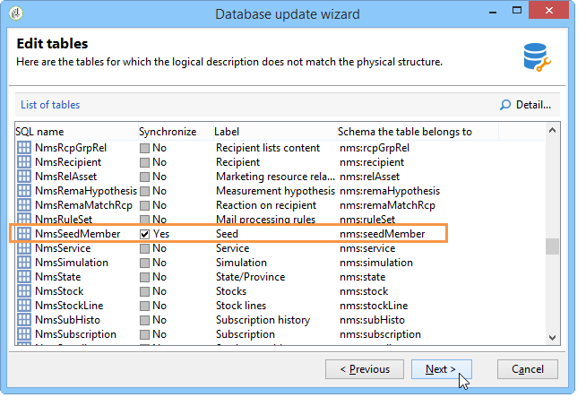
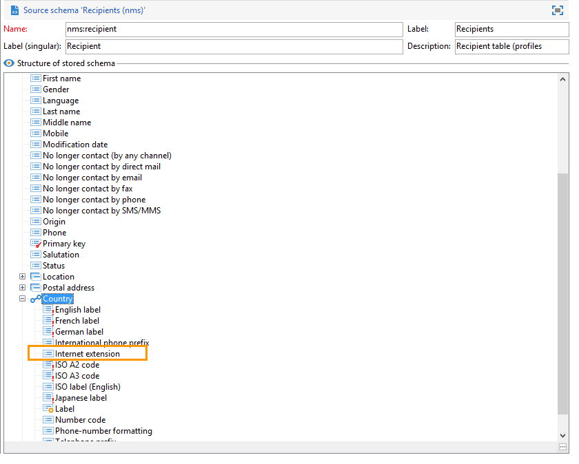
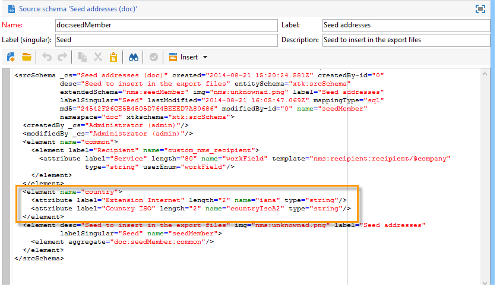
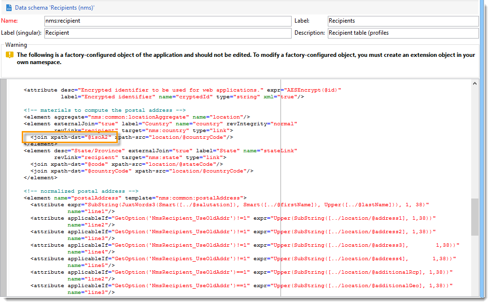
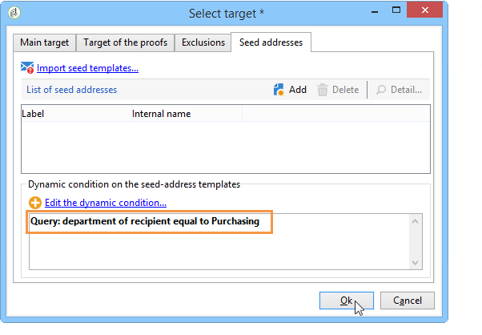

# 사용 사례: 기준 시드 주소 선택{#use-case-selecting-seed-addresses-on-criteria}

게재 또는 캠페인의 프레임워크에서, **[!UICONTROL Edit the dynamic condition...]** 링크를 사용하면 특정 선택 기준에 따라 시드 주소를 선택할 수 있습니다.

이 경우 **My online library** 라는 사이트는 고객의 문학적 취향에 따라 Newsletter를 개인화하고 싶어합니다.

구매 부서와 함께 배송을 담당하는 사용자는 경찰 소설을 구입한 구독자를 위한 뉴스레터를 만들었습니다.

배송 관리자는 최종 협업 결과를 공유하기 위해 구매 부서의 동료들을 시드 주소로 배달에 추가하기로 합니다. 동적 조건을 사용하면 주소 구성 및 업데이트 시간을 절약할 수 있습니다.

동적 조건을 사용하려면 다음이 있어야 합니다.

* 배송될 준비가 되셨고
* 공통 값을 갖는 시드 주소. 이 값은 Adobe Campaign에 이미 존재하는 필드일 수 있습니다. 이 예에서 시드 주소는 기본적으로 애플리케이션에 나타나지 않는 &quot;부서&quot; 필드의 &quot;구매&quot; 값을 공유합니다.

## 1단계 - 배달 만들기 {#step-1---creating-a-delivery}

배달을 만드는 단계는 [이메일 배달](../../delivery/using/creating-an-email-delivery.md) 만들기 섹션에 자세히 설명되어 있습니다.

이 예에서는 게재 관리자가 뉴스레터를 만들고 수신자를 선택했습니다.


## 2단계 - 공통 값 만들기 {#step-2---creating-a-common-value}

예제(구매 부서)에서 사용하는 것과 같은 공통 값을 만들려면 먼저 시드 주소의 **데이터 스키마를** 확장하고 관련 입력 양식을 편집해야 합니다.

### 데이터 스키마 확장 {#extending-the-data-schema}

스키마 확장에 대한 자세한 내용은 구성 [가이드를 참조하십시오](../../configuration/using/data-schemas.md).

1. 노드에서 **[!UICONTROL Administration > Configuration > Data schemas]** 아이콘을 **[!UICONTROL New]** 클릭합니다.
1. 창 **[!UICONTROL Creation of a data schema]** 에서 **[!UICONTROL Extension of a schema]** 옵션을 선택하고 을 클릭합니다 **[!UICONTROL Next]**.

   

1. 소스 **[!UICONTROL Seed addresses]** 스키마를 선택하고 **문서** 를 **[!UICONTROL Namespace]** 입력한 후 **[!UICONTROL Ok]**&#x200B;클릭합니다.

   

1. **[!UICONTROL Save]**&#x200B;을(를) 클릭합니다.
1. 스키마 편집 창에서 아래 줄을 복사하여 스크린샷에 표시된 영역에 붙여넣습니다.

   ```
     <element name="common">
       <element label="Recipient" name="custom_nms_recipient">
         <attribute label="Department" length="80" name="workField" template="nms:recipient:recipient/@company"
                    type="string" userEnum="workField"/>
       </element>
     </element>
   ```

   

   다음 줄을 복사하여 요소 아래에 **[!UICONTROL Seed to insert in the export files]** 붙여넣습니다.

   ```
       <element aggregate="doc:seedMember:common">
     </element>
   ```

   

   이 경우 시드 주소 테이블에 이름이 지정된 새 열거가 생성되었음을 지정하고, 표준 **[!UICONTROL Department]** 열거형 템플릿(시드 주소 양식의 회사 이름 아래에 **[!UICONTROL @company]** 레이블이 지정됨)을 **** 기반으로 합니다.

1. **[!UICONTROL Save]**&#x200B;을(를) 클릭합니다.
1. In the **[!UICONTROL Tools > Advanced]** menu, select the **[!UICONTROL Update database structure]** option.

   

1. 업데이트 마법사가 표시되면 **[!UICONTROL Next]** 단추를 클릭하여 테이블 편집 창에 액세스합니다.시드 주소 데이터 스키마에서 수행된 변경 사항은 구조 업데이트가 필요합니다.

   

1. 업데이트를 실행할 페이지로 이동할 때까지 마법사를 따르십시오. **[!UICONTROL Start]** 버튼을 클릭합니다.

   

   업데이트가 완료되면 마법사를 닫을 수 있습니다.

1. 연결을 끊고 Adobe Campaign에 다시 연결합니다. 이제 시드 주소 데이터 스키마에서 수행된 변경 사항이 적용됩니다. 시드 주소 화면에서 볼 수 있게 하려면 연결된 내용을 업데이트해야 합니다 **[!UICONTROL Input form]**. 입력 양식 [업데이트 섹션을](#updating-the-input-form) 참조하십시오.

#### 연결된 테이블에서 데이터 스키마 확장 {#extending-the-data-schema-from-a-linked-table}

시드 주소 데이터 스키마는 받는 사람 데이터 스키마 - 받는 사람(nms)에 연결된 테이블의 값을 사용할 수 있습니다.

예를 들어, 사용자는 수신자 스키마에 연결된 테이블에 **[!UICONTROL Internet Extension]** 있는 **[!UICONTROL Country]** 항목을 통합하려고 합니다.



따라서 이 함수는 섹션에 자세히 설명된 대로 시드 주소 데이터 스키마를 확장해야 합니다. 그러나 **4단계에서 통합할 코드 줄은 다음과** 같습니다.

```
<element name="country">
      <attribute label="Internet Extension" length="2" name="iana" type="string"/>
      <attribute label="Country ISO" length="2" name="countryIsoA2" type="string"/>
    </element>
```



다음과 같은 내용이 표시됩니다.

* 사용자가 **[!UICONTROL Internet Extension]**
* 이 요소가 **[!UICONTROL Country]** 테이블에서 가져오는 경우

>[!CAUTION]
>
>연결된 테이블 이름에서 연결된 테이블의 **xpath-dst** 를 지정해야 합니다.
>
>수신자 테이블의 **[!UICONTROL Country]** 요소에서 찾을 수 있습니다.



그런 다음 사용자는 섹션의 **5단계** 에서 팔로우하고 시드 주소 **[!UICONTROL Input form]** 를 업데이트할 수 있습니다.

입력 양식 [업데이트 섹션을](#updating-the-input-form) 참조하십시오.

#### 입력 양식 업데이트 {#updating-the-input-form}

1. 노드에서 **[!UICONTROL Administration > Configuration > Input forms]** 시드 주소 입력 양식을 찾습니다.

   

1. 양식을 편집하고 컨테이너에 다음 줄을 **[!UICONTROL Recipient]** 삽입합니다.

   ```
   <input xpath="@workField"/>
   ```

   

1. 변경 내용을 저장합니다.
1. 시드 주소를 엽니다. 필드가 표 **[!UICONTROL Department]** 에 **[!UICONTROL Recipient]** 나타납니다.

   

1. 게재에 사용할 시드 주소를 편집하고 **Purchasing** 을 **[!UICONTROL Department]** 필드에 값으로 입력합니다.

## 3단계 - 조건 정의 {#step-3---defining-the-condition}

이제 전달에 대한 시드 주소의 동적 조건을 지정할 수 있습니다. 방법은 다음과 같습니다.

1. 배달을 엽니다.

   

1. 링크를 클릭한 다음 **[!UICONTROL To]** 탭을 클릭하여 **[!UICONTROL Seed addresses]** **[!UICONTROL Edit the dynamic condition...]** 링크에 액세스합니다.

   

1. 원하는 시드 주소를 선택할 수 있는 표현식을 선택합니다. 여기에서 사용자가 표현식을 **[!UICONTROL Department (@workField)]** 선택합니다.

   

1. 원하는 값을 선택합니다. 이 예에서 사용자는 값 드롭다운 목록에서 **구매** 부서를 선택합니다.

   

   >[!NOTE]
   >
   >이전에 생성된 스키마 확장은 **받는** 스키마에서 옵니다. 위 화면에 표시되는 값은 **받는 사람** 스키마의 열거를 나타냅니다.

1. **[!UICONTROL Ok]**&#x200B;을(를) 클릭합니다.

   쿼리가 **[!UICONTROL Select target]** 창에 표시됩니다.

   

1. Click **[!UICONTROL Ok]** to approve the query.
1. 배달 내용을 분석한 다음 **[!UICONTROL Delivery]** 탭을 클릭하여 배달 로그에 액세스합니다.

   구매 부서의 시드 주소는 받는 사람 또는 다른 시드 주소와 마찬가지로 보류 중인 배달로 표시됩니다.

   

1. Click the **[!UICONTROL Send]** button to start the delivery.

   구매 부서 구성원은 이메일 받은 편지함으로 배달될 시드 주소의 일부를 구성합니다.

   
