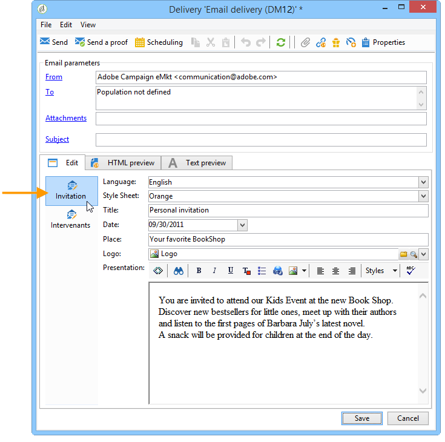
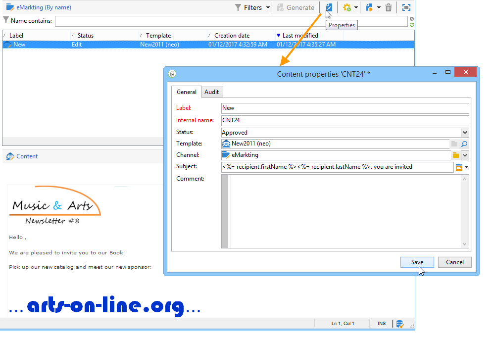

# 컨텐츠 템플릿 사용{#using-a-content-template}

## 컨텐츠 템플릿 정보 {#about-content-templates}

컨텐츠 템플릿을 직접 참조하고 게재에서 사용할 수 있습니다. 컨텐츠 [관리를 통해 배달 만들기를 참조하십시오.](#creating-a-delivery-via-content-management)

컨텐츠 인스턴스를 만드는 데 사용할 수도 있습니다. 이러한 인스턴스가 만들어지면 이러한 인스턴스가 전달될 준비가 됩니다(컨텐츠 인스턴스 [제공](#delivering-a-content-instance)참조). 또는 내보내기를 [참조하십시오(컨텐츠 인스턴스](#creating-a-content-instance)생성 참조).

## 컨텐츠 관리를 통해 전달 만들기 {#creating-a-delivery-via-content-management}

입력 필드를 사용하여 컨텐츠를 입력하는 과정에서 배달에 컨텐츠 템플릿을 참조할 수 있습니다. 배달 컨텐츠를 정의하기 위한 추가 탭이 배달 마법사에 추가됩니다.

선택한 설정에 따라 레이아웃이 자동으로 적용됩니다. 이를 보려면 **[!UICONTROL HTML preview]** (또는 **[!UICONTROL Text preview]** )을 클릭하고 개인화 요소를 테스트할 수신자를 선택합니다.

자세한 내용은 전체 구현 예를 참조하십시오.배달 [마법사에서](../../delivery/using/use-case--creating-content-management.md#creating-content-in-the-delivery-wizard)컨텐츠 만들기

## 컨텐츠 인스턴스 만들기 {#creating-a-content-instance}

Adobe Campaign 트리에서 직접 컨텐츠를 만들어 워크플로우, 내보내기 또는 새 게재에 직접 삽입할 수 있습니다.

다음 단계를 적용합니다.

1. 트리의 **[!UICONTROL Resources > Contents]** 노드를 선택하고 마우스 오른쪽 단추를 클릭한 다음 **[!UICONTROL Properties]**&#x200B;선택합니다.

   

1. 이 폴더에 대해 활성화할 발행물 템플릿을 선택합니다.

   

1. 이제 컨텐츠 목록 위의 **[!UICONTROL New]** 단추를 사용하여 새 컨텐츠를 만들 수 있습니다.

   

1. 양식에 필드를 입력합니다.

   

1. 그런 다음 **[!UICONTROL HTML preview]** 탭을 클릭하여 렌더링을 확인합니다. 여기에서 데이터베이스에서 가져온 개인화 필드는 입력되지 않습니다.

   

1. 컨텐츠가 만들어지면 사용 가능한 컨텐츠 목록에 컨텐츠가 추가됩니다. 링크를 클릭하여 레이블, 상태를 변경하거나 내역을 확인합니다. **[!UICONTROL Properties]**

   

1. 필요한 경우 컨텐츠가 승인되면 도구 모음의 해당 단추를 사용하여 생성할 수 있습니다.

   

   >[!NOTE]
   >
   >승인되지 않은 컨텐츠의 생성을 승인할 수 있습니다. 이렇게 하려면 게시 템플릿에서 관련 옵션을 변경합니다. 자세한 내용은 템플릿 [만들기 및 구성을 참조하십시오](../../delivery/using/publication-templates.md#creating-and-configuring-the-template).

   HTML 및 텍스트 컨텐츠는 기본적으로 Adobe Campaign 인스턴스의 **게시** 폴더에 생성됩니다. NcmPublishingDir 옵션 덕분에 발행물 폴더를 변경할 **수** 있습니다.

## 콘텐츠 인스턴스 제공 {#delivering-a-content-instance}

컨텐츠 인스턴스를 만들어 제공하려면 이 컨텐츠를 생성하는 데 사용되는 게시 템플릿에 배달 템플릿을 연결해야 합니다. 자세한 내용은 배달을 [참조하십시오](../../delivery/using/publication-templates.md#delivery).

또한 컨텐츠 저장소 폴더는 이 발행물 템플릿에서 가져온 컨텐츠 전용 폴더여야 합니다. 컨텐츠 폴더를 사용하면 여러 유형의 컨텐츠를 생성할 수 있지만 자동으로 컨텐츠를 만들 수 없습니다.

선택한 컨텐츠를 기반으로 자동으로 배달을 만들려면 **[!UICONTROL Delivery]** 아이콘을 클릭하고 템플릿을 선택합니다.

텍스트와 HTML 컨텐츠는 자동으로 입력됩니다.
