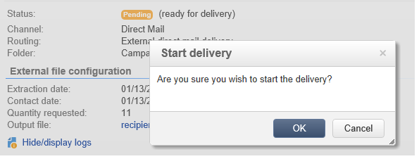

# 유효성 확인{#validating}

배달을 확인할 때의 글로벌 개념이 [이 섹션에](../../delivery/using/steps-validating-the-delivery.md)설명되어 있습니다.

배달 분석 중에 DM 배달 출력 파일이 생성됩니다. 파일의 내용은 선택한 출력 열에 따라 다릅니다(추출 파일 [참조](../../delivery/using/defining-the-direct-mail-content.md#extraction-file)).

>[!NOTE]
>
>분석 단계는 배달 [분석에서](../../delivery/using/steps-validating-the-delivery.md#analyzing-the-delivery)자세히 설명합니다.

분석 단계 동안 파일이 생성되지만 받는 사람(예: 배달 로그)에 대한 정보는 업데이트되지 않습니다. 따라서 아무 위험이나 실행하지 않고 이 작업을 취소할 수 있습니다.

를 클릭하기 전에 분석 결과와 출력 파일의 컨텐츠를 확인합니다 **[!UICONTROL Confirm delivery]**. 확인 메시지를 통해 배달을 시작할 수 있습니다.

보내기 확인은 지정된 파일에서 데이터 추출을 시작합니다.

그런 다음 마법사를 닫고 **[!UICONTROL Delivery]** 탭을 통해 배달 로그를 볼 수 있습니다. 이 로그는 전달 세부 정보를 통해 액세스할 수 있습니다.

배달 속성의 **[!UICONTROL Analysis]** 탭에서 배달 로그 검색 모드를 구성할 수 있습니다.

두 가지 모드가 있습니다.

* **[!UICONTROL Messages are considered sent after validation]** (기본 모드):이 함수 모드에서는 연산자가 전송을 확인하고(상태는 &#39;배달 대기 중&#39;에서 &#39;전송&#39;(Sent&#39;)으로 전달하면 모든 브로드로그가 자동으로 **[!UICONTROL Finished]**&#x200B;업데이트됩니다.
* **[!UICONTROL A file of results determines the messages that are sent and those that have failed]** :이 모드에서는 서비스 제공업체에서 보내는 외부 파일을 통해 브로드로그를 업데이트할 수 있습니다. 이 경우 브로드캐스트 상태를 업데이트하려면 이 정보를 처리하는 워크플로우를 사용해야 합니다.

   >[!NOTE]
   >
   >이 경우 브로드로그가 업데이트되는 즉시 **[!UICONTROL Finished]** 사용자가 전달 상태를 변경해야 합니다.
