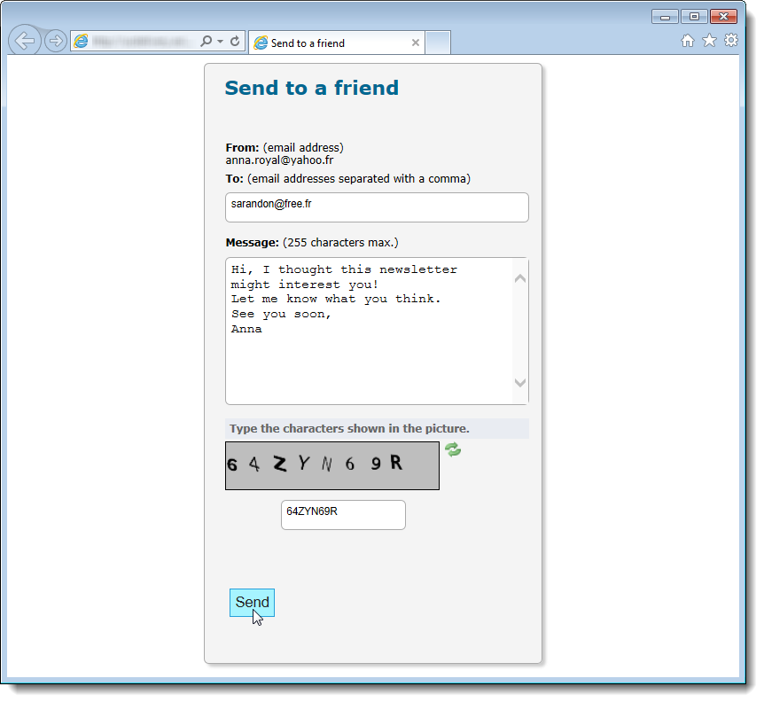

# 바이럴 및 소셜 마케팅{#viral-and-social-marketing}

## 바이럴 마케팅 정보 {#about-viral-marketing}

Adobe Campaign을 사용하면 바이러스 마케팅을 촉진하는 도구를 설정할 수 있습니다.

이렇게 하면 배달 받는 사람 또는 웹 사이트 방문자가 자신의 네트워크와 정보를 공유할 수 있습니다.Facebook 또는 Twitter 프로필에 링크를 추가하여 친구에게 메시지를 보내는 방법

>[!CAUTION]
>
>링크가 제대로 작동하도록 하려면 일치하는 미러 페이지를 사용할 수 있어야 합니다. 이렇게 하려면 게재에 미러 페이지에 대한 링크를 포함합니다.

## 소셜 네트워크:링크 공유 {#social-networks--sharing-a-link}

전달 받는 사람이 메시지를 네트워크 구성원과 공유할 수 있도록 하려면 일치하는 개인화 블록을 포함해야 합니다.

>[!NOTE]
>
>기본적으로 이 링크는 블록 목록에 제공되지 않습니다. 클릭하고 블록 **[!UICONTROL Other...]**&#x200B;을 선택하여 액세스할 수 **[!UICONTROL Social network sharing links]** 있습니다.

렌더링은 다음과 같습니다.

수신자가 표시되는 소셜 네트워크 중 하나의 아이콘을 클릭하면 해당 계정으로 자동으로 리디렉션되고 링크를 통해 메시지 내용을 공유할 수 있습니다. 이렇게 하면 네트워크 구성원이 통신에 액세스할 수 있습니다.

>[!NOTE]
>
>이 개인화 블록에는 모든 링크(메시지 전송 및 모든 소셜 네트워크와의 공유)가 포함되어 있습니다. 필요에 맞게 변경할 수 있습니다. 하지만 구성은 고급 사용자용으로 예약되어 있습니다. 일치하는 개인화 블록을 편집하려면 Adobe Campaign 트리의 **[!UICONTROL Resources > Campaign management > Personalization blocks]** 노드로 이동합니다.

## 바이럴 마케팅:친구에게 양보하다 {#viral-marketing--forward-to-a-friend}

입소문 서비스를 통해 참조 유형 작업을 수행할 수 있습니다.이러한 작업을 통해 친구에게 메시지를 전달할 수 있습니다. 심판의 프로필은 데이터베이스에 임시로 저장됩니다(전용 테이블). 전달된 메시지에는 심판이 구독할 수 있는 링크가 포함되어 있습니다.이렇게 하면 Adobe Campaign 데이터베이스에 추가됩니다.

메시지 전달은 소셜 네트워크 링크와 동일한 원칙을 기반으로 합니다.

다음 단계를 적용합니다.

1. 원본 메시지 본문에 **[!UICONTROL Social network sharing links]** 개인화 블록을 추가합니다.
1. 메시지 수신자는 **[!UICONTROL Email]** 아이콘을 클릭하여 이 메시지를 한 명 이상의 친구에게 보낼 수 있습니다.

   

   참조 양식을 사용하면 심판들의 이메일 주소를 입력할 수 있습니다.

   

   기본 수신자가 단추를 클릭하면 메시지가 **[!UICONTROL Next]** 보내집니다.

   >[!NOTE]
   >
   >이 메시지의 내용은 필요에 따라 개인화할 수 있습니다. 노드를 저장하는 **[!UICONTROL Transfer of original message]** 템플릿을 기반으로 **[!UICONTROL Administration > Campaign management > Technical delivery templates]** 만들어집니다.
   >
   >레퍼러가 사용할 수 있는 메시지 전달 양식을 변경할 수도 있습니다. 이렇게 하려면 **노드에 저장된 바이럴 양식** **[!UICONTROL Resources > Online > Web applications]** 웹 응용 프로그램을 변경해야 합니다.

1. 전달된 메시지에서, 심판이 데이터베이스에 프로필을 저장할 수 있는 링크를 제공합니다. 이 용도로 응모 양식이 제공됩니다.

   

   >[!NOTE]
   >
   >이 구성을 조정할 수 있습니다. 이렇게 하려면 노드에 저장된 **수신자 구독** 웹 응용 프로그램을 **[!UICONTROL Resources > Online > Web applications]** 수정해야 합니다.
   >
   >For more information on Web applications, refer to [this section](../../web/using/about-web-applications.md).

   유효성 검사를 수행하면 확인 메시지가 표시됩니다.확인 메시지의 링크를 활성화한 후에야 등록됩니다. 이 메시지는 노드에 저장되는 **[!UICONTROL Registration confirmation]** 템플릿을 기반으로 **[!UICONTROL Administration > Campaign management > Technical delivery templates]** 만들어집니다.

   심판은 데이터베이스의 **수신자** 폴더에 추가되며(기본적으로) **뉴스레터** 정보 서비스에 가입됩니다.

## 소셜 네트워크 공유 추적 {#tracking-social-network-sharing}

공유 정보에 대한 공유 및 액세스 권한이 추적됩니다. Adobe Campaign이 수집한 정보는 다음 두 곳에서 액세스할 수 있습니다.

* 전달의 **[!UICONTROL Tracking]** 탭에서(또는 각 수신자에 대해 개별적으로):

   

* 전용 **[!UICONTROL Sharing to social networks]** 보고서에서 다음을 수행합니다.

   

