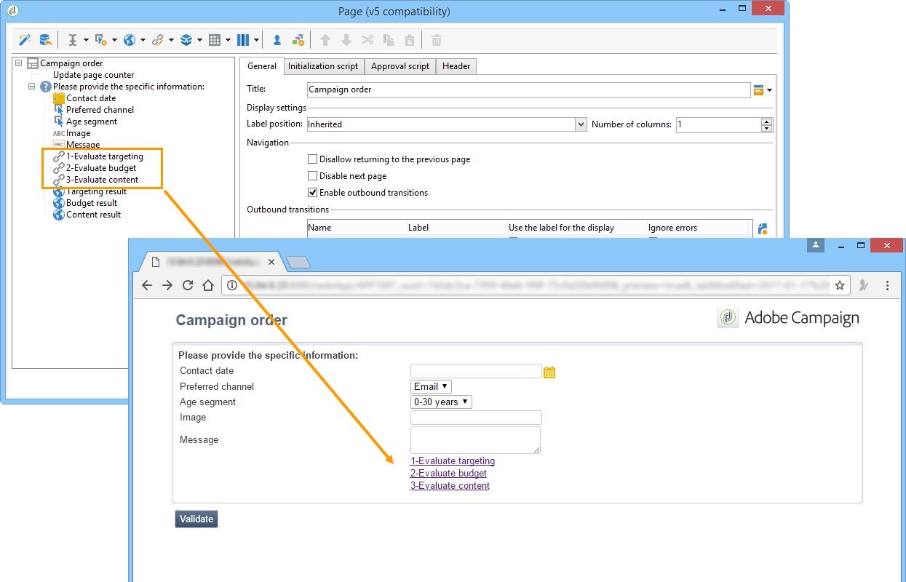
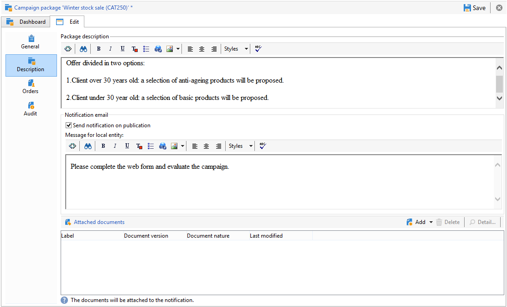

# 분산 마케팅 샘플{#distributed-marketing-samples}


## 로컬 캠페인 만들기(양식별) {#creating-a-local-campaign--by-form-}

**폼** 형식 웹 인터페이스에는 **웹 응용 프로그램**&#x200B;이 사용됩니다. 구성에 따라 이 웹 애플리케이션에는 정의된 모든 유형의 개인화된 요소가 포함될 수 있습니다. 예를 들어 타겟, 예산, 콘텐츠 등을 평가할 수 있는 링크를 제안할 수 있습니다. 전용 API를 통해

>[!NOTE]
>
>API는 전용 문서에 자세히 설명되어 있습니다. [자세히 알아보기](../../configuration/using/about-web-services.md).
>
>이 예제에 사용된 웹 애플리케이션은 Adobe Campaign에서 바로 사용할 수 있는 웹 앱이 아닙니다. 캠페인에서 양식을 사용하려면 전용 웹 애플리케이션을 만들어야 합니다.

캠페인 템플릿을 만들 때 **[!UICONTROL Advanced campaign settings...]** 링크의 **[!UICONTROL Web interface]** 옵션 내에 있는 **[!UICONTROL Zoom]** 아이콘을 클릭하여 웹 애플리케이션의 세부 정보에 액세스합니다.


>[!NOTE]
>
>웹 애플리케이션 매개 변수는 캠페인 템플릿에서만 사용할 수 있습니다.

**[!UICONTROL Edit]** 탭에서 **캠페인 순서** 활동을 선택한 다음 열어 콘텐츠에 액세스합니다.


이 예제에서 **캠페인 순서** 활동은 다음을 포함합니다.

* 주문하는 동안 로컬 엔티티가 입력할 필드,

  

* 로컬 엔티티가 캠페인을 평가할 수 있도록 하는 링크(예: 타겟, 예산, 콘텐츠 등),

  

* 이러한 평가의 결과를 계산하고 표시할 수 있는 스크립트.

  

이 예에서는 다음 API가 사용됩니다.

* 대상 평가의 경우,

  ```
  var res = nms.localOrder.EvaluateTarget(ctx.localOrder);
  ```

* 예산 평가를 위해,

  ```
  var res = nms.localOrder.EvaluateDeliveryBudget(ctx.@deliveryId, NL.XTK.parseNumber(ctx.@compt));
  ```

* 콘텐츠 평가를 위해,

  ```
  var res = nms.localOrder.EvaluateContent(ctx.localOrder, ctx.@deliveryId, "html", resSeed.@id);
  ```

## 공동 작업 캠페인 만들기(대상 승인별) {#creating-a-collaborative-campaign--by-target-approval-}

### 소개 {#introduction}

미국 전역에 온라인 상점과 여러 부티크 매장이 있는 대형 의류 브랜드의 마케팅 매니저입니다. 봄이 왔으므로, 당신은 최고의 고객에게 카탈로그에 있는 모든 드레스를 50% 할인하는 특별 오퍼를 만들기로 결정했습니다.

이 오퍼는 미국 내 상점의 최고 고객을 대상으로 하며, 이는 연초 이후 300달러 이상을 소비한 고객을 의미합니다.

따라서 분산 마케팅을 사용하여 (타겟 승인별로) 공동 작업 캠페인을 생성하기로 결정하며, 이를 통해 상점의 베스트 클라이언트(지역별로 그룹화됨)를 선택하고 누가 특별 오퍼가 포함된 이메일 게재를 받을 것인지 선택할 수 있습니다.

이 예제의 첫 번째 부분에서는 캠페인 생성 알림을 받는 로컬 엔티티와 이를 사용하여 캠페인을 평가하고 순서를 지정하는 방법을 보여줍니다.

이 예제의 두 번째 부분에서는 캠페인을 만드는 방법을 설명합니다.

단계는 다음과 같습니다.

**로컬 엔터티의 경우**

1. 캠페인 생성 알림을 사용하여 중앙 엔티티에 의해 선택된 연락처 목록에 액세스합니다.
1. 담당자를 선택하고 기여도를 승인합니다.

**중앙 엔터티의 경우:**

1. **[!UICONTROL Data distribution]** 활동을 만듭니다.
1. 공동 작업 캠페인을 만듭니다.
1. 캠페인을 게시합니다.

### 로컬 엔티티 측 {#local-entity-side}

1. 캠페인에 참여하도록 선택한 로컬 엔티티에 이메일 알림이 전송됩니다.

   

1. **[!UICONTROL Access your contact list and approve targeting]** 링크를 클릭하면 로컬 엔터티에 캠페인에 대해 선택한 클라이언트 목록에 대한 액세스 권한(웹 브라우저를 통해)이 부여됩니다.

   

1. 올해 초부터 유사한 오퍼에 대해 이미 연락되었으므로 로컬 엔티티는 목록에서 특정 연락처를 선택 취소합니다.

   

확인이 승인되면 캠페인이 자동으로 시작될 수 있습니다.

### 중앙 엔터티 측 {#central-entity-side}

#### 데이터 배포 활동 만들기 {#creating-a-data-distribution-activity}

1. 공동 작업 캠페인을 설정하려면(대상 승인별로) 먼저 **[!UICONTROL Data distribution activity]**&#x200B;을(를) 만들어야 합니다. **[!UICONTROL Resources > Campaign management > Data distribution]** 노드에서 **[!UICONTROL New]** 아이콘을 클릭합니다.

   

1. **[!UICONTROL General]** 탭에서 다음을 지정해야 합니다.

   * **[!UICONTROL Targeting dimension]**. 여기서 **데이터 배포**&#x200B;는 **수신자**&#x200B;에서 수행됩니다.
   * **[!UICONTROL Distribution type]**. **고정 크기** 또는 **백분율로 크기**&#x200B;를 선택할 수 있습니다.
   * **[!UICONTROL Assignment type]**. **로컬 엔터티** 옵션을 선택하십시오.
   * **[!UICONTROL Distribution type]**. 여기에서 연락처와 로컬 엔터티 간의 관계를 식별할 수 있는 필드는 받는 사람 테이블에 있는 **[!UICONTROL Origin (@origin)]** 필드입니다.
   * **[!UICONTROL Approval storage]** 필드. **받는 사람의 로컬 승인** 옵션을 선택하십시오.

1. **[!UICONTROL Breakdown]** 탭에서 다음을 지정합니다.

   * 예정된 캠페인에 포함된 로컬 엔터티에 해당하는 **[!UICONTROL Distribution field value]**
   * 로컬 엔터티 **[!UICONTROL label]**&#x200B;입니다.
   * **[!UICONTROL Size]**(고정 또는 백분율로 표시)입니다. **0 기본값**&#x200B;에는 로컬 엔터티에 연결된 모든 받는 사람을 선택하는 작업이 포함됩니다.

   

1. 새 데이터 배포를 저장합니다.

#### 공동 캠페인 만들기 {#creating-a-collaborative-campaign}

1. **[!UICONTROL Campaign management > Campaign]** 노드에서 새 **[!UICONTROL collaborative campaign (by target approval)]**&#x200B;을(를) 만듭니다.
1. **[!UICONTROL Targeting and workflows]** 탭에서 캠페인에 대한 워크플로우를 만듭니다. **[!UICONTROL Data distribution]** 활동에 의해 **[!UICONTROL Record count limitation]**&#x200B;이(가) 정의된 **분할** 활동이 포함되어야 합니다.

   

1. 다음을 지정할 수 있는 **[!UICONTROL Local approval]** 작업을 추가합니다.

   * 알림에서 로컬 엔터티로 전송될 메시지 콘텐츠
   * 승인 알림,
   * 캠페인에 대한 예상 처리입니다.

   

1. 레코드를 저장합니다.

#### 캠페인 게시 {#publishing-the-campaign}

이제 **[!UICONTROL Campaigns]** 탭에서 **캠페인 패키지**&#x200B;를 추가할 수 있습니다.

1. **[!UICONTROL Reference campaign]**&#x200B;을(를) 선택하세요. 패키지의 **[!UICONTROL Edit]** 탭에서 캠페인에 사용할 **[!UICONTROL Approval mode]**&#x200B;을(를) 선택할 수 있습니다.

   * **수동** 모드에서 로컬 엔터티가 중앙 엔터티의 초대를 수락하면 캠페인에 참여합니다. 원하는 경우 사전 선택된 연락처를 삭제할 수 있으며 캠페인 참여를 확인하기 위해 관리자의 승인이 필요합니다.
   * **자동** 모드에서는 로컬 엔터티가 등록을 취소하지 않는 한 캠페인에 참여해야 합니다. 그들은 승인이 필요 없이 연락처를 삭제할 수 있습니다.

   

1. **[!UICONTROL Description]** 탭에서 캠페인에 대한 설명과 로컬 엔터티로 보낼 문서를 추가할 수 있습니다.

   

1. 캠페인 패키지를 승인한 다음 워크플로를 시작하여 패키지를 게시하고 패키지 목록의 모든 로컬 엔티티에서 사용할 수 있도록 합니다.

   

## 공동 작업 캠페인 만들기(양식별) {#creating-a-collaborative-campaign--by-form-}

### 소개 {#introduction-1}

당신은 온라인 상점과 여러 부티크가 미국 전역에 있는 대형 메이크업 브랜드의 마케팅 매니저입니다. 겨울 스톡을 언로드하고 새 스톡을 위한 공간을 만들기 위해, 귀하는 연령에 민감한 피부 관리 제품을 제공할 30대 이상과 보다 기본적인 피부 관리 제품을 제공할 30대 미만의 고객 범주, 즉 두 가지 고객 범주를 타겟으로 하는 특별 오퍼를 만들기로 결정합니다.

따라서 분산 마케팅을 사용하여 연령 범위별로 서로 다른 스토어에서 클라이언트를 선택할 수 있는 공동 작업 캠페인(양식별)을 만들기로 결정합니다. 이러한 고객은 연령 범위에 따라 개인화된 특별 오퍼가 포함된 이메일 게재를 받게 됩니다.

이 예제의 첫 번째 부분에서는 캠페인 생성 알림을 받는 로컬 엔티티와 이를 사용하여 캠페인을 평가하고 순서를 지정하는 방법을 보여줍니다.

이 예제의 두 번째 부분에서는 캠페인을 만드는 방법을 설명합니다.

단계는 다음과 같습니다.

**로컬 엔터티의 경우**

1. 캠페인 생성 알림을 사용하여 온라인 양식에 액세스합니다.
1. 캠페인(타겟, 콘텐츠, 게재 볼륨)을 개인화합니다.
1. 이 필드를 확인하고 필요한 경우 변경합니다.
1. 기여도를 승인합니다.
1. 로컬 엔티티(또는 중앙 엔티티)의 관리자는 구성 및 기여도를 승인합니다.

**중앙 엔터티의 경우:**

1. 공동 작업 캠페인을 만듭니다.
1. 로컬 캠페인처럼 **[!UICONTROL Advanced campaign settings...]**&#x200B;을(를) 구성합니다.
1. 로컬 캠페인처럼 캠페인 워크플로우와 게재를 구성합니다.
1. 웹 양식을 업데이트합니다.
1. 캠페인 패키지를 만들고 게시합니다.

### 로컬 엔티티 측 {#local-entity-side-1}

1. 캠페인에 참여하도록 선택된 로컬 엔티티는 캠페인 참여를 알리는 이메일 알림을 수신합니다.

   

1. 로컬 엔티티가 개인화된 양식을 완료한 후 다음을 수행합니다.

   * 목표와 예산을 평가합니다.
   * 게재 콘텐츠 미리 보기,
   * 기여도를 승인합니다.

     

1. 주문의 검증을 담당하는 운영자가 그 참여를 승인한다.

   

### 중앙 엔터티 측 {#central-entity-side-1}

1. 공동 작업 캠페인(양식별)을 구현하려면 **공동 작업 캠페인(양식별)** 템플릿을 사용하여 캠페인을 만들어야 합니다.

   

1. 캠페인의 **[!UICONTROL Edit]** 탭에서 **[!UICONTROL Advanced campaign settings...]** 링크를 클릭하여 로컬 캠페인으로 구성합니다. [로컬 캠페인 만들기(양식으로)](#creating-a-local-campaign--by-form-)를 참조하세요.

   

1. 캠페인 워크플로우와 웹 양식을 구성합니다. [로컬 캠페인 만들기(양식으로)](#creating-a-local-campaign--by-form-)를 참조하세요.
1. 실행 일정 및 관련 로컬 엔티티를 지정하여 캠페인 패키지를 생성합니다.

   

1. **[!UICONTROL Edit]** 탭에서 승인 모드를 선택하여 패키지 구성을 완료합니다.

   

1. **[!UICONTROL Description]** 탭에서 캠페인 패키지 설명, 패키지가 게시될 때 로컬 엔터티에 보낼 알림 메시지를 입력하고 캠페인 패키지에 모든 정보 문서를 첨부할 수 있습니다.

   

1. 게시할 패키지를 승인합니다.

   
