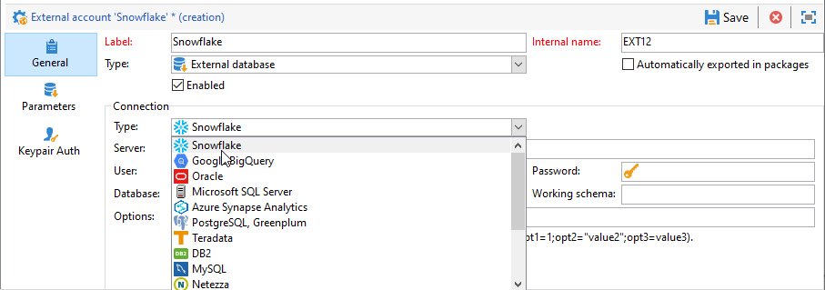

# Snowflake 액세스 구성 {#configure-access-to-snowflake}

Campaign 사용 **페더레이션 데이터 액세스** (FDA) 외부 데이터베이스에 저장된 정보를 처리하는 옵션입니다. 액세스 권한을 구성하려면 아래 단계를 따르십시오. [!DNL Snowflake].

1. 구성 [!DNL Snowflake] 날짜 [리눅스](#snowflake-linux).
1. 구성 [!DNL Snowflake] [외부 계정](#snowflake-external) 캠페인에서

>[!NOTE]
>
>[!DNL Snowflake] 커넥터는 호스팅 및 온프레미스 배포에 사용할 수 있습니다. 자세한 정보는 이 [페이지](../../installation/using/capability-matrix.md)를 참조하십시오.


## Linux의 Snowflake {#snowflake-linux}

구성하려면 [!DNL Snowflake] linux의 경우 아래 단계를 수행합니다.

1. ODBC를 설치하기 전에 Linux 배포판에 다음 패키지가 설치되어 있는지 확인하십시오.

   * Red Hat/CentOS의 경우:

     ```
     yum update
     yum upgrade
     yum install -y grep sed tar wget perl curl
     ```

   * Debian의 경우:

     ```
     apt-get update
     apt-get upgrade
     apt-get install -y grep sed tar wget perl curl
     ```

1. 스크립트를 실행하기 전에 `--help` 옵션:

   ```
   cd /usr/local/neolane/nl6/bin/fda-setup-scripts/
   ./snowflake_odbc-setup.sh --help
   ```

1. 스크립트가 있는 디렉토리에 액세스하여 루트 사용자로 다음 스크립트를 실행합니다.

   ```
   cd /usr/local/neolane/nl6/bin/fda-setup-scripts
   ./snowflake_odbc-setup.sh
   ```

1. ODBC 드라이버를 설치한 후 Campaign Classic을 다시 시작해야 합니다. 이렇게 하려면 다음 명령을 실행합니다.

   ```
   systemctl stop nlserver.service
   systemctl start nlserver.service
   ```

1. 그런 다음 Campaign에서 다음을 구성할 수 있습니다. [!DNL Snowflake] 외부 계정입니다. 외부 계정을 구성하는 방법에 대한 자세한 내용은 [이 섹션](#snowflake-external).

## 외부 계정 Snowflake {#snowflake-external}

다음을 만들어야 합니다. [!DNL Snowflake] Campaign 인스턴스를 [!DNL Snowflake] 외부 데이터베이스.

1. 출처: Campaign **[!UICONTROL Explorer]**, 클릭 **[!UICONTROL Administration]** &#39;>&#39; **[!UICONTROL Platform]** &#39;>&#39; **[!UICONTROL External accounts]**.

1. **[!UICONTROL New]**&#x200B;를 클릭합니다.

1. 선택 **[!UICONTROL External database]** 외부 계정으로 **[!UICONTROL Type]**.

1. 아래 **[!UICONTROL Configuration]**, 선택 [!DNL Snowflake] 다음에서 **[!UICONTROL Type]** 드롭다운.

   

1. 사용자 추가 **[!UICONTROL Server]** URL **[!UICONTROL Database]**.

1. 구성 **[!UICONTROL Snowflake]** 외부 계정 인증:

   * 계정/암호 인증의 경우 다음을 지정해야 합니다.

      * **[!UICONTROL Account]**: 사용자 이름

      * **[!UICONTROL Password]**: 사용자 계정 암호.

     

   * 키 쌍 인증의 경우 **[!UICONTROL Keypair Auth]** 탭 사용 **[!UICONTROL Private key]** 을(를) 인증하고 복사하려면 다음을 붙여넣습니다. **[!UICONTROL Private key]**.

     

1. 다음을 클릭합니다. **[!UICONTROL Parameters]** 탭을 클릭한 다음 **[!UICONTROL Deploy functions]** 단추를 클릭하여 함수를 만듭니다.

   >[!NOTE]
   >
   >모든 함수를 사용할 수 있으려면 원격 데이터베이스에 Adobe Campaign SQL 함수를 만들어야 합니다. 자세한 내용은 다음을 참조하십시오. [페이지](../../configuration/using/adding-additional-sql-functions.md).

   

1. 클릭 **[!UICONTROL Save]** 구성이 완료되면.

커넥터는 다음 옵션을 지원합니다.

| 옵션 | 설명 |
|---|---|
| 작업 스키마 | 작업 테이블에 사용할 데이터베이스 스키마 |
| warehouse | 사용할 기본 웨어하우스 이름. 사용자의 기본값보다 우선 적용됩니다. |
| 시간대 이름 | 기본적으로 비어 있음, 즉 Campaign Classic 앱 서버의 시스템 시간대가 사용됩니다. 옵션을 사용하여 시간대 세션 매개 변수를 강제 적용할 수 있습니다. <br>자세한 정보는 이 [페이지](https://docs.snowflake.net/manuals/sql-reference/parameters.html#timezone)를 참조하십시오. |
| WeekStart | WEEK_START 세션 매개 변수. 기본적으로 0으로 설정됩니다. <br>자세한 정보는 이 [페이지](https://docs.snowflake.com/en/sql-reference/parameters.html#week-start)를 참조하십시오. |
| UseCachedResult | USE_CACHED_RESULTS 세션 매개 변수 기본적으로 TRUE로 설정됩니다. 이 옵션은 캐시된 Snowflake 결과를 비활성화하는 데 사용할 수 있습니다. <br>자세한 정보는 이 [페이지](https://docs.snowflake.net/manuals/user-guide/querying-persisted-results.html)를 참조하십시오. |
| bulkThread | Snowflake 벌크 로더에 사용할 스레드 수. 더 많은 스레드는 더 큰 벌크 로드에 대해 더 나은 성능을 의미합니다. 기본적으로 1로 설정됩니다. 컴퓨터 스레드 수에 따라 숫자를 조정할 수 있습니다. |
| 청크 크기 | 대량 로더 청크의 파일 크기를 결정합니다. 기본적으로 128MB로 설정됩니다. bulkThreads와 함께 사용할 때 최적의 성능을 위해 수정할 수 있습니다. 동시에 활성화된 스레드가 많을수록 성능이 향상됩니다. <br>자세한 내용은 다음을 참조하십시오. [Snowflake 설명서](https://docs.snowflake.net/manuals/sql-reference/sql/put.html). |
| StageName | 사전 프로비저닝된 내부 단계의 이름입니다. 새 임시 단계를 만드는 대신 일괄 로드에서 사용됩니다. |
