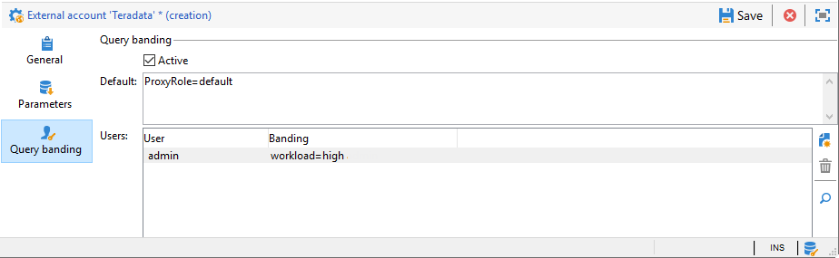

# teradata 액세스 구성 {#configure-access-to-teradata}


Campaign 사용 [페더레이션 데이터 액세스](../../installation/using/about-fda.md) (FDA) 외부 데이터베이스에 저장된 정보를 처리하는 옵션. teradata에 대한 액세스를 구성하려면 아래 단계를 따르십시오.

1. 설치 및 구성 [Teradata 드라이버](#teradata-config)
1. teradata 구성 [외부 계정](#teradata-external) 캠페인에서
1. 설정 [추가 구성](#teradata-additional-configurations) teradata 및 캠페인 서버용

## Teradata 구성 {#teradata-config}

Campaign에 연결하려면 Teradata 드라이버를 설치해야 합니다.

1. 설치 [teradata용 ODBC 드라이버](https://downloads.teradata.com/download/connectivity/odbc-driver/linux).

   Red Hat(또는 CentOS)/Suse에 다음 순서로 설치할 수 있는 세 가지 패키지로 구성됩니다.

   * 테라
   * tdicu1510(setup_wrapper.sh를 사용하여 설치)
   * tdodbc1510(setup_wrapper.sh를 사용하여 설치)

1. ODBC 드라이버를 구성합니다. 구성은 표준 파일에서 수행할 수 있습니다. **/etc/odbc.ini** 일반 매개 변수의 경우 및 드라이버를 선언하는 경우 /etc/odbcinst.ini의 경우:

   * **/etc/odbc.ini**

      ```
      [ODBC]
      InstallDir=/etc/
      ```

      &quot;InstallDir&quot;은 **odbcinst.ini** 파일.

   * **/etc/odbcinst.ini**

      ```
      [ODBC DRIVERS]
      teradata=Installed
      
      [teradata]
      Driver=/opt/teradata/client/17.10/lib64/tdataodbc_sb64.so
      APILevel=CORE
      ConnectFunctions=YYY
      DriverODBCVer=3.51
      SQLLevel=1
      ```

1. Adobe Campaign 서버의 환경 변수를 지정합니다.

   * **LD_LIBRARY_PATH** teradata : /opt/client/15.10/lib64 및 /opt/teradata/client/15.10/odbc_64/lib.
   * **오브치니**: odbc.ini 파일의 위치(예: /etc/odbc.ini)입니다.
   * **NLSPATH**: opermsgs.cat 파일의 위치(/opt/teradata/client/15.10/msg/opermsgs.cat)

>[!NOTE]
>
>FDA에서 Teradata 외부 데이터베이스에 연결하려면 Adobe Campaign 서버에서 추가 구성 단계가 필요합니다. [자세히 알아보기](#teradata-additional-configurations)

## Teradata 외부 계정{#teradata-external}

teradata 외부 계정을 사용하면 Campaign 인스턴스를 Teradata 외부 데이터베이스에 연결할 수 있습니다.

1. 출처: Campaign **[!UICONTROL Explorer]**, 클릭 **[!UICONTROL Administration]** / **[!UICONTROL Platform]** / **[!UICONTROL External accounts]**.

1. 클릭 **[!UICONTROL New]** 및 선택 **[!UICONTROL External database]** 다음으로: **[!UICONTROL Type]**.

   

1. 을(를) 구성하려면 다음을 수행하십시오. **[!UICONTROL Teradata]** 외부 계정에서 다음을 지정해야 합니다.

   * **[!UICONTROL Type]**: 다음을 선택합니다. **[!UICONTROL Teradata]** 유형.

   * **[!UICONTROL Server]**: Teradata 서버의 URL 또는 이름

   * **[!UICONTROL Account]**: Teradata 데이터베이스에 액세스하는 데 사용되는 계정의 이름

   * **[!UICONTROL Password]**: Teradata 데이터베이스에 연결하는 데 사용되는 암호

   * **[!UICONTROL Database]**: 데이터베이스 이름(선택 사항)

   * **[!UICONTROL Options]**: Teradata을 통해 전달할 옵션. &#39;parameter=value&#39; 형식을 사용하십시오. 값 사이의 구분 기호로 세미콜론을 사용합니다.

   * **[!UICONTROL Timezone]**: Teradata에 설정된 시간대. [자세히 알아보기](#timezone)

커넥터는 다음 옵션을 지원합니다.

| 옵션 | 설명 |
|---|---|
| TD_MAX_SESSIONS | teradata Parallel Transporter가 연산자 작업에 대해 얻을 수 있는 최대 로그온 세션 수를 지정합니다. <br>자세한 정보는 이 [페이지](https://documentation.sas.com/doc/en/pgmsascdc/9.4_3.5/ds2ref/p1naft0um1kn3vn1ubgkrjdf7c3a.html)를 참조하십시오. |
| 시간대 이름 | 서버 표준 시간대의 이름입니다. |
| 문자 집합 | teradata 문자 집합을 구성하는 데 사용됩니다. <br>자세한 정보는 이 [페이지](https://docs.teradata.com/r/ODBC-Driver-for-Teradata-User-Guide/May-2017/Configuration-of-odbc.ini-in-UNIX/Linux-and-Apple-OS-X/Teradata-DSN-Options#rub1478609534082__table_N102D3_N102B6_N102B3_N10001)를 참조하십시오. |
| IANAAppCodePage | ODBC 응용 프로그램 코드 페이지입니다. <br>[자세한 정보는 이 페이지](https://docs.teradata.com/r/ODBC-Driver-for-Teradata-User-Guide/May-2017/ODBC-Driver-for-Teradata-Application-Development/International-Character-Set-Support/Application-Code-Page)를 참조하십시오. |

### 추가 ODBC 외부 계정 추가 {#add-external}

>[!NOTE]
>
> 7.3.1 이전 버전에서는 이 옵션을 사용할 수 없습니다.

teradata 드라이버가 자체 ODBC 라이브러리를 제공하지만 이 라이브러리는 다른 ODBC 외부 계정과 호환되지 않을 수 있습니다.

ODBC도 사용하는 다른 외부 계정(예: Snowflake)을 구성하려면 기본 ODBC 라이브러리의 경로로 설정된 ODBCLib 옵션을 추가해야 합니다(`/usr/lib/x86_64-linux-gnu/libodbc.so` 데비안과 `/usr/lib64/libodbc.so` RHEL/CentOS에서).


### 쿼리 밴딩

여러 Adobe Campaign 사용자가 동일한 FDA Teradata 외부 계정에 연결하면 **[!UICONTROL Query banding]** 탭에서는 세션에 쿼리 밴드(예: 키/값 쌍 세트)를 설정할 수 있습니다.



이 옵션이 구성되면 Campaign 사용자가 Teradata 데이터베이스에서 쿼리를 수행할 때마다 Adobe Campaign은 이 사용자와 연결된 키 목록으로 구성된 메타데이터를 전송합니다. 그런 다음 Teradata 관리자는 감사 목적이나 액세스 권한 관리에 이 데이터를 사용할 수 있습니다.

>[!NOTE]
>
>에 대한 자세한 내용 **[!UICONTROL Query banding]**&#x200B;을(를) 참조하십시오. [Teradata 설명서](https://docs.teradata.com/reader/cY5B~oeEUFWjgN2kBnH3Vw/a5G1iz~ve68yTMa24kVjVw).

쿼리 밴딩을 구성하려면 아래 단계를 따르십시오.

1. 사용  **[!UICONTROL Default]** 사용자에게 연관된 쿼리 대역이 없는 경우 사용할 기본 쿼리 대역을 입력합니다. 이 필드를 비워 두면 쿼리 대역이 없는 사용자는 Teradata을 사용할 수 없습니다.

1. 사용 **[!UICONTROL Users]** 각 사용자에 대한 쿼리 대역을 지정하는 필드입니다. 키/값 쌍을 필요한 만큼 추가할 수 있습니다(예: 우선 순위=1;워크로드=높음). 사용자에게 쿼리 대역이 할당되지 않은 경우 **[!UICONTROL Default]** 필드가 적용됩니다.

1. 다음 확인: **[!UICONTROL Active]** 이 기능을 활성화하는 상자

#### 외부 계정 문제 해결 {#external-account-troubleshooting}

연결을 테스트하는 동안 다음 오류가 나타나면 **TIM-030008 날짜 &#39;2&#39;: 누락된 문자(iRc=-53)** odbc 드라이버가 올바르게 설치되어 있고 LD_LIBRARY_PATH(Linux)/PATH(Windows)가 Campaign 서버에 대해 설정되어 있는지 확인하십시오.

오류 **ODB-240000 ODBC 오류: [Microsoft][ODBC Driver Manager] 데이터 원본 이름을 찾을 수 없으며 기본 드라이버가 지정되지 않았습니다.** 16.X 드라이버를 사용하는 경우 Windows에서 발생합니다. Adobe Campaign에서는 teradata의 이름이 odbcinst.ini에서 &#39;{teradata}&#39;이(가) 되어야 합니다.

* Campaign 18.10부터 외부 계정의 옵션에 ODBCDriverName=&quot;Teradata 데이터베이스 ODBC 드라이버 16.10&quot;을 추가할 수 있습니다. 버전 번호는 변경될 수 있으며, 정확한 이름은 odbcad32.exe를 실행하고 드라이버 탭에 액세스하여 찾을 수 있습니다.

* 이전 버전의 Campaign을 사용하는 경우 드라이버 설치로 만든 odbcinst.ini의 Teradata 섹션을 Teradata라는 새 섹션으로 복사해야 합니다. 이 경우 Regedit를 사용할 수 있습니다. 기준이 latin1이면 다음을 추가해야 합니다. **APICharSize=1** 을 참조하십시오.

## 추가 구성 {#teradata-additional-configurations}

<!--
### Compatibility {#teradata-compatibility}

**Based in Unicode**

| Database version | Driver version |  Minimal Campaign version required |  Note |
|:-:|:-:|:-:|:-:|
| 15  |  15 |  Campaign Classic 17.9 | Under Linux: Queries with timestamp may fail (fixed in build 8937 for 18.4 and 8977 for 18.10) In debug mode, warnings relative to bad memory usage in the driver may occur. |
| 15  | 16  | Campaign Classic 17.9  | Recommended setup for a Teradata 15 database under Linux.  |
|  16 | 16  | Campaign Classic 18.10 |  Unicode characters with surrogate pairs are not fully handled. Using surrogate characters in data should work. Using surrogates in a filtering condition of a query will not work without this change. |
| 16  |  15 |  Campaign Classic 19.0 |  &nbsp; |

**Based in Latin1**

Versions previous to Adobe Campaign Classic 17.9 only supported Teradata Latin-1 database.

Starting from Adobe Campaign Classic 17.9, we now support by default Teradata database in Unicode.

Customers with a Latin-1 Teradata database migrating to a recent Campaign Classic release will have to add the parameter APICharSize=1 in the options of the external account.
-->

### 사용자 구성 {#user-configuration}

외부 데이터베이스에는 사용자 지정 프로시저 만들기/삭제/실행, 테이블 만들기/삭제/삽입/선택 권한이 필요합니다. Adobe Campaign 인스턴스에서 md5 및 sha2 함수를 사용하려면 사용자 모드 함수를 만들어야 할 수도 있습니다.

올바른 시간대를 구성해야 합니다. Adobe Campaign 인스턴스에서 만든 외부 계정에 설정되는 항목과 일치해야 합니다.

Adobe Campaign은 데이터베이스에서 만들 개체에 보호 모드(대체)를 설정하지 않습니다. Adobe Campaign에서 다음 쿼리를 사용하여 Teradata 데이터베이스에 연결하는 데 사용할 사용자의 기본값을 설정해야 할 수 있습니다.

| 기본 대체 항목 비활성화 |
| :-: |
| ```MODIFY USER $login$ AS NO FALLBACK;``` |

### MD5 설치 {#md5-installation}

Adobe Campaign 인스턴스에서 md5 함수를 사용하려면 이 위치에서 Teradata 데이터베이스에 사용자 모드 함수를 설치해야 합니다 [페이지](https://downloads.teradata.com/download/extensibility/md5-message-digest-udf) (md5_20080530.zip).

다운로드한 파일의 sha1은 65cc0bb6935f72fcd84fef1ebcd64c00115dfd1e와 같습니다.

md5를 설치하려면

1. md5_20080530.zip 파일의 압축을 풉니다.

1. md5/src 디렉토리로 이동합니다.

1. bteq를 사용하여 Teradata 데이터베이스에 연결합니다.

1. 다음 bteq 명령을 실행합니다.

   ```
   .run file = hash_md5.btq
   ```

### SHA2 설치 {#sha2-installation}

Adobe Campaign 인스턴스에서 sha2 함수를 사용하려면 여기에서 Teradata 데이터베이스에 사용자 모드 함수를 설치해야 합니다 [페이지](https://github.com/akuroda/teradata-udf-sha2/archive/v1.0.zip) (teradata-udf-sha2-1.0.zip).

다운로드한 파일의 sha1은 e87438d37424836358bd3902cf1adeb629349780과 같다.

sha2를 설치하려면:

1. teradata-udf-sha2-1.0.zip 파일의 압축을 풉니다.

1. teradata-udf-sha2-1.0/src 디렉토리로 이동합니다.

1. bteq를 사용하여 Teradata 데이터베이스에 연결합니다.

1. 다음 두 개의 bteq 명령을 실행합니다.

   ```
   .run file = hash_sha256.sql
   .run file = hash_sha512.sql
   ```

### UDF_UTF16TO8 설치 {#UDF-UTF16TO8-installation}

Adobe Campaign 인스턴스에서 udf_utf16to8 함수를 사용하려면 다음에서 Teradata 데이터베이스에 사용자 모드 함수를 설치해야 합니다. **Teradata 유니코드 툴 키트** 이 중 [페이지](https://downloads.teradata.com/download/tools/unicode-tool-kit) (utk_release1.7.0.0.zip).

다운로드한 파일의 sha1은 e58235f434f52c71316a577cb48e20b97d24f470과 같습니다.

udf_utf16to8을 설치하려면

1. utk_release1.7.0.0.zip 파일의 압축을 풉니다.

1. 추출된 파일에서 udf_utf16to8.o를 찾아 파일이 포함된 디렉토리로 이동합니다. 이름은 utk_release1.7.0.0/utk_release1.7.0.0/04 TranslationUDFs/01 Teradata UDFs/suselinux-x8664/udf_installation/ 로 지정해야 합니다.

1. bteq를 사용하여 Teradata 데이터베이스에 연결합니다.

1. 다음 bteq 명령을 입력합니다.

   ```
   REPLACE FUNCTION udf_utf16to8 (
   inputString VARCHAR(8000) CHARACTER SET UNICODE
   ) RETURNS VARCHAR(16000) CHARACTER SET LATIN
   LANGUAGE C
   NO SQL
   EXTERNAL NAME 'CO!i18n103!udf_utf16to8.o!F!udf_utf16to8'
   PARAMETER STYLE SQL;
   
   -- Test: should return 410042
   SELECT CAST(Char2HexInt(UDF_UTF16to8(_UNICODE'004100000042'XC)) AS VARCHAR(100));
   ```

## Linux용 Campaign 서버 구성 {#campaign-server-linux}

드라이버 설치에 필요한 사항은 다음과 같습니다.

* Teradata ODBC 드라이버, 여기에서 찾을 수 있음 [페이지](https://downloads.teradata.com/download/connectivity/odbc-driver/linux)

* Teradata 도구 및 유틸리티(대량 로드에 사용됨), 여기에서 찾을 수 있음 [페이지](https://downloads.teradata.com/download/tools/teradata-tools-and-utilities-linux-installation-package-0)

파일 이름 및 sha1:

* tdodbc1620__linux_indep.16.20.00.00-1.tar.gz 121fdd978b56fe1304fc5cb7819741b0847f44fd

* TeradataToolsAndUtilitiesBase__linux_indep.16.20.01.00.tar.gz b 29d0af5ffd8dcf68a9dbbaa6f8639387b19c563

Linux 배포용 패키지가 없는 경우 CentOS 7에 설명된 대로 설치(예: docker 사용)한 다음 Adobe Campaign 서버에서 /opt/teradata의 콘텐츠를 복사할 수 있습니다.

### ODBC 드라이버 설치 {#odbc-installation}

ODBC 드라이버를 설치하려면:

1. tdodbc1620__linux_indep.16.20.00.00-1.tar.gz 파일의 압축을 풉니다.

1. tdodbc1620 디렉터리로 이동합니다.

1. 설치 스크립트를 수정해야 할 수 있습니다.

   ```
   "sed -i s/16.10/16.20/ setup_wrapper.sh".
   ```

1. setup_wrapper.sh를 실행합니다.

### Teradata 도구 및 유틸리티 설치 {#teradata-tools-installation}

도구를 설치하려면:

1. TeradataToolsAndUtilitiesBase__linux_indep.16.20.01.00.tar.gz 파일의 압축을 풉니다.

1. TeradataToolsAndUtilitiesBase/Linux/i386-x8664/tdicu 디렉토리로 이동합니다.

1. setup_wrapper.sh를 실행합니다.

1. TeradataToolsAndUtilitiesBase/Linux/i386-x8664/cliv2 디렉토리로 이동합니다.

1. setup_wrapper.sh를 실행합니다.

1. TeradataToolsAndUtilitiesBase/Linux/i386-x8664/tptbase 디렉토리로 이동합니다.

1. setup_wrapper.sh를 실행합니다.

1. teradata libtelapi.so 파일은 /opt/client/16.20/lib64에서 사용할 수 있어야 합니다.

## Windows용 Campaign 서버 구성 {#campaign-server-windows}

먼저 Windows용 Teradata 도구 및 유틸리티를 다운로드해야 합니다. 여기에서 다운로드할 수 있습니다. [페이지](https://downloads.teradata.com/download/tools/teradata-tools-and-utilities-windows-installation-package)

ODBC 드라이버와 Teradata Parallel Transporter Base를 설치하십시오. teradata 데이터베이스에서 대량 로드를 수행하는 데 사용되는 telapi.dll을 설치합니다.

드라이버와 유틸리티의 경로가 실행 중에 nlserver에 포함될 PATH 변수에 있는지 확인합니다. 기본적으로 경로는 C:\Program 파일(x86)\Teradata\Client\15.10\bin(Windows 32비트 또는 C:\Program Files\Teradata\Client\15.10\bin 64비트)입니다.

## 시간대 {#timezone}

Teradata이 표준이 아닌 표준 시간대 이름을 사용하므로 [Teradata 사이트](https://docs.teradata.com/reader/rgAb27O_xRmMVc_aQq2VGw/oGKvgl7gCeBMTGrp59BnwA). Adobe Campaign은 외부 구성에 지정된 시간대를 Teradata이 이해하는 시간대로 변환하려고 합니다. 서신을 찾을 수 없는 경우 해당 세션에 대한 가장 가까운 GMT+X(또는 GMT-X) 시간대가 표시되고 로그에 경고가 표시됩니다.

변환은 linux의 /usr/local/neolane/nl6/datakit 디렉터리에 있어야 하는 teradata_timezones.txt 파일을 읽으면서 수행됩니다. 이 파일을 편집하는 경우 Adobe Campaign 팀에 문의하여 소스 코드를 변경하십시오. 그렇지 않으면 다음 Campaign 업데이트 중에 이 파일을 덮어씁니다.

연결에 사용되는 시간대는 -verbose 스위치와 함께 nlserver를 실행할 때 표시됩니다. 예를 들면 다음과 같습니다.

```
15:04:04 >   ODB-240007 Teradata: will use 'Europe Central' as session time zone.
```

사용된 시간대가 올바르지 않은 경우 &quot;TimeZoneName&quot;이라는 옵션을 외부 계정에 추가할 수 있습니다. 이 경우 Teradata 값(예: &quot;TimeZoneName=Europe Central&quot;)을 사용합니다.

일괄 로드 또는 Teradata 문서에서 &quot;빠른 로드&quot;를 사용할 때 Campaign에서 시간대를 표시할 수 없습니다. 따라서 Campaign에서 연결에 사용할 사용자의 기본 시간대를 설정하는 것이 좋습니다.

```
MODIFY USER $login$ AS TIME ZONE = 'Europe Central';
```
