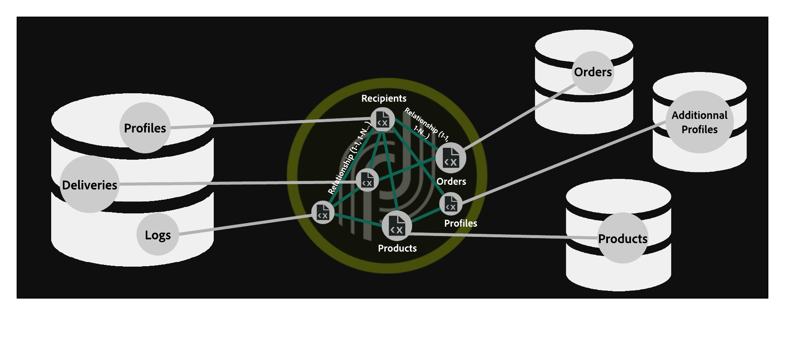

# vertica analytics에 대한 액세스 구성 {#configure-fda-vertica}


Campaign 사용 **페더레이션 데이터 액세스** (FDA) 외부 데이터베이스에 저장된 정보를 처리하는 옵션입니다. 액세스 권한을 구성하려면 아래 단계를 따르십시오. [!DNL Vertica Analytics].

1. 구성 [!DNL Vertica Analytics] 날짜 [센트OS](#vertica-centos), [Windows](#vertica-windows) 또는 [데비안](#vertica-debian)
1. 구성 [!DNL Vertica Analytics] [외부 계정](#vertica-external) 캠페인에서



## CentOS의 vertica analytics {#vertica-centos}

구성하려면 [!DNL Vertica Analytics] CentOS에서 아래 단계를 수행합니다.

1. 다음에 대한 ODBC 드라이버 다운로드 [!DNL Vertica Analytics]. [여기를 클릭하십시오.](https://www.vertica.com/download/vertica/client-drivers/) 최신 Linux RPM을 다운로드하십시오.

1. 그런 다음 다음 다음 명령을 사용하여 unixODBC를 설치해야 합니다.

   ```
   yum search unixODBC
   yum install unixODBC.x86_64
   ```

1. 이전에 을 설치한 경우 [!DNL Vertica Analytics] 서버, ODBC 드라이버가 이미 설치됩니다. 이 경우 다음과 같이 드라이브를 업데이트합니다.

   ```
   #Switch to root
   sudo su
   
   #Install the package (add --force to update it)
   rpm -Uvh vertica-client-x.x.x-x.x86_64.rpm [--force]
   
   #Open odbcinst.ini
   vi /etc/odbcinst.ini
   
   #Add a section for Vertica Analytics and save
   [VerVertica Analyticstica]
   Description = Vertica Analytics ODBC Driver
   Driver = /opt/vertica/lib64/libverticaodbc.so
   
   #Open odbc.ini
   vi /etc/odbc.ini
   
   #Add your DSN in ODBC Data Sources section, for example:
   [ODBC Data Sources]
   VMart = "VMart database on Vertica Analytics"
   
   #Add a DSN definition section below, for example:
   [VMart]
   Description = Vmart Database
   Driver = Vertica Analytics
   Database = VMart
   Servername = # The name of the server where Vertica Analytics is installed. Use localhost if Vertica Analytics is installed on the same machine.
   UID = dbadmin
   PWD = <password>
   Port = 5433
   
   #Cleanup
   #Remove the ODBC package
   rm vertica-client-x.x.x-x.x86_64.rpm
   ```

1. 그런 다음 Adobe Campaign에서 다음을 구성할 수 있습니다. [!DNL Vertica Analytics] 외부 계정입니다. 외부 계정을 구성하는 방법에 대한 자세한 내용은 [이 섹션](#vertica-external).

## Windows의 vertica analytics {#vertica-windows}

1. 다운로드 [Windows용 ODBC 드라이버](https://www.vertica.com/download/vertica/client-drivers/). Windows용 드라이버를 설치하려면 .NET Framework 3.5를 사용하도록 설정해야 합니다. 그렇지 않으면 설치 마법사가 자동으로 사용하도록 설정하고 다운로드합니다.

1. Windows에서 ODBC 드라이버를 구성합니다. 자세한 정보는 이 [페이지](https://www.vertica.com/docs/9.2.x/HTML/Content/Authoring/ConnectingToVertica/ClientODBC/SettingUpADSN.htm)를 참조하십시오

1. 그런 다음 Adobe Campaign에서 다음을 구성할 수 있습니다. [!DNL Vertica Analytics] 외부 계정입니다. 외부 계정을 구성하는 방법에 대한 자세한 내용은 [이 섹션](#vertical-external).

## 데비안 vertica analytics {#vertica-debian}

1. 다음에 대한 ODBC 드라이버 다운로드 [!DNL Vertica Analytics]. [여기를 클릭하십시오.](https://sfc-repo.snowflakecomputing.com/odbc/linux/latest/index.html) 다운로드를 시작합니다.

1. 그런 다음 다음 다음 명령을 사용하여 unixODBC를 설치해야 합니다.

   ```
   apt-get install unixODBC
   ```

1. 이전에 을 설치한 경우 [!DNL Vertica Analytics] 서버, ODBC 드라이버가 이미 설치됩니다. 이 경우 다음과 같이 드라이브를 업데이트합니다.

   ```
   #Switch to root
   sudo su
   
   #Move or copy the downloaded file and change to /root
   mv vertica_9.3..xx_odbc_x86_64_linux.tar.gz /
   cd /
   
   #Uncompress the file you downloaded
   tar vzxf vertica_9.3..xx_odbc_x86_64_linux.tar.gz
   
   #Remove the tar.gz since it is not needed anymore
   rm vertica_9.3..xx_odbc_x86_64_linux.tar.gz
   
   #Open odbcinst.ini
   vi /etc/odbcinst.ini
   
   #Add a section for Vertica Analytics and save
   [Vertica Analytics]
   Description = Vertica Analytics ODBC Driver
   Driver = /opt/vertica/lib64/libverticaodbc.so
   
   #Open odbc.ini
   vi /etc/odbc.ini
   
   #Add your DSN in ODBC Data Sources section, for example:
   [ODBC Data Sources]
   VMart = "VMart database on Vertica Analytics"
   
   #Add a DSN definition section below, for example:
   [VMart]
   Description = Vmart Database
   Driver = Vertica Analytics
   Database = VMart
   Servername = # The name of the server where Vertica Analytics is installed. Use localhost if Vertica Analytics is installed on the same machine.
   UID = dbadmin
   PWD = <password>
   Port = 5433
   ```

1. 그런 다음 Adobe Campaign에서 다음을 구성할 수 있습니다. [!DNL Vertica Analytics] 외부 계정입니다. 외부 계정을 구성하는 방법에 대한 자세한 내용은 [이 섹션](#vertica-external).

## Vertica analytics 외부 계정 {#vertica-external}

다음을 만들어야 합니다. [!DNL Vertica Analytics] Campaign 인스턴스를 [!DNL Vertica Analytics] 외부 데이터베이스.

1. 출처: Campaign **[!UICONTROL Explorer]**, 클릭 **[!UICONTROL Administration]** &#39;>&#39; **[!UICONTROL Platform]** &#39;>&#39; **[!UICONTROL External accounts]**.

1. **[!UICONTROL New]**&#x200B;를 클릭합니다.

1. 선택 **[!UICONTROL External database]** 외부 계정으로 **[!UICONTROL Type]**.

1. 구성 **[!UICONTROL Vertica Analytics]** 외부 계정에서 다음을 지정해야 합니다.

   * **[!UICONTROL Type]**: [!DNL Vertica Analytics]

   * **[!UICONTROL Server]**: 의 URL [!DNL Vertica Analytics] server

   * **[!UICONTROL Account]**: 사용자 이름

   * **[!UICONTROL Password]**: 사용자 계정 암호

   * **[!UICONTROL Database]**: 데이터베이스 이름

   

커넥터는 다음 옵션을 지원합니다.

| 옵션 | 설명 |
|---|---|
| 시간대 이름 | 기본적으로 비어 있음, 즉 Campaign Classic 앱 서버의 시스템 시간대가 사용됩니다. 옵션을 사용하여 시간대 세션 매개 변수를 강제 적용할 수 있습니다. |

