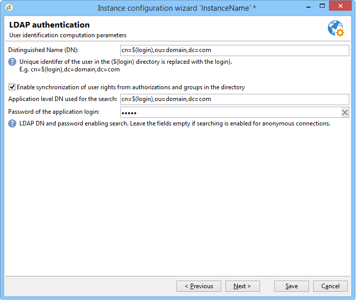

# LDAP를 통해 연결{#connecting-through-ldap}

## 캠페인 및 LDAP 구성 {#configuring-campaign-and-ldap}

>[!NOTE]
>
>LDAP 구성은 온-프레미스 또는 하이브리드 설치에서만 가능합니다.

LDAP 구성은 배포 마법사에서 수행됩니다. 첫 번째 구성 단계 동안 옵션을 선택해야 **[!UICONTROL LDAP integration]** 합니다. 배포 [마법사를 참조하십시오](../../installation/using/deploying-an-instance.md#deployment-wizard).

이 창을 사용하면 지정된 LDAP 디렉토리를 통해 Adobe Campaign 사용자의 ID를 구성할 수 있습니다.

* 필드에 LDAP 서버의 주소를 **[!UICONTROL LDAP server]** 지정합니다. 포트 번호를 추가할 수 있습니다. 기본적으로 사용되는 포트는 389입니다.
* 드롭다운 목록에서 사용자에 대한 인증 방법을 선택합니다.

   * 암호화된 암호(**md5**)

      기본 모드.

   * 일반 텍스트 암호 + SSL(**TLS**)

      전체 인증 절차(암호 포함)가 암호화됩니다. 이 모드에서는 보안 포트 636을 사용할 수 없습니다.Adobe Campaign은 자동으로 보안 모드로 전환합니다.

      Linux에서 이 인증 모드를 사용하면 열린 LDAP 클라이언트 라이브러리에서 인증서가 확인됩니다. 인증 절차가 암호화되도록 유효한 SSL 인증서를 사용하는 것이 좋습니다. 그렇지 않으면 정보가 일반 텍스트로 표시됩니다.

      인증서도 Windows에서 확인됩니다.

   * Windows NT LAN Manager(**NTLM**)

      독점적 Windows 인증. 도메인 이름 **[!UICONTROL Unique identifier]** 에 대해서만 사용됩니다.

   * DPA(Distributed Password **Authentication**)

      독점적 Windows 인증. 도메인 이름 **[!UICONTROL Unique identifier]** 에 대해서만 사용됩니다(domain.com).

   * 일반 텍스트 암호

      암호화 없음(테스트 단계에서만 사용).

* 사용자 인증 모드를 선택합니다. **[!UICONTROL Automatically compute the unique user identifier]** (단계 [고유 이름 계산](#distinguished-name-calculation)참조) 또는 **[!UICONTROL Search the unique user identifier in the directory]** (식별자 [검색 단계 참조](#searching-for-identifiers))

## 호환성 {#compatibility}

호환되는 시스템은 선택한 인증 메커니즘에 따라 다릅니다. 다음은 운영 체제 및 LDAP 서버의 호환성 매트릭스입니다.

<table> 
 <thead> 
  <tr> 
   <th> </th> 
   <th> OpenLDAP  </th> 
   <th> Active Directory  </th> 
  </tr> 
 </thead> 
 <tbody> 
  <tr> 
   <td> md5  </td> 
   <td> Windows, Linux  </td> 
   <td> Linux  </td> 
  </tr> 
  <tr> 
   <td> TLS  </td> 
   <td> Linux  </td> 
   <td> Windows, Linux  </td> 
  </tr> 
  <tr> 
   <td> NTLM 및 DPA  </td> 
   <td> </td> 
   <td> Windows  </td> 
  </tr> 
  <tr> 
   <td> 일반 텍스트  </td> 
   <td> Windows, Linux  </td> 
   <td> Windows, Linux  </td> 
  </tr> 
 </tbody> 
</table>

## 고유 이름 계산 {#distinguished-name-calculation}

DN(고유 이름) 식별자를 계산하려는 경우 배포 마법사의 다음 단계에서 계산 모드를 구성할 수 있습니다.

* 필드의 디렉토리(고유 이름 - DN)에서 사용자의 고유 식별자를 **[!UICONTROL Distinguished Name]** 지정합니다.

   **[!UICONTROL (login)]** 은 Adobe Campaign 연산자의 식별자로 대체됩니다.

   >[!CAUTION]
   >
   >설정은 **[!UICONTROL dc]** 소문자여야 합니다.

* LDAP 디렉토리 **[!UICONTROL Enable synchronization of user rights from authorizations and groups in the directory]** 의 그룹 및 사용자 연결을 동기화하고 Adobe Campaign의 그룹 및 사용자 연결을 동기화하려면 옵션을 선택합니다.

   이 옵션을 선택하면 **[!UICONTROL Application level DN used for the search]** 및 **[!UICONTROL Password of the application login]** 이 활성화됩니다.

   이 두 필드를 채우면 Adobe Campaign은 자체 로그인 및 암호를 사용하여 LDAP 서버에 연결됩니다. 비어 있는 경우 Adobe Campaign은 익명으로 서버에 연결할 것입니다.

## 식별자 검색 {#searching-for-identifiers}

식별자를 검색하도록 선택하는 경우 배포 마법사를 사용하여 검색을 구성할 수 있습니다.

* 및 **[!UICONTROL Application level DN used for the search]** **[!UICONTROL Password of the application login]** 필드에서, Adobe Campaign이 식별자를 검색하기 위해 연결할 식별자 및 암호를 입력합니다. 비어 있는 경우 Adobe Campaign은 익명으로 서버에 연결할 것입니다.
* 검색을 시작할 LDAP 디렉토리의 하위 집합을 결정하려면 **[!UICONTROL Base identifier]** 및 **[!UICONTROL Search scope]** 필드를 지정합니다.

   드롭다운 목록에서 필요한 모드를 선택합니다.

   

   1. **[!UICONTROL Recursive (default mode)]**.

      LDAP 디렉토리는 지정된 수준에서 시작하여 전체 단위로 검색됩니다.

   1. **[!UICONTROL Limited to the base]**.

      모든 속성이 검색에 포함됩니다.

   1. **[!UICONTROL Limited to the first sub-level of the base]**.

      디렉토리의 모든 속성에 대해 검색이 수행되고 속성의 첫 번째 레벨부터 시작됩니다.

* 이 **[!UICONTROL Filter]** 필드를 사용하면 검색 범위를 구체화하는 요소를 지정할 수 있습니다.

## LDAP 권한 구성 {#configuring-ldap-authorizations}

이 창은 **[!UICONTROL Enable synchronization of user rights from authorizations and groups in the directory]** 옵션을 선택하면 표시됩니다.

사용자가 속한 그룹 또는 그룹과 해당 권한(예:

* 현장 **[!UICONTROL Database identifier]** ,
* 현장 **[!UICONTROL Search scope]** ,

   >[!NOTE]
   >
   >DN을 검색하도록 선택한 경우, DN에 대해 선택한 값과 이전 화면에서 검색 범위를 **[!UICONTROL Reuse the DN search parameters]** 이월하기 위해 선택할 수 있습니다.

* 로그인 및 사용자의 고유 이름을 기반으로 하는 **[!UICONTROL Rights search filter]** 필드
* 사용자와 관련된 **[!UICONTROL Attribute containing the group or authorization name]** 필드,
* adobe campaign에서 그룹 이름 및 관련 권한을 추출할 수 있는 **[!UICONTROL Association mask]** 필드입니다. 정규 표현식을 사용하여 이름을 검색할 수 있습니다.
* 연결 **[!UICONTROL Enable the connection of users declared in the LDAP directory if the operator is not declared in Adobe Campaign]** 에 대한 액세스 권한이 사용자에게 자동으로 부여되도록 선택합니다.

인스턴스 구성 **[!UICONTROL Save]** 을 완료하려면 을(를) 클릭합니다.

## 연산자 관리 {#managing-operators}

구성을 확인했으면 LDAP 디렉토리를 통해 관리되는 Adobe Campaign 연산자를 정의해야 합니다.

LDAP 디렉토리를 사용하여 연산자를 인증하려면 해당 프로파일을 편집하고 **[!UICONTROL Edit the access parameters]** 링크를 클릭합니다. 다음 **[!UICONTROL Use LDAP for authentication]** 옵션을 선택합니다.이 연산자에 대해 **[!UICONTROL Password]** 필드가 회색으로 표시됩니다.

## 사용 사례 {#use-cases}

이 섹션에서는 요구 사항에 따라 가장 적합한 구성을 얻는 데 도움이 되는 몇 가지 간단한 사용 사례를 제공합니다.

1. 사용자가 LDAP 디렉토리에 생성되었지만 Adobe Campaign에서는 만들어지지 않았습니다.

   사용자가 LDAP 인증을 통해 플랫폼에 액세스할 수 있도록 Adobe Campaign을 구성할 수 있습니다. Adobe Campaign은 LDAP 디렉토리에서 ID/암호 조합의 유효성을 제어하여 즉시 연산자를 Adobe Campaign에서 만들 수 있어야 합니다. 이렇게 하려면 옵션을 **[!UICONTROL Enable the connection of users declared in the LDAP directory if the operator is not declared in Adobe Campaign]** 확인하십시오. 이 경우 그룹 동기화를 구성해야 합니다.옵션을 선택해야 **[!UICONTROL Enable synchronization of user rights from authorizations and groups in the directory]** 합니다.

1. 사용자가 Adobe Campaign에서 만들어졌지만 LDAP 디렉토리에서는 만들어지지 않았습니다.

   그들은 Adobe Campaign에 로그온하지 못할 것이다.

1. Adobe Campaign에 없는 그룹이 LDAP 디렉토리에 있습니다.

   이 그룹은 Adobe Campaign에서 생성되지 않습니다. 이 옵션을 통해 일치를 활성화하려면 그룹을 만들고 그룹을 동기화해야 **[!UICONTROL Enable synchronization of user rights from authorizations and groups in the directory]** 합니다.

1. 그룹은 Adobe Campaign에 있고 LDAP 디렉토리는 이벤트 후에 활성화됩니다.adobe campaign의 사용자 그룹은 LDAP 그룹의 컨텐츠로 자동 대체되지 않습니다. 마찬가지로, 그룹이 Adobe Campaign에만 존재하는 경우 LDAP에서 그룹을 만들고 동기화할 때까지 LDAP 사용자를 추가할 수 없습니다.

   그룹은 Adobe Campaign 또는 LDAP에 의해 신속하게 만들어지지 않습니다. Adobe Campaign과 LDAP 디렉토리에 모두 개별적으로 만들어야 합니다.

   LDAP 디렉토리의 그룹 이름은 Adobe Campaign 그룹의 이름과 일치해야 합니다. 연결 마스크는 배포 마법사의 마지막 구성 단계에서 정의됩니다.Adobe Campaign_(*).

