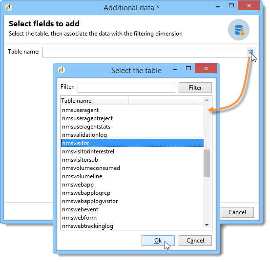

# 데이터베이스에 연결 {#connecting-to-the-database}

외부 데이터베이스에 대한 연결을 활성화하려면 연결 매개 변수(즉, 대상 데이터 소스 및 로드할 데이터가 있는 테이블 이름)를 표시해야 합니다.

>[!CAUTION]
>
>외부 데이터베이스의 데이터를 처리하기 위해서는 외부 데이터베이스 및 Adobe Campaign 응용 프로그램 서버에 대한 특정 권한이 있어야 합니다. 자세한 내용은 [원격 데이터베이스 액세스 권한](../../installation/using/remote-database-access-rights.md) 섹션을 참조하십시오.
>
>오작동을 방지하기 위해 원격 공유 데이터에 액세스하는 연산자는 별도의 공간에서 작업해야 합니다.

## 공유 연결 만들기 {#creating-a-shared-connection}

이 연결이 활성 상태인 경우 공유 외부 데이터베이스에 대한 연결을 활성화하려면 Adobe Campaign을 통해 데이터베이스에 액세스할 수 있습니다.

1. 구성을 노드를 통해 미리 정의해야 **[!UICONTROL Administration > Platform > External accounts]** 합니다.
1. 단추를 **[!UICONTROL New]** 클릭하고 **[!UICONTROL External database]** 유형을 선택합니다.
1. 외부 데이터베이스의 **[!UICONTROL Connection]** 매개 변수를 정의합니다.

   ODBC **형식 데이터베이스에** 연결하려면 **[!UICONTROL Server]** 필드에 서버 이름이 아닌 ODBC 데이터 원본 이름이 포함되어야 합니다. 또한 사용된 데이터베이스에 따라 특정 추가 구성이 필요할 수 있습니다. 데이터베이스 유형별 [특정 구성 섹션을](../../installation/using/configure-fda.md) 참조하십시오.

1. 매개 변수가 입력되면 **[!UICONTROL Test the connection]** 단추를 클릭하여 승인합니다.

   

1. 필요한 경우 구성을 삭제하지 않고 이 데이터베이스에 대한 액세스를 비활성화하는 **[!UICONTROL Enabled]** 옵션을 선택 해제합니다.
1. Adobe Campaign이 이 데이터베이스에 액세스할 수 있도록 하려면 SQL 함수를 배포해야 합니다. 탭 **[!UICONTROL Parameters]** 을 클릭한 다음 **[!UICONTROL Deploy functions]** 단추를 클릭합니다.

   

탭에서는 테이블 및 인덱스에 대한 특정 작업 테이블스페이스를 정의할 수 **[!UICONTROL Parameters]** 있습니다.

## 임시 연결 만들기 {#creating-a-temporary-connection}

워크플로우 활동에서 외부 데이터베이스에 대한 연결을 직접 정의할 수 있습니다. 이 경우 현재 워크플로 내에서 사용하도록 예약된 로컬 외부 데이터베이스에 있게 됩니다.외부 계정에는 저장되지 않습니다. 이러한 유형의 정확한 가상 연결은 워크플로우의 다양한 활동, 특히 **[!UICONTROL Query]**&#x200B;활동 **[!UICONTROL Data loading (RDBMS)]**&#x200B;또는 활동 **[!UICONTROL Enrichment]** 에서 만들 수 **[!UICONTROL Split]** 있습니다.

>[!CAUTION]
>
>이러한 유형의 구성은 권장되지 않지만 데이터를 수집하는 데 정기적으로 사용될 수 있습니다. 그러나 공유 연결 만들기 섹션에 나와 있는 [대로 외부 계정을 만들어야](#creating-a-shared-connection) 합니다.

예를 들어 쿼리 활동에서 외부 데이터베이스에 대한 주기적 연결을 만드는 단계는 다음과 같습니다.

1. 을 **[!UICONTROL Add data...]** 클릭하고 옵션을 **[!UICONTROL External data]** 선택합니다.
1. 옵션을 **[!UICONTROL Locally defining the data source]** 선택합니다.

   

1. 드롭다운 목록에서 대상 데이터베이스 엔진을 선택합니다. 서버 이름을 입력하고 인증 매개 변수를 제공합니다.

   외부 데이터베이스의 이름도 지정합니다.

   

   **[!UICONTROL Next]** 버튼을 클릭합니다.

1. 데이터가 저장되는 테이블을 선택합니다.

   해당 필드에 직접 테이블 이름을 입력하거나 편집 아이콘을 클릭하여 데이터베이스 테이블 목록에 액세스할 수 있습니다.

   

1. 이 **[!UICONTROL Add]** 단추를 눌러 외부 데이터베이스 데이터와 Adobe Campaign 데이터베이스의 데이터 간에 하나 또는 여러 개의 조정 필드를 정의합니다. 및 **[!UICONTROL Edit expression]** 아이콘을 사용하여 **[!UICONTROL Remote field]** 각 테이블의 필드 목록에 액세스할 **[!UICONTROL Local field]** 수 있습니다.

   

1. 필요한 경우 필터링 조건 및 데이터 정렬 모드를 지정합니다.
1. 외부 데이터베이스에서 수집할 추가 데이터를 선택합니다. 이렇게 하려면 추가할 필드를 두 번 클릭하여 에 표시합니다 **[!UICONTROL Output columns]**.

   

   이 구성 **[!UICONTROL Finish]** 을 확인하려면 클릭하십시오.

## 보안 연결 {#secure-connection}

>[!NOTE]
>
>보안 연결은 PostgreSQL에만 사용할 수 있습니다.

외부 FDA 계정을 구성할 때 외부 데이터베이스에 안전하게 액세스할 수 있습니다.

이렇게 하려면 사용된 포트의 서버 주소와 주소 뒤에 &quot;**:ssl**&quot;을 추가합니다. 예: **192.168.0.52:4501:ssl**.

그러면 데이터는 보안 SSL 프로토콜을 통해 전송됩니다.

## 추가 구성 {#additional-configurations}

필요한 경우 외부 데이터베이스에서 데이터를 처리하기 위한 스키마를 만들 수 있습니다. 마찬가지로, Adobe Campaign을 사용하면 외부 테이블의 데이터에 대한 매핑을 정의할 수 있습니다. 이러한 구성은 일반적이며 워크플로우에만 적용되지 않습니다.

>[!NOTE]
>
>Adobe Campaign에서 스키마 생성 및 새 데이터 매핑 정의에 대한 자세한 내용은 [이 페이지를 참조하십시오](../../configuration/using/about-schema-edition.md).