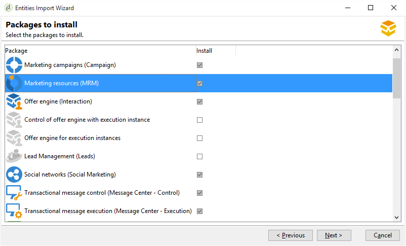

# 데이터베이스 만들기 및 구성{#creating-and-configuring-the-database}

데이터베이스를 만들 때 Adobe Campaign은 두 가지 다른 옵션을 제공합니다.

1. 데이터베이스 생성 또는 재활용:새 데이터베이스를 만들거나 기존 데이터베이스를 다시 사용하려면 이 옵션을 선택합니다. 사례 [1 참조:데이터베이스 생성/재활용](#case-1--creating-recycling-a-database).
1. 기존 데이터베이스 사용:관리자가 이미 빈 데이터베이스를 만들었으며 이를 사용하려면 이 옵션을 선택합니다.또는 기존 데이터베이스의 구조를 확장하기 위해. 사례 2 [를 참조하십시오.기존 데이터베이스](#case-2--using-an-existing-database)사용

다음은 구성 단계에 대한 자세한 정보입니다.

>[!CAUTION]
>
>데이터베이스, 사용자 및 스키마 이름은 숫자로 시작하거나 특수 문자를 포함하지 않아야 합니다.
>
>내부 **** 식별자만 이러한 작업을 수행할 수 있습니다. For more on this, refer to [Internal identifier](../../installation/using/campaign-server-configuration.md#internal-identifier).

## 사례 1:데이터베이스 만들기/재활용 {#case-1--creating-recycling-a-database}

데이터베이스를 만들거나 기존 베이스를 재활용하는 단계는 아래에 나와 있습니다. 일부 구성은 사용된 데이터베이스 엔진에 따라 다릅니다.

다음 단계가 포함됩니다.

* [1단계 - 데이터베이스 엔진](#step-1---selecting-the-database-engine)선택,
* [2단계 - 서버에](#step-2---connecting-to-the-server)연결,
* [3단계 - 데이터베이스의 연결 및 특성](#step-3---connection-and-characteristics-of-the-database),
* [4단계 - 설치할](#step-4---packages-to-install)패키지,
* [5단계 - 만들기 단계](#step-5---creation-steps),
* [6단계 - 데이터베이스](#step-6---creating-the-database)생성

### 1단계 - 데이터베이스 엔진 선택 {#step-1---selecting-the-database-engine}

드롭다운 목록에서 데이터베이스 엔진을 선택합니다.


지원되는 데이터베이스는 호환성 표 [에 나와 있습니다](https://helpx.adobe.com/kr/campaign/kb/compatibility-matrix.html).

서버를 식별하고 수행할 작업 유형을 선택합니다. 이 경우, **[!UICONTROL Create or recycle a database]**


선택한 데이터베이스 엔진에 따라 서버 식별 정보가 다를 수 있습니다.

* Oracle **** 엔진의 경우 애플리케이션 서버에 대해 **정의된 TNS 이름** 을 채웁니다.
* PostgreSQL **또는** DB2 **** 엔진의 경우 데이터베이스 서버에 액세스하려면 응용 프로그램 서버에 정의된 DNS 이름(또는 IP 주소)을 지정해야 합니다.
* Microsoft **SQL Server** 엔진의 경우 다음을 정의해야 합니다.

   1. 데이터베이스 서버에 액세스하기 위해 응용 프로그램 서버에 정의된 DNS 이름(또는 IP 주소): **DNS** 또는 **DNS\ `<instance>`** (인스턴스 모드),
   1. Microsoft SQL Server에 액세스하는 데 사용되는 인증 방법: **[!UICONTROL SQL Server authentication]** 또는 **[!UICONTROL Windows NT authentication]**.

      

### 2단계 - 서버에 연결 {#step-2---connecting-to-the-server}

창에서 데이터베이스 서버 액세스를 **[!UICONTROL Server access]** 정의합니다.


이렇게 하려면 데이터베이스에 액세스할 수 있는 권한이 있는 **관리 시스템 계정** 이름 및 암호를 입력하십시오.

* **시스템** (Oracle 데이터베이스)
* **sa** for the Microsoft SQL Server database,
* **PostgreSQL** 데이터베이스
* **DB2 데이터베이스에 대한 db2inst1** .

### 3단계 - 데이터베이스의 연결 및 특성 {#step-3---connection-and-characteristics-of-the-database}

다음 단계에서는 데이터베이스에 로그온하기 위한 설정을 구성할 수 있습니다.


다음 설정을 정의해야 합니다.

* 만들 데이터베이스의 이름을 지정합니다.

   >[!NOTE]
   >
   >DB2 데이터베이스의 경우 데이터베이스 이름은 8자를 초과할 수 없습니다.

* 이 데이터베이스에 연결된 계정의 암호를 입력합니다.
* 데이터베이스가 유니코드로 되어 있는지 여부를 나타냅니다.

   이 **[!UICONTROL Unicode database]** 옵션을 사용하면 언어에 관계없이 모든 문자 유형을 유니코드로 저장할 수 있습니다.

   >[!NOTE]
   >
   >Oracle 데이터베이스를 사용하는 경우 이 **[!UICONTROL Unicode storage]** 옵션을 사용하면 **NCLOB** 및 **NVARCHAR** 유형 필드를 사용할 수있습니다.
   > 
   >이 옵션을 선택하지 않으면 Oracle 데이터베이스의 문자 집합(문자 집합)이 모든 언어로 데이터 저장을 활성화해야 합니다(AL32UTF8 권장).

* 데이터베이스의 표준 시간대를 선택하고 UTC(가능한 경우)로 할지 여부를 지정합니다.

   자세한 내용은 시간대 [관리를 참조하십시오](../../installation/using/time-zone-management.md).

### 4단계 - 설치할 패키지 {#step-4---packages-to-install}

설치할 패키지를 선택합니다.

&quot;상호 작용&quot; 또는 &quot;소셜 마케팅&quot;과 같이 귀하가 설치할 수 있는 솔루션 및 옵션을 확인하려면 라이센스 계약을 참조하십시오.



### 5단계 - 만들기 단계 {#step-5---creation-steps}

이 **[!UICONTROL Creation steps]** 창에서는 테이블을 만드는 데 사용되는 SQL 스크립트를 표시하고 편집할 수 있습니다.


* Oracle, Microsoft SQL Server 또는 PostgreSQL 데이터베이스의 경우 관리자는 데이터베이스 개체를 생성할 때 사용할 **저장** 매개변수를 정의할 수도 있습니다.

   이러한 매개 변수는 정확한 테이블스페이스 이름을 받습니다(경고:대/소문자 구분). 이러한 지표는 각각 다음 옵션 **[!UICONTROL Administration > Platform > Options]** 의 노드에 저장됩니다(참조 [](../../installation/using/configuring-campaign-options.md#database)).

   * **WdbcOptions_TableSpaceUser**:스키마를 기반으로 하는 사용자 테이블
   * **WdbcOptions_TableSpaceIndex**:스키마를 기반으로 하는 사용자 테이블 색인
   * **WdbcOptions_TableSpaceWork**:스키마가 없는 작업 테이블
   * **WdbcOptions_TableSpaceWorkIndex**:스키마가 없는 작업 테이블 인덱스

* Oracle 데이터베이스의 경우, Adobe Campaign 사용자는 일반적으로 설치 그룹의 구성원으로서 Oracle 라이브러리에 액세스할 수 **있어야** 합니다.
* 이 **[!UICONTROL Set or change the administrator password]** 옵션을 사용하면 관리자 권한으로 Adobe Campaign 연산자에 연결된 암호를 입력할 수 있습니다.

   보안을 위해 Adobe Campaign 계정 관리자 암호를 정의하는 것이 좋습니다.

### 6단계 - 데이터베이스 만들기 {#step-6---creating-the-database}

마법사의 마지막 단계에서는 데이터베이스를 만들 수 있습니다. 을 **[!UICONTROL Start]** 클릭하여 확인합니다.


데이터베이스가 만들어지면 다시 연결하여 인스턴스 구성을 완료할 수 있습니다.

이제 인스턴스 구성을 완료하려면 배포 마법사를 시작해야 합니다. 배포 [마법사를 참조하십시오](../../installation/using/deploying-an-instance.md#deployment-wizard).

인스턴스에 연결된 데이터베이스의 연결 설정은 Adobe Campaign 설치 디렉토리에 있는 파일 **`/conf/config-<instance>.xml`** 에 저장됩니다.

암호화된 암호를 사용하여 &#39;campaign&#39; 계정에 연결된 base61 데이터베이스의 Microsoft SQL Server 구성 예:

```
<dbcnx encrypted="1" login="campaign:myBase" password="myPassword" provider="DB" server="dbServer"/>
```

## 사례 2:기존 데이터베이스 사용 {#case-2--using-an-existing-database}

데이터베이스와 사용자는 데이터베이스 관리자가 만들고 액세스 권한이 올바르게 구성되어 있어야 합니다.

예를 들어 Oracle 데이터베이스의 경우 필요한 최소 권한은 다음과 같습니다.CONNECT, 리소스 및 무제한 테이블스페이스를 부여합니다.

기존 데이터베이스를 사용하려면 구성 단계는 다음과 같습니다.

* [1단계 - 데이터베이스 엔진](#step-1---choosing-the-database-engine)선택,
* [2단계 - 데이터베이스 연결 설정](#step-2---database-connection-settings),
* [3단계 - 설치할](#step-3---packages-to-install)패키지,
* [4단계 - 만들기 단계](#step-4---creation-steps),
* [5단계 - 데이터베이스](#step-5---creating-the-database)생성

### 1단계 - 데이터베이스 엔진 선택 {#step-1---choosing-the-database-engine}

드롭다운 목록에서 데이터베이스 엔진을 선택합니다.


서버를 식별하고 수행할 작업 유형을 선택합니다. 이 경우, **[!UICONTROL Use an existing database]**


선택한 데이터베이스 엔진에 따라 서버 식별 정보가 다를 수 있습니다.

* Oracle **** 엔진의 경우 애플리케이션 서버에 대해 **정의된 TNS 이름** 을 채웁니다.
* PostgreSQL **또는** DB2 **** 엔진의 경우 데이터베이스 서버에 액세스하려면 응용 프로그램 서버에 정의된 DNS 이름(또는 IP 주소)을 지정해야 합니다.
* Microsoft **SQL Server** 엔진의 경우 다음을 정의해야 합니다.

   1. 데이터베이스 서버에 액세스하기 위해 응용 프로그램 서버에 정의된 DNS 이름(또는 IP 주소)
   1. Microsoft SQL Server에 액세스하는 데 사용되는 보안 방법: **[!UICONTROL SQL Server authentication]** 또는 **[!UICONTROL Windows NT authentication]**.

      

### 2단계 - 데이터베이스 연결 설정 {#step-2---database-connection-settings}

창에서 데이터베이스 연결 설정을 **[!UICONTROL Database]** 정의합니다.


다음 설정을 정의해야 합니다.

* 사용할 데이터베이스의 이름을 입력합니다.
* 이 데이터베이스와 연결된 계정의 이름과 암호를 입력하십시오.

   >[!NOTE]
   >
   >스키마 이름과 사용자 이름이 모두 일치해야 합니다. 캠페인 콘솔 클라이언트를 통해 데이터베이스를 만드는 것이 좋습니다.
   >Oracle 데이터베이스의 경우 계정 이름을 입력할 필요가 없습니다.

* 데이터베이스가 유니코드인지 여부를 지정합니다.

### 3단계 - 설치할 패키지 {#step-3---packages-to-install}

설치할 패키지를 선택합니다.

&quot;상호 작용&quot; 또는 &quot;리드&quot;와 같이 사용자에게 설치 권한이 부여된 솔루션과 옵션을 확인하려면 라이선스 계약을 참조하십시오.


### 4단계 - 작성 단계 {#step-4---creation-steps}

이 **[!UICONTROL Creation steps]** 창에서는 테이블을 만드는 데 사용되는 SQL 스크립트를 표시하고 편집할 수 있습니다.


* Oracle, Microsoft SQL Server 또는 PostgreSQL 데이터베이스의 경우 관리자는 데이터베이스 객체를 생성할 때 사용할 **저장** 매개변수를 정의할 수 있습니다.
* Oracle 데이터베이스의 경우, Adobe Campaign 사용자는 일반적으로 설치 그룹의 구성원으로서 Oracle 라이브러리에 액세스할 수 **있어야** 합니다.
* 이 **[!UICONTROL Set or change the administrator password]** 옵션을 사용하면 관리자 권한으로 Adobe Campaign 연산자에 연결된 암호를 입력할 수 있습니다.

   보안을 위해 Adobe Campaign 계정 관리자 암호를 정의하는 것이 좋습니다.

### 5단계 - 데이터베이스 만들기 {#step-5---creating-the-database}

마법사의 마지막 단계에서는 데이터베이스를 만들 수 있습니다. 을 **[!UICONTROL Start]** 클릭하여 확인합니다.


데이터베이스 생성이 완료되면 인스턴스 구성을 마무리하기 위해 다시 연결할 수 있습니다.

이제 인스턴스 구성을 완료하려면 배포 마법사를 시작해야 합니다. 배포 [마법사를 참조하십시오](../../installation/using/deploying-an-instance.md#deployment-wizard).

인스턴스에 연결된 데이터베이스의 연결 설정은 Adobe Campaign 설치 디렉토리에 있는 파일 **`/conf/config-<instance>.xml`** 에 저장됩니다.

암호화된 암호를 사용하여 &#39;campaign&#39; 계정에 연결된 base61 데이터베이스의 Microsoft SQL Server 구성 예:

```
<dbcnx encrypted="1" login="campaign:myBase" password="myPassword" provider="DB" server="dbServer"/>
```

